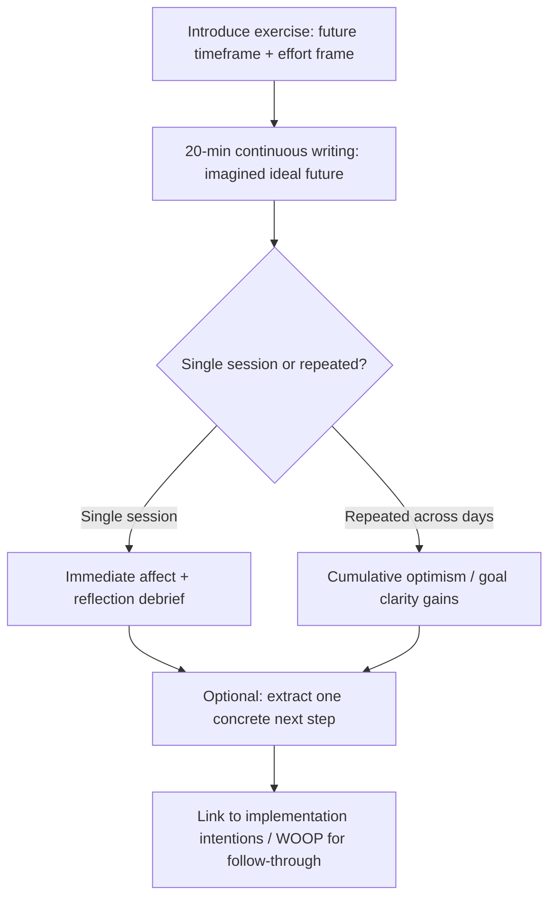

## Best Possible Self and Future-Visioning Exercises

### Overview

Best Possible Self (BPS) is a structured positive psychology intervention in which an individual writes about, or otherwise imagines, a future in which their life has unfolded in the best possible way across meaningful domains, having worked hard and succeeded in reaching their goals. Developed and popularized primarily by Laura King (2001), BPS draws on theoretical foundations in possible-selves theory (Markus & Nurius, 1986), goal-setting theory, and broaden-and-build theory of positive emotions (Fredrickson, 2001). Future-visioning exercises are a broader family of techniques that include BPS as well as related variants: guided imagery of future success, "letter from future self," life-domain visioning, and hope-based goal-mapping exercises.

### Theoretical Foundations

**Possible Selves Theory**

Markus and Nurius (1986) proposed that self-concept includes not only a present self but a repertoire of "possible selves" — representations of what one could become, would like to become, or fears becoming. BPS operationalizes the "ideal self" component of this framework, giving it concrete narrative form.

**Broaden-and-Build Theory**

Fredrickson's model holds that positive emotions broaden momentary thought-action repertoires and build durable psychological, social, and physical resources over time. BPS is theorized to work partly by inducing positive affect during the writing/visualization process itself, and partly by clarifying goals that later generate additional positive affect as they are pursued.

**Self-Regulation and Goal Theory**

BPS intersects with goal-setting theory (Locke & Latham) in that a vividly specified future state can function as a reference point against which current behavior is regulated, and with self-determination theory in that BPS exercises tend to work best when the imagined future reflects autonomously chosen, intrinsically valued goals rather than externally imposed ones.

**Affective Forecasting**

Related but distinct is affective forecasting research (Gilbert & Wilson), which studies how accurately people predict their future emotional states. BPS is not primarily about accurate forecasting — it is a deliberately optimistic, idealized projection — which is an important conceptual distinction from realistic future planning exercises.

### Core Protocol (King, 2001)

The canonical BPS protocol:

1. **Instruction framing**: Participants are asked to imagine their life in the future (commonly 5–10 years out), in which everything has gone as well as it possibly could have.
2. **Effort framing**: They are told to imagine that they have worked hard and succeeded in accomplishing their life goals — this is a best possible self *achieved through effort*, not a passive fantasy or lottery-win scenario.
3. **Writing**: Participants write continuously about this imagined future for a fixed duration, typically 20 minutes, across multiple sessions (King's original study used 4 consecutive days).
4. **Free generation**: Unlike gratitude journaling, BPS does not use a fixed prompt list; it is open-ended expressive writing directed at a single generative theme.

**[Inference]** Many applied/clinical adaptations shorten this to a single 15–20 minute session or extend it to a multi-week practice; the dosage effects of session count and spacing are not fully standardized across the literature.

### Structured Variant: Domain-Based Visioning

A widely used applied structure decomposes the "life" prompt into explicit domains so participants don't default to only one area (e.g., career):

- Career / vocational achievement
- Relationships (romantic, family, friendship)
- Health and physical wellbeing
- Personal growth / learning
- Community / contribution
- Leisure / recreation
- Financial security
- Living environment

**Facilitation Script Example**

> "Think about your life five years from now. Imagine that everything has gone as well as it possibly could. You have worked hard and succeeded in accomplishing your goals in each of the areas that matter to you. Don't worry about being realistic — just let yourself imagine the best possible version. Now write continuously for 20 minutes describing this future in as much vivid detail as you can: What does a typical day look like? Who is with you? What have you accomplished? How do you feel?"

### Mechanisms of Action

| Mechanism | Description |
| --- | --- |
| Positive affect induction | Vivid imagining of success generates in-the-moment positive emotion |
| Goal clarification | Forces implicit goals into explicit, articulable form |
| Increased optimism | Repeated practice associated with dispositional optimism gains (Malouff & Schutte meta-analysis) |
| Self-concept elaboration | Enriches and organizes self-schema around desired identity |
| Motivational priming | Clear future image can function as an approach-goal cue, engaging behavioral activation systems |

**[Inference]** The relative contribution of each mechanism to outcomes is not cleanly separable in existing designs, since most studies measure downstream wellbeing rather than mediating process variables directly.

### Empirical Evidence

- King's (2001) original study found BPS writing (compared to writing about a trauma, or a control topic) produced significant increases in subjective wellbeing, and — perhaps counterintuitively — did **not** produce the short-term physical health costs associated with trauma disclosure writing, while still yielding health benefits at follow-up.
- Meta-analytic work (e.g., Malouff & Schutte, 2017, in *The Journal of Positive Psychology*) synthesizing multiple BPS trials reported moderate positive effects on wellbeing indices, with effects present but generally smaller than for some other positive psychology interventions (e.g., gratitude visits) in certain comparisons, and larger when practiced repeatedly rather than once.
- Sheldon and Lyubomirsky have used BPS-type visioning within broader "possible selves" and goal-based happiness-increasing interventions, generally supporting durable gains when the exercise is repeated and paired with goal-pursuit follow-through.

**[Unverified]** Specific effect-size figures vary noticeably by study population, dosage, and outcome measure; readers implementing BPS as an intervention should consult the primary meta-analyses directly rather than relying on a single cited number.

### Comparison to Related Interventions

| Intervention | Temporal Focus | Core Task | Primary Mechanism |
| --- | --- | --- | --- |
| Best Possible Self | Future | Imagine/write ideal outcome | Optimism, goal clarity |
| Gratitude Journal | Past/Present | List things grateful for | Positive reappraisal |
| Three Good Things | Past (daily) | Record daily positives | Attention retraining |
| Letter from Future Self | Future | Write advice as future self | Perspective-taking, self-compassion |
| Life Crafting | Future | Structured multi-domain life plan with concrete steps | Goal-setting, action planning |
| Mental Contrasting (WOOP) | Future + Present obstacles | Contrast wish with obstacle | Realistic goal commitment |

**Key Points**

- BPS is idealized and effort-framed, not passive wish-fulfillment.
- BPS differs from mental contrasting/WOOP in that it deliberately omits obstacle identification — WOOP was later developed partly in response to concerns that pure positive fantasizing (unmoderated) can reduce goal-directed energy for some individuals (Oettingen's research on the risks of unconstrained positive fantasy).
- Facilitators combining BPS with implementation intentions or WOOP-style obstacle planning may get more consistent behavioral follow-through than BPS alone. **[Inference]**

### Facilitation Guidelines

1. **Set the time frame deliberately.** Too short (e.g., 6 months) may not allow imaginative distance; too long (e.g., 30 years) can feel abstract or disconnected from actionable goals. 5–10 years is the most common window in research protocols.
2. **Use the effort frame explicitly.** Omitting "you worked hard and succeeded" risks the exercise functioning as escapist fantasy rather than a motivational and self-concept-clarifying task.
3. **Encourage sensory and narrative detail.** Vividness (concrete scenes, dialogue, sensory description) is associated with stronger affective engagement than abstract statement of accomplishments (e.g., "I got a good job" vs. a scene walking into a specific workspace).
4. **Protect against social comparison contamination.** In group settings, ensure participants are not implicitly comparing their imagined future to others' shared visions.
5. **Offer a decompression step.** After 20 minutes of immersive positive writing, some practitioners include a brief bridge activity (e.g., "name one small step toward this future you could take this week") to convert affect into action, borrowing from implementation-intention research.
6. **Screen for contraindications.** For individuals in acute grief, severe depression with strong hopelessness, or trauma-related identity disruption, unconstrained future-idealization exercises may increase discrepancy distress (the gap between imagined and current self can feel aversive rather than motivating). A clinician-informed judgment call is advised in applied/therapeutic settings rather than default protocol use. **[Inference]**

### Example Exercise (Full Script)

**Setup (2 minutes):** Explain the exercise; set expectation of 20 minutes of continuous writing; no worry about grammar or structure.

**Prompt:**

> "Imagine yourself in the future — let's say 5 years from today. Everything in your life has gone as well as it possibly could. You have worked hard, and through that effort, you have realized your goals. This could include your career, relationships, health, personal growth, or any other area that matters to you. Write continuously about this best possible future. Try to make it vivid: where are you, what does your day look like, who is around you, what have you built or achieved, and how do you feel as you live this life?"

**Sample opening excerpt (illustrative, not a template to copy verbatim for participants):**

> "I wake up in a sunlit apartment near the coast. I've just finished the certification I worked toward for two years, and this morning I'm heading into a role I actually chose, not settled for..."

**Debrief prompts (after writing):**

- What surprised you about what you wrote?
- Which domain came up first, and why do you think that is?
- What is one concrete step, however small, that moves you toward any part of this vision?

### Digital and Group Adaptations

- **App-based/text-prompt delivery**: Several wellbeing apps deliver BPS as a timed guided-writing module with a countdown timer and domain-rotation prompts across multiple days, replicating King's multi-day dosage structure digitally.
- **Guided audio/visualization variant**: Instead of writing, a facilitator or recording guides participants through an imagined scene using present-tense, second-person narration ("You are walking into..."), useful for populations with lower writing fluency or comfort.
- **Group workshop variant**: Small-group sharing of one element of the imagined future (not the whole narrative, to preserve privacy) followed by peer reflection; must be handled carefully to avoid comparison effects noted above.
- **Coaching/organizational contexts**: BPS-style visioning is frequently embedded in career coaching and leadership development as a "vision statement" exercise; the underlying mechanism (self-concept clarification via future narrative) is the same even when framed in organizational rather than clinical-wellbeing language. **[Inference]**

### Illustrative Diagram: BPS Intervention Flow (svg_diagram)

### Measurement and Outcome Tracking

Common outcome measures used in BPS research and applied evaluation:

- **Subjective wellbeing**: Satisfaction with Life Scale (SWLS), PANAS (positive/negative affect)
- **Optimism**: Life Orientation Test–Revised (LOT-R)
- **Goal clarity/progress**: custom goal-specificity ratings, goal progress scales
- **Physical health proxies** (in King's original design): illness/symptom self-report over follow-up weeks

**[Inference]** Applied practitioners without research infrastructure often substitute brief pre/post single-item wellbeing ratings (e.g., 1–10 mood or life-satisfaction scales) rather than full validated instruments; this trades measurement rigor for feasibility.

### Common Pitfalls

- Treating BPS as generic "positive thinking" without the effort-and-success frame, which weakens the goal-clarification mechanism.
- Running it as a one-off with no debrief or action-linking step, leaving positive affect without behavioral translation.
- Applying it uncritically to clinical populations with active hopelessness or complicated grief without appropriate screening.
- Conflating BPS with vision boards or manifestation practices; BPS is a structured writing/reflection protocol with an empirical base, distinct from folk practices that lack the effort-framing and controlled-comparison research behind it.

**Next Steps**

- Life Crafting interventions (structured multi-domain future planning with concrete action steps)
- Mental contrasting and WOOP (Wish–Outcome–Obstacle–Plan) as a complement to BPS
- Possible selves theory (Markus & Nurius) as theoretical background
- Implementation intentions (Gollwitzer) for converting vision into behavior
- Hope theory (Snyder) and its pathways/agency components
- Gratitude-based interventions as a contrasting past/present-oriented technique
- Affective forecasting research and its implications for future-oriented exercises