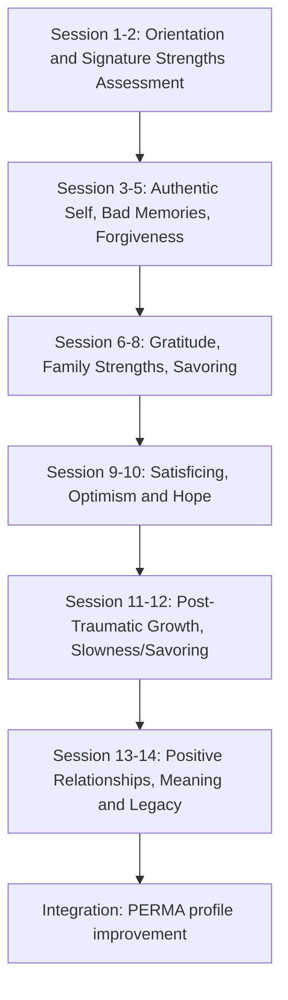

## Positive Psychotherapy and Seligman's PPT Protocol

### Overview

Positive Psychotherapy (PPT) is a manualized, evidence-based intervention developed by Martin Seligman and colleagues (notably Tayyab Rashid) designed to treat depression and enhance wellbeing by systematically building character strengths, positive emotions, meaning, and engagement, rather than focusing primarily on symptom reduction or pathology correction as traditional psychotherapy models do. PPT is distinct from generic "positive psychology interventions" (PPIs) applied ad hoc — it is a structured, session-by-session clinical protocol with its own theoretical model, assessment tools, and treatment manual.

### Theoretical Foundation: PERMA and the Authentic Happiness Model

PPT's theoretical scaffolding evolved through two of Seligman's models:

**Authentic Happiness Theory (earlier model)**

Proposed three routes to happiness:

- The Pleasant Life (maximizing positive emotion)
- The Engaged Life (flow, absorption in activities that use signature strengths)
- The Meaningful Life (using strengths in service of something larger than the self)

**PERMA Model (later, more comprehensive model)**

Seligman's *Flourish* (2011) expanded the framework into five measurable, independently pursued elements of wellbeing:

| Element | Description |
| --- | --- |
| **P**ositive Emotion | Subjective feelings of joy, contentment, hope, gratitude |
| **E**ngagement | Flow states; deep absorption via signature strengths |
| **R**elationships | Positive social connections, "active-constructive responding" |
| **M**eaning | Belonging to and serving something larger than oneself |
| **A**ccomplishment | Achievement pursued for its own sake, mastery, competence |

**[Inference]** The clinical PPT manual (Rashid & Seligman) predates the full PERMA formalization and was originally organized more explicitly around the three-route Authentic Happiness model; later editions and adaptations have been reframed to align with PERMA, though the underlying session content overlaps substantially between versions.

### Character Strengths and the VIA Classification

PPT is built heavily on the VIA (Values in Action) Classification of Character Strengths, developed by Peterson and Seligman (2004) as a positive counterpart to the DSM. It organizes 24 character strengths under 6 broad virtues:

1. **Wisdom and Knowledge** — creativity, curiosity, judgment, love of learning, perspective
2. **Courage** — bravery, perseverance, honesty, zest
3. **Humanity** — love, kindness, social intelligence
4. **Justice** — teamwork, fairness, leadership
5. **Temperance** — forgiveness, humility, prudence, self-regulation
6. **Transcendence** — appreciation of beauty/excellence, gratitude, hope, humor, spirituality

**Signature strengths** are the subset of these (typically the top 5) that are most central to a person's identity, that feel authentic and energizing to use, and that a person is intrinsically motivated to express. Identifying and deploying signature strengths in novel ways is a core mechanism across PPT sessions.

### The PPT Protocol Structure

PPT is typically delivered as a structured 14-session protocol (individual or group format), each session built around a specific skill-building theme, homework assignment, and in-session exercise. The most commonly cited version (Rashid & Seligman's manual) organizes sessions as follows:

| Session | Theme | Core Exercise |
| --- | --- | --- |
| 1 | Orientation to positive psychotherapy | Introduce PPT model; distinguish from symptom-focused therapy |
| 2 | Signature strengths assessment | VIA-IS administration; identify top strengths |
| 3 | Authentic self / better version of self | Applying signature strengths in daily life |
| 4 | Good vs. bad memory (bad memories) | Processing and "closing the gestalt" on negative memories |
| 5 | Forgiveness | The REACH forgiveness model or equivalent; letter of forgiveness (not necessarily sent) |
| 6 | Gratitude | Gratitude journal; **Gratitude Visit** exercise |
| 7 | Family tree of strengths | Mapping strengths across family members |
| 8 | Capitalizing on strengths / savoring | Active-constructive responding; savoring positive events |
| 9 | Satisficing vs. maximizing | Reducing maximizing behavior to increase satisfaction |
| 10 | Optimism and hope | Best Possible Self exercise; disputing pessimistic explanatory style |
| 11 | Post-traumatic growth | Finding growth narratives in adversity |
| 12 | Slowness and savoring | Mindful engagement with pleasant experiences |
| 13 | Positive relationships | Building and reinforcing meaningful relationships |
| 14 | Meaning and purpose | Legacy exercise; integrating strengths into a meaningful life narrative |

**[Unverified]** Exact session numbering, ordering, and titles vary slightly across published versions of the manual and across group vs. individual adaptations; clinicians should consult the specific manual edition being used (e.g., *Positive Psychotherapy: Clinician Manual*, Rashid & Seligman, 2018) for session-exact fidelity.

### Signature Exercises Within PPT

**Gratitude Visit**

Client writes a detailed letter of gratitude to someone who had a significant positive impact on their life but was never properly thanked, then (traditionally) delivers it in person, reading it aloud. Distinct from ongoing gratitude journaling in that it is a single, high-intensity, socially embedded act rather than a repeated private practice.

**Signature Strengths in a New Way**

Client identifies a top signature strength and commits to using it in a novel way each day for one week — grounded in Seligman, Steen, Park, and Peterson's (2005) randomized controlled study, which found this exercise produced durable increases in happiness and decreases in depressive symptoms over a 6-month follow-up, one of the more robust findings in the early PPI literature.

**Three Good Things (What Went Well)**

Client records three positive events each night along with their perceived cause, retraining attentional bias away from negativity bias and building an explanatory style that credits personal agency for positive outcomes.

**Active-Constructive Responding (ACR)**

Based on Shelly Gable's work on relationship capitalization: when another person shares good news, the four possible response styles are:

| Response Style | Description |
| --- | --- |
| Active-Constructive | Enthusiastic, engaged, asks follow-up questions |
| Passive-Constructive | Understated support ("that's nice") |
| Active-Destructive | Points out downsides or problems |
| Passive-Destructive | Ignores or changes the subject |

Only active-constructive responding is associated with relationship-strengthening outcomes; PPT trains clients to recognize and practice this style deliberately.

**Post-Traumatic Growth Narrative Work**

Distinct from resilience (bouncing back to baseline), post-traumatic growth (Tedeschi & Calhoun) refers to positive psychological change experienced as a result of struggling with highly challenging life circumstances, typically assessed across five domains: relating to others, new possibilities, personal strength, spiritual change, and appreciation of life.

### Illustrative Session Flow Diagram (svg_diagram)

### Assessment Instruments Used in PPT

| Instrument | Purpose |
| --- | --- |
| VIA Inventory of Strengths (VIA-IS) | Identifies and ranks the 24 character strengths |
| PERMA-Profiler | Multidimensional wellbeing measure aligned to the PERMA model |
| Satisfaction with Life Scale (SWLS) | Global life satisfaction |
| Beck Depression Inventory (BDI) or PHQ-9 | Symptom tracking (since PPT was originally validated against depression outcomes) |
| Post-Traumatic Growth Inventory (PTGI) | Measures growth domains post-adversity |

### Empirical Evidence Base

- Seligman, Rashid, and Parks (2006) conducted the original controlled trial of PPT (both individual and group formats) against treatment-as-usual and treatment-as-usual-plus-medication for depression, finding PPT produced greater symptom relief and higher rates of remission, particularly in the group format compared to standard treatment.
- Subsequent meta-analyses of positive psychology interventions broadly (Sin & Lyubomirsky, 2009; Bolier et al., 2013) found small-to-moderate effects on wellbeing and depressive symptoms across PPI protocols, with PPT-style multicomponent protocols generally performing comparably to or better than single-exercise interventions delivered in isolation.
- **[Unverified]** Effect sizes vary by population (clinical depression vs. subclinical/general population), delivery format (individual vs. group), and dosage (full 14-session protocol vs. abbreviated versions); readers should consult primary studies for population-specific figures rather than assuming a single effect size generalizes.

### PPT vs. Traditional CBT: Key Distinctions

| Dimension | Traditional CBT | Positive Psychotherapy |
| --- | --- | --- |
| Primary target | Cognitive distortions, symptom reduction | Strength-building, wellbeing enhancement |
| Core question | "What is wrong and how do we fix it?" | "What is right, and how do we build on it?" |
| Homework style | Thought records, behavioral activation | Gratitude visits, strength-use logs, savoring practice |
| Outcome measures | Symptom scales (primary) | PERMA/wellbeing measures alongside symptom scales |
| View of negative affect | Target for correction | Acknowledged and processed, not the sole focus |

**Key Points**

- PPT is not merely "adding positive exercises" to standard therapy — it is a distinct, manualized protocol with its own session sequence and theoretical rationale.
- The VIA strengths classification underpins most exercises; strengths identification (Session 2) is foundational to nearly everything that follows.
- PPT was originally validated specifically against depression outcomes, giving it a stronger clinical evidence base than many looser "wellbeing intervention" packages.
- Group format has shown particularly strong outcomes in the original trials, likely due to added social reinforcement mechanisms (though this is a plausible mechanism rather than a definitively isolated causal factor). **[Inference]**

### Implementation Considerations

- **Population fit**: PPT was developed and validated primarily with adults experiencing mild-to-moderate depression; applying it unmodified to severe psychopathology, active suicidality, or acute crisis states requires clinical judgment and is not the population on which the core trials were based.
- **Cultural adaptation**: The VIA strengths framework and specific exercises (e.g., gratitude letter delivery norms) may require cultural adaptation in delivery style, particularly around emotional expression norms and family-strengths mapping exercises.
- **Fidelity vs. flexibility trade-off**: Full 14-session fidelity produces the evidence-based outcomes studied in trials; many applied/coaching contexts adapt individual exercises (e.g., Gratitude Visit, Signature Strengths) as standalone tools, which sacrifices some of the cumulative, sequenced design of the full protocol. **[Inference]**

**Related Topics**

- VIA Classification of Character Strengths (full 24-strength taxonomy)
- PERMA model and the PERMA-Profiler instrument
- Best possible self and future-visioning exercises (covered as a PPT component)
- Gratitude interventions (Gratitude Visit, Three Good Things)
- Active-constructive responding and relationship capitalization theory
- Post-traumatic growth theory (Tedeschi & Calhoun)
- Explanatory style and learned optimism (Seligman's earlier work)
- Flow theory (Csikszentmihalyi) as it relates to the Engagement (E) component of PERMA