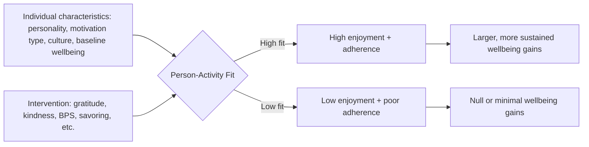

## Person-Activity Fit and Moderators of Intervention Effectiveness

### Overview

Person-activity fit refers to the degree of congruence between an individual's characteristics (personality, values, preferences, motivation, cultural background, current life circumstances) and the specific positive psychology intervention (PPI) or wellbeing-building activity they are asked to perform. The construct, formalized primarily by Sonja Lyubomirsky and Kennon Sheldon in their "Person-Activity Fit Diagnostic" work, addresses a core empirical puzzle in the PPI literature: interventions with strong average effects in meta-analyses (e.g., gratitude journaling, acts of kindness) frequently show substantial individual variability, with some participants improving markedly and others showing null or even negative responses to the identical protocol.

### Theoretical Basis: The Sustainable Happiness Model

Lyubomirsky, Sheldon, and Schkade's (2005) sustainable happiness model decomposes chronic happiness level into three sources:

$$H = S + C + V$$

Where:

- $S$ = genetic/temperamental set point (estimated ~50% of variance in twin studies)
- $C$ = life circumstances (estimated ~10% of variance)
- $V$ = intentional activity (estimated ~40% of variance)

**[Unverified]** These percentage estimates derive from specific behavioral genetics studies (notably Lykken & Tellegen's twin research) and specific decompositions of circumstantial variance; they are widely cited heuristics rather than universally agreed-upon exact figures, and subsequent researchers have debated the precision of the set-point percentage in particular.

The model's practical implication is that intentional activity ($V$) is the most *modifiable* component, which is the theoretical justification for PPIs as a class of intervention. Person-activity fit theory extends this by arguing that $V$'s effectiveness is not uniform across people — the same activity produces different amounts of sustainable wellbeing gain depending on fit.

### The Person-Activity Fit Diagnostic (PAFD)

Developed by Sheldon and Lyubomirsky as a practical tool, the PAFD assesses fit along several dimensions before recommending a specific intervention:

| Fit Dimension | Description |
| --- | --- |
| Perceived value/meaning of the activity | Does the person believe the activity is beneficial? |
| Enjoyment | Does the person find performing the activity pleasant rather than effortful/dutiful? |
| Efficacy beliefs | Does the person believe they can perform it successfully? |
| Naturalness | Does the activity feel like an extension of the person's existing habits, or foreign? |
| Culture and social norm fit | Is the activity congruent with the person's cultural/social context? |
| Preexisting motivation type | Does the activity align with autonomous vs. controlled motivation? |

**[Inference]** Higher scores across these dimensions predict greater intervention adherence and larger wellbeing gains, though the PAFD itself is a screening/matching heuristic rather than a fully psychometrically validated diagnostic scale with established cutoff norms in the way clinical instruments are.

### Categories of Moderating Variables

**Personality-Based Moderators**

| Moderator | Effect on Intervention Fit |
| --- | --- |
| Extraversion | Associated with stronger responses to social/kindness-based interventions |
| Openness to experience | Associated with stronger responses to novel, imaginative interventions (e.g., Best Possible Self) |
| Conscientiousness | Associated with better adherence to structured, repeated-practice interventions (e.g., daily gratitude logs) |
| Neuroticism | Mixed findings — some studies show neurotic individuals derive larger gains from savoring/gratitude (larger room for improvement), others show poorer adherence |
| Self-esteem (baseline) | Notably, low baseline self-esteem has been shown in some studies to blunt or even reverse gains from certain self-affirming interventions |

**Motivational Moderators**

Grounded in self-determination theory (Deci & Ryan), the distinction between autonomous motivation (engaging in the activity because one values or enjoys it) and controlled motivation (engaging because of external pressure or obligation) is one of the most consistently replicated moderators:

- Autonomously motivated engagement with a PPI predicts sustained practice and larger wellbeing gains.
- Controlled/pressured engagement (e.g., mandated as a workplace wellness requirement) predicts weaker gains and higher dropout, and in some studies null or negative effects.

**Dosage and Timing Moderators**

- **Variety effects**: Sheldon, Boehm, and Lyubomirsky's work found that varying *how* an activity is performed (e.g., performing acts of kindness in different ways each week) sustains positive effects longer than performing the identical act repeatedly, which is subject to hedonic adaptation.
- **Frequency**: Lyubomirsky's counting-kindnesses studies found that performing multiple acts of kindness in a single day (vs. spread across a week) produced larger wellbeing gains — a counterintuitive dosage/timing/concentration effect.
- **Duration of practice**: Some interventions (e.g., gratitude journaling) show diminishing or even reversing returns with excessive frequency (e.g., journaling too many times per week can shift from a novel positive practice to a tedious chore) — an inverted-U dosage relationship suggested in several studies.

**Cultural and Demographic Moderators**

- Collectivist vs. individualist cultural orientation has been shown to moderate responses to self-focused vs. other-focused interventions; other-focused activities (e.g., acts of kindness, gratitude toward others) sometimes show more consistent cross-cultural effectiveness than self-focused activities (e.g., "best possible self," which foregrounds individual achievement).
- Age has been examined as a moderator of specific interventions (e.g., older adults have shown particularly strong responses to gratitude and meaning-based interventions in some studies, plausibly linked to socioemotional selectivity theory's account of shifting motivational priorities across the lifespan). **[Inference]**

**Baseline Wellbeing/Clinical Status Moderators**

- Individuals with clinically significant depression may respond differently to PPIs than subclinical or non-clinical populations — this is part of the rationale for structured, clinically validated protocols like Positive Psychotherapy (PPT) rather than unguided self-administration of isolated exercises in clinical populations.
- Ceiling effects: individuals already high in baseline wellbeing show smaller absolute gains on many wellbeing measures, a straightforward measurement/statistical phenomenon rather than a fit issue per se, but one that is often conflated with fit effects in less careful study designs.

### Illustrative Diagram: Fit-Effectiveness Pathway (svg_diagram)

### Mechanistic Explanation: Why Fit Matters

Three converging mechanisms are commonly proposed in the literature:

1. **Adherence pathway**: Poor fit reduces the likelihood a person will continue performing the activity, and dosage/consistency is itself a predictor of outcome magnitude — so fit affects outcomes indirectly through behavior persistence.
2. **Self-determination pathway**: Activities congruent with a person's values and interests are experienced as autonomously motivated, which self-determination theory links to more durable psychological benefit than externally pressured behavior, independent of adherence.
3. **Hedonic adaptation resistance pathway**: A well-fitted activity is more likely to be varied and personally elaborated by the individual (rather than performed mechanically), which slows hedonic adaptation — the tendency for repeated positive experiences to lose their emotional impact over time.

### Practical Application: Matching Frameworks

Applied positive psychology practice has generated several heuristic matching approaches (distinct from, though inspired by, the formal PAFD):

| If the person tends toward... | Consider recommending... |
| --- | --- |
| High extraversion, social orientation | Acts of kindness, gratitude visits, active-constructive responding practice |
| High openness, imaginative tendency | Best Possible Self, future-visioning, novel strengths-use exercises |
| High conscientiousness, structure preference | Daily gratitude logs, Three Good Things, habit-based savoring practices |
| Low baseline motivation/high skepticism | Start with low-effort, high-immediacy activities (e.g., single Gratitude Visit) before layering repeated-practice interventions |
| Collectivist cultural background | Other-focused interventions (kindness, gratitude, relationship-strengthening) may show more reliable uptake than self-focused achievement framing |

**[Inference]** These matching heuristics are drawn from the broader theoretical logic of person-activity fit and represent reasonable applied extrapolations; they are not, individually, all backed by dedicated randomized matching-trial evidence in the way the underlying moderator findings (e.g., variety effects, autonomous motivation effects) are.

### Methodological Considerations in Studying Moderators

- **Underpowered subgroup analyses**: Many PPI trials are powered to detect main effects, not interaction effects (moderator analyses), meaning null moderator findings in the literature may partly reflect insufficient statistical power rather than true absence of moderation.
- **Self-selection confound**: In real-world (non-randomized) settings, individuals often self-select into interventions that already fit them, inflating apparent effectiveness compared to randomized-assignment trial conditions — an important distinction when interpreting real-world wellbeing app usage data versus RCT evidence.
- **Measurement of fit itself**: Fit is frequently measured via retrospective self-report (e.g., "how much did you enjoy this activity?") rather than a priori prediction, which raises the possibility that reported fit is partly a post-hoc rationalization of experienced benefit rather than a pure independent predictor. **[Inference]**

**Key Points**

- Average PPI effect sizes reported in meta-analyses obscure substantial individual-level heterogeneity; person-activity fit is the leading explanatory framework for this heterogeneity.
- Autonomous motivation (vs. controlled/obligatory engagement) is one of the most robust and consistently replicated moderators across the PPI literature.
- Variety in how an activity is performed, and appropriately calibrated dosage/frequency, both interact with fit to influence resistance to hedonic adaptation.
- Practitioners should treat "one-size-fits-all" PPI prescription with caution and consider individual differences (personality, motivation, culture, baseline wellbeing) when selecting or sequencing interventions.

**Next Steps**

- Hedonic adaptation and the hedonic treadmill (Brickman & Campbell)
- Self-determination theory (Deci & Ryan) as a moderator framework
- Sustainable happiness model and the $H = S + C + V$ decomposition
- Variety effects in kindness and gratitude interventions (Sheldon, Boehm, Lyubomirsky)
- Cross-cultural positive psychology and collectivist vs. individualist intervention design
- Positive Psychotherapy (PPT) as a clinically structured response to fit/population concerns
- Dose-response relationships in wellbeing interventions