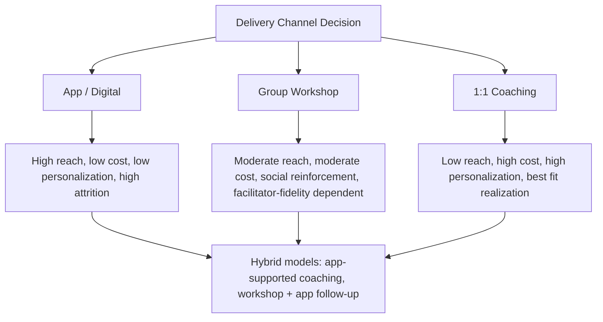

## Delivering Interventions at Scale Through Apps, Workshops, and Coaching

### Overview

Scaled delivery of positive psychology interventions (PPIs) refers to the design, implementation, and evaluation challenges involved in moving PPIs from tightly controlled research settings (small samples, in-person, researcher-administered) to real-world delivery formats capable of reaching large populations: mobile/web applications, structured group workshops, and professional coaching relationships. Each delivery channel carries distinct tradeoffs regarding fidelity, personalization, cost, reach, and evidentiary support.

### Delivery Channel Comparison

| Dimension | Digital/App-Based | Group Workshop | 1:1 Coaching |
| --- | --- | --- | --- |
| Reach/scalability | Very high | Moderate | Low |
| Cost per participant | Very low (marginal) | Moderate | High |
| Personalization/fit | Low-moderate (algorithmic at best) | Low | High |
| Fidelity to research protocol | Variable, often lower | Moderate-high (facilitator-dependent) | Moderate-high (coach-dependent) |
| Social reinforcement | Low (unless app has social features) | High | Moderate |
| Attrition/dropout rate | Typically high | Moderate | Low |
| Real-time responsiveness to distress | Very limited/automated | Moderate (facilitator present) | High |

### Digital and App-Based Delivery

**Architecture Patterns for PPI Apps**

Digital PPI delivery typically follows one of several architectural patterns:

1. **Fixed-sequence protocol apps**: Digitize a specific manualized intervention (e.g., a 14-session PPT-style protocol) as a linear sequence of modules, largely preserving the original research protocol's structure and ordering.
2. **Modular/adaptive libraries**: Offer a library of discrete exercises (gratitude journal, Best Possible Self, kindness tracker, savoring prompts) that users select or that an algorithm recommends based on stated preferences or in-app behavior — this pattern operationalizes person-activity fit at scale, though typically via simple self-report matching rather than the full PAFD.
3. **Micro-intervention/ecological momentary intervention (EMI) apps**: Deliver very brief, frequent prompts (e.g., a daily notification asking "What's one good thing that happened today?") rather than longer structured sessions, drawing on ecological momentary assessment (EMA) methodology adapted for intervention delivery.
4. **Chatbot/conversational agent delivery**: Use conversational interfaces (rule-based or LLM-based) to deliver PPI content interactively, simulating some aspects of dialogic coaching at much lower marginal cost. **[Inference]** This is a rapidly evolving delivery mode; the evidence base for LLM-mediated PPI delivery specifically is thinner and newer than for the app patterns above, since large-scale conversational-agent PPI delivery is a comparatively recent development.

**Design Considerations Specific to Digital Delivery**

- **Engagement/retention design**: App-based wellbeing interventions face notoriously high attrition; behavioral design patterns (streaks, reminders, progress visualization, notification timing) are commonly borrowed from general app-engagement design, though overly gamified approaches risk shifting motivation from autonomous to controlled (see person-activity fit topic), potentially undermining the intervention's own theoretical mechanism.
- **Personalization algorithms**: Simple rule-based matching (e.g., a short onboarding questionnaire recommending an initial exercise) is far more common in deployed apps than sophisticated adaptive algorithms; **[Unverified]** the degree to which deployed apps' matching algorithms are validated against actual outcome data (versus designed heuristically) varies widely and is often not publicly documented by app developers.
- **Measurement infrastructure**: At-scale digital delivery creates opportunities for large passive datasets (usage patterns, response timing) alongside active outcome measures (in-app wellbeing check-ins), but also introduces measurement validity concerns (self-selection into continued app use, non-representative samples of who completes follow-up surveys).
- **Safety and escalation pathways**: Digital PPI delivery at scale must account for occasional users in acute distress; responsible app design includes crisis-resource signposting and, where appropriate, escalation pathways to human support, since automated content cannot reliably detect or respond to acute risk in the way an in-person facilitator or coach can.

**Evidence Base for Digital PPIs**

Meta-analytic work on digital/app-delivered PPIs (e.g., studies examining app-based gratitude, mindfulness-adjacent, and multi-component wellbeing apps) generally finds effects that are directionally consistent with in-person PPI research but often smaller in magnitude and more heterogeneous, plausibly reflecting lower fidelity, lower dosage/completion rates, and less personalized fit. **[Inference]** The magnitude gap between in-person research effects and real-world app effects is a recurring theme in the digital health literature broadly, not unique to positive psychology.

### Group Workshop Delivery

**Structural Patterns**

- **Fixed-curriculum workshops**: Deliver a structured sequence (often compressed from longer clinical protocols) across a set number of sessions (e.g., a 6- or 8-week format condensing elements of the 14-session PPT protocol) in organizational, educational, or community settings.
- **Single-session/workshop-day formats**: Common in corporate wellness and educational contexts — a single 1-3 hour session introducing 2-4 core exercises (e.g., gratitude, signature strengths identification, savoring) without the sequenced, cumulative structure of the full clinical protocol.
- **Train-the-trainer models**: Scale delivery by training local facilitators (teachers, HR staff, community leaders) to deliver a standardized curriculum, trading some fidelity control for substantially greater reach than direct expert-led delivery.

**Facilitator Fidelity Considerations**

Workshop-based delivery is highly sensitive to facilitator skill and fidelity to the underlying protocol:

| Fidelity Risk | Mitigation |
| --- | --- |
| Facilitator drift from evidence-based content toward generic motivational content | Structured facilitator manuals, fidelity checklists |
| Inconsistent handling of participant distress disclosures | Facilitator training in basic psychological safety and referral pathways |
| Group size effects diluting personalization | Capping group size; breakout/small-group exercise structuring |
| Cultural mismatch between standardized curriculum and local context | Facilitator-level cultural adaptation guidance built into training |

**Group-Specific Mechanisms**

Group delivery introduces mechanisms not present in solo digital or app use:

- **Social reinforcement and normalization**: Hearing peers engage authentically with exercises (e.g., sharing a gratitude reflection) can normalize the practice and reduce self-consciousness.
- **Active-constructive responding in vivo**: Group workshops allow live practice of interpersonal PPI skills (e.g., ACR) that are difficult to practice meaningfully in solo app use.
- **Risk**: Group settings also introduce social comparison risk (as noted under Best Possible Self and person-activity fit topics), requiring facilitator awareness and appropriate exercise sequencing/framing.

### One-on-One Coaching Delivery

**Coaching vs. Clinical Delivery Distinction**

Positive psychology coaching (distinct from Positive Psychotherapy delivered by licensed clinicians) is typically delivered by trained coaches (sometimes certified through positive psychology coaching credentialing programs) working with non-clinical populations pursuing personal or professional growth goals rather than symptom reduction.

| Dimension | Positive Psychology Coaching | Positive Psychotherapy (Clinical) |
| --- | --- | --- |
| Practitioner credentialing | Coaching certification (varies widely in rigor) | Licensed mental health clinician |
| Target population | Generally non-clinical, growth-oriented | Often includes clinical depression, validated in RCTs against depression outcomes |
| Regulatory oversight | Largely unregulated in most jurisdictions | Subject to clinical licensure and scope-of-practice regulation |
| Session structure | Often flexible, goal-driven, less manualized | Manualized, sequenced protocol (e.g., 14-session PPT) |

**[Inference]** Because coaching is a less regulated space than clinical psychotherapy, the quality and evidence-fidelity of "positive psychology coaching" varies substantially by provider and certifying body; the underlying exercises draw on the same research base (VIA strengths, gratitude, BPS, etc.) but delivery quality control is far less standardized than in clinical protocol delivery.

**High-Personalization Advantages**

One-on-one coaching most closely approximates the person-activity fit ideal: a skilled coach can directly assess a client's personality, motivation style, cultural context, and current circumstances, and select/sequence interventions accordingly — operationalizing the PAFD's matching logic through direct human judgment rather than an algorithmic proxy.

### Illustrative Diagram: Scaled Delivery Tradeoff Space (svg_diagram)

### Hybrid and Blended Models

Increasingly common in applied practice:

- **Workshop-plus-app follow-up**: An in-person or live-virtual workshop introduces exercises with facilitator support, followed by app-based reinforcement/tracking to sustain practice over subsequent weeks — attempting to combine workshop-level fidelity and social reinforcement with app-level sustained engagement infrastructure.
- **Coach-supported app use**: A coach periodically reviews app-tracked data (e.g., gratitude log consistency) and provides personalized guidance during scheduled check-ins, blending scalability with human personalization at a lower cost than pure 1:1 coaching.
- **Stepped-care models**: Analogous to stepped-care in clinical mental health treatment — offer lower-intensity digital self-help first, escalating to workshop or coaching/clinical support for individuals who do not respond or who show signs of more significant need. **[Inference]** Stepped-care logic is well established in clinical mental health service design generally; its specific formalized application to PPI delivery at scale is a plausible and increasingly discussed extension rather than a single canonical established protocol.

### Organizational and Public Health Deployment Contexts

| Context | Typical Delivery Pattern | Key Consideration |
| --- | --- | --- |
| Corporate wellness programs | Workshops + app-based reinforcement | Risk of controlled (mandated) motivation undermining effectiveness (see person-activity fit) |
| K-12/higher education | Curriculum-embedded workshops (e.g., social-emotional learning integration) | Developmental appropriateness; teacher fidelity as quasi-facilitators |
| Public health/population-level campaigns | Mass-reach digital tools, sometimes government or NGO-sponsored | Equity of access (device/internet access disparities); very low per-user engagement typical of mass digital campaigns |
| Clinical/healthcare settings | Coaching or clinician-delivered PPT-style protocols, sometimes app-supplemented | Requires integration with existing clinical workflows and referral pathways |

### Evaluation Challenges Unique to Scaled Delivery

1. **Fidelity measurement at scale**: Verifying that thousands of app users or dozens of independently trained facilitators are delivering content consistent with the evidence base is substantially harder than monitoring fidelity in a single-site research trial.
2. **Selection and survivorship bias in outcome data**: Users/participants who complete follow-up assessments in real-world deployments are frequently non-representative of the full population that started the intervention, inflating apparent effectiveness.
3. **Commercial incentive misalignment**: App engagement metrics (time-in-app, daily active use) are the commercial success metrics for many wellbeing app businesses, which do not necessarily align with genuine wellbeing improvement or healthy, adaptive use patterns — a structural tension worth flagging when evaluating claims made by commercial PPI products. **[Inference]**
4. **Long-term follow-up feasibility**: Sustained follow-up (necessary to assess hedonic-treadmill-related fade-out, per the prior limitations topic) is logistically and financially harder to maintain in large-scale deployed programs than in funded research trials with dedicated follow-up infrastructure.

**Key Points**

- No single delivery channel dominates on all dimensions; reach, cost, personalization/fit, and fidelity trade off against each other systematically across apps, workshops, and coaching.
- Digital delivery most directly confronts the person-activity fit and hedonic-treadmill challenges discussed in prior topics, since it has the least capacity for human judgment-based matching and the highest attrition risk.
- Group workshops introduce valuable social-reinforcement mechanisms but are highly sensitive to facilitator fidelity and introduce social-comparison risk.
- One-on-one coaching best approximates true person-activity fit through direct human matching but does not scale, and — unlike clinical PPT — often operates with less regulatory and evidentiary rigor.
- Hybrid/stepped-care models are an increasingly common practical response to these tradeoffs, though their own evidence base is still developing relative to single-channel delivery research.

**Related Topics**

- Person-activity fit and moderators of intervention effectiveness (cross-reference: algorithmic matching as a scaled proxy)
- Limitations, null findings, and the hedonic treadmill problem (cross-reference: attrition and fade-out in digital delivery)
- Positive Psychotherapy and Seligman's PPT protocol (cross-reference: clinical vs. coaching delivery distinction)
- Digital health engagement design and behavior change technology
- Stepped-care models in mental health service delivery
- Ecological momentary assessment and intervention (EMA/EMI) methodology
- Regulation and credentialing in the coaching industry
- Conversational AI and chatbot-delivered mental health/wellbeing support