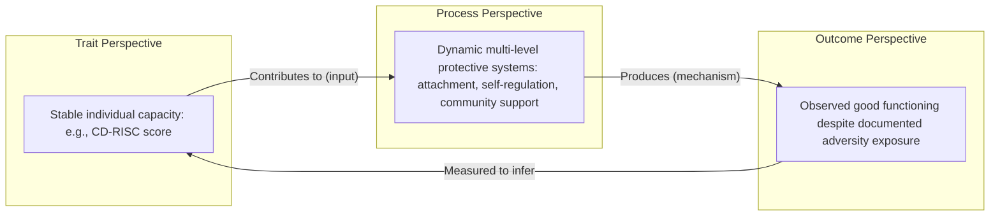

## Defining Resilience: Trait, Process, and Outcome Perspectives

### Overview

Resilience is one of the most conceptually contested constructs in psychology, and a foundational challenge for the field is that "resilience" has been defined and operationalized in at least three substantially different ways across the literature: as a stable personality trait, as a dynamic developmental process, and as an observed outcome pattern following adversity. These are not merely semantic variants — they imply different research designs, different measurement approaches, and different practical/clinical implications. Understanding this tripartite distinction is prerequisite to interpreting virtually any resilience research or intervention claim.

### The Core Definitional Problem

Most contemporary definitions converge on resilience involving two necessary components:

1. **Exposure to significant adversity, risk, or stress** (without this, "doing well" is not resilience — it is simply normal functioning)
2. **A pattern of positive adaptation or maintained/restored functioning despite that adversity**

The disagreement in the field centers on *what kind of thing* produces or constitutes that positive adaptation, and at *what level of analysis* (individual trait, dynamic process, or measured outcome) resilience should be conceptualized.

### Trait Perspective

**Definition**

The trait perspective treats resilience as a relatively stable individual-difference characteristic or personality attribute — a capacity or set of capacities a person possesses to varying degrees, roughly analogous to how conscientiousness or extraversion are treated as stable traits in personality psychology.

**Representative Instruments**

Trait-oriented measurement approaches produced instruments designed to capture resilience as a scoreable individual attribute:

| Instrument | Approach |
| --- | --- |
| Connor-Davidson Resilience Scale (CD-RISC) | Self-report scale assessing perceived personal competence, tolerance of negative affect, acceptance of change, control, and spiritual influences |
| Resilience Scale (Wagnild & Young) | Measures perceived personal competence and acceptance of self/life |
| Ego-Resiliency Scale (Block & Kremen) | Rooted in personality psychology; treats ego-resiliency as a stable characteristic related to flexible adaptation to changing circumstances |

**Strengths of the Trait View**

- Enables straightforward psychometric measurement and comparison across individuals
- Aligns with everyday, intuitive language ("she's a resilient person")
- Supports research designs correlating a resilience score with other stable traits (e.g., Big Five correlates)

**Criticisms of the Trait View**

- Risk of tautological reasoning: if resilience is defined as "the trait that produces good outcomes after adversity," and measured by asking people whether they generally cope well, the construct risks circularity (resilient people cope well because they are resilient; we know they are resilient because they cope well).
- Empirical evidence increasingly suggests that a person's adaptive functioning varies substantially across different types of adversity and life domains, which sits uneasily with a single, generalized, stable trait model. **[Inference]** The domain-specificity finding is well-documented; the interpretive conclusion that this "sits uneasily" with pure trait models is a reasonable but interpretive inference rather than a directly stated consensus claim.

### Process Perspective

**Definition**

The process perspective, most closely associated with Ann Masten's work (notably her description of resilience as reflecting "ordinary magic" — the product of ordinary, common adaptive systems rather than rare or extraordinary individual qualities), conceptualizes resilience as a dynamic set of interacting processes across multiple system levels (biological, psychological, family, community) that unfold over time in response to risk or adversity.

**Key Theoretical Commitments**

- Resilience is not a fixed quantity a person "has" but an emergent property of interactions between the individual and their environment — including protective factors at the individual level (cognitive skills, emotion regulation capacity), relational level (secure attachment, supportive caregiving), and systemic level (community resources, institutional support).
- The same person can show resilient processes in one domain (e.g., academic functioning) while struggling in another (e.g., peer relationships) following the same adverse exposure — a pattern well documented in developmental resilience research and difficult to reconcile with a single generalized trait score.
- Resilience processes are theorized to operate through identifiable "protective systems" — Masten's work in particular emphasizes that these systems (attachment relationships, self-regulation capacities, motivation to learn/adapt, community/cultural belief systems) are common, ordinary human adaptive systems, not rare extraordinary capacities — hence "ordinary magic" rather than exceptional heroism.

**Multi-System Levels in Process Models**

| System Level | Example Protective Processes |
| --- | --- |
| Biological | Stress-response regulation (HPA axis functioning), genetic factors moderating stress sensitivity |
| Individual/psychological | Cognitive appraisal style, emotion regulation skills, self-efficacy beliefs |
| Relational/family | Secure attachment, authoritative parenting, at least one stable supportive relationship |
| Community/institutional | School support structures, community cohesion, access to healthcare and social services |
| Cultural | Culturally rooted meaning-making systems, religious/spiritual coping frameworks, collective identity resources |

**Strengths of the Process View**

- Better accommodates the domain-specificity and context-dependency observed empirically (resilience in one area, difficulty in another)
- Directly generates intervention targets: if resilience is a process involving identifiable protective systems, those systems (e.g., a supportive relationship, a functioning school environment) become actionable targets for prevention and intervention programs.
- Aligns with developmental systems theory and ecological models (e.g., Bronfenbrenner) that dominate contemporary developmental psychology more broadly.

**Criticisms of the Process View**

- More complex to operationalize and measure than a single trait score; process models often require longitudinal, multi-level data collection that is more resource-intensive than a single self-report questionnaire.
- Some critics argue the process view, taken to its logical extreme, risks defining resilience so broadly (as the sum of essentially all positive developmental processes) that it loses discriminant meaning as a distinct construct. **[Inference]**

### Outcome Perspective

**Definition**

The outcome perspective defines resilience descriptively, after the fact, as an observed pattern: an individual has "shown resilience" if, having been exposed to significant adversity, they demonstrate outcomes that meet or exceed some normative expectation for functioning (academic achievement, mental health status, social functioning) — without necessarily making any claim about the underlying trait or process that produced that outcome.

**Operationalization Approaches**

Outcome-based resilience research typically classifies individuals post hoc using a combination of:

1. **Risk/adversity exposure measurement**: Documenting the type, severity, timing, and chronicity of adversity exposure (e.g., adverse childhood experiences, poverty exposure, trauma exposure)
2. **Competence/functioning measurement**: Assessing functioning across one or more domains (academic, social, emotional, behavioral) against normative benchmarks

Individuals are then classified into outcome categories such as:

| Category | Adversity Exposure | Functioning Level |
| --- | --- | --- |
| Resilient | High | Good/expected |
| Vulnerable | High | Poor/impaired |
| Competent (non-resilient comparison) | Low | Good/expected |
| At-risk-but-unaffected is sometimes distinguished from... | — | — |

**[Unverified]** Exact categorical labeling schemes vary across researchers (e.g., Garmezy's early work, Luthar's later refinements); there is no single universally standardized four-quadrant taxonomy used identically across all studies, though the underlying risk-by-outcome cross-tabulation logic is broadly shared.

**Strengths of the Outcome View**

- Empirically tractable: does not require committing to a causal theory before measurement; researchers can identify "resilient" cases descriptively and then investigate what distinguishes them from non-resilient peers exposed to similar adversity.
- Historically, this approach (associated with foundational researchers like Norman Garmezy, Emmy Werner, and Michael Rutter) generated much of the empirical basis from which later trait and process theories were built — the classic Kauai longitudinal study (Werner & Smith) is a canonical example of outcome-based resilience research.

**Criticisms of the Outcome View**

- Definitionally circular in a different way than trait tautology: resilience is defined by its own presence (good outcomes despite adversity) without explaining what produces it — the outcome view describes *that* resilience occurred, not *how*.
- Ann Masten and others (notably Suniya Luthar's influential critiques) have raised concerns about the "moving target" problem: what counts as "good functioning" varies by developmental stage, cultural context, and which domain is assessed, making cross-study comparison difficult.
- Luthar's critique also raised concern that outcome-based resilience classifications can imply an inappropriately static, binary judgment ("resilient" vs. "not resilient") about a person, when in fact resilience status frequently varies over time and by domain — bridging back toward the process perspective's emphasis on dynamism.

### Integration: How the Three Perspectives Relate

**[Inference]** Contemporary resilience scholarship, particularly Masten's and Luthar's work, has increasingly moved toward integrative positions that treat trait-like individual differences (e.g., temperament, cognitive style) as *inputs* into dynamic processes, which in turn *produce* the outcomes that outcome-based researchers historically measured — effectively nesting the three perspectives into a single explanatory chain rather than treating them as fully competing paradigms. This integrative framing is a reasonable synthesis of trends in the literature rather than a single universally cited canonical statement.

### Illustrative Diagram: Three Perspectives and Their Relationship (svg_diagram)

### Practical and Research Implications of the Distinction

| If your goal is... | The most useful perspective is... | Because... |
| --- | --- | --- |
| Screening/selecting individuals for targeted support | Trait (with caution re: circularity) | Provides a quick, scoreable individual metric |
| Designing a prevention or intervention program | Process | Identifies specific, modifiable protective systems as intervention targets |
| Conducting longitudinal or epidemiological research on adversity populations | Outcome | Enables systematic, replicable classification across large samples |
| Explaining *why* some individuals do well despite adversity | Process (informed by trait and outcome data) | Only the process view directly addresses causal mechanism |

### Common Conceptual Pitfalls

- **Conflating resilience with invulnerability**: Early resilience research was sometimes (mis)interpreted as suggesting some children were simply "invulnerable" to adversity; contemporary process-oriented scholarship explicitly rejects invulnerability framing in favor of the "ordinary magic" model — resilience results from ordinary protective systems functioning, not from rare invulnerable individuals.
- **Treating resilience as a fixed, global, once-achieved status**: All three perspectives, when applied carelessly, risk implying resilience is a permanent achieved state; the process perspective in particular explicitly rejects this in favor of a dynamic view where resilience can fluctuate across time, domain, and context.
- **Ignoring cultural variation in "positive adaptation"**: Since the outcome perspective requires a normative standard for "good functioning," failing to account for cultural variation in what constitutes healthy adaptation risks imposing a culturally narrow standard as if it were universal.

**Key Points**

- The trait, process, and outcome perspectives are not merely different definitions of the same thing — they imply different measurement strategies, different research designs, and different intervention targets.
- Ann Masten's "ordinary magic" framing is central to the modern process perspective and explicitly rejects the idea that resilience reflects rare, extraordinary individual qualities.
- The outcome perspective is historically foundational (Garmezy, Werner, Rutter) but faces a "moving target" critique regarding what counts as good functioning across contexts and developmental stages.
- Contemporary integrative approaches tend to treat traits as inputs, processes as mechanisms, and outcomes as the measured endpoint of a single explanatory chain, rather than treating the three perspectives as mutually exclusive.

**Next Steps**

- Masten's "ordinary magic" theory and protective systems framework in depth
- Multisystem/ecological models of resilience (Bronfenbrenner-influenced approaches)
- Classic longitudinal resilience studies (Werner & Smith's Kauai Longitudinal Study; Rutter's Isle of Wight studies)
- Risk factors, protective factors, and cumulative risk models
- Domain-specificity of resilience (academic vs. social vs. emotional functioning)
- Cultural and cross-cultural perspectives on defining "positive adaptation"
- Resilience across the lifespan: childhood, adolescent, and adult resilience models
- Measurement instruments in depth (CD-RISC, Resilience Scale, Ego-Resiliency Scale) and their psychometric properties