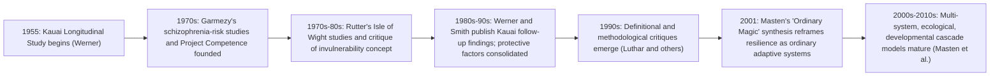

## Historical Development from Garmezy, Rutter, and Werner to Masten

### Overview

The scientific study of resilience emerged as a distinct field in the 1970s, growing out of a paradigm shift within developmental psychopathology research. Rather than continuing to study only children who developed psychopathology following adversity (a deficit-focused approach), a small group of researchers — most prominently Norman Garmezy, Michael Rutter, and Emmy Werner — turned their attention to the puzzling and clinically important observation that a substantial subset of children exposed to serious risk factors (parental mental illness, poverty, abuse, war, perinatal complications) nonetheless developed into competent, well-functioning adults. This historical arc, culminating in Ann Masten's synthesis and reframing, represents one of the clearest examples of a field's conceptual evolution from descriptive discovery to mechanistic, systems-level theory.

### Precursors and the Paradigm Shift

**Deficit-Focused Developmental Psychopathology (Pre-1970s Context)**

Prior to the emergence of resilience research, developmental psychopathology was overwhelmingly oriented toward identifying risk factors and documenting negative outcomes in high-risk populations (e.g., children of parents with schizophrenia, children raised in poverty). This research productively established *that* risk factors predicted negative outcomes on average, but did not systematically address the variance around that average — the children who, despite equivalent risk exposure, did not develop the expected negative outcomes were often treated as statistical noise rather than a phenomenon worth studying in its own right.

**The Reframing**

The conceptual innovation that founded resilience research was the decision to treat these positive-outlier cases not as noise to be averaged away, but as a scientifically important phenomenon demanding its own explanation: *why* do some children exposed to serious adversity do well, when most theory would predict they should not?

### Norman Garmezy: Risk Research and the Search for Protective Factors

**Key Contributions**

Norman Garmezy, working at the University of Minnesota, is widely credited as a founding figure of resilience research, particularly through his studies of children of parents with schizophrenia (high genetic and environmental risk for psychopathology) in the 1970s and 1980s.

- Garmezy's "Project Competence" research program at the University of Minnesota (which Ann Masten would later inherit and lead) systematically studied competence and adaptation in children facing high-risk circumstances, establishing much of the empirical infrastructure and longitudinal methodology that later resilience research built upon.
- Garmezy is credited with popularizing the term "invulnerable" in early resilience discourse, though this specific framing (implying near-total immunity to adversity's effects) was later substantially revised and critiqued by subsequent researchers, including Garmezy's own intellectual successors, as overstating the phenomenon.
- Garmezy's work helped establish the foundational triad of protective factor categories that recur throughout subsequent resilience literature: (1) individual attributes (temperament, cognitive ability), (2) family characteristics (warmth, cohesion), and (3) broader social/community support systems.

### Michael Rutter: Refining the Construct and Introducing Process Thinking

**Key Contributions**

British psychiatrist Michael Rutter made several foundational theoretical contributions that pushed the field away from static trait/invulnerability framing toward more nuanced process-oriented thinking, years before "process perspective" became a standard framing in the field.

- **The Isle of Wight studies**: Rutter's large-scale epidemiological studies of children on the Isle of Wight (and later inner London comparisons) provided foundational data on rates of childhood psychiatric disorder and the role of risk factors, informing later resilience-relevant analyses of protective conditions.
- **Critique of the "invulnerability" concept**: Rutter explicitly challenged the implication that resilient children were simply immune to stress, arguing instead that resilience reflects relative resistance that varies by degree, by circumstance, and over time — an early and influential precursor to the later "ordinary magic"/process framing.
- **Emphasis on mechanisms, not just correlates**: Rutter pushed the field to ask not just *which* factors correlate with good outcomes, but *how* those factors operate mechanistically — for example, distinguishing between a protective factor that reduces exposure to risk altogether versus one that alters a person's response to risk once exposed.
- **"Steeling effects" / stress inoculation concept**: Rutter proposed that certain manageable, non-overwhelming exposures to adversity or challenge could, under the right conditions, strengthen subsequent coping capacity — an early conceptual ancestor of later stress-inoculation and post-traumatic growth ideas, while also cautioning that this effect is highly conditional and does not generalize to justify exposing children to excessive or overwhelming adversity.
- **Turning-point concept**: Rutter emphasized that developmental trajectories are not fixed by early risk exposure alone — key turning points (a stable marriage, military service, a supportive mentor) could redirect a life trajectory away from an expected negative outcome, reinforcing a dynamic, lifespan-oriented view of adaptation rather than a fixed early-childhood-determines-everything model.

### Emmy Werner: The Kauai Longitudinal Study

**Study Design**

Emmy Werner and Ruth Smith's Kauai Longitudinal Study is one of the most influential empirical studies in the history of resilience research. Beginning in 1955, the study followed all children born that year on the Hawaiian island of Kauai (approximately 700 children) prospectively from birth into adulthood (with follow-ups extending across multiple decades), documenting risk exposures (perinatal complications, poverty, family instability, parental mental illness/substance use) and developmental outcomes at multiple time points.

**Key Findings**

- Approximately one-third of the children in the study's designated high-risk group (defined by exposure to four or more significant risk factors by age two) nonetheless developed into competent, confident, and caring adults by their early adult follow-up assessments — a finding that became one of the most frequently cited empirical anchors in resilience research.
- Werner and Smith identified a set of protective factors distinguishing the resilient subgroup from their less-resilient high-risk peers, spanning individual characteristics (an easy temperament, good communication and problem-solving skills), family factors (a close bond with at least one competent, emotionally stable caregiver), and extrafamilial factors (a supportive relationship with a non-parental adult — a teacher, neighbor, or minister — and engagement with community/religious institutions).
- **The "at least one caring adult" finding** emerging from this and related work became one of the most widely cited and practically influential findings in the entire resilience literature, directly informing mentoring-program design and educational policy emphasis on relational support for at-risk youth.
- The longitudinal design (following the same individuals across decades) was methodologically crucial: it allowed Werner and Smith to document that some individuals who struggled in earlier assessments went on to show improved functioning later in adulthood, reinforcing Rutter's turning-point concept and undermining any notion of early-fixed, permanent resilience status.

### Synthesis Period: Consolidating Protective Factors Research (1980s-1990s)

Following the foundational work of Garmezy, Rutter, and Werner, the 1980s and 1990s saw a period of consolidation in which multiple research groups worked to catalog and organize protective factors, while also beginning to grapple more explicitly with the definitional and methodological critiques (circularity, moving-target problem, invulnerability overreach) that would later be more systematically articulated by Suniya Luthar and others.

### Ann Masten: Theoretical Synthesis and "Ordinary Magic"

**Key Contributions**

Ann Masten, who inherited leadership of Garmezy's Project Competence research program at the University of Minnesota, is widely regarded as having produced the field's most influential theoretical synthesis, most concisely captured in her frequently cited 2001 paper describing resilience as "ordinary magic."

- **"Ordinary magic" reframing**: Masten's central theoretical contribution was to argue that resilience does not reflect rare, extraordinary, almost magical individual qualities (as earlier "invulnerability" language implied), but rather the operation of ordinary, common human adaptive systems — attachment relationships, cognitive/self-regulatory development, motivation systems, community and cultural belief systems — functioning as they normally do, even under adverse conditions. This reframing directly addressed and resolved much of the earlier invulnerability critique that Rutter and others had raised.
- **Multi-system, ecological integration**: Masten's later work (particularly her book *Ordinary Magic: Resilience in Development*, 2014) systematically integrated resilience theory with multi-level, ecological, and developmental systems frameworks, explicitly modeling resilience as emerging from dynamic interactions across biological, psychological, family, and sociocultural systems — the mature form of the "process perspective" described in the prior topic.
- **Cascading and cumulative effects models**: Masten's work incorporated the concept of developmental cascades — how competence or difficulty in one domain (e.g., early academic functioning) can cascade to affect functioning in other domains over time (e.g., peer relationships, later occupational functioning), adding a temporal, cumulative dimension to resilience theory.
- **Disaster and mass-trauma resilience extensions**: Masten's later research also extended resilience theory to community and population-level disaster contexts, applying multi-system resilience thinking beyond the individual-child focus of the field's founding studies.
- **Bridging to intervention science**: Masten explicitly connected resilience theory to prevention/intervention design, arguing that because resilience-producing systems are "ordinary" (not rare), they are in principle targetable and buildable through intervention (supporting relationships, effective schools, functioning communities) rather than being fixed, rare individual endowments — this framing directly underlies contemporary resilience-building intervention program design.

### Illustrative Timeline (svg_diagram)

### Table: Contribution Summary by Researcher

| Researcher | Primary Contribution | Signature Study/Work |
| --- | --- | --- |
| Norman Garmezy | Founding risk/protective-factor research; established Project Competence | Studies of children of parents with schizophrenia |
| Michael Rutter | Critiqued invulnerability framing; introduced mechanism-focused and turning-point concepts | Isle of Wight epidemiological studies |
| Emmy Werner (with Ruth Smith) | Landmark longitudinal empirical demonstration of resilience phenomenon | Kauai Longitudinal Study |
| Ann Masten | Theoretical synthesis; reframed resilience as ordinary, systems-based, and buildable | "Ordinary Magic" (2001); *Ordinary Magic* (2014) |

### Why This History Matters for Contemporary Practice

**[Inference]** Understanding this developmental arc is not merely of historical interest — it directly explains why contemporary resilience-building interventions (e.g., school-based programs emphasizing mentoring relationships, community resilience initiatives) target *ordinary, buildable systems* (relationships, self-regulation skill development, community resources) rather than attempting to identify and select for rare "resilient personality types," a design philosophy traceable directly to Masten's reframing of Garmezy's and Rutter's earlier, more trait/invulnerability-oriented language.

**Key Points**

- Resilience research began as a reframing within developmental psychopathology: treating positive-outlier cases following adversity as a phenomenon to explain, not statistical noise.
- Garmezy, Rutter, and Werner represent complementary contributions: Garmezy established the research infrastructure and risk-factor framework, Rutter provided crucial theoretical refinement (rejecting simple invulnerability, introducing mechanism and turning-point thinking), and Werner provided the field's most influential single longitudinal empirical demonstration.
- The "at least one caring adult" finding from the Kauai study remains one of the most cited and practically applied findings in the entire field.
- Masten's "ordinary magic" synthesis resolved the early invulnerability critique by reframing resilience as the product of common, ordinary adaptive systems, directly enabling the shift toward viewing resilience as buildable through intervention rather than fixed at the individual level.

**Related Topics**

- Defining resilience: trait, process, and outcome perspectives (cross-reference: how this history produced the modern definitional debate)
- Masten's multi-system and developmental cascade models in depth
- Protective factors and cumulative risk models
- The Kauai Longitudinal Study in methodological depth
- Turning points and life-course developmental theory (Rutter's influence on life-course criminology and developmental psychology)
- Resilience-building intervention design informed by "ordinary magic" theory
- Community and disaster resilience frameworks (Masten's later extensions)
- Suniya Luthar's methodological critiques of resilience research