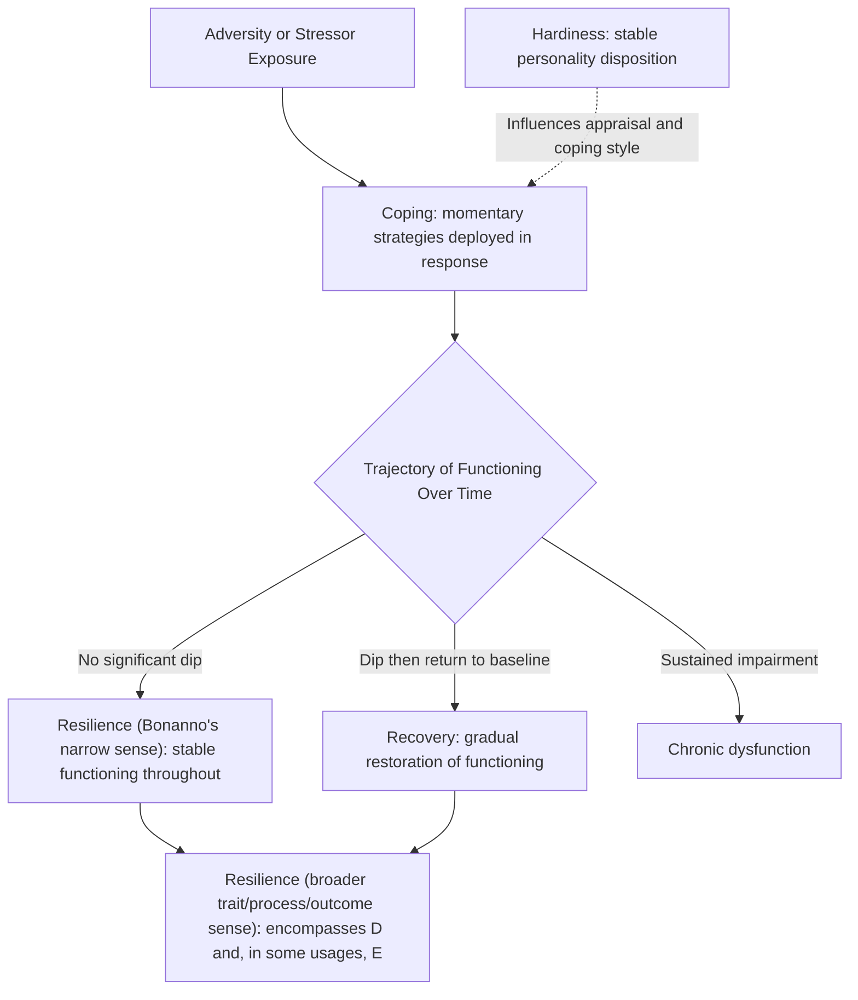

## Resilience versus Related Constructs: Hardiness, Coping, and Recovery

### Overview

Resilience is frequently used loosely alongside — and sometimes conflated with — several closely related but conceptually distinct constructs: hardiness, coping, and recovery. Precise differentiation among these terms matters both theoretically (each construct emerged from a distinct research tradition with its own measurement approach) and practically (interventions targeting one construct do not necessarily transfer to the others). This topic systematically distinguishes resilience from each related construct along definitional, temporal, and measurement dimensions.

### Resilience: Recap of Core Definition

As established in the prior topic, resilience (across trait, process, and outcome perspectives) fundamentally requires two components: (1) exposure to significant adversity or risk, and (2) a pattern of positive adaptation or maintained/restored functioning despite that exposure. Resilience is thus inherently a *relative* concept — it only has meaning in reference to a documented adversity or risk exposure.

### Hardiness

**Definition and Origin**

Psychological hardiness was developed by Suzanne Kobasa in the late 1970s and early 1980s, originally in the context of research on executives and other professionals under occupational stress. Hardiness is conceptualized as a personality style or disposition composed of three interrelated components, often summarized as the "three Cs":

| Component | Description |
| --- | --- |
| Commitment | Tendency to involve oneself fully in activities and relationships rather than experiencing alienation |
| Control | Belief that one can influence events through one's own effort, rather than feeling powerless |
| Challenge | Tendency to view change and difficulty as an opportunity for growth rather than a threat |

**Key Distinctions from Resilience**

- **Trait specificity**: Hardiness is explicitly and specifically a *personality trait/disposition* construct with a fixed three-component structure (commitment, control, challenge); resilience, as covered in the prior topic, spans trait, process, and outcome perspectives and is not tied to a single fixed component structure.
- **Origin context**: Hardiness emerged specifically from occupational/organizational stress research (Kobasa's original studies involved corporate executives), whereas resilience emerged primarily from developmental psychopathology research on children facing severe adversity (abuse, poverty, parental mental illness).
- **Presumed mechanism**: Hardiness theory proposes a specific cognitive-appraisal mechanism — hardy individuals appraise stressors as manageable challenges rather than threats, which is theorized to reduce the physiological and psychological toll of stress. Resilience process models (Masten's multi-system framework) are considerably broader, encompassing biological, relational, and community-level mechanisms well beyond individual cognitive appraisal style.
- **Measurement**: Hardiness is measured via dedicated instruments assessing the three-component structure (e.g., the Dispositional Resilience Scale, despite its name, is specifically a hardiness measure); resilience measurement, as covered previously, varies substantially depending on which of the trait/process/outcome perspectives a given study adopts.

**[Inference]** Hardiness can reasonably be understood as one specific, historically prior, and narrower personality-trait construct that overlaps conceptually with — and arguably anticipates — the later trait perspective on resilience, rather than as a fully separate unrelated construct; the two literatures developed largely independently for some time before later researchers began drawing explicit connections between them.

### Coping

**Definition and Origin**

Coping refers to the cognitive and behavioral efforts an individual uses to manage (reduce, minimize, master, or tolerate) the internal and external demands created by a stressful situation. The dominant theoretical framework, developed by Richard Lazarus and Susan Folkman (1984), is the transactional model of stress and coping, which emphasizes that stress arises from the *transaction* between a person and their environment, mediated by cognitive appraisal.

**Major Coping Taxonomies**

| Coping Type | Description |
| --- | --- |
| Problem-focused coping | Efforts directed at changing or managing the stressor itself (e.g., problem-solving, seeking information) |
| Emotion-focused coping | Efforts directed at managing the emotional response to the stressor (e.g., reappraisal, emotional expression, avoidance) |
| Meaning-focused coping | Efforts directed at finding or sustaining meaning in the face of stress (a later addition, associated with Folkman's revised model) |
| Social/relational coping | Seeking or utilizing social support as a coping strategy |

**Key Distinctions from Resilience**

- **Timescale/granularity**: Coping typically refers to specific strategies deployed in response to a specific stressor or stressful episode, operating at a relatively fine-grained, often momentary-to-short-term timescale. Resilience, particularly in the process and outcome perspectives, typically refers to a broader pattern of adaptation across a more extended developmental period or following a more significant, often chronic or severe, adversity exposure.
- **Adequacy of outcome not implied**: Coping is a largely value-neutral descriptive term — a coping strategy can be adaptive or maladaptive, effective or ineffective (e.g., avoidance coping is a legitimate coping strategy but is frequently associated with worse long-term outcomes). Resilience, by contrast, definitionally implies a *positive* outcome — "resilient coping" would be somewhat redundant, while "maladaptive coping" is a coherent, common phrase precisely because coping itself does not presuppose success.
- **Relationship**: Coping strategies are commonly theorized as *contributing processes within* a broader resilience process — i.e., effective coping is one of the mechanisms through which resilient outcomes are achieved, making coping a component or input within resilience process models (see Masten's multi-system framework) rather than a synonym for resilience itself.

**[Inference]** The relationship between specific coping strategies and eventual resilient outcomes is not perfectly linear or deterministic — the same coping strategy (e.g., emotion-focused coping) may be adaptive in one context (an uncontrollable stressor) and maladaptive in another (a controllable stressor amenable to problem-focused action), a nuance sometimes described as the "goodness of fit" hypothesis in the coping literature.

### Recovery

**Definition and Origin**

Recovery, in the resilience-adjacent literature, most commonly refers to a *trajectory* concept: a pattern in which an individual experiences a significant decline in functioning following a discrete adverse or traumatic event, followed by a gradual return to (or restoration of) their pre-event baseline level of functioning over time. This usage is most prominent in trauma and bereavement research, notably in the influential trajectory-based work of George Bonanno.

**Bonanno's Trajectory Model**

Bonanno's research on responses to loss and potentially traumatic events identified multiple distinct trajectories following adversity, commonly including:

| Trajectory | Pattern |
| --- | --- |
| Resilience (in Bonanno's specific trajectory sense) | Stable, healthy functioning maintained throughout, with minimal or transient disruption |
| Recovery | Functioning drops significantly following the event, then gradually returns to baseline over time |
| Chronic dysfunction/distress | Functioning drops and does not substantially return to baseline; sustained impairment |
| Delayed dysfunction | Functioning initially appears stable, but deteriorates significantly at a later point |

**Key Distinctions from Resilience**

- **Bonanno's usage is a specific, narrower technical sense**: In Bonanno's trajectory framework, "resilience" specifically denotes the pattern of *minimal disruption* (stable healthy functioning throughout), which is explicitly and empirically *distinguished from* "recovery" (a dip followed by a return to baseline) — these are treated as two different trajectories in his model, not synonyms. This is an important terminological subtlety: some resilience literature (particularly Bonanno's) uses "resilience" more narrowly than the broader trait/process/outcome framework covered in the prior topic, which would potentially classify both the "resilience" and "recovery" trajectories as instances of positive adaptation following adversity.
- **Temporal shape**: Recovery, by definition, involves an observable dip-then-return trajectory shape; the broader resilience construct (outside Bonanno's narrower usage) does not require this specific temporal shape and can include cases of sustained stable functioning throughout adversity exposure (no dip at all).
- **Applicability**: Recovery as a trajectory concept is most naturally applied to discrete, identifiable adverse events (a death, a disaster, a diagnosis) with a clear before/during/after temporal structure; it is less naturally applied to chronic, ongoing adversity (e.g., chronic poverty, ongoing parental mental illness) that lacks a single discrete onset point, which is the more typical adversity type studied in developmental resilience research (Garmezy, Werner).

### Comparative Summary Table

| Construct | Primary Level | Timescale | Outcome-Neutral? | Originating Tradition |
| --- | --- | --- | --- | --- |
| Resilience | Trait / Process / Outcome (multiple) | Developmental / extended | No — implies positive adaptation | Developmental psychopathology |
| Hardiness | Trait/personality disposition | Stable/enduring | No — implies adaptive appraisal style | Occupational stress research |
| Coping | Behavioral/cognitive strategy | Momentary to short-term, episode-specific | Yes — can be adaptive or maladaptive | Stress and appraisal research (Lazarus & Folkman) |
| Recovery | Trajectory pattern | Discrete event with defined before/after | No — implies eventual return to baseline | Trauma and bereavement research (Bonanno) |

### Illustrative Diagram: Conceptual Relationships (svg_diagram)

### Practical Implications of Precise Terminology

- **Research design**: A study using Bonanno's trajectory methodology (repeated measures around a discrete event) is answering a different question than a study using Werner's outcome-classification methodology (comparing high-risk-good-outcome vs. high-risk-poor-outcome groups) — conflating findings across these designs without noting the differing operational definitions risks invalid comparison.
- **Intervention targeting**: An intervention aimed at building hardiness (cognitive appraisal training, e.g., viewing challenges as opportunities) targets a different mechanism than an intervention aimed at building resilience through Masten's multi-system approach (strengthening relationships, community support, self-regulation skills) — the two are complementary but not interchangeable, and a hardiness intervention alone would not be expected to address relational or community-level protective factors.
- **Assessment selection**: Using a coping inventory (e.g., the Ways of Coping Questionnaire) to make claims about a person's overall "resilience" would be a category error, since coping instruments measure strategy use in specific stressful episodes, not the broader developmental or trajectory-level pattern that resilience measurement is meant to capture.

**Key Points**

- Hardiness is a narrower, specifically personality-trait construct originating in occupational stress research, involving the specific commitment-control-challenge structure — a plausible historical precursor to trait-based resilience thinking rather than a synonym for it.
- Coping is outcome-neutral and episode/strategy-specific; it functions as a component process that can contribute to (but does not guarantee) resilient outcomes, distinguishing it clearly from resilience's inherently positive-outcome-implying definition.
- Recovery, in Bonanno's influential trajectory framework, is explicitly distinguished from "resilience" as a separate trajectory pattern (dip-then-return vs. stable-throughout) — a terminological subtlety that differs from the broader trait/process/outcome resilience framework covered previously.
- Precise use of these terms matters for research design, cross-study comparison, and appropriate intervention targeting; loose interchangeable use of "resilience," "hardiness," "coping," and "recovery" in popular or applied literature frequently obscures meaningful conceptual and mechanistic distinctions.

**Related Topics**

- Defining resilience: trait, process, and outcome perspectives (cross-reference: hardiness as a trait-perspective precursor)
- Bonanno's trajectory research on loss, trauma, and multiple pathways to adaptation
- Lazarus and Folkman's transactional model of stress and coping in depth
- Post-traumatic growth as a distinct construct from both recovery and resilience
- Kobasa's original hardiness research on executive stress
- Meaning-focused coping and its relationship to positive psychology interventions
- Allostatic load and physiological models of stress and recovery