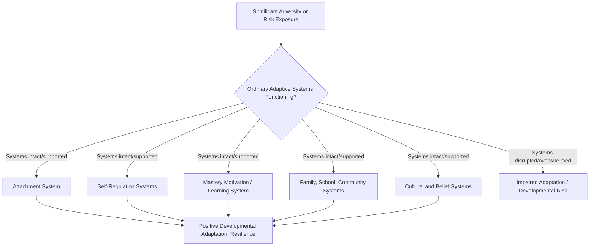

## Ordinary Magic: Masten's View of Resilience as Commonplace

### Overview

"Ordinary magic" is Ann Masten's foundational reframing of resilience, first articulated in her widely cited 2001 *American Psychologist* paper and later expanded into her comprehensive 2014 book *Ordinary Magic: Resilience in Development*. The phrase captures Masten's central theoretical claim: resilience does not arise from rare, extraordinary, exceptional qualities possessed by a special subset of unusually gifted or invulnerable individuals, but rather from the normal, everyday operation of ordinary human adaptive systems — systems that most people possess and that function protectively even under conditions of significant adversity. This topic examines the theoretical content of the ordinary magic framework, its component adaptive systems, and its far-reaching implications for how resilience is studied and cultivated.

### The Core Claim: Resilience Is Not Rare or Exceptional

**Rejecting the "Invulnerability" and "Superkid" Framing**

Early resilience research (as covered in the historical development topic) sometimes used language implying that resilient children were exceptional or nearly invulnerable — an implicit "superkid" framing that suggested something rare or extraordinary distinguished them from their less fortunate peers. Masten's ordinary magic thesis directly challenges this framing on both empirical and theoretical grounds:

- **Empirical basis**: Resilience, across large-scale studies (including Garmezy's Project Competence data that Masten inherited and extended), is not a rare statistical outlier phenomenon — it is, in fact, a common outcome following adversity exposure. A substantial proportion of children facing serious risk factors go on to show reasonably good developmental outcomes, which is difficult to reconcile with a "rare exceptional quality" account.
- **Theoretical basis**: If resilience depended on rare, exceptional individual qualities, it would be a poor target for prevention and intervention efforts (since rare qualities are, by definition, not something most people can be given or taught). Masten's reframing directly serves an applied, intervention-oriented purpose: if resilience-producing systems are ordinary and common, they become plausible targets for building and strengthening through accessible prevention and intervention programs.

### The "Ordinary" Adaptive Systems

Masten's framework identifies several core adaptive systems — deliberately described as ordinary, common, evolutionarily conserved human systems — that, when functioning normally, protect development even under adverse conditions:

| Adaptive System | Description |
| --- | --- |
| Attachment system | The capacity to form close, protective relationships with caregivers and other supportive figures; a species-typical, near-universal human developmental system |
| Self-regulation systems | Neurobiological and behavioral systems governing emotion regulation, impulse control, and stress response (including HPA axis functioning) |
| Mastery motivation / learning system | The intrinsic human drive to explore, learn, and develop competence, present from infancy |
| Cognitive systems | Problem-solving capacity, executive function, and information-processing abilities that support adaptive appraisal and action |
| Family systems | Ordinary family functioning processes — communication, structure, warmth — that, under normal circumstances, support child development |
| School and community systems | Ordinary institutional structures (functioning schools, community organizations, religious/cultural institutions) that provide structure, opportunity, and belonging |
| Cultural and belief systems | Shared meaning-making systems, religious or spiritual frameworks, and cultural narratives that support coping and a sense of significance |

**Key Theoretical Point**

None of these systems is rare, exotic, or possessed only by a gifted few — they are the basic architecture of typical human development. Masten's claim is that resilience emerges when these ordinary systems continue to function, or are protected and supported, even while a child or individual is under adversity — not from the sudden emergence of some special resilience-specific trait or capacity.

### "Magic" as Metaphor, Not Literal Claim

The word "magic" in Masten's framing is explicitly metaphorical and somewhat ironic — it captures the everyday, popular perception that positive adaptation despite serious adversity seems remarkable or almost magical, while the substantive theoretical point of the paper is precisely to demystify that appearance: what looks like magic from the outside is, on closer developmental-systems analysis, the predictable product of ordinary protective systems operating as they normally do. **[Inference]** This rhetorical structure (naming a phenomenon "magic" specifically in order to then explain it as non-magical) is a deliberate communicative device on Masten's part, aimed at shifting both scientific and public perception away from mystification and toward a systems-based, actionable understanding.

### Relationship to the Process Perspective

Ordinary magic theory is best understood as the fullest theoretical articulation of the process perspective on resilience (covered in the "Defining Resilience" topic). It specifies:

- **What the processes are** (the adaptive systems listed above)
- **Why they matter across multiple levels** (biological, individual, family, community, cultural — a genuinely multi-system, ecological model)
- **How they interact dynamically over development**, including the concept of developmental cascades, in which functioning or dysfunction in one system (e.g., early attachment security) can propagate effects into other systems and domains over time (e.g., later self-regulation, academic functioning, peer relationships).

### Illustrative Diagram: Ordinary Magic — Multi-System Protective Architecture (svg_diagram)

### Implications for Intervention and Prevention Design

Masten's ordinary magic framework directly reshaped the applied/intervention side of resilience science along several lines:

1. **Targeting systems, not selecting individuals**: Rather than trying to identify and select rare "resilient" children for special programs, intervention design shifts toward strengthening ordinary protective systems for broad populations — for example, supporting stable caregiving relationships, improving school climate, and building self-regulation skills through universal (not narrowly targeted) programming.
2. **Multi-level intervention points**: Because ordinary magic theory is explicitly multi-system, it supports intervention at multiple levels simultaneously — individual-level self-regulation training, family-level parenting support programs, and community/institutional-level structural improvements (school quality, neighborhood safety, access to services) are all valid, complementary intervention targets rather than competing approaches.
3. **Prevention orientation**: If resilience-producing systems are ordinary and common, protecting them *before* significant adversity strikes (primary prevention) becomes as theoretically justified as intervening *after* adversity has occurred (traditional treatment-oriented approaches) — this reframing supported the broader growth of prevention science as a field closely allied with resilience research.
4. **Disaster and mass-adversity applications**: Masten extended ordinary magic thinking to community and population-level contexts (natural disasters, war, forced displacement, and more recently pandemic-related disruption), arguing that community-level resilience similarly depends on ordinary community systems (social cohesion, functioning institutions, resource access) rather than exceptional community-level heroism, paralleling the individual-level reframing.

### Distinguishing Ordinary Magic from Naive Optimism or "Just Be Resilient" Messaging

**[Inference]** A significant risk in popularizing ordinary magic theory is that it can be misread — particularly outside academic contexts — as suggesting resilience is simple, automatic, or something any individual should be able to achieve through personal effort alone ("just tap into your ordinary systems"). This is a misreading of Masten's actual argument:

- The theory explicitly emphasizes that these ordinary systems require adequate environmental conditions and support to function protectively — a child's attachment system, for example, requires an available, responsive caregiver to function as intended; the system's *existence* is ordinary, but its *protective functioning* is not guaranteed and depends heavily on environmental and relational context.
- Masten's framework is compatible with — and indeed strongly supports — significant structural, policy-level, and resource-based explanations for why some individuals or communities show resilient outcomes and others do not; it is not an individual-responsibility or willpower-based account, despite surface-level popularization sometimes drifting toward that misreading.
- The theory does not claim severe or chronic adversity is inconsequential; it claims that *when* ordinary systems remain functional or are supported despite adversity, positive adaptation becomes the more common, expectable outcome — not that adversity itself is unimportant or easily overcome regardless of severity or duration.

### Ordinary Magic and Cumulative/Cascading Risk

Masten's later work also incorporates the reality that ordinary adaptive systems can themselves be damaged or overwhelmed by sufficiently severe, chronic, or multiply-compounding adversity (cumulative risk models) — ordinary magic theory does not claim that protective systems are infinitely robust or immune to being overwhelmed. **[Inference]** This qualification is an important, less-popularized aspect of the theory: the "ordinary" framing describes the *nature* of the protective systems (common, not rare or magical), not a claim that these systems are inexhaustible or invulnerable to sufficiently severe or prolonged adversity — a nuance that helps reconcile ordinary magic theory with cumulative-risk research showing that resilient outcomes become statistically less common as the number and severity of risk factors increases.

### Comparison: Pre-Masten vs. Ordinary Magic Framing

| Dimension | Earlier "Invulnerability"/"Superkid" Framing | Masten's "Ordinary Magic" Framing |
| --- | --- | --- |
| Source of resilience | Rare, exceptional individual quality | Ordinary, common adaptive systems |
| Implication for intervention | Select/identify special individuals | Build/support systems broadly across populations |
| Population prevalence assumption | Resilience is rare/exceptional | Resilience is common when systems function |
| Risk of misinterpretation | Implies most children are simply not resilient/lack the special quality | Risk of naive over-optimism if support requirements are ignored |
| Theoretical foundation | Loosely specified individual trait | Explicit multi-system developmental architecture |

**Key Points**

- Masten's ordinary magic thesis reframes resilience from a rare, exceptional individual quality to the predictable product of ordinary, common human adaptive systems functioning under adversity.
- The "magic" in the title is a deliberate rhetorical device — naming the phenomenon's outward appearance in order to then demystify it through systems-level explanation.
- The theory identifies specific ordinary adaptive systems (attachment, self-regulation, mastery motivation, family/school/community systems, cultural belief systems) operating across multiple levels of a developmental ecology.
- Because these systems are ordinary rather than rare, the theory directly supports broad, systems-targeted prevention and intervention approaches rather than narrow selection of exceptional individuals.
- The theory does not claim these systems are infinitely robust; sufficiently severe or cumulative adversity can overwhelm even ordinary, well-functioning protective systems, an important qualification against naive over-optimistic readings of the framework.

**Next Steps**

- Developmental cascade models and their empirical support
- Cumulative risk models and dose-response relationships between adversity and outcome
- Application of ordinary magic theory to community and disaster resilience
- Prevention science as a field allied with resilience research
- Attachment theory as a specific ordinary adaptive system in depth
- HPA axis and neurobiological self-regulation systems in resilience research
- Structural and policy-level interventions informed by systems-based resilience theory
- Suniya Luthar's critiques and how they interact with the ordinary magic framework