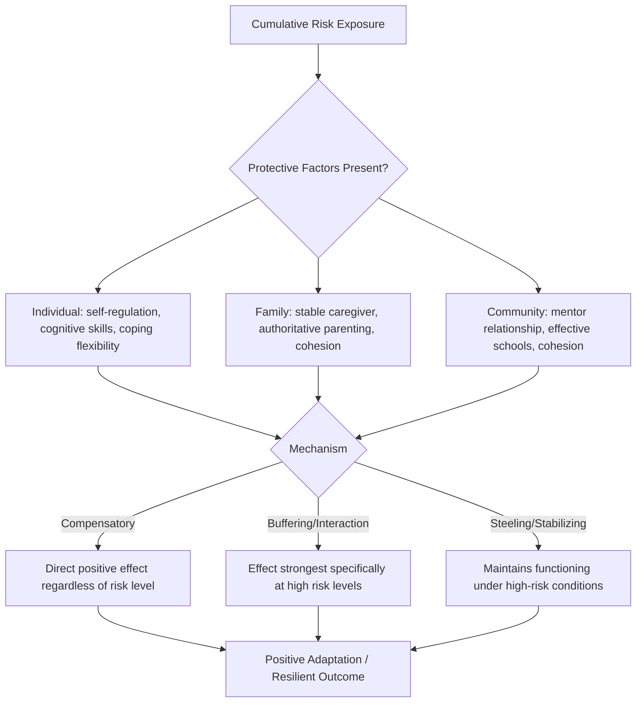

## Protective Factors at Individual, Family, and Community Levels

### Overview

Protective factors are conditions, resources, or characteristics that reduce the negative impact of risk exposure and increase the likelihood of positive developmental outcomes. Building directly on the multisystemic/ecological models and cumulative risk framework covered previously, this topic organizes protective factors systematically across the individual, family, and community levels — while also examining the distinct *mechanisms* by which protective factors are theorized to operate, which is arguably more theoretically important than the simple cataloging of factors by level.

### Distinguishing Protective Factors from the Simple Absence of Risk

**A Common Conceptual Confusion**

A protective factor is not merely the *absence* of a corresponding risk factor (e.g., "not living in poverty" is not automatically a protective factor in the technical sense used here) — true protective factors are theorized to have a specific buffering or compensatory function that becomes most apparent, or exerts its effect specifically, in the presence of risk or adversity. This distinction matters for both research design (testing for genuine interaction/buffering effects, not just main effects) and theory (understanding protective mechanisms as active processes, not passive absences).

### Three Models of Protective Factor Mechanism

Drawing on influential distinctions in the resilience literature (notably articulated by Suniya Luthar, Garmezy, and Rutter across their respective work), protective factors are theorized to operate through at least three distinguishable statistical/mechanistic models:

| Model | Mechanism | Statistical Signature |
| --- | --- | --- |
| Compensatory model | The protective factor has a direct, main-effect positive influence on outcomes regardless of risk level, effectively offsetting or counterbalancing risk | A significant main effect of the protective factor, operating independently of risk level |
| Protective/buffering (interaction) model | The protective factor's beneficial effect is specifically stronger (more apparent) at higher levels of risk, buffering against risk's negative impact | A significant statistical interaction between risk level and protective factor |
| Protective-stabilizing (or "steeling") model | The protective factor maintains or stabilizes functioning specifically under conditions of high risk, in a pattern distinguishable from simple buffering (related to Rutter's "steeling effects" concept from the historical development topic) | Distinct interaction pattern, often examined in the context of graduated/moderate stress exposure building later resistance |

**[Inference]** These three models are conceptually distinct, but in applied research practice they are not always cleanly separated, and some published studies use "protective factor" language loosely across all three mechanisms without explicitly testing which specific statistical model best fits their data — a methodological point worth flagging for careful readers of the primary literature.

### Individual-Level Protective Factors

| Factor | Description |
| --- | --- |
| Cognitive ability/problem-solving skills | General cognitive capacity and specific problem-solving skills supporting adaptive appraisal and action under stress |
| Self-regulation capacity | Emotion regulation and impulse control abilities, closely tied to executive function development and HPA axis regulation |
| Temperament (easy/adaptable) | An "easy" temperament style (as identified in Werner's Kauai study) associated with eliciting more positive responses from caregivers and adapting more readily to environmental change |
| Self-efficacy and internal locus of control | Belief in one's capacity to influence outcomes through one's own effort (conceptually related to, though not identical with, Kobasa's hardiness "control" component) |
| Sense of humor | Documented in several resilience studies (including Werner's) as an individual characteristic associated with more adaptive stress responses |
| Positive self-concept/self-esteem | A generally positive, realistic sense of self-worth, though the causal direction between self-esteem and resilient outcomes is debated (self-esteem may be as much a consequence as a cause of positive functioning) |
| Coping flexibility | As introduced in the Bonanno trajectory topic, the capacity to adaptively shift coping strategies to match situational demands |

### Family-Level Protective Factors

| Factor | Description |
| --- | --- |
| At least one stable, caring caregiver relationship | Perhaps the single most consistently replicated family-level protective factor across the resilience literature, tracing directly to Werner's Kauai findings and Masten's attachment-system emphasis |
| Authoritative parenting style | Parenting combining warmth/responsiveness with appropriate structure and expectations, associated with better outcomes than either overly permissive or overly authoritarian styles |
| Family cohesion and communication | Family systems characterized by clear, open communication and mutual support |
| Parental mental health and stability | Parental psychological wellbeing and stability, which affects both the direct parent-child relationship and the broader family environment |
| Extended family/kinship support | Availability of grandparents, aunts/uncles, or other extended family members providing additional caregiving capacity and emotional support |
| Family routines and predictability | Consistent family routines associated with providing a sense of stability and predictability, particularly valuable under conditions of external stress or unpredictability |

### Community-Level Protective Factors

| Factor | Description |
| --- | --- |
| Supportive non-parental adult relationships | A mentoring relationship with a teacher, coach, neighbor, or religious/community leader — one of the most consistently cited extrafamilial protective factors (also tracing to Werner's findings) |
| Effective schools | Schools providing not only academic instruction but structure, positive relationships, extracurricular engagement, and a sense of belonging |
| Community cohesion and informal social control | Neighborhoods characterized by mutual trust, shared expectations, and willingness of community members to intervene supportively (related to the sociological concept of "collective efficacy") |
| Access to community resources and services | Availability of healthcare, mental health services, recreational facilities, and social services |
| Religious/spiritual community involvement | Participation in religious or spiritual communities, associated in various studies with social support, meaning-making resources, and behavioral norms |
| Economic opportunity structures | Availability of employment opportunities and pathways to economic stability within a community |

### Illustrative Diagram: Protective Factors Across Levels, Operating on Cumulative Risk (svg_diagram)

### Cross-Level Interaction and Compensation

**Compensation Across Levels**

As noted in the multisystemic models topic, protective factors at one level can partially compensate for deficits at another level — for example, strong community-level resources (an effective school, an engaged mentor) can partially offset family-level risk (parental unavailability or instability), and vice versa. **[Inference]** The degree to which cross-level compensation is possible, and its limits, likely varies by the specific type and severity of risk and protective factor involved; this is not a claim that any community-level resource can fully substitute for a severely dysfunctional family environment, but rather that partial, meaningful compensation across levels is a documented pattern in the literature.

**Convergence and the "Cumulative Protection" Concept**

Just as risk factors show cumulative, often accelerating negative effects when they co-occur (per the prior cumulative risk topic), some resilience researchers have proposed an analogous cumulative *protection* concept — that the co-occurrence of multiple protective factors across levels may produce disproportionately positive effects, though **[Unverified]** this "cumulative protection" concept has received less extensive direct empirical testing in the literature than cumulative risk has, and should be treated as a plausible theoretical extension rather than as equally well-established as the cumulative risk dose-response pattern.

### Distinguishing Universal vs. Population-Specific Protective Factors

**[Inference]** Not all protective factors identified in the literature generalize identically across all populations and contexts; some factors (such as having at least one stable, caring adult relationship) appear to be very broadly replicated across culturally and demographically diverse samples, functioning close to a "universal" protective factor in Masten's ordinary-systems sense, while other more culturally or contextually specific factors (e.g., particular forms of religious/community involvement, specific parenting style norms) may show protective effects that are more context-dependent, reflecting the cultural-fit considerations raised in earlier positive-psychology-related topics regarding intervention design.

### Methodological Considerations in Protective Factor Research

| Consideration | Description |
| --- | --- |
| Testing for genuine interaction, not just main effects | As emphasized above, distinguishing compensatory (main effect) from buffering (interaction effect) mechanisms requires appropriate statistical modeling (testing risk × protective-factor interaction terms), which not all published studies rigorously conduct |
| Bidirectional/reciprocal causation concerns | Some proposed protective factors (e.g., self-esteem, positive parent-child relationship quality) may be as much a consequence of a child's already-adaptive functioning as a cause of it, raising directionality questions that cross-sectional designs cannot resolve |
| Measurement of community-level constructs | Community-level protective factors (cohesion, collective efficacy) require appropriately aggregated, multilevel measurement approaches distinct from individual-level self-report, adding methodological complexity relative to individual or family-level factor measurement |

### Applied Implications for Prevention and Intervention Design

1. **Multi-level intervention targeting**: Because protective factors operate at multiple levels, effective prevention programming often deliberately targets several levels simultaneously (e.g., a program combining parenting support, school-based mentoring, and community resource connection) rather than a single-level approach, directly extending the multisystemic intervention principles from the prior chapter.
2. **Prioritizing well-replicated, high-leverage factors**: Given the strength and consistency of findings regarding "at least one stable caring relationship" (whether family or community-based) across multiple independent research traditions (Werner, Masten, and subsequent mentoring-program research), this specific protective factor is frequently prioritized as a particularly high-leverage, evidence-supported intervention target relative to some other more contextually variable protective factors.
3. **Layering protection to offset unaddressable risk**: In contexts where certain risk factors are not readily modifiable through available intervention resources (e.g., structural poverty in the short term), strengthening accessible protective factors at other levels (school support, mentoring, community resource connection) represents a practical strategy consistent with the cross-level compensation pattern described above, even while systemic/structural risk factors remain a separate and important target for longer-term policy-level intervention.

**Key Points**

- Protective factors are theorized to operate through at least three distinguishable mechanisms — compensatory (main effect), buffering (risk-by-protection interaction), and steeling/stabilizing — which should be distinguished both conceptually and statistically rather than treated as a single undifferentiated category.
- "At least one stable, caring adult relationship" (family or community-based) is among the most consistently replicated protective factors across the resilience literature, tracing to Werner's Kauai findings and reinforced by Masten's attachment-system emphasis.
- Cross-level compensation (e.g., community resources partially offsetting family-level risk) is a documented pattern, though its limits and boundary conditions are not fully mapped in the literature.
- A proposed "cumulative protection" concept, analogous to cumulative risk, is theoretically plausible but has received comparatively less direct empirical testing than the well-established cumulative risk dose-response pattern.

**Related Topics**

- Risk factor accumulation and cumulative risk models (cross-reference: risk-protection interaction)
- Multisystemic and ecological models of resilience (cross-reference: level structure)
- Mentoring program research and design (applied extension of the caring-adult-relationship finding)
- Collective efficacy and community cohesion research (sociological foundations)
- Authoritative parenting style research in developmental psychology
- Rutter's steeling effects and stress inoculation concept in depth
- Bidirectional effects and person-environment transaction models in developmental psychopathology
- School-based resilience-building program design