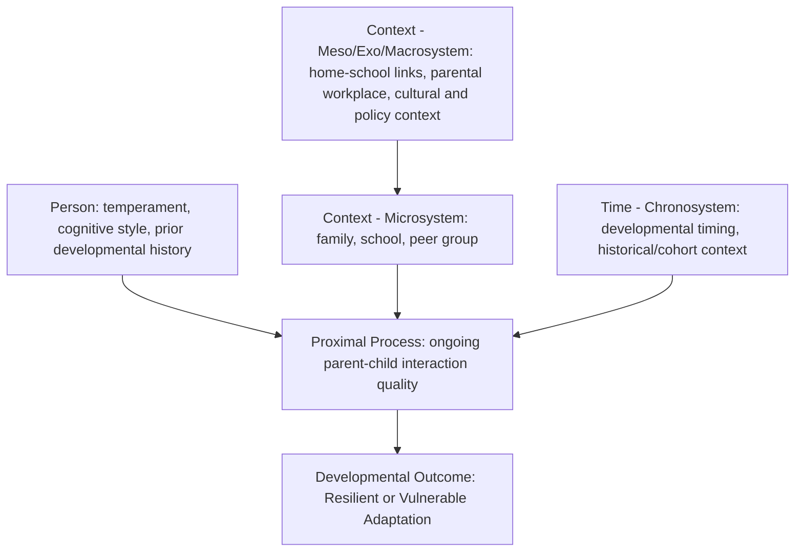

## Bronfenbrenner's Ecological Systems Theory Applied to Resilience

### Overview

While Bronfenbrenner's bioecological model was introduced briefly in the multisystemic models topic as a theoretical precursor, this topic provides a dedicated, detailed treatment of the model itself and its specific, systematic application to resilience research and practice. Urie Bronfenbrenner's ecological systems theory, developed across several decades from the late 1970s through the 1990s, remains one of the most widely cited and foundational frameworks underlying contemporary multisystemic resilience thinking, and a detailed understanding of its structure and evolution is valuable for rigorously applying it to resilience-specific questions.

### Bronfenbrenner's Theoretical Evolution: From Ecological to Bioecological

**Original Ecological Systems Theory (1979)**

Bronfenbrenner's original formulation, presented in *The Ecology of Human Development* (1979), proposed that human development must be understood within the context of the multiple, nested environmental systems in which a person is embedded, moving developmental psychology away from an overly narrow focus on decontextualized individual processes (e.g., laboratory-based studies of isolated cognitive or behavioral processes) toward a genuinely ecological understanding of development in real-world context.

**The Bioecological Model (Refined, 1990s onward)**

In later work, Bronfenbrenner refined the theory into the "bioecological model," most notably incorporating the **Process-Person-Context-Time (PPCT)** model, which added critical specificity beyond the original nested-systems structure:

| PPCT Component | Description |
| --- | --- |
| Process | Proximal processes — the recurring, increasingly complex reciprocal interactions between an individual and their immediate environment (e.g., parent-child interaction patterns) theorized as the primary engines of development |
| Person | Individual characteristics (temperament, biological predispositions, prior developmental history) that the person brings to and shapes within their proximal processes |
| Context | The nested ecological systems (micro-, meso-, exo-, macrosystem) in which the person and their proximal processes are embedded |
| Time | The chronosystem — how the effects of person-context interactions vary across historical time and developmental time, including timing of life transitions |

**Significance of the Bioecological Refinement**

This later refinement is important and often under-appreciated in secondary/applied citations of "Bronfenbrenner's ecological systems theory": the addition of "Process" and explicit "Person" characteristics moved the theory beyond a purely structural description of nested environments toward an explicitly interactional, developmental-systems model emphasizing that development emerges from the *interaction* between individual characteristics and proximal environmental processes, not simply from static environmental context alone.

### The Nested System Levels (Detailed Recap and Extension)

| Level | Definition | Resilience-Relevant Elaboration |
| --- | --- | --- |
| Microsystem | The immediate setting containing the developing person, involving face-to-face interaction (family, classroom, peer group, workplace) | The primary locus of most individual-level and family-level protective factors covered in the prior topic |
| Mesosystem | Interconnections *between* two or more microsystems containing the developing person | Quality of connection between home and school (e.g., parent involvement in schooling) shown in various studies to relate to child outcomes independent of either setting alone |
| Exosystem | Settings that affect the developing person indirectly, without the person's direct participation in that setting | A parent's workplace conditions (e.g., job stress, schedule flexibility) affecting the home environment and parent-child interaction quality |
| Macrosystem | The broader cultural, ideological, economic, and legal context — the "blueprint" shaping the form and content of all other system levels | Cultural norms regarding child-rearing, national social welfare and family-leave policy, broader economic conditions |
| Chronosystem | The dimension of historical and developmental time | Timing of risk exposure relative to developmental stage; broader historical/cohort effects (e.g., growing up during a specific economic recession or pandemic period) |

### Applying Proximal Process Theory to Resilience Mechanisms

**Proximal Processes as the Engine of Both Risk and Protection**

Bronfenbrenner's proximal process concept — the idea that development is driven primarily by recurring, increasingly complex reciprocal interactions between the person and their immediate environment — offers a specific mechanistic lens for understanding *how* protective factors identified in the prior topic (e.g., a stable caregiver relationship) actually produce their protective effects: not simply through the caregiver's presence as a static structural fact, but through the accumulated quality and complexity of ongoing, reciprocal interaction patterns between child and caregiver over developmental time.

**[Inference]** This proximal-process lens suggests that interventions aiming to strengthen family-level protective factors should focus not merely on ensuring a caregiver's physical presence or availability, but on the quality, responsiveness, and increasing complexity of actual parent-child interaction patterns over time — a nuance that goes beyond a simple structural checklist of "is a stable caregiver present" toward a more process-oriented intervention target, consistent with Bronfenbrenner's own theoretical emphasis.

### Macrosystem and Chronosystem: Often-Underemphasized Levels in Applied Resilience Work

**Macrosystem Applications**

While much applied resilience intervention work concentrates on microsystem and mesosystem levels (family support, school programming), the macrosystem level connects resilience research directly to broader societal and policy questions:

- National social welfare policy (family leave policy, childcare subsidy availability, healthcare access) shapes the baseline resource environment within which family-level protective factors must operate.
- Cultural norms regarding child-rearing, gender roles, and community obligation shape which specific protective factors are culturally available, expected, or effective within a given macrosystem context — connecting back to the cultural-fit considerations raised in the person-activity fit and limitations topics from the positive psychology chapter.
- **[Inference]** Macrosystem-level factors are the most difficult to directly target through individual-level or even community-level intervention programs, since they require policy and structural-level change rather than direct programmatic intervention — this is part of why much applied "resilience-building" programming, of practical necessity, concentrates on more tractable micro- and mesosystem levels even while acknowledging the macrosystem's ultimate importance.

**Chronosystem Applications**

The chronosystem level directly connects Bronfenbrenner's framework to the "dynamic, developmental process" and "cumulative risk timing" concepts covered in prior topics:

- Historical/cohort effects: individuals developing through a shared historical period of significant societal disruption (e.g., a war, economic depression, or pandemic) may show resilience-relevant patterns shaped by that shared historical chronosystem context, distinct from purely individual-level developmental timing.
- Developmental timing effects: as covered in the "dynamic process" topic, the same environmental event or transition can have different effects depending on the individual's developmental stage at the time it occurs — a direct chronosystem-level phenomenon in Bronfenbrenner's terms.

### Illustrative Diagram: PPCT Model Applied to a Resilience Case (svg_diagram)

### Critiques and Limitations of Applying Bronfenbrenner's Model to Resilience

| Critique | Description |
| --- | --- |
| Difficulty operationalizing the full model | The complete PPCT model, with all nested levels and the proximal process/time dimensions, is extremely difficult to fully operationalize in a single empirical study, leading most applied resilience research to necessarily focus on a subset of levels (typically micro/mesosystem) rather than comprehensively modeling the entire framework |
| Macrosystem vagueness | The macrosystem level, while theoretically important, is defined at a level of abstraction that makes direct empirical measurement and hypothesis testing more challenging than at the more concretely observable microsystem level |
| Risk of a static, purely structural reading | Applied resilience work sometimes uses Bronfenbrenner's nested-circles diagram as a static organizational device for listing risk/protective factors by level, without incorporating the theory's more sophisticated proximal-process and person-characteristic emphasis from the bioecological refinement — a simplification that, while pedagogically useful, loses some of the theory's original mechanistic depth |

### Relationship to Other Chapter and Prior-Chapter Concepts

**[Inference]** Bronfenbrenner's framework, examined in this dedicated detail, both underlies and extends several previously covered concepts: it provides the formal theoretical scaffolding for the multisystemic models topic's level structure; its proximal-process concept offers a mechanistic explanation for *how* the individual, family, and community protective factors covered in the prior topic actually exert their effects over developmental time; and its chronosystem concept formally integrates the developmental-timing considerations raised in the "dynamic process" topic from the previous chapter into a single, unified ecological-systems framework.

**Key Points**

- Bronfenbrenner's theory evolved from an original nested-systems structural model (1979) into a more sophisticated bioecological model incorporating the Process-Person-Context-Time (PPCT) framework, with proximal processes theorized as the central developmental engine.
- Proximal processes offer a mechanistic lens for understanding how protective factors (e.g., a stable caregiver relationship) actually produce their effects — through the quality and complexity of ongoing reciprocal interaction, not merely through structural presence.
- Macrosystem and chronosystem levels, while theoretically significant (connecting resilience to policy and historical-timing questions), are less frequently directly targeted in applied resilience intervention work than the more tractable microsystem and mesosystem levels.
- Much applied resilience research necessarily operationalizes only a subset of the full PPCT model due to the practical difficulty of comprehensively measuring and modeling every level and dimension simultaneously.

**Next Steps**

- Proximal process theory and parent-child interaction quality research in depth
- Macrosystem-level policy analysis and its relationship to resilience outcomes (family leave, childcare policy, welfare systems)
- Chronosystem and cohort-effect research (e.g., resilience following shared historical disruptions)
- Mesosystem research: home-school connection quality and child outcomes
- Person-environment fit and transactional models of development
- Historical and cross-cultural applications of Bronfenbrenner's model beyond resilience
- Policy-level intervention design informed by macrosystem-level resilience theory
- Integration of PPCT model with developmental cascade and multisystemic resilience research