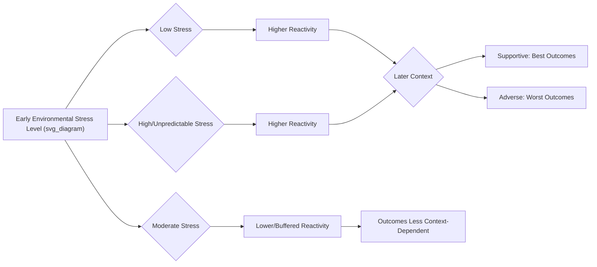

## Differential Susceptibility and Biological Sensitivity to Context

### Overview

Differential susceptibility theory (DST) and biological sensitivity to context (BSC) are complementary frameworks in developmental psychology that reconceptualize how individuals respond to environmental influences. Both challenge the traditional "diathesis-stress" or "dual-risk" model, which assumes that individual vulnerability factors (genetic, temperamental, or physiological) only worsen outcomes under adverse conditions. Instead, DST and BSC propose that the same traits or biological systems that heighten vulnerability to negative environments also heighten benefit from positive or supportive environments. Susceptibility is reframed as **plasticity**, not fragility.

### Historical and Theoretical Origins

**Diathesis-Stress Model (baseline comparison)**

- Predicts a "dual-risk" pattern: individuals with a vulnerability factor (e.g., a risk allele, difficult temperament) do worse only in adverse environments and are indistinguishable from others in benign or supportive environments.
- Graphically: two lines that diverge only on the negative end of the environmental spectrum.

**Differential Susceptibility Theory (Belsky, 1997, 2005; Belsky & Pluess, 2009)**

- Jay Belsky proposed that evolutionary logic favors variation in parental sensitivity to rearing conditions, since no single reactive strategy is optimal across unpredictable environments.
- Some children are "orchids" (highly susceptible, plastic) and others are "dandelions" (resilient, less affected by context in either direction) — a metaphor popularized by W. Thomas Boyce.
- Susceptibility factors include temperament (e.g., negative emotionality), physiological reactivity, and specific genetic polymorphisms.

**Biological Sensitivity to Context (Boyce & Ellis, 2005)**

- Independently developed, focusing specifically on stress-response biology, particularly the sympathetic nervous system (SNS) and hypothalamic-pituitary-adrenal (HPA) axis.
- Proposes that high physiological reactivity is not inherently pathological; it reflects heightened environmental sensitivity that plays out for better or worse depending on context quality.
- Introduces the concept that BOTH very high and very low reactivity can be adaptive depending on environmental unpredictability — an inverted-U (curvilinear) relationship between early stress exposure and adult reactivity, rather than a simple linear one.

### Core Theoretical Distinction: Three Models of Person-Environment Interaction

| Model | Vulnerable/Sensitive Group in Adverse Context | Vulnerable/Sensitive Group in Supportive Context | Pattern |
| --- | --- | --- | --- |
| Diathesis-Stress (Dual Risk) | Worse outcomes | Same as others | Divergence only on negative side |
| Differential Susceptibility | Worse outcomes | Better outcomes than others | "For better and for worse" — crossover interaction |
| Vantage Sensitivity (Pluess & Belsky, 2013) | Same as others | Better outcomes | Divergence only on positive side |

**Key Points**

- Differential susceptibility is the broadest framework, encompassing both dual-risk and vantage-sensitivity as special or partial cases.
- Vantage sensitivity was proposed to describe cases where a "for better" effect exists without a corresponding "for worse" effect — useful for isolating positive-context-only sensitivity.
- Statistically, true differential susceptibility requires a **crossover interaction**: the regression lines for high- and low-susceptibility groups must cross within the observed range of the environmental variable, not merely show different slopes.

### Statistical Identification of Differential Susceptibility

Distinguishing DST from diathesis-stress is a methodological challenge because both produce a statistically significant interaction term. Roisman et al. (2012) proposed formal criteria:

1. **Region of Significance (RoS) analysis**: Using the Johnson-Neyman technique, researchers identify the range of the environmental (moderator) variable where the simple slope for the susceptible group differs significantly from the less susceptible group, on both the positive and negative ends.
2. **Proportion of Interaction (PoI) index**: Quantifies what fraction of the interaction's plotted area reflects a crossover (for-better-and-worse) pattern versus a purely diathesis-stress pattern. A PoI closer to 0.5 indicates a symmetrical crossover; a PoI closer to 0 indicates pure diathesis-stress.
3. Confirming that the crossover point falls within a plausible/observed range of the environmental measure, not extrapolated far outside collected data.

$$Y = \beta_0 + \beta_1 X_{env} + \beta_2 X_{susceptibility} + \beta_3 (X_{env} \times X_{susceptibility}) + \varepsilon$$

Where the interaction coefficient $\beta_3$ being significant is necessary but not sufficient — the crossover location and RoS must be examined to confirm DST versus dual-risk.

### Markers of Susceptibility Studied in the Literature

**Temperamental markers**

- Negative emotionality / difficult temperament in infancy.
- Behavioral inhibition.

**Physiological reactivity markers (BSC's primary focus)**

- **HPA axis reactivity**: cortisol reactivity to stressors (e.g., Trier Social Stress Test, or infant/child analogs like the Strange Situation).
- **Autonomic nervous system (ANS) reactivity**: sympathetic (SNS) measures such as skin conductance and pre-ejection period (PEP); parasympathetic (PNS) measures such as respiratory sinus arrhythmia (RSA) and vagal tone/withdrawal.
- Boyce and Ellis emphasized that reactivity across multiple stress-response systems, not any single marker, best indexes biological sensitivity.

**Genetic markers ("plasticity genes," per Belsky & Pluess)**

- *DRD4* (dopamine receptor D4) 7-repeat allele — associated with sensation-seeking and susceptibility to parenting quality.
- *5-HTTLPR* (serotonin transporter gene promoter polymorphism, short allele) — extensively studied in gene-by-environment (G×E) interaction research on depression risk.
- *BDNF* Val66Met polymorphism.
- *MAOA* (monoamine oxidase A) polymorphism — studied in relation to early maltreatment and antisocial outcomes (Caspi et al., 2002).
- [Inference] The specific molecular mechanisms linking these polymorphisms to differential susceptibility (versus simple risk) remain an active and somewhat contested area, as many candidate-gene G×E findings have faced replication difficulties in later, better-powered studies.

### The Evolutionary Rationale

Belsky's original argument draws on evolutionary bet-hedging logic:

- Parents cannot reliably predict the future environment their offspring will face.
- If all offspring were equally responsive to current rearing conditions, and conditions changed, the whole lineage could be maladapted.
- Producing some offspring who are highly responsive to their immediate rearing environment (orchids) and others who develop more uniformly regardless of context (dandelions) diversifies a "bet" across the parents' genetic investment, increasing the odds that at least some offspring are well-matched to the environment they eventually mature into.
- [Inference] This adaptive framing is a theoretical account of *why* such variation might have been selected for; it is harder to test directly than the proximate developmental patterns.

### Biological Sensitivity to Context: The Curvilinear Model

Boyce and Ellis specifically argued that the relationship between early adversity/unpredictability and later stress reactivity is **curvilinear (inverted-U shaped)**, not linear:

- Children from **very low-stress** environments may develop heightened reactivity because they had no need to "toughen" against stress and remain sensitive to novel challenge.
- Children from **very high-stress/unpredictable** environments may also develop heightened reactivity, as an adaptive "vigilance" strategy.
- Children from **moderate-stress** environments tend to develop lower, more buffered reactivity.
- High reactivity, when paired with a subsequently supportive environment, is associated with the best outcomes of any group; when paired with continued adversity, the worst.

### Illustrative Diagram: Three Interaction Patterns

<svg xmlns="http://www.w3.org/2000/svg" viewBox="0 0 780 300" font-family="sans-serif">
<text x="390" y="20" text-anchor="middle" font-size="14" font-weight="bold">Three Person-by-Environment Interaction Patterns (svg_diagram)</text>

<g>
<line x1="40" y1="260" x2="230" y2="260" stroke="black" stroke-width="1.5" />
<line x1="40" y1="260" x2="40" y2="60" stroke="black" stroke-width="1.5" />
<text x="135" y="280" text-anchor="middle" font-size="11">Environment (adverse → supportive)</text>
<text x="20" y="160" text-anchor="middle" font-size="11" transform="rotate(-90 20,160)">Outcome</text>
<line x1="45" y1="240" x2="225" y2="80" stroke="#2563eb" stroke-width="2" />
<line x1="45" y1="150" x2="225" y2="150" stroke="#dc2626" stroke-width="2" />
<text x="135" y="45" text-anchor="middle" font-size="12" font-weight="bold">Diathesis-Stress</text>
<text x="230" y="80" font-size="9" fill="#2563eb">Susceptible</text>
<text x="230" y="150" font-size="9" fill="#dc2626">Non-susceptible</text>
</g>

<g>
<line x1="290" y1="260" x2="480" y2="260" stroke="black" stroke-width="1.5" />
<line x1="290" y1="260" x2="290" y2="60" stroke="black" stroke-width="1.5" />
<text x="385" y="280" text-anchor="middle" font-size="11">Environment (adverse → supportive)</text>
<line x1="295" y1="240" x2="475" y2="70" stroke="#2563eb" stroke-width="2" />
<line x1="295" y1="150" x2="475" y2="150" stroke="#dc2626" stroke-width="2" />
<text x="385" y="45" text-anchor="middle" font-size="12" font-weight="bold">Differential Susceptibility</text>
<text x="480" y="70" font-size="9" fill="#2563eb">Susceptible</text>
<text x="480" y="150" font-size="9" fill="#dc2626">Non-susceptible</text>
<circle cx="385" cy="155" r="3" fill="black" />
<text x="390" y="175" font-size="8">crossover</text>
</g>

<g>
<line x1="540" y1="260" x2="730" y2="260" stroke="black" stroke-width="1.5" />
<line x1="540" y1="260" x2="540" y2="60" stroke="black" stroke-width="1.5" />
<text x="635" y="280" text-anchor="middle" font-size="11">Environment (adverse → supportive)</text>
<line x1="545" y1="160" x2="725" y2="75" stroke="#2563eb" stroke-width="2" />
<line x1="545" y1="160" x2="725" y2="150" stroke="#dc2626" stroke-width="2" />
<text x="635" y="45" text-anchor="middle" font-size="12" font-weight="bold">Vantage Sensitivity</text>
<text x="730" y="75" font-size="9" fill="#2563eb">Susceptible</text>
<text x="730" y="150" font-size="9" fill="#dc2626">Non-susceptible</text>
</g>
</svg>

### Relevance to Positive Psychology and Resilience

- **Reframing "vulnerability" as "plasticity"**: A child previously labeled purely at-risk (e.g., due to difficult temperament or high reactivity) may in fact be the child most capable of flourishing under strengths-based intervention — resilience-promoting environments yield disproportionate benefit for highly susceptible individuals.
- **Intervention amplification effect**: Multiple randomized intervention studies (e.g., Bakermans-Kranenburg & van IJzendoorn's work on the *Video-feedback Intervention to promote Positive Parenting*, VIPP) find that children carrying purported plasticity markers (e.g., DRD4 7-repeat) show the largest gains from the intervention condition and, in some studies, the largest declines when randomized to control — direct empirical support for "for better and for worse."
- **Implication for universal vs. targeted programming**: Because susceptible individuals benefit most from enrichment, resilience and positive-psychology interventions (mentoring, positive parenting programs, school-based SEL curricula) may show larger effect sizes in subgroups with higher reactivity/susceptibility, informing more efficient targeted resource allocation.
- **Challenges the deficit model**: Traditional risk models focus resources only on preventing negative outcomes in "vulnerable" populations. DST supports a complementary logic: investing in positive environmental quality for the same populations, since they stand to gain the most.
- **Strength-based reframing of temperament**: Traits such as high emotional reactivity or sensitivity, often viewed as risk factors or clinical concerns (e.g., in discussions of "highly sensitive persons," a related but distinct popular-psychology construct by Elaine Aron), can be reframed within DST as heightened capacity for positive environmental uptake rather than pure liability.

### Practical / Applied Example

**Scenario**: A classroom-based social-emotional learning (SEL) program is implemented across a school district.

- Under a dual-risk lens, only children flagged as "at risk" (behavior problems, low reactivity control) are prioritized for intensive intervention resources, with an assumption that other children will do fine regardless.
- Under a DST lens, teachers and program designers recognize that highly reactive/sensitive children — who might currently be performing adequately in a stable classroom — stand to gain disproportionately from a high-quality SEL curriculum, while also being disproportionately harmed by a poor-quality or chaotic classroom environment.
- **Practical design implication**: Rather than only screening for existing problems, resilience-oriented programs might use temperament or reactivity screening (informally, via teacher-rated temperament scales) to identify children for whom classroom environmental quality will have outsized impact, and prioritize placing these children with the most consistent, well-resourced teachers — a "person-environment fit" resilience strategy rather than a purely deficit-remediation strategy.

### Measurement Tools Commonly Used in Research

- **Trier Social Stress Test (TSST)** and child-adapted versions — cortisol reactivity.
- **Respiratory Sinus Arrhythmia (RSA)** via electrocardiogram during challenge tasks — vagal/parasympathetic reactivity.
- **Pre-ejection Period (PEP)** — sympathetic nervous system reactivity.
- **Infant Behavior Questionnaire (IBQ)** and **Children's Behavior Questionnaire (CBQ)** — temperament/negative emotionality.
- **Strange Situation Procedure** — used in some studies as a context for measuring physiological reactivity in infants.
- [Unverified] Specific effect sizes for gene-by-environment susceptibility findings vary considerably across studies and meta-analyses; several early candidate-gene results (e.g., for *5-HTTLPR*) have shown inconsistent replication, so individual study effect sizes should be interpreted cautiously rather than treated as fixed parameters.

### Critiques and Open Debates

- **Replication concerns**: Candidate-gene-by-environment (cG×E) studies, a major evidentiary pillar for DST's genetic component, have faced significant replication and publication-bias criticism in behavioral genetics more broadly.
- **Statistical power demands**: Detecting a true crossover interaction requires substantially larger samples than detecting a main effect or a simple dual-risk interaction, and many earlier studies were underpowered.
- **Circularity risk**: Critics note the risk of researchers labeling any significant interaction as "differential susceptibility" post hoc without applying the formal RoS/PoI criteria, inflating apparent support for the theory.
- **Construct overlap**: The boundaries between differential susceptibility, biological sensitivity to context, sensory-processing sensitivity, and orchid-dandelion metaphor are used somewhat interchangeably in popular science writing despite differing operational definitions in the primary literature — care should be taken to cite the specific framework and marker used in any given study.

### Key Researchers and Foundational Citations

- **Jay Belsky** — differential susceptibility theory, evolutionary framing.
- **W. Thomas Boyce & Bruce Ellis** — biological sensitivity to context, curvilinear reactivity model.
- **Michael Pluess** — vantage sensitivity, integrative reviews of environmental sensitivity.
- **Marian Bakermans-Kranenburg & Marinus van IJzendoorn** — intervention-based (experimental) tests of differential susceptibility using randomized parenting programs.
- **Glenn Roisman et al.** — statistical/methodological criteria (RoS, PoI) for distinguishing DST from dual-risk models.

### Related Topics

- Orchid-dandelion hypothesis and temperament typologies
- Gene-by-environment (G×E) interaction methodology
- HPA axis and allostatic load in child development
- Sensory Processing Sensitivity (Aron's Highly Sensitive Person construct) and its distinction from DST
- Ecological Systems Theory (Bronfenbrenner) and person-environment fit
- Epigenetics and early-life programming of stress reactivity
- Person-environment interaction models in resilience research
- Vantage sensitivity and positive intervention research design