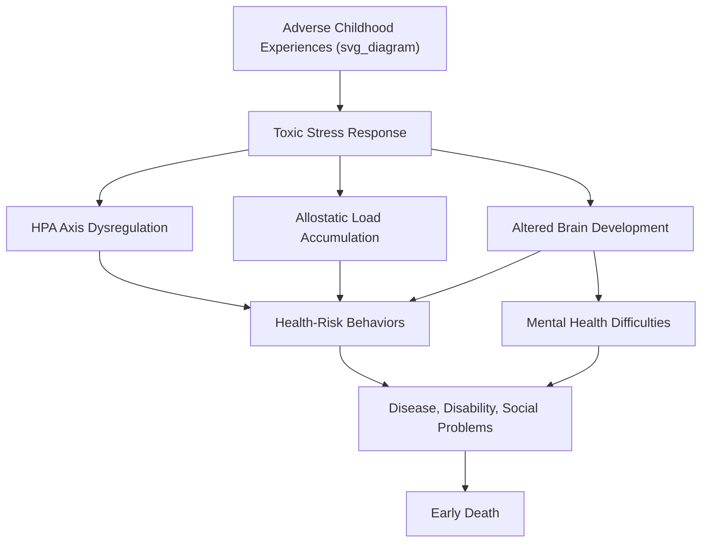

## Adverse Childhood Experiences Research and Its Implications

### Overview

Adverse Childhood Experiences (ACEs) research examines how potentially traumatic events occurring before age 18 are statistically associated with elevated risk for negative physical health, mental health, and social outcomes across the lifespan. The foundational **ACE Study** (Felitti, Anda, et al., 1998), conducted through Kaiser Permanente and the CDC, established a dose-response relationship between cumulative childhood adversity and adult morbidity, mortality, and risk behavior — reshaping public health, pediatrics, education, and social policy approaches to early adversity.

### The Original ACE Study

**Design**

- Retrospective cohort study of over 17,000 adult members of Kaiser Permanente's San Diego health plan.
- Participants completed a standardized health questionnaire assessing childhood exposure to specific adverse categories, alongside a comprehensive physical examination.
- Notable sample characteristics: predominantly middle-class, insured, majority white, college-educated — a limitation frequently cited in later critiques regarding generalizability.

**Original 10 ACE Categories** (each scored as present/absent before age 18, summed into an ACE score of 0–10):

*Abuse*

1. Emotional abuse
2. Physical abuse
3. Sexual abuse

*Neglect*

4. Emotional neglect

5. Physical neglect

*Household Dysfunction*

6. Household substance abuse

7. Household mental illness

8. Mother treated violently (domestic violence exposure)

9. Parental separation or divorce

10. Incarcerated household member

**Key Points**

- ACEs are historically clustered — experiencing one ACE substantially increases the statistical likelihood of experiencing others, since many stem from overlapping household conditions (e.g., substance abuse and domestic violence often co-occur).
- The ACE score is a cumulative count, not a weighted severity index — each category counts equally regardless of frequency, duration, or intensity of the specific adverse experience, which is frequently cited as a psychometric simplification.

### The Dose-Response Relationship

The central and most replicated finding is a **graded, dose-response relationship**: as ACE score increases, the prevalence and risk of numerous negative outcomes increases in a stepwise or exponential fashion, rather than as a simple threshold effect.

Outcomes originally associated with higher ACE scores included:

- Ischemic heart disease, chronic obstructive pulmonary disease (COPD), liver disease
- Depression, suicide attempts
- Alcoholism and illicit drug use
- Smoking, severe obesity
- Unintended pregnancy, high number of sexual partners
- Intimate partner violence (as victim or perpetrator in later life)

[Inference] While the dose-response pattern itself is robustly replicated across many subsequent cohorts internationally, the specific odds ratios reported in the original 1998 study reflect that particular sample and should not be treated as universal population parameters — later meta-analyses report substantial heterogeneity in effect sizes across populations and measurement approaches.

### Proposed Biological and Behavioral Mechanisms

**Toxic Stress and the Biology of Adversity**

The National Scientific Council on the Developing Child (Harvard Center on the Developing Child) distinguishes three types of childhood stress response:

| Stress Type | Description | Key Feature |
| --- | --- | --- |
| Positive stress | Brief, mild physiological activation | Buffered by supportive relationships; normative and growth-promoting |
| Tolerable stress | More severe/longer activation (e.g., loss of a loved one) | Buffered by supportive adult relationships, allowing recovery |
| Toxic stress | Strong, frequent, or prolonged activation | Absence of buffering adult support; disrupts developing brain architecture |

**Proposed physiological pathways**

- Chronic activation of the **HPA axis**, leading to dysregulated cortisol patterns (hyper- or hypo-cortisolism depending on chronicity and developmental timing).
- Sustained **allostatic load** — cumulative "wear and tear" on multiple physiological systems (cardiovascular, metabolic, immune, neural) from repeated stress-response activation.
- Disruption of prefrontal cortex, amygdala, and hippocampal development, implicated in emotional regulation, threat appraisal, and memory.
- Epigenetic modification (e.g., DNA methylation changes) potentially altering gene expression related to stress reactivity — an active area of ongoing research.
- Behavioral pathway: adversity increases likelihood of coping via health-risk behaviors (smoking, substance use, overeating), which independently mediate later disease risk.

### Expanded ACE Frameworks

Subsequent research and practice have proposed expanding beyond the original 10 categories to address critiques of narrow scope:

**Expanded/Community ACEs (sometimes termed "ACEs 2.0" in practice literature)**

- Community violence exposure
- Bullying (peer victimization)
- Racism and discrimination
- Community disruption (e.g., eviction, homelessness)
- Foster care involvement
- Peer rejection
- Living in an unsafe neighborhood

**Positive/Protective Counterpart Frameworks**

- **Positive Childhood Experiences (PCEs)** (Bethell et al., 2019) — proposes measuring counterbalancing protective experiences (e.g., feeling able to talk to family about feelings, feeling supported by friends, having at least two nonparent adults who took genuine interest) that are associated with better adult mental health outcomes even among individuals with high ACE scores.
- **Benevolent Childhood Experiences (BCEs)** (Narayan et al., 2018) — a related protective-factor counterpart scale.
- [Inference] These positive-experience frameworks are more recent and have a smaller evidence base than the original ACE research; their proposed buffering or counterbalancing mechanisms are still being tested for causal, rather than correlational, effects.

### Screening Tools and Clinical Application

- **Original CDC-Kaiser ACE Questionnaire** — the 10-item retrospective self-report used in the original study.
- **PEARLS (Pediatric ACEs and Related Life-Events Screener)** — developed for clinical pediatric use, incorporates broader adversity categories.
- **CYW ACE-Q (Center for Youth Wellness ACE Questionnaire)** — used in California's state-supported ACE screening initiative for pediatric primary care.
- California's **ACEs Aware initiative** (launched 2019–2020) reimburses Medi-Cal providers for administering ACE screenings, representing one of the largest policy-level applications of ACE research into routine clinical practice.

**Example: Clinical Screening Workflow**

1. Pediatric or primary care visit includes standardized ACE questionnaire (self-report for adults, caregiver-report or validated screener for children).
2. Score is calculated (0–10 for original scale, or category-specific for expanded scales).
3. Elevated scores prompt referral to trauma-informed care resources, connection to protective-factor-building interventions (e.g., home visiting programs, parenting support), rather than being used as a standalone diagnostic label.
4. Clinicians are trained to interpret ACE score as one input among many (current stressors, protective factors, resilience indicators), not as a deterministic prognosis.

### Critiques and Methodological Limitations

- **Sample bias**: The original cohort's demographic homogeneity (largely white, middle-class, insured) raises questions about generalizability to more diverse and lower-resource populations, though numerous replications have since been conducted across more diverse samples.
- **Retrospective recall bias**: Adult self-report of childhood events decades earlier is subject to memory distortion, underreporting (especially for stigmatized categories like sexual abuse), and mood-congruent recall bias.
- **Equal weighting problem**: Treating all 10 categories as equivalent in severity is a substantial simplification; a single instance of mild parental separation and years of severe physical abuse both contribute "1 point."
- **Correlational, not causal, design**: The original ACE Study is correlational; while later research (including some longitudinal and quasi-experimental designs) strengthens causal inference for specific pathways, the cumulative ACE score itself does not establish individual-level causality.
- **Risk of deterministic labeling**: Critics (e.g., in social work and critical trauma-informed care literature) caution against using ACE scores to predict individual outcomes, since population-level statistical associations do not translate to individual-level certainty — many high-ACE-score individuals show no elevated negative outcomes, particularly with strong protective factors present.
- **Missing structural/systemic adversity**: Original categories are largely household-level and interpersonal; the framework was criticized for underweighting structural factors like poverty, racism, and community violence, prompting the expanded-ACEs movement described above.
- **Overpathologizing normative adversity**: Some critics argue that widescale screening risks pathologizing common family transitions (e.g., divorce) without adequate context for severity or protective buffering.

### Relevance to Positive Psychology and Resilience

- **Resilience as the empirically dominant outcome, not the exception**: Reanalyses and follow-up research consistently show that a majority of individuals with even high ACE scores do NOT develop the most severe outcomes — resilience is statistically the modal response to adversity, not a rare exception, which counters early deterministic public narratives around ACE research.
- **Protective factors as buffers**: The Positive Childhood Experiences and Benevolent Childhood Experiences frameworks operationalize exactly the kind of protective, relationship-based buffering central to resilience science (see also Werner & Smith's Kauai Longitudinal Study and Masten's "ordinary magic" framework).
- **Trauma-informed strengths-based practice**: ACE research has directly informed **trauma-informed care (TIC)** models in schools, healthcare, and social services, which pair adversity awareness with deliberate strengths-based, relationship-centered intervention (e.g., "safe, stable, nurturing relationships" — SSNRs — promoted by the CDC as the primary preventive lever).
- **Reframing "What happened to you?" vs. "What's wrong with you?"**: A central shift in trauma-informed and resilience-oriented practice, moving from behavior-as-pathology framing to behavior-as-adaptation-to-adversity framing, directly informed by ACE research's toxic stress model.
- **Intervention leverage points**: Because toxic stress requires the *absence* of buffering relationships to become damaging, resilience interventions focus heavily on building at least one stable, responsive adult relationship — identified across multiple resilience frameworks as the single most consistent protective factor.

### Practical / Applied Example

**Scenario**: A school district adopts a trauma-informed, resilience-building framework informed by ACE research.

- Rather than using ACE scores punitively or diagnostically, the district trains teachers in recognizing behavior as potentially adversity-driven (e.g., a child's dysregulated behavior reframed as a stress response rather than "defiance").
- The district implements universal SEL curricula (benefiting all students, consistent with a "vantage sensitivity"/differential susceptibility logic) alongside targeted mentoring programs pairing high-adversity-exposure students with consistent, caring adult mentors.
- Progress is measured not only by reduction in negative outcomes but by growth in protective/positive factors (sense of belonging, at least one trusted adult relationship, self-regulation skills) — operationalizing the PCE/BCE framework's emphasis on building resilience resources rather than solely preventing risk factors.

### Key Researchers and Foundational Sources

- **Vincent Felitti & Robert Anda** — principal investigators of the original 1998 CDC-Kaiser ACE Study.
- **Nadine Burke Harris** — pediatrician and public health advocate; authored *The Deepest Well*; founded the Center for Youth Wellness; led California's ACEs Aware initiative as the state's first Surgeon General.
- **Jack Shonkoff** — Harvard Center on the Developing Child; toxic stress framework and biological embedding of adversity.
- **Christina Bethell** — Positive Childhood Experiences (PCE) research.
- **Angela Narayan** — Benevolent Childhood Experiences (BCE) research.

### Related Topics

- Toxic stress and the biology of adversity (HPA axis, allostatic load)
- Positive Childhood Experiences (PCEs) and Benevolent Childhood Experiences (BCEs)
- Trauma-informed care models in schools and healthcare
- Safe, Stable, Nurturing Relationships (SSNRs) as a public health prevention framework
- Differential susceptibility and biological sensitivity to context
- Kauai Longitudinal Study (Werner & Smith) and long-term resilience trajectories
- Epigenetics of early-life stress
- Critiques of deficit-based versus strengths-based adversity frameworks