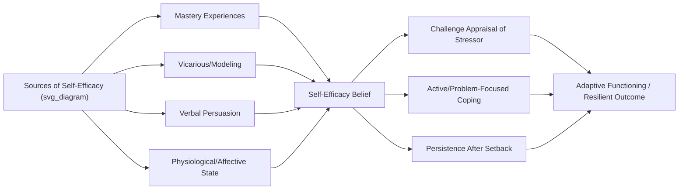

## Self-Efficacy and Mastery Beliefs in Resilient Functioning

### Overview

Self-efficacy — an individual's belief in their capacity to execute the actions required to produce specific outcomes — is one of the most extensively validated cognitive protective factors in resilience science. Rooted in Albert Bandura's social cognitive theory, self-efficacy and the closely related construct of **mastery beliefs** (a generalized sense that one's own effort and actions can influence outcomes) function as proximal psychological mechanisms through which risk exposure is buffered and adaptive coping is enabled. These constructs consistently emerge across major longitudinal resilience studies as core individual-level protective factors.

### Theoretical Foundations

**Bandura's Social Cognitive Theory (1977, 1997)**

Self-efficacy is defined as a **domain-specific, task-specific** belief — "I can successfully complete this particular task" — distinct from generalized self-esteem or self-concept.

Bandura proposed four primary sources of self-efficacy information:

1. **Mastery experiences** — direct personal success at a task; the most powerful source, since it provides authentic evidence of capability.
2. **Vicarious experiences** — observing similar others succeed (social modeling), which raises observers' beliefs that they too possess the capability to succeed.
3. **Verbal/social persuasion** — encouragement or feedback from credible others that one possesses the capabilities needed to succeed.
4. **Physiological and affective states** — interpretation of one's own arousal, fatigue, or mood as informative about capability (e.g., interpreting nervous arousal as excitement versus incompetence).

$$SE_{task} = f(M_{experience}, V_{modeling}, P_{persuasion}, A_{affective\ state})$$

**Key Points**

- Self-efficacy operates through four principal mechanisms: influencing (a) choice of activities/environments, (b) effort expenditure, (c) persistence in the face of obstacles, and (d) emotional reactions to challenge (e.g., anxiety versus confidence).
- Self-efficacy is distinct from *outcome expectancy* — the belief that a given action will produce a given outcome. One can believe an action would work (outcome expectancy) while doubting one's personal ability to execute it (low self-efficacy), and vice versa.

**Mastery Beliefs and Locus of Control**

Related but conceptually distinct constructs frequently appear alongside self-efficacy in resilience literature:

- **Mastery** (Pearlin & Schooler, 1978) — a more generalized, trait-like sense that one's life circumstances are under one's own control rather than fatalistically determined.
- **Locus of control** (Rotter, 1966) — the degree to which individuals attribute outcomes to internal (own effort/ability) versus external (luck, powerful others, chance) causes.
- **Learned helplessness** (Seligman) — the theoretical opposite pole, describing a state in which repeated uncontrollable negative outcomes produce a generalized belief that effort is futile.

[Inference] While self-efficacy, mastery, and internal locus of control are empirically correlated and often used interchangeably in applied resilience literature, they arose from distinct theoretical traditions (social cognitive theory, sociological stress-process models, and attribution theory respectively) and are measured with different instruments; treating them as fully interchangeable risks conflating related but non-identical constructs.

### Empirical Role in Major Resilience Frameworks

**Kauai Longitudinal Study (Werner & Smith)**

- Identified "a sense of efficacy" or "faith that they could control their own fate" as one of the consistent dispositional characteristics distinguishing resilient children (who overcame high-risk backgrounds) from peers with similar risk exposure who developed later problems.

**Garmezy's Triad of Protective Factors**

- Norman Garmezy's influential framework grouped protective factors into three broad categories: (1) dispositional attributes of the child (including self-efficacy/self-esteem), (2) family cohesion/warmth, and (3) external support systems — positioning self-efficacy as a primary individual-level factor.

**Masten's "Ordinary Magic" Framework**

- Ann Masten identifies "effective agency" or "a sense of mastery, hopefulness" among the short list of resilience factors so consistently replicated across studies and populations that she terms them **"ordinary magic"** — common adaptive systems rather than rare extraordinary traits.

**Rutter's Concept of "Turning Points" and Self-Efficacy**

- Michael Rutter's resilience research emphasizes that successful navigation of a single significant life challenge (a "turning point") can generate a durable increase in self-efficacy that alters an individual's subsequent trajectory — illustrating self-efficacy as both an outcome of, and contributor to, resilience processes.

### Proposed Mechanisms of Protective Action

Self-efficacy is theorized to buffer risk and promote resilience through several interacting pathways:

| Mechanism | Description |
| --- | --- |
| Appraisal effects | High self-efficacy shifts cognitive appraisal of stressors from "threat" toward "challenge," per Lazarus & Folkman's transactional stress model |
| Coping strategy selection | Higher self-efficacy is associated with greater use of active, problem-focused coping and less avoidance-based coping |
| Persistence under adversity | Self-efficacious individuals maintain effort longer following setbacks rather than disengaging |
| Physiological stress reactivity | Perceived low self-efficacy/controllability is associated with heightened HPA-axis and sympathetic stress responses; perceived control is associated with attenuated physiological stress reactivity |
| Help-seeking behavior | Moderate-to-high self-efficacy is associated with appropriate help-seeking (recognizing limits while still acting), whereas very low self-efficacy is associated with reduced help-seeking due to hopelessness |

### Measurement Instruments

- **General Self-Efficacy Scale (GSE)** (Schwarzer & Jerusalem, 1995) — 10-item scale measuring generalized, cross-situational self-efficacy beliefs.
- **Self-Efficacy Scale (Sherer et al., 1982)** — includes general and social self-efficacy subscales.
- **Pearlin Mastery Scale** (Pearlin & Schooler, 1978) — 7-item scale widely used in sociological stress-process and life-course research.
- **Academic Self-Efficacy Scales** (e.g., Patterns of Adaptive Learning Scales, PALS) — domain-specific instruments used heavily in educational resilience research.
- **Self-Efficacy Questionnaire for Children (SEQ-C)** (Muris, 2001) — measures academic, social, and emotional self-efficacy domains separately in youth populations.
- Domain-specific instruments are generally preferred over generalized measures when the research question concerns a specific performance context (e.g., academic self-efficacy predicting academic resilience specifically), consistent with Bandura's original emphasis on task specificity.

### Interventions Targeting Self-Efficacy

**Mastery-experience-based interventions**

- Graduated task exposure / scaffolded skill-building — structuring tasks from easily achievable to progressively more challenging so that early successes build a mastery foundation (used extensively in academic and clinical/CBT contexts).

**Vicarious/modeling-based interventions**

- Peer mentoring and near-peer role modeling programs, leveraging the principle that observing similar others succeed is more efficacy-enhancing than observing highly dissimilar experts.

**Persuasion-based approaches**

- Strengths-based feedback and attribution retraining — explicitly linking student/client success to effort and strategy ("You solved that because you tried a new approach," rather than generic praise), consistent with Carol Dweck's growth mindset research, which shares conceptual overlap with self-efficacy theory though it is a distinct construct focused on beliefs about ability malleability rather than task-specific competence beliefs.

**Physiological/affective reframing**

- Cognitive-behavioral reappraisal techniques teaching individuals to reinterpret physiological arousal (e.g., pre-exam nervousness) as functional activation rather than evidence of inadequacy.

**Example: School-Based Self-Efficacy Intervention Design**

1. **Assessment**: Administer a domain-specific self-efficacy measure (e.g., academic self-efficacy scale) to identify students with low task-specific confidence, independent of actual current performance level.
2. **Scaffolded goal-setting**: Break long-term academic goals into short-term, attainable sub-goals, ensuring early, genuine mastery experiences.
3. **Structured peer modeling**: Pair students with near-peer models who have successfully navigated similar academic challenges.
4. **Process-focused feedback**: Provide specific, effort/strategy-attributed feedback rather than solely outcome-based praise.
5. **Progress monitoring**: Reassess self-efficacy alongside performance metrics, since the intervention target is the belief system, not only the outcome — sustained efficacy gains are theorized to generalize to future novel challenges beyond the immediate task trained.

### Distinguishing Self-Efficacy From Adjacent Constructs

| Construct | Definition | Distinguishing Feature |
| --- | --- | --- |
| Self-efficacy | Belief in capability to execute a specific task | Task/domain-specific, situational |
| Self-esteem | Global evaluation of one's own worth | Broad, evaluative, not tied to specific competence |
| Mastery | Generalized sense of control over life circumstances | Trait-like, broader than single tasks |
| Locus of control | Attribution of outcomes to internal vs. external causes | Attributional style, not a competence belief per se |
| Growth mindset | Belief that ability/intelligence can be developed | Belief about malleability of traits, not immediate task confidence |
| Hope (Snyder's model) | Goal-directed agency + pathways thinking | Includes "pathways" (route-generation) component beyond pure efficacy |

### Critiques and Boundary Conditions

- **Overconfidence risk**: Self-efficacy beliefs that substantially exceed actual competence can lead to poor risk assessment or persistence in maladaptive strategies; the protective effect assumes reasonably calibrated efficacy beliefs.
- **Context and resource dependency**: [Inference] Self-efficacy's protective effect is likely moderated by the actual availability of environmental resources and opportunity structures — high self-efficacy in a context with no genuine avenues for exercising agency (e.g., severe structural poverty or oppression) may have attenuated or even paradoxical effects, an area with a comparatively thinner evidence base than efficacy research in more resourced settings.
- **Domain non-generalization**: High self-efficacy in one domain (e.g., academics) does not automatically transfer to another (e.g., social relationships), a limitation sometimes overlooked when generalized self-efficacy measures are used as proxies for domain-specific resilience processes.
- **Cultural variation**: Most foundational self-efficacy research originated in individualist Western contexts emphasizing personal agency; cross-cultural research suggests collective efficacy (a group's shared belief in its capability) may be a more salient protective construct in collectivist cultural contexts, and personal self-efficacy measures may require cultural adaptation for valid cross-cultural use.

### Relevance to Positive Psychology and Resilience

- Self-efficacy operationalizes the **agentic core** of resilience theory — the capacity for individuals to act as active agents shaping their environment and trajectory rather than passive recipients of risk or protection.
- It intersects directly with positive psychology's **PERMA model** (Seligman) via the "Accomplishment" (A) pillar and indirectly supports "Engagement" (E), since task engagement is facilitated by confidence in one's capability to meet the challenge.
- Self-efficacy is a core mechanism within **Hope Theory** (Snyder), contributing the "agency" component alongside "pathways" thinking.
- It is a central target construct in **strengths-based practice models** across social work, education, and clinical psychology, reflecting the broader positive-psychology shift from deficit remediation toward capacity-building.

### Related Topics

- Bandura's social cognitive theory and reciprocal determinism
- Hope theory (Snyder) — agency and pathways thinking
- Growth mindset (Dweck) and implicit theories of ability
- Locus of control and attribution theory in coping research
- Learned helplessness and its reversal (learned optimism, Seligman)
- Collective efficacy in community resilience research
- Strengths-based practice models in social work and education
- Garmezy's protective factor triad and Masten's "ordinary magic" framework