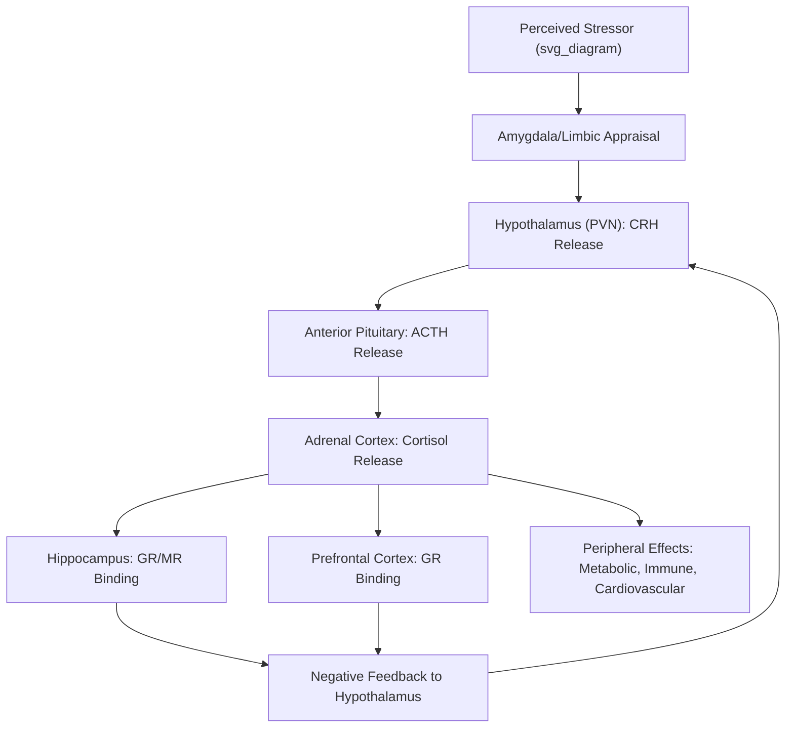

## The HPA Axis and the Neurobiology of the Stress Response

### Overview

The hypothalamic-pituitary-adrenal (HPA) axis is the principal neuroendocrine system coordinating the body's physiological response to stress. Together with the sympathetic-adrenal-medullary (SAM) system, it forms the biological substrate through which psychological and physical stressors are translated into hormonal, metabolic, and behavioral adaptations. Understanding HPA axis structure and regulation is foundational to resilience science, since individual differences in HPA reactivity and recovery are central to concepts such as allostatic load, toxic stress, and biological sensitivity to context.

### Anatomical and Physiological Components

**The Core HPA Cascade**

1. **Hypothalamus** (paraventricular nucleus, PVN) — upon perceiving a stressor (via limbic and cortical input), secretes **corticotropin-releasing hormone (CRH)**, and to a lesser extent arginine vasopressin (AVP), into the hypophyseal portal system.
2. **Anterior pituitary gland** — CRH binds to CRH receptors (CRHR1) on corticotrope cells, stimulating release of **adrenocorticotropic hormone (ACTH)** into systemic circulation.
3. **Adrenal cortex** (zona fasciculata) — ACTH binds melanocortin type 2 receptors, stimulating synthesis and release of **glucocorticoids** — primarily **cortisol** in humans (corticosterone in rodents).

$$\text{Stressor} \rightarrow \text{PVN (CRH)} \rightarrow \text{Anterior Pituitary (ACTH)} \rightarrow \text{Adrenal Cortex (Cortisol)}$$

**Negative Feedback Regulation**

Cortisol exerts inhibitory feedback at multiple levels to terminate the stress response:

- **Hippocampus** — dense glucocorticoid receptor (GR) concentration; hippocampal activation inhibits hypothalamic CRH release.
- **Hypothalamus (PVN)** — direct feedback inhibition of CRH synthesis/release.
- **Anterior pituitary** — feedback inhibition of ACTH release.
- **Prefrontal cortex** — modulates HPA activity, generally providing additional inhibitory regulation, particularly relevant to top-down emotion regulation capacities.

Glucocorticoids act through two receptor types with differing binding affinity:

- **Mineralocorticoid receptors (MR)** — high affinity, largely occupied even at basal (circadian trough) cortisol levels; involved in appraisal and initial stress-response threshold-setting.
- **Glucocorticoid receptors (GR)** — lower affinity, substantially occupied only during stress-induced cortisol elevations or the circadian peak; primarily responsible for negative feedback and stress-response termination/recovery.

### The Complementary Fast-Response System: SAM Axis

While the HPA axis produces a slower hormonal response (minutes), the **sympathetic-adrenal-medullary (SAM) axis** produces an immediate response (seconds):

- Sympathetic nervous system activation triggers release of **epinephrine (adrenaline)** and **norepinephrine (noradrenaline)** from the adrenal medulla and sympathetic nerve terminals.
- Produces the classic acute "fight-or-flight" physiological changes: increased heart rate, blood pressure, respiration, and glucose mobilization.
- Operates largely independently of, but in coordination with, the slower HPA cascade — the SAM system provides rapid mobilization while the HPA axis sustains and eventually terminates the broader metabolic stress response.

**Key Points**

- HPA axis cortisol release follows a **pronounced circadian rhythm** independent of acute stress: a sharp rise shortly after waking (the **cortisol awakening response**, CAR), peak in early morning, and gradual decline (nadir) at night — a critical methodological consideration, since acute stress reactivity must be measured against this fluctuating baseline, not an assumed flat resting level.
- Cortisol is often measured via salivary, blood, urinary, or hair samples in research; hair cortisol concentration is increasingly used as a retrospective index of cumulative cortisol exposure over preceding months, since hair growth incorporates circulating cortisol over time.

### Neural Circuits Modulating HPA Activation

| Structure | Role in HPA Regulation |
| --- | --- |
| Amygdala (particularly central and basolateral nuclei) | Excitatory; threat detection and appraisal, activates PVN |
| Hippocampus | Inhibitory; negative feedback, contextual appraisal of safety/threat |
| Medial prefrontal cortex | Generally inhibitory; top-down regulation, cognitive reappraisal |
| Bed nucleus of the stria terminalis (BNST) | Complex/mixed; implicated in sustained anxiety-related HPA activation, distinct from phasic amygdala-driven fear responses |
| Paraventricular nucleus (PVN) of hypothalamus | Integration hub; final common pathway initiating CRH release |

[Inference] The precise balance of excitatory versus inhibitory input across these circuits, and how this balance is shaped by early-life experience, remains an active area of research; findings regarding specific circuit-level plasticity are generally drawn from animal models and require caution when extrapolated directly to human stress-response individual differences.

### Developmental Programming of the HPA Axis

**Early-Life Sensitivity**

- The HPA axis undergoes a period of heightened plasticity during early development, during which chronic or severe stress exposure (e.g., maltreatment, neglect, caregiver unavailability) can produce lasting alterations in axis reactivity and feedback sensitivity — a mechanism proposed to underlie the "biological embedding" of early adversity discussed in ACE research.
- Animal model research (notably Michael Meaney's work on maternal licking/grooming behavior in rodents) demonstrated that variation in early caregiving quality is associated with epigenetic modification of the glucocorticoid receptor gene promoter in the hippocampus, altering GR expression and subsequent stress reactivity into adulthood — a foundational finding in behavioral epigenetics.
- [Inference] Direct human epigenetic replication of these rodent findings (e.g., studies examining *NR3C1* — the human GR gene — methylation in relation to early adversity) shows a generally consistent direction of association but with smaller, more variable effect sizes and greater methodological heterogeneity than the animal literature, and causal directionality in human observational studies is harder to establish.

**Patterns of Altered HPA Function Associated With Early Adversity**

- **Hyperactivation/hypercortisolism** — associated with some forms of chronic stress and certain depressive presentations.
- **Hypoactivation/hypocortisolism** — associated with some forms of chronic early trauma, PTSD in certain presentations, and burnout; theorized to reflect a compensatory downregulation following prolonged hyperactivation.
- [Unverified] The specific conditions determining which pattern (hyper- vs. hypocortisolism) emerges in a given individual — related to timing, chronicity, and type of adversity — are not fully resolved in the literature and represent an active research question rather than settled fact.

### Allostasis and Allostatic Load

- **Allostasis** (McEwen & Stellar, 1993) — the process of achieving physiological stability through change; the HPA and SAM systems are core allostatic mechanisms, adaptively adjusting physiological parameters in response to demand.
- **Allostatic load** — the cumulative physiological "cost" of repeated or chronic allostatic activation, theorized to manifest as measurable wear across multiple systems (cardiovascular, metabolic, immune, neuroendocrine).
- **Allostatic overload** — a more severe state in which cumulative demands exceed the organism's capacity to adapt, associated with the onset of stress-related disease.

Common **allostatic load indices** used in research combine biomarkers such as: cortisol, DHEA-S, systolic/diastolic blood pressure, waist-hip ratio, HbA1c, HDL/total cholesterol ratio, and inflammatory markers (e.g., C-reactive protein, IL-6) into a composite score.

### HPA Axis Reactivity in Resilience Research

- **Biological Sensitivity to Context** (Boyce & Ellis) frames HPA reactivity (alongside SNS/PNS reactivity) as a marker of environmental sensitivity rather than pure pathology — high reactivity paired with supportive context is associated with favorable outcomes.
- **Buffering effect of supportive relationships**: A substantial body of research (e.g., work by Megan Gunnar on institutionalized/adopted children) demonstrates that the presence of a sensitive, responsive caregiver attenuates children's cortisol reactivity to stressors — providing a physiological mechanism for the well-established "safe, stable, nurturing relationships" protective factor.
- **Resilient recovery/regulation, not absence of reactivity**: Contemporary resilience science increasingly frames adaptive stress-response functioning not as the absence of HPA activation, but as efficient activation followed by timely recovery (return to baseline) — chronic failure to terminate the stress response, rather than the initial reactivity itself, is more consistently linked to negative outcomes.

### Practical / Applied Example

**Scenario**: A researcher designs a study examining whether a school-based mindfulness intervention buffers students' physiological stress reactivity.

1. **Baseline measurement**: Salivary cortisol sampled at multiple points accounting for circadian rhythm (e.g., immediately upon waking for CAR, and 30/60 minutes post-waking) before intervention begins.
2. **Acute stress challenge**: A standardized laboratory stress task (e.g., a Trier Social Stress Test variant adapted for youth) is administered, with cortisol sampled at baseline, immediately post-task, and at 20, 40, and 60 minutes post-task to capture the full reactivity-and-recovery curve — not simply a peak value.
3. **Intervention period**: Half the sample receives an 8-week mindfulness-based stress reduction curriculum; the other serves as a waitlist control.
4. **Post-intervention reassessment**: The same stress-challenge protocol is repeated, examining whether the intervention group shows faster cortisol recovery (return to baseline) post-stressor relative to control — operationalizing "resilient" physiological functioning as efficient recovery rather than blunted reactivity.
5. **Interpretation caveat**: Researchers must control for time of day, recent food/caffeine intake, medication use (e.g., oral contraceptives, corticosteroids), and menstrual cycle phase, all of which significantly influence cortisol measurement and are common confounds in HPA axis research.

### Measurement Considerations and Confounds

- Circadian timing must be standardized or statistically controlled, given the steep diurnal cortisol slope.
- Salivary cortisol reflects free (unbound) cortisol; blood-based assays typically capture total cortisol (bound + unbound to corticosteroid-binding globulin), and the two are not interchangeable without appropriate conversion/interpretation.
- Acute confounds: recent exercise, food/caffeine intake, smoking, and time since waking all significantly affect cortisol readings.
- Individual difference confounds: hormonal contraceptive use, pregnancy, certain medications (e.g., corticosteroids), and diagnosed endocrine disorders (e.g., Cushing's or Addison's disease) require exclusion or statistical control in typical psychological stress research.

### Relevance to Positive Psychology and Resilience

- HPA axis functioning provides the physiological substrate connecting early relational and environmental protective factors (secure attachment, caregiver buffering, community stability) to measurable long-term health and psychological outcomes.
- It supports a biologically grounded account of why "safe, stable, nurturing relationships" function as a primary universal protective factor — caregiver presence directly attenuates children's physiological stress reactivity.
- The shift in resilience science from viewing high reactivity as inherently maladaptive toward viewing it as context-dependent plasticity (per BSC/differential susceptibility) directly depends on HPA axis research as its biological foundation.
- Interventions shown to modulate HPA functioning (mindfulness-based programs, secure attachment-promoting parenting interventions, physical exercise) represent concrete, biologically validated levers within positive psychology and resilience-building practice.

### Related Topics

- Differential susceptibility and biological sensitivity to context
- Allostasis and allostatic load across the lifespan
- Behavioral epigenetics and the biological embedding of early adversity (Meaney's maternal care research)
- Autonomic nervous system reactivity: sympathetic and parasympathetic (vagal) regulation
- Adverse Childhood Experiences (ACEs) and toxic stress
- Cortisol awakening response and circadian stress biology
- Attachment theory and caregiver buffering of physiological stress
- Mindfulness-based interventions and HPA axis regulation