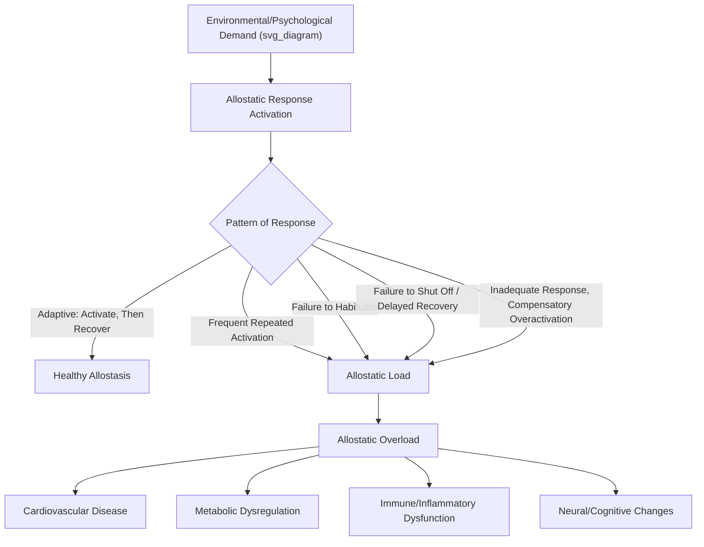

## Allostasis and Allostatic Load

### Overview

Allostasis and allostatic load together form a conceptual framework describing how the body maintains physiological stability through active, adaptive change in response to environmental and psychological demands, and the cumulative biological cost of doing so repeatedly or excessively. Developed as an alternative and elaboration of the older concept of homeostasis, this framework has become central to understanding how chronic stress, particularly across development, becomes biologically embedded and contributes to long-term disease risk — making it a key mechanistic bridge between psychosocial risk/protective factors and physical health outcomes in resilience science.

### Theoretical Origins: Allostasis vs. Homeostasis

**Homeostasis** (Cannon, Bernard) — the classical concept describing physiological systems maintained within a narrow, fixed set-point range (e.g., blood pH, core body temperature) through corrective feedback mechanisms.

**Allostasis** (Sterling & Eyer, 1988; popularized by Bruce McEwen) — extends this concept to systems, such as blood pressure, cortisol, and glucose, that do not operate around a single fixed set point but are instead adaptively adjusted based on anticipated demand, circadian rhythm, and environmental context. McEwen defined allostasis as **"stability through change"** — the active process by which the body's regulatory systems adjust operating parameters to meet perceived or anticipated challenges, rather than passively resisting deviation from a fixed baseline.

**Key Points**

- Homeostatic systems (e.g., blood pH, oxygen tension) have narrow, life-critical set points with minimal tolerable deviation.
- Allostatic systems (e.g., cortisol, blood pressure, heart rate) have wider, context-dependent operating ranges that shift adaptively across the day, across situations, and across the lifespan.
- Allostasis is inherently adaptive and necessary for survival — the capacity to mobilize cardiovascular, metabolic, and neuroendocrine resources in anticipation of or response to challenge is a feature of healthy physiological functioning, not a dysfunction in itself.

### The Four Primary Allostatic Systems

McEwen identified four principal physiological mediators of allostasis, all also central to HPA axis and autonomic nervous system functioning:

| System | Primary Mediators | Function |
| --- | --- | --- |
| Neuroendocrine (HPA axis) | Cortisol, CRH, ACTH | Mobilizes energy, modulates immune/inflammatory activity |
| Autonomic nervous system | Epinephrine, norepinephrine | Rapid cardiovascular/metabolic mobilization |
| Metabolic | Glucose, insulin, triglycerides | Energy substrate regulation and mobilization |
| Immune | Pro-inflammatory cytokines (e.g., IL-6, TNF-α, CRP) | Inflammatory response coordination |

### From Allostasis to Allostatic Load

**Allostatic load** is defined as the cumulative physiological "wear and tear" that results from chronic overactivity or dysregulation of allostatic systems — the price paid by the body for repeatedly having to adapt to unpredictable, prolonged, or intense demands.

McEwen and Stellar (1993) proposed four situations that give rise to allostatic load:

1. **Frequent stress activation** — repeated exposure to novel stressors, each requiring a fresh allostatic response (e.g., repeated acute stressors without recovery time).
2. **Failure to habituate** — repeated exposure to the *same* stressor without the normal adaptive reduction in response magnitude that most individuals show with repetition.
3. **Failure to shut off the response** (inadequate recovery) — the allostatic response (e.g., elevated cortisol) fails to terminate promptly after the stressor ends, prolonging exposure to stress mediators.
4. **Inadequate response leading to compensatory activation of other systems** — when one system underresponds (e.g., insufficient cortisol release), other systems (e.g., inflammatory pathways) may become chronically overactive to compensate.

### Allostatic Overload

A distinction is often drawn between **allostatic load** (the cumulative burden, which may still be within adaptable limits) and **allostatic overload** — a more severe state in which cumulative allostatic demands exceed the organism's capacity to adapt, resulting in pathophysiological damage and the onset of overt disease. McEwen further distinguished:

- **Type 1 allostatic overload** — occurs when energy demand exceeds supply, typically triggering an adaptive response (e.g., hibernation-like states, or in humans, the body's response to genuine resource scarcity), which can eventually resolve as conditions improve.
- **Type 2 allostatic overload** — occurs when the social/physical environment persistently overtaxes the organism even in the absence of true energy scarcity (e.g., chronic psychosocial stress, social conflict, or perceived threat), producing sustained pathophysiological cost with less clear resolution.

### Measuring Allostatic Load: Composite Biomarker Indices

Because allostatic load is a multi-system construct, researchers typically operationalize it as a **composite index** aggregating biomarkers across the four core systems, rather than relying on any single measure.

**Commonly Included Biomarkers**

*Cardiovascular*

- Systolic and diastolic blood pressure

*Metabolic*

- Waist-to-hip ratio (or BMI)
- HbA1c (glycated hemoglobin)
- HDL cholesterol, total cholesterol/HDL ratio
- Triglycerides

*Neuroendocrine*

- Cortisol (salivary, urinary, or hair)
- DHEA-S (dehydroepiandrosterone sulfate; often examined for its counter-regulatory relationship to cortisol)
- Epinephrine, norepinephrine

*Immune/Inflammatory*

- C-reactive protein (CRP)
- Interleukin-6 (IL-6)
- Fibrinogen

**Scoring approach**: A common method involves flagging each biomarker as "high risk" if it falls in the top (or bottom, depending on directionality) quartile of the sample distribution, then summing the flags into a composite score (e.g., 0–10). [Inference] This quartile-based approach is a methodological convention rather than a biologically derived cutoff system, meaning allostatic load scores are somewhat sample-dependent and not directly comparable across studies using different biomarker panels or scoring thresholds.

### The Life-Course and Developmental Perspective

Allostatic load is inherently a **cumulative, life-course construct** — it is theorized to accumulate progressively from early childhood through adulthood, making it a key mechanistic link in life-course models of health disparities.

- **Biological embedding of early adversity**: Chronic early-life stress (e.g., as captured in ACE research) is proposed to initiate allostatic load accumulation earlier and more steeply, contributing to the observed dose-response relationship between childhood adversity and adult disease.
- **Socioeconomic gradient research**: Allostatic load has been used extensively to help explain the biological pathway underlying socioeconomic health disparities — chronic exposure to financial strain, discrimination, neighborhood disadvantage, and reduced access to protective resources is associated with higher cumulative allostatic load scores, independent of health behaviors alone.
- **"Weathering" hypothesis** (Arline Geronimus) — proposes that chronic exposure to social and economic adversity, including racism-related stress, accelerates biological aging and allostatic load accumulation, contributing to health disparities observed in marginalized populations at earlier ages than in more advantaged populations.

### Allostatic Load and Resilience: Protective Buffering

- **Supportive relationships and social support** are consistently associated with lower allostatic load scores, providing a biological mechanism for the well-documented protective effect of social connectedness in resilience research.
- **Effective emotion regulation and coping strategies** (e.g., active coping, cognitive reappraisal) are associated with more efficient allostatic responses (adequate activation followed by timely recovery), rather than chronic dysregulation.
- **Physical activity, sleep quality, and nutrition** function as direct behavioral moderators of allostatic load, representing concrete, modifiable intervention targets.
- **Sense of control/self-efficacy** is associated with more adaptive allostatic regulation, consistent with the broader literature linking perceived control to attenuated physiological stress reactivity.

[Inference] While these associations are well-replicated at a correlational level, allostatic load research is predominantly observational; establishing that a specific intervention (e.g., a mindfulness program) causally reduces long-term allostatic load, as opposed to producing short-term biomarker improvements, generally requires longer and larger trials than are commonly available in the literature.

### Practical / Applied Example

**Scenario**: A public health researcher investigates whether a community-based stress-reduction and social-support program reduces allostatic load among residents of a high-poverty neighborhood.

1. **Baseline assessment**: Collect a standard allostatic load panel (blood pressure, waist-hip ratio, HbA1c, cholesterol profile, cortisol, CRP, IL-6) from participants at study entry.
2. **Intervention**: Deliver a 12-month program combining stress-management skills training, peer support groups, and connection to community resources addressing material hardship (e.g., housing assistance referrals).
3. **Follow-up assessment**: Re-collect the same biomarker panel at 6 and 12 months.
4. **Composite scoring**: Calculate allostatic load index scores at each time point using consistent quartile cutoffs derived from the baseline sample distribution.
5. **Analysis consideration**: Given that allostatic load reflects cumulative, slow-accumulating processes, researchers anticipate that biomarker changes may lag behind self-reported stress or well-being improvements, and appropriately plan for a longer follow-up window and control for confounds such as changes in medication use or health behaviors during the study period.

### Critiques and Methodological Considerations

- **Lack of biomarker panel standardization**: Different studies use varying combinations and numbers of biomarkers, limiting direct comparability of allostatic load scores across the literature.
- **Directionality and causality**: Cross-sectional allostatic load research cannot establish whether elevated load causes subsequent disease or reflects early subclinical disease processes already underway; longitudinal designs are needed but are less common due to cost and duration requirements.
- **Reverse causation and confound risk**: Chronic illness or medication use (e.g., antihypertensives, statins, corticosteroids) can directly affect several allostatic load biomarkers independent of psychosocial stress exposure, requiring careful statistical control.
- **Sample and population specificity**: Because scoring often relies on within-sample quartiles, allostatic load indices calculated in one population are not straightforwardly transferable to interpret risk in a different population without recalibration.

### Relevance to Positive Psychology and Resilience

- Allostatic load provides the **integrative physiological pathway** connecting chronic psychosocial stress, socioeconomic adversity, and early-life risk exposure to long-term physical health outcomes, extending resilience science beyond purely psychological outcome measures.
- It reframes resilience not merely as psychological adjustment but as the capacity to **maintain lower cumulative physiological cost** despite adversity exposure — implying that subjectively reported "doing well" and biologically measured allostatic burden should ideally be assessed together for a complete resilience picture.
- Interventions targeting well-being, social connection, and stress management (central to positive psychology practice) have a plausible, biologically grounded pathway to long-term health benefit via allostatic load reduction, strengthening the case for well-being-focused intervention as a public health, not merely psychological, priority.
- The concept underlies calls within resilience and health equity research to address **structural and material drivers of chronic stress** (poverty, discrimination, housing instability) as legitimate resilience-building targets, alongside individual-level psychological intervention.

### Related Topics

- The HPA axis and the neurobiology of the stress response
- Adverse Childhood Experiences (ACEs) and toxic stress
- The "weathering" hypothesis and health disparities (Geronimus)
- Socioeconomic status and biological embedding of stress
- Social support and physiological stress buffering
- Behavioral epigenetics and early-life biological programming
- Life-course epidemiology and cumulative risk models
- Inflammatory biomarkers (CRP, IL-6) in psychoneuroimmunology