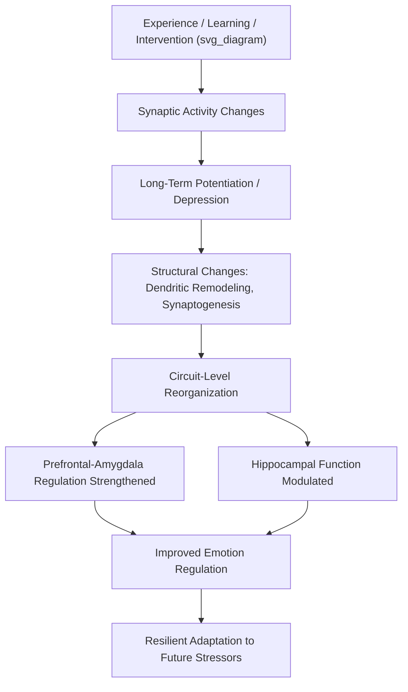

## Neuroplasticity and Its Role in Resilient Adaptation

### Overview

Neuroplasticity — the nervous system's capacity to reorganize its structure, function, and connectivity in response to experience, learning, injury, or environmental demand — provides the fundamental biological substrate through which resilient adaptation becomes possible across the lifespan. Rather than treating the brain as a fixed structure post-development, neuroplasticity research establishes that neural circuits underlying emotion regulation, stress response, and cognitive coping remain modifiable, offering a mechanistic explanation for how protective factors, interventions, and positive experiences translate into durable psychological resilience.

### Core Forms of Neuroplasticity

**Structural Plasticity**

- Changes in the physical structure of neurons and neural tissue, including dendritic branching, synaptic density, axonal sprouting, and — in specific brain regions — neurogenesis (generation of new neurons).
- **Synaptic pruning and synaptogenesis**: The continuous process of eliminating underused synaptic connections while strengthening frequently used ones, active throughout life but particularly pronounced during specific developmental windows.
- **Neurogenesis**: The hippocampus (specifically the dentate gyrus) is one of the few brain regions with well-documented adult neurogenesis in humans, though the extent and functional significance of adult human hippocampal neurogenesis remains a topic of active scientific debate, with some studies reporting robust evidence and others reporting minimal detectable neurogenesis in older adults. [Unverified] The precise rate and functional role of adult human neurogenesis is not settled science and should be treated as an area of ongoing investigation rather than an established fact with fixed parameters.

**Functional/Synaptic Plasticity**

- **Long-term potentiation (LTP)** — a persistent strengthening of synaptic transmission following repeated or patterned stimulation, widely regarded as a fundamental cellular mechanism underlying learning and memory.
- **Long-term depression (LTD)** — the complementary weakening of synaptic connections through disuse or specific stimulation patterns, contributing to circuit refinement and forgetting/unlearning processes.
- **Hebbian plasticity** — the principle, often summarized as "neurons that fire together, wire together," describing how synaptic strength is modified based on the correlated activity of connected neurons.

$$\Delta w_{ij} \propto x_i \cdot y_j$$

Where $\Delta w_{ij}$ represents the change in synaptic weight between neurons, and $x_i$, $y_j$ represent correlated pre- and post-synaptic activity — a simplified formalization of Hebbian learning principles.

**Key Points**

- Plasticity is not uniformly "good" or protective by default — maladaptive plasticity (e.g., fear-circuit sensitization following trauma, or reward-circuit changes in addiction) demonstrates that the same mechanisms enabling adaptive learning can also encode and reinforce dysfunction.
- Plasticity is not confined to early "critical periods" — while certain developmental windows show heightened plasticity (e.g., early visual system development, early language acquisition), substantial plasticity persists throughout adulthood, particularly in circuits related to learning, memory, and emotional regulation.

### Key Neural Circuits Relevant to Resilience

| Region | Role in Resilience-Relevant Plasticity |
| --- | --- |
| Prefrontal cortex (PFC) | Top-down emotion regulation, cognitive reappraisal, executive function; plasticity here supports improved regulation of amygdala-driven threat responses |
| Amygdala | Threat detection and fear learning; plasticity underlies both fear acquisition and, importantly, fear extinction |
| Hippocampus | Contextual memory, negative feedback regulation of the HPA axis; vulnerable to stress-induced dendritic remodeling and, per some evidence, neurogenesis changes |
| Ventral striatum / reward circuitry | Reward processing and motivation; plasticity here relevant to positive affect regulation and hedonic capacity |
| Anterior cingulate cortex (ACC) | Conflict monitoring, emotion-cognition integration |

**Fear Extinction as a Plasticity Model**

- Fear extinction — the process by which a previously conditioned fear response diminishes through repeated safe exposure to the conditioned stimulus — is one of the most well-studied plasticity-dependent processes directly relevant to resilience and trauma recovery.
- Extinction is now understood not as "erasure" of the original fear memory but as the formation of a **new, competing inhibitory memory trace**, primarily involving prefrontal cortex (particularly the infralimbic/ventromedial PFC in rodent models) exerting top-down inhibition over amygdala output.
- This mechanistic understanding directly underlies exposure-based therapeutic interventions (e.g., prolonged exposure therapy for PTSD), which are explicitly designed to promote extinction learning as a form of therapeutic plasticity.

### Stress-Induced Plasticity: The Double-Edged Nature

Chronic stress produces well-documented, measurable plastic changes, primarily studied via animal models and increasingly corroborated by human neuroimaging:

- **Hippocampus**: Chronic stress is associated with dendritic retraction (particularly in CA3 pyramidal neurons) and, in some models, reduced neurogenesis — plausibly contributing to memory and HPA-axis feedback impairments observed under chronic stress.
- **Amygdala**: Chronic stress is associated with dendritic *hypertrophy* (increased branching) in the basolateral amygdala, plausibly contributing to heightened fear/anxiety reactivity.
- **Prefrontal cortex**: Chronic stress is associated with dendritic retraction in medial PFC regions, plausibly contributing to impaired top-down emotion regulation capacity.

[Inference] This differential, region-specific pattern (hippocampal/PFC retraction paired with amygdala growth) is a well-replicated finding in rodent stress models; the degree to which equivalent structural changes occur in the human brain under comparable chronic stress, versus more subtle functional/connectivity changes detectable via neuroimaging, is an area where direct evidence is more limited than in animal models.

**Critically, many stress-induced structural changes show evidence of reversibility** following stress cessation or intervention (e.g., hippocampal dendritic complexity can partially recover following stress-reduction), reinforcing the concept that plasticity underlies not only vulnerability but also the capacity for recovery — a central premise supporting resilience-oriented intervention.

### Plasticity-Based Mechanisms of Resilient Adaptation

**Cognitive Reappraisal and Prefrontal Strengthening**

- Regular engagement in cognitive reappraisal (reframing the meaning of a stressor) is associated, in longitudinal and training-based studies, with strengthened prefrontal-amygdala connectivity, plausibly reflecting a plasticity-based mechanism through which repeated practice of adaptive emotion regulation strategies becomes more automatic and efficient over time.

**Mindfulness-Based Structural Changes**

- Neuroimaging research on mindfulness-based interventions (e.g., MBSR) has reported associations with structural changes including increased cortical thickness or gray matter density in regions such as the prefrontal cortex, insula, and hippocampus, alongside reported reductions in amygdala gray matter density or reactivity following training.
- [Inference] While multiple studies report such findings, effect sizes in this literature are often modest, sample sizes in early studies were frequently small, and this remains an area where replication in larger, well-controlled samples continues to refine confidence in specific structural claims.

**Enriched Environment Effects**

- Extensive animal literature demonstrates that environmental enrichment (increased social interaction, physical activity, and cognitive stimulation) promotes hippocampal neurogenesis, dendritic complexity, and improved stress resilience in rodent models — providing foundational support for human-relevant hypotheses linking enriched, stimulating environments to resilience-promoting neural changes, though direct human causal evidence at the structural level is harder to obtain than in controlled animal studies.

**Exercise-Induced Plasticity**

- Physical exercise is one of the most robustly supported behavioral promoters of plasticity, associated with increased **brain-derived neurotrophic factor (BDNF)** expression, a key growth factor supporting synaptic plasticity, neuronal survival, and (in animal models) hippocampal neurogenesis.

### Molecular Mediators of Plasticity

- **Brain-Derived Neurotrophic Factor (BDNF)**: A key neurotrophin supporting neuronal growth, survival, and synaptic plasticity; BDNF expression is upregulated by exercise, environmental enrichment, and certain antidepressant treatments, and downregulated by chronic stress — positioning BDNF as a molecular convergence point linking behavioral/environmental factors to plasticity outcomes.
- **NMDA receptors**: Glutamate receptor subtype centrally involved in triggering LTP; NMDA receptor function is required for many forms of experience-dependent synaptic strengthening.
- **Glucocorticoids**: Exert a complex, dose- and duration-dependent influence on plasticity — moderate, acute glucocorticoid elevation can facilitate certain forms of memory consolidation, while chronic elevation is associated with impaired hippocampal plasticity and dendritic remodeling, illustrating the same inverted-U/context-dependency pattern seen elsewhere in stress biology.

### Practical / Applied Example

**Scenario**: A cognitive-behavioral therapy (CBT) program for anxiety is designed with explicit reference to extinction-learning and plasticity principles.

1. **Psychoeducation phase**: Clients are taught that anxiety-related neural circuits are not fixed, and that repeated, structured practice can build new regulatory pathways — framing therapy explicitly as a plasticity-based skill-building process rather than symptom suppression.
2. **Graduated exposure exercises**: Following extinction-learning principles, clients engage in systematically graduated exposure to feared stimuli/situations, generating repeated opportunities for new inhibitory (safety) learning to compete with and eventually predominate over the original fear association.
3. **Spaced repetition and context variation**: Extinction learning is known from the plasticity literature to generalize better when practiced across multiple contexts and with spaced repetition, rather than massed practice in a single setting — directly informing "homework" exposure assignments across varied real-world settings.
4. **Combining with adjunctive practices**: Programs may recommend regular physical exercise (BDNF-supportive) and adequate sleep (critical for memory consolidation, including consolidation of new extinction/safety learning) as adjuncts that plausibly support the underlying plasticity processes the therapy aims to leverage.
5. **Relapse prevention framing**: Clients are informed that original fear associations are not permanently erased (a plasticity-consistent understanding of extinction as new competing learning, not deletion), which informs realistic expectation-setting and continued practice to maintain newly strengthened inhibitory pathways.

### Critiques and Boundary Conditions

- **Overgeneralization in popular science**: The term "neuroplasticity" has become widely popularized, sometimes leading to overstated claims (e.g., that any brain training activity produces broad, transferable cognitive benefits); rigorous evidence supports plasticity as domain- and task-relevant rather than a general-purpose enhancement mechanism.
- **Animal-to-human translation limits**: A substantial portion of foundational plasticity mechanisms (dendritic remodeling under stress, enriched-environment effects, precise molecular cascades) is established primarily in rodent models; human evidence, particularly at the structural level, relies more heavily on indirect neuroimaging correlates than direct cellular observation.
- **Maladaptive plasticity is equally real**: Plasticity research must be presented alongside the recognition that the same mechanisms underlie pathological learning (fear sensitization, addiction-related reward circuit changes), reinforcing that plasticity is a neutral capacity for change, not an inherently positive process — its valence depends on what experiences drive it.
- **Individual variability**: [Inference] Substantial individual variability likely exists in the rate, degree, and even direction of plasticity-related change in response to a given intervention, related to factors such as age, genetic variation (e.g., BDNF polymorphisms), and baseline circuit function, though precise predictive models of "who will show the most plasticity-based benefit" from a given intervention remain underdeveloped.

### Relevance to Positive Psychology and Resilience

- Neuroplasticity provides the **biological plausibility mechanism** underlying nearly every psychological resilience intervention — the premise that emotion-regulation skills, coping strategies, and adaptive thinking patterns can be learned and strengthened over time rests fundamentally on the brain's capacity for experience-dependent change.
- It supports a **growth-oriented, non-deterministic framing** of psychological difficulty: early adversity or trauma-related neural changes are understood as modifiable rather than permanently fixed, directly informing hope and motivation in clinical and educational resilience-building contexts.
- The concept underlies **"post-traumatic growth"** research, providing a plausible neural mechanism through which adversity, when processed adaptively (often with support), can lead not merely to recovery but to demonstrable positive psychological change.
- Plasticity research provides direct justification for **behavioral levers** promoted throughout positive psychology and resilience practice — exercise, mindfulness, cognitive reappraisal training, enriched social and cognitive environments — as legitimate mechanisms for building durable psychological resources, not merely temporary mood improvements.

### Related Topics

- Fear extinction and exposure-based trauma treatment
- Mindfulness-based interventions and structural brain changes
- BDNF and exercise-induced neuroplasticity
- The HPA axis and the neurobiology of the stress response
- Post-traumatic growth: mechanisms and critiques
- Critical periods versus lifelong plasticity in development
- Cognitive reappraisal and prefrontal-amygdala connectivity
- Behavioral epigenetics and biological embedding of experience