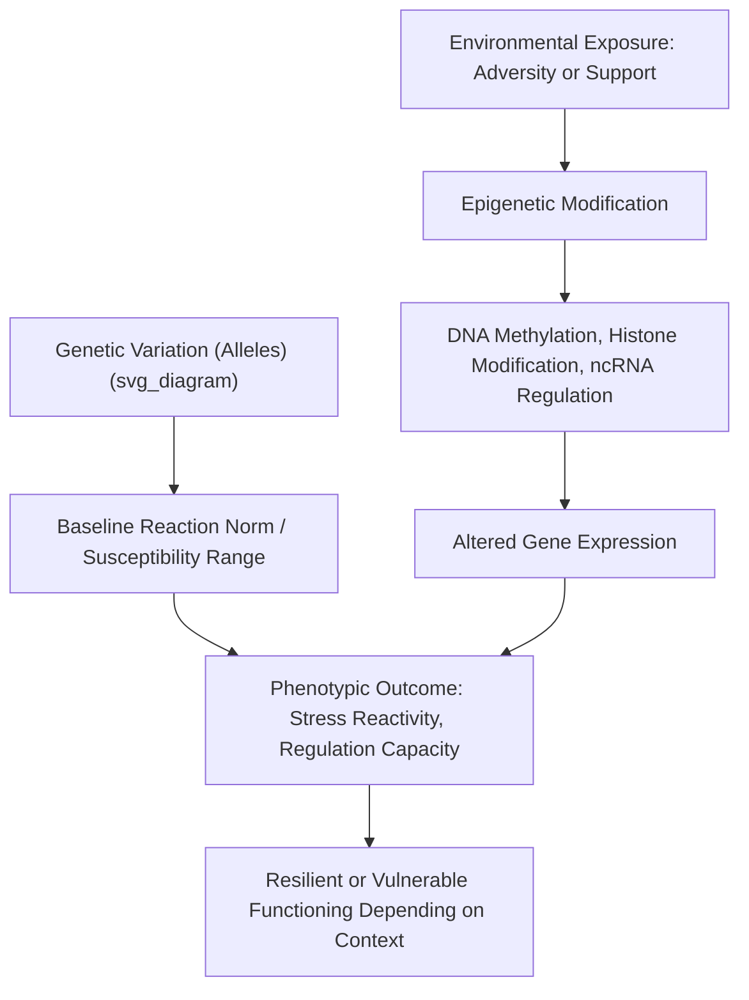

## Genetic and Epigenetic Contributions to Resilience

### Overview

Genetic and epigenetic research examines how heritable DNA sequence variation and environmentally responsive modifications to gene expression jointly shape individual differences in resilience — the capacity to maintain or regain adaptive functioning following adversity. Rather than positioning genes as deterministic blueprints, contemporary resilience genetics emphasizes **gene-by-environment (G×E) interaction** and **epigenetic plasticity**, framing genetic factors as probabilistic influences on susceptibility and regulatory capacity that are substantially shaped by developmental and environmental context.

### Foundational Distinction: Genetics vs. Epigenetics

| Domain | Definition | Key Feature |
| --- | --- | --- |
| Genetics | DNA sequence variation (alleles, polymorphisms) inherited from parents | Fixed at conception; does not change across the lifespan |
| Epigenetics | Chemical modifications regulating gene expression without altering the underlying DNA sequence | Dynamic; responsive to environment, development, and experience; can occur across the lifespan |

**Key Points**

- Genetic variation sets a *range* of possible phenotypic responses (a "reaction norm"), not a fixed outcome; epigenetic and environmental factors substantially determine where within that range an individual's actual functioning falls.
- Epigenetic marks can, in principle, be modified by later intervention or changed environmental conditions, offering a biological basis for the premise that resilience-promoting experiences can produce genuine, lasting biological change — not merely symptom management.

### Core Epigenetic Mechanisms

**DNA Methylation**

- Addition of a methyl group to cytosine bases, typically at CpG sites; generally associated with gene silencing/reduced expression when occurring in gene promoter regions.
- The most extensively studied epigenetic mechanism in human resilience and early-adversity research due to relative measurement stability and feasibility using peripheral tissue (blood, saliva) as a proxy.

**Histone Modification**

- Chemical modifications (acetylation, methylation, phosphorylation) to histone proteins around which DNA is wound, altering chromatin structure and thereby gene accessibility for transcription.
- Histone acetylation generally loosens chromatin structure, promoting gene expression; deacetylation generally has the opposite effect.

**Non-Coding RNA Regulation**

- MicroRNAs (miRNAs) and other non-coding RNA molecules that regulate gene expression post-transcriptionally, increasingly studied in relation to stress-response gene regulation.

$$\text{Environmental Exposure} \rightarrow \text{Epigenetic Modification (e.g., DNA Methylation)} \rightarrow \text{Altered Gene Expression} \rightarrow \text{Phenotypic Outcome}$$

### Foundational Human Gene-by-Environment Interaction Studies

**5-HTTLPR and Depression Risk (Caspi et al., 2003)**

- A landmark study examining the serotonin transporter gene-linked polymorphic region (5-HTTLPR), reporting that individuals carrying the short allele showed elevated depression risk specifically following stressful life events, while long-allele carriers showed relative resilience under the same stress exposure — an early, highly influential candidate G×E finding.
- [Unverified] Subsequent large-scale meta-analyses and replication attempts have produced mixed results for this specific interaction, with some larger, better-powered studies failing to replicate the original effect; this finding is frequently cited in methodological discussions of the broader replication challenges facing candidate-gene G×E research and should be presented with that caveat rather than as an unqualified established fact.

**MAOA and Maltreatment (Caspi et al., 2002)**

- Examined interaction between monoamine oxidase A (MAOA) genotype and childhood maltreatment in predicting later antisocial behavior, reporting that low-MAOA-activity genotype combined with maltreatment predicted elevated antisocial outcomes, while high-activity genotype appeared to buffer this risk.
- Similarly subject to mixed replication in the broader literature, illustrating a recurring pattern in candidate-gene G×E research.

**DRD4 and Parenting Sensitivity (Bakermans-Kranenburg & van IJzendoorn)**

- The dopamine receptor D4 (DRD4) 7-repeat allele has been studied as a "plasticity gene" in multiple experimental intervention studies, with several reporting that carriers show disproportionately larger benefit from randomized positive-parenting interventions (and, in some studies, disproportionately worse outcomes in control/lower-quality environments) — offering some of the stronger experimental (rather than purely observational) support for differential-susceptibility-style G×E effects.

### Methodological Evolution: From Candidate Genes to Polygenic Approaches

**Candidate Gene Studies (Historical Approach)**

- Focused on a small number of biologically plausible genes (e.g., 5-HTTLPR, MAOA, BDNF Val66Met, COMT, DRD4), often in modestly sized samples.
- Widely critiized in later behavioral genetics literature for insufficient statistical power, publication bias favoring positive findings, and inconsistent replication.

**Genome-Wide Association Studies (GWAS)**

- Examine hundreds of thousands to millions of genetic variants simultaneously across very large samples (often tens of thousands to over a million participants), without pre-specifying candidate genes.
- GWAS findings for complex psychological traits, including stress resilience and related phenotypes (depression, PTSD risk), consistently indicate a **highly polygenic architecture** — many genetic variants each contributing very small individual effects, rather than a small number of large-effect "resilience genes."

**Polygenic Risk/Resilience Scores**

- Aggregate the small individual effects of many genetic variants (identified via GWAS) into a single composite score estimating genetic loading for a trait or outcome.
- [Inference] Polygenic scores for psychological resilience-related phenotypes currently explain a relatively modest proportion of outcome variance at the individual level and are considered more useful for population-level research than individual prediction or clinical decision-making at this stage of the field's development.

### Heritability Estimates and Their Interpretation

Twin and family studies estimate that resilience-related traits (stress reactivity, emotional regulation capacity, general psychological resilience measures) show **moderate heritability**, typically in a range commonly reported across behavioral genetics for many psychological traits.

**Key Points**

- Heritability is a population-level statistic describing the proportion of *variance* in a trait attributable to genetic differences *within a specific population and environment* — it is not a statement about the degree to which any individual's resilience is "genetically fixed," nor does it indicate immutability.
- Heritability estimates can shift across different populations and environmental conditions (a phenomenon related to gene-environment interaction itself), meaning a single heritability figure should not be treated as a universal biological constant for the trait.
- The remaining non-genetic variance is typically decomposed into shared environment (experiences common to siblings raised together) and non-shared/unique environment (experiences unique to the individual) — in most psychological trait research, unique environmental factors account for a substantial portion of variance, often comparable to or exceeding genetic contributions.

### Landmark Epigenetic Research: Maternal Care and the Glucocorticoid Receptor Gene

**Meaney and colleagues' rodent research** demonstrated that variation in naturally occurring maternal licking/grooming behavior in rat pups was associated with differential DNA methylation of the glucocorticoid receptor (GR) gene promoter in the hippocampus:

- Pups receiving high levels of maternal licking/grooming showed lower methylation at the GR promoter, higher GR expression, and more efficient HPA axis negative feedback (lower stress reactivity) in adulthood.
- Pups receiving low levels of maternal care showed the opposite pattern — a foundational demonstration that early social experience can produce lasting, biologically embedded epigenetic change with functional consequences for stress regulation.
- Critically, this research also demonstrated **reversibility**: cross-fostering pups to differently behaving mothers, or pharmacological intervention (e.g., histone deacetylase inhibitors), could reverse the methylation pattern and associated stress-reactivity phenotype — direct evidence that epigenetic marks are not permanently fixed.

**Human Translational Research**

- Studies examining the human homologous gene (*NR3C1*, the glucocorticoid receptor gene) have reported associations between early-life adversity/maltreatment and altered methylation patterns in some human samples (including a widely cited postmortem study examining suicide victims with and without histories of childhood abuse).
- [Inference] Human epigenetic research in this domain generally shows a consistent qualitative direction of association with the animal literature but with smaller, more variable effect sizes, reliance on peripheral tissue as an imperfect proxy for brain tissue methylation patterns, and greater difficulty establishing causal directionality than is possible in controlled animal experiments.

### Practical / Applied Example

**Scenario**: A research team investigates whether a home-visiting parenting intervention for at-risk families produces measurable epigenetic change alongside behavioral outcomes.

1. **Baseline sampling**: Buccal or saliva DNA samples are collected from participating children at intervention entry, alongside standard measures of caregiving quality, child stress reactivity (e.g., cortisol reactivity), and behavioral adjustment.
2. **Randomization**: Families are randomized to receive the home-visiting intervention (focused on responsive, sensitive caregiving skills) versus a waitlist control condition.
3. **Post-intervention sampling**: DNA methylation at candidate stress-regulation genes (e.g., *NR3C1*, *FKBP5* — a gene involved in glucocorticoid receptor sensitivity and frequently studied in trauma/PTSD epigenetic research) is reassessed following intervention completion.
4. **Multi-level outcome analysis**: Researchers examine whether methylation changes correlate with, and plausibly mediate, observed improvements in behavioral and physiological stress-regulation outcomes — while appropriately treating peripheral-tissue epigenetic findings as informative biomarkers rather than direct measures of brain-level epigenetic change.
5. **Interpretive caution**: Given the field's history of underpowered candidate-gene studies, researchers pre-register hypotheses, use adequately powered samples, and report effect sizes transparently to avoid contributing to the replication difficulties documented elsewhere in this literature.

### Critiques and Open Debates

- **Replication crisis in candidate-gene G×E research**: A substantial portion of foundational G×E findings in resilience-relevant psychiatric genetics (5-HTTLPR, MAOA) have faced serious replication challenges in larger, better-powered subsequent studies, leading much of the field to shift toward genome-wide and polygenic approaches.
- **Peripheral tissue as a proxy problem**: Most human epigenetic research relies on blood, saliva, or buccal cells as accessible proxies for methylation patterns of interest, which may not accurately reflect epigenetic states in relevant brain tissue — a significant and frequently acknowledged limitation.
- **Correlational, not causal, human evidence**: Human epigenetic association studies are almost entirely observational; establishing that a specific epigenetic mark causally mediates the relationship between early adversity and later outcome (rather than being a correlated but non-causal marker) remains difficult to demonstrate directly in humans.
- **Risk of genetic determinism in public communication**: Popular science coverage of resilience genetics research has at times overstated the deterministic implications of specific "risk genes" or "resilience genes," when the underlying science more accurately describes small-effect, highly polygenic, and environmentally contingent influences.
- **Equifinality and multifinality**: Similar genetic/epigenetic profiles can be associated with divergent outcomes depending on environmental context (equifinality reversed — multifinality), and different genetic profiles can converge on similar outcomes (equifinality), underscoring that genetic/epigenetic factors operate probabilistically within a broader developmental system rather than deterministically.

### Relevance to Positive Psychology and Resilience

- Genetic and epigenetic research provides the **biological grounding for differential susceptibility theory** — demonstrating plausible molecular mechanisms (e.g., plasticity-gene variants, differential methylation patterns) through which some individuals show heightened responsiveness to both adverse and supportive environments.
- The **reversibility of epigenetic marks** demonstrated in foundational animal research offers a scientifically grounded basis for optimism in resilience-building intervention — early biological embedding of adversity is not necessarily permanent, and supportive environmental change retains the potential to produce genuine biological, not merely behavioral, change.
- This research reinforces the core positive psychology and resilience science premise that **biology and environment are bidirectionally interactive**, moving decisively away from older "nature versus nurture" framings toward integrated gene-environment models that credit both hereditary and environmental/intervention-based pathways to resilient functioning.
- Polygenic and epigenetic findings collectively support a **population-level, probabilistic framing of risk and resilience** rather than individual deterministic prediction, aligning with resilience science's broader emphasis on modifiable protective factors and intervention potential over fixed trait-based prognosis.

### Related Topics

- Differential susceptibility and biological sensitivity to context
- The HPA axis and the neurobiology of the stress response
- Neuroplasticity and its role in resilient adaptation
- Adverse Childhood Experiences (ACEs) and biological embedding
- Meaney's maternal care research and glucocorticoid receptor methylation
- Polygenic risk scores in psychiatric and behavioral genetics
- FKBP5 and trauma/PTSD-related epigenetic research
- Gene-by-environment interaction methodology and statistical criteria