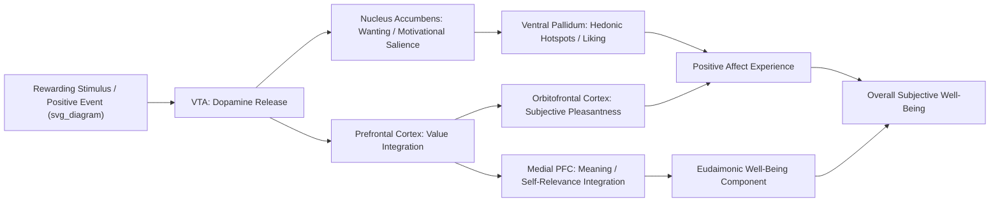

## Neural Correlates of Positive Affect and Well-Being

### Overview

Neuroscientific research on positive affect and well-being examines the specific brain structures, circuits, and neurochemical systems associated with subjective experiences of pleasure, contentment, motivation, and eudaimonic flourishing. This research complements the historically dominant focus on negative-affect and threat-related neurocircuitry (fear, stress, HPA axis), establishing that positive affect and well-being are supported by at least partially dissociable neural systems rather than being merely the absence of negative-affect activation — a foundational premise for affective neuroscience approaches within positive psychology.

### Foundational Theoretical Distinctions

**Hedonic vs. Eudaimonic Well-Being**

- **Hedonic well-being** — subjective well-being centered on pleasure, positive emotion, and life satisfaction (closely tied to Bentham-derived utilitarian traditions and Diener's subjective well-being research).
- **Eudaimonic well-being** — well-being centered on meaning, purpose, self-actualization, and psychological functioning (rooted in Aristotelian tradition; operationalized in frameworks such as Ryff's Psychological Well-Being model).
- [Inference] While behavioral and self-report research clearly distinguishes these constructs, the degree to which they are supported by fully dissociable versus substantially overlapping neural systems remains an active area of investigation, with some neuroimaging studies reporting distinguishable correlates and others reporting substantial shared neural substrates.

**Approach Motivation vs. Consummatory Pleasure**

- A key distinction in affective neuroscience separates **"wanting"** (incentive salience, approach motivation, anticipatory drive toward reward) from **"liking"** (the actual hedonic pleasure experienced upon reward consumption) — a distinction developed extensively by Kent Berridge and colleagues, demonstrating these processes are supported by at least partially separable neural mechanisms.

### Key Neural Structures and Circuits

| Structure | Role in Positive Affect/Well-Being |
| --- | --- |
| Ventral striatum (including nucleus accumbens) | Reward anticipation ("wanting"), motivational salience, dopaminergic reward signaling |
| Ventral pallidum | Contains "hedonic hotspots" implicated in consummatory pleasure ("liking") in animal models |
| Orbitofrontal cortex (OFC) | Reward valuation, integration of sensory and hedonic information, subjective pleasantness coding |
| Medial prefrontal cortex (mPFC) | Self-referential processing, integration of reward value with broader self-concept and meaning |
| Left prefrontal cortex (particularly dorsolateral, relative to right) | Approach-motivation and positive affect, per asymmetry research |
| Anterior insula | Interoceptive awareness, subjective feeling states |
| Amygdala | Traditionally threat-associated, but also implicated in processing of positively valenced, high-salience stimuli |

**The Mesolimbic Dopamine Pathway**

- The primary reward circuit, projecting from the ventral tegmental area (VTA) to the nucleus accumbens and prefrontal cortex.
- Dopamine release in this pathway is most strongly associated with reward *prediction* and *anticipation* (the "wanting" component) rather than the consummatory pleasure experience itself — a distinction with substantial support from animal lesion and pharmacological manipulation studies.

### Frontal Asymmetry and Approach-Related Positive Affect

**Davidson's Asymmetry Research**

- Richard Davidson's extensive EEG-based research program established that relatively greater **left prefrontal cortical activation** (compared to right) is associated with approach-motivated positive affect, extraversion, and trait positive emotionality, while relatively greater right prefrontal activation is associated with withdrawal-motivated negative affect (though the association with negative affect specifically, versus withdrawal motivation more broadly, has been refined in later work).
- This asymmetry has been proposed as a trait-like individual difference marker (a "affective style" or "hedonic set point" indicator) with some evidence of relative stability over time, alongside evidence that it can shift with intervention (e.g., mindfulness training studies reporting leftward shifts in frontal asymmetry).
- [Inference] The frontal asymmetry literature, while historically influential, has faced some replication and methodological critique in subsequent EEG research regarding measurement reliability and the specificity of the approach/withdrawal interpretation; findings should be considered well-established at a broad programmatic level but with appropriate caution regarding specific effect sizes in any single study.

### Neurochemical Systems Associated With Positive Affect

| Neurotransmitter/Hormone | Primary Association |
| --- | --- |
| Dopamine | Reward anticipation, motivation, incentive salience |
| Serotonin | Mood regulation, satiety-related contentment; target of most antidepressant pharmacology |
| Endogenous opioids (endorphins, enkephalins) | Consummatory pleasure, "liking," pain modulation |
| Oxytocin | Social bonding, trust, affiliative positive affect |
| Endocannabinoids | Mood regulation, exercise-induced positive affect (implicated in "runner's high," alongside endorphins) |
| GABA | Anxiolytic effects, contributing indirectly to positive affective states via reduced negative affect |

**Key Points**

- No single neurotransmitter is a simple "happiness chemical" — each system contributes to specific components of the broader positive affect and reward process (e.g., dopamine for anticipation/motivation, opioids for consummatory pleasure), and popular oversimplifications (e.g., labeling dopamine as "the pleasure chemical") do not accurately reflect the "wanting" versus "liking" distinction established in the neuroscience literature.
- Oxytocin's role is most robustly linked to social affiliative bonding contexts specifically, rather than positive affect broadly, and effects appear substantially moderated by social context and individual differences.

### Neuroimaging Findings on Meaning and Eudaimonic Well-Being

- Research contrasting hedonic and eudaimonic experimental conditions (e.g., studies by Barbara Fredrickson and colleagues examining "eudaimonic" versus purely "hedonic" positive affect) has reported differential patterns of gene expression related to inflammatory and antiviral immune signaling (the **Conserved Transcriptional Response to Adversity, CTRA** framework) — an area connecting affective neuroscience to psychoneuroimmunology.
- [Unverified] This specific gene-expression research (sometimes referenced under the label "hedonic well-being is associated with a pattern resembling adversity") has generated substantial scientific debate, including published critiques regarding statistical methodology and replication; it should be treated as a contested and actively debated finding rather than an established consensus result.
- Meaning-related processing is consistently associated with medial prefrontal cortex and default mode network activity, implicated in self-referential thought, autobiographical meaning-making, and narrative identity integration.

### Broaden-and-Build Theory: A Neuroscience-Relevant Framework

Barbara Fredrickson's **broaden-and-build theory** proposes that positive emotions broaden momentary attentional and cognitive scope (in contrast to the narrowing effect of negative emotions/fear), which over time builds durable psychological, social, and physical resources.

- Behavioral and some neuroimaging evidence supports the "broadening" component — positive affect induction is associated with wider attentional breadth and more flexible, exploratory cognitive processing, plausibly relatable to reduced amygdala-driven threat-narrowing and increased prefrontal exploratory engagement.
- [Inference] The precise neural mechanisms underlying the proposed "broadening" effect are still being elaborated; much of the behavioral evidence for broaden-and-build precedes, and is more extensive than, direct neuroimaging confirmation of its proposed neural substrates.

### Resting-State and Network-Level Research

- **Default Mode Network (DMN)**: Implicated in self-referential processing, mind-wandering, and autobiographical meaning-making; altered DMN connectivity patterns have been examined in relation to rumination (a negative-affect-associated DMN pattern) versus adaptive self-reflection relevant to eudaimonic meaning-making.
- **Salience Network**: Involving the anterior insula and anterior cingulate cortex, implicated in detecting and orienting attention toward personally relevant (including positively valenced) stimuli.
- **Frontoparietal Control Network**: Implicated in cognitive control processes relevant to emotion regulation strategies (e.g., cognitive reappraisal) that support sustained positive affect and well-being.

### Practical / Applied Example

**Scenario**: A research team designs an fMRI study examining whether a gratitude journaling intervention produces measurable neural changes associated with well-being.

1. **Baseline neuroimaging**: Participants undergo resting-state fMRI and a reward-processing task (e.g., a monetary incentive delay task assessing ventral striatal reward anticipation response) prior to intervention.
2. **Intervention period**: Participants complete a structured multi-week gratitude journaling practice, compared against a neutral daily-activity-logging control condition.
3. **Post-intervention neuroimaging**: The same resting-state and reward-task protocols are repeated, examining changes in ventral striatal reward anticipation signal, medial prefrontal activity during self-referential gratitude-related stimuli, and resting-state connectivity within reward and default mode networks.
4. **Self-report integration**: Neural changes are examined alongside validated well-being self-report measures (e.g., subjective well-being scales, psychological well-being scales capturing eudaimonic dimensions) to assess convergence between neural and subjective indices, since neural activation patterns alone cannot be assumed to map one-to-one onto subjective experience without corroborating self-report.
5. **Interpretive caution**: Given known challenges of fMRI reproducibility in affective neuroscience (small sample sizes historically common in this literature, flexibility in analytic pipelines), researchers pre-register analysis plans and report effect sizes with appropriate confidence intervals rather than over-interpreting single-study findings.

### Critiques and Methodological Considerations

- **Reverse inference problem**: A substantial portion of affective neuroscience research risks "reverse inference" — inferring a specific psychological state (e.g., "happiness") purely from activation in a region like the ventral striatum, when that region is implicated in many motivationally salient states beyond positive affect specifically; well-designed studies use task contrasts and multivariate approaches to mitigate this risk, but caution is warranted when interpreting single-region findings.
- **Small sample sizes and reproducibility**: Affective neuroimaging studies, particularly earlier work, often used modest sample sizes relative to the effect sizes typically observed in individual-differences neuroscience, contributing to a broader reproducibility discussion within social/affective neuroscience.
- **Animal-to-human translation**: Much of the foundational "wanting versus liking" and hedonic hotspot research derives from rodent models with direct neurochemical manipulation and lesion studies not feasible in human research; human evidence relies more heavily on correlational neuroimaging.
- **Conflation of distinct well-being constructs**: Studies do not always clearly distinguish hedonic from eudaimonic well-being constructs when reporting neural correlates, and effect specificity to one construct versus the other should be evaluated critically on a study-by-study basis rather than assumed.

### Relevance to Positive Psychology and Resilience

- This research substantiates positive psychology's foundational premise that positive affect and well-being are not merely the *absence* of psychopathology-related negative-affect processing, but are supported by identifiable, at least partially dissociable neural systems worthy of independent scientific study — directly paralleling Seligman's argument for a "positive psychology" distinct from deficit-focused clinical psychology.
- The dopaminergic "wanting" versus opioid-related "liking" distinction offers a scientifically grounded caution against equating engagement/motivation (Seligman's PERMA "Engagement" pillar) with actual experienced pleasure, suggesting well-being interventions should attend to both anticipatory and consummatory components of positive experience.
- Broaden-and-build theory's proposed neural substrates provide a plausible mechanistic bridge explaining how momentary positive emotion inductions (a common focus of positive psychology interventions, e.g., gratitude practices, savoring exercises) could plausibly translate into durable resource-building relevant to long-term resilience, though direct neural confirmation of this translational pathway remains an active research frontier.
- Frontal asymmetry and related affective neuroscience markers offer potential objective, biologically grounded outcome measures for evaluating well-being and resilience interventions, complementing traditional self-report methodology.

### Related Topics

- Broaden-and-build theory of positive emotions (Fredrickson)
- Wanting versus liking: dopamine and opioid systems in reward processing
- Frontal EEG asymmetry and approach/withdrawal motivation (Davidson)
- Hedonic versus eudaimonic well-being frameworks
- Default mode network and self-referential/meaning-making processing
- Neuroplasticity and its role in resilient adaptation
- Mindfulness-based interventions and affective neuroscience outcomes
- Psychoneuroimmunology and the CTRA framework