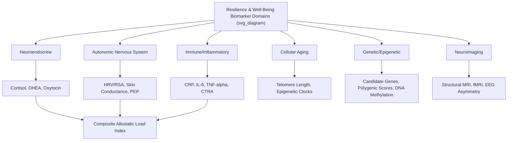

## Biomarkers Used in Resilience and Well-Being Research

### Overview

Biomarkers in resilience and well-being research are objectively measurable biological indicators used to complement self-report data, providing convergent physiological evidence for psychological constructs and enabling investigation of mechanistic pathways linking adversity, protective factors, and health outcomes. This field spans neuroendocrine, autonomic, immune, genetic/epigenetic, and neuroimaging measures, each offering distinct methodological strengths, limitations, and appropriate use cases.

### Rationale for Biomarker Use in Resilience Research

- **Convergent validation**: Biomarkers provide an independent, objective data stream to corroborate (or challenge) self-report measures of stress, resilience, and well-being, addressing concerns about reporting bias, social desirability, and limited introspective access to physiological states.
- **Mechanistic pathway elucidation**: Biomarkers allow researchers to test proposed biological mechanisms (e.g., whether social support "gets under the skin" via HPA axis attenuation) rather than relying solely on correlational self-report associations.
- **Early/preclinical detection**: Certain biomarkers may detect physiological dysregulation before it manifests as clinically significant psychological or physical symptoms, offering potential for earlier intervention.
- **Objective intervention outcome measures**: Biomarkers provide outcome measures less susceptible to expectancy or demand-characteristic effects than self-report, strengthening intervention research designs.

**Key Points**

- No single biomarker is considered a definitive or standalone index of resilience; the field consistently emphasizes multi-system, composite approaches (e.g., allostatic load indices) over reliance on isolated measures.
- Biomarker-self-report correspondence is often modest rather than strong, reflecting that subjective experience and physiological state are related but non-identical constructs — a persistent methodological consideration across this research domain.

### Neuroendocrine Biomarkers

**Cortisol**

- The most extensively used neuroendocrine biomarker in stress and resilience research, reflecting HPA axis activity.
- **Measurement modalities**:
  - *Salivary cortisol* — non-invasive, reflects free (unbound) cortisol, widely used for repeated sampling (e.g., cortisol awakening response protocols).
  - *Serum/plasma cortisol* — reflects total cortisol (bound + unbound), typically requires venipuncture, more common in clinical/inpatient settings.
  - *Urinary free cortisol* — reflects cumulative cortisol output over the collection period (commonly 24 hours).
  - *Hair cortisol concentration* — reflects cumulative cortisol exposure over preceding weeks to months (based on hair growth rate assumptions), increasingly used as a retrospective chronic-stress index resistant to acute situational confounds affecting single-timepoint measures.
- **Common indices derived from repeated sampling**: Cortisol awakening response (CAR), diurnal slope (rate of decline from morning peak to evening nadir), and area-under-the-curve (AUC) measures capturing total output or reactivity-recovery dynamics.

**DHEA and DHEA-S (Dehydroepiandrosterone / Sulfate)**

- An adrenal steroid often examined alongside cortisol; some research frames the cortisol/DHEA ratio as an index of "anabolic versus catabolic" balance, with relatively higher DHEA proposed as a potential resilience-associated counter-regulatory hormone, though this framework has a more limited and mixed evidence base than cortisol research alone.

**Oxytocin**

- Measured via plasma, salivary, or (less commonly and with greater measurement controversy) cerebrospinal fluid assays; examined in relation to social bonding, trust, and affiliative buffering of stress responses.
- [Unverified] Peripheral (blood/saliva) oxytocin measurement as a valid proxy for central nervous system oxytocin activity has been a subject of significant methodological debate in the field; findings using peripheral oxytocin assays should be interpreted with this measurement validity caveat in mind.

### Autonomic Nervous System Biomarkers

| Biomarker | System Reflected | Common Use in Resilience Research |
| --- | --- | --- |
| Heart rate variability (HRV), particularly respiratory sinus arrhythmia (RSA) | Parasympathetic/vagal tone | Index of self-regulatory capacity; higher resting HRV associated with better emotion regulation and stress recovery, per Porges' polyvagal theory and related frameworks |
| Skin conductance response (SCR)/electrodermal activity (EDA) | Sympathetic arousal | Index of physiological arousal/reactivity to stressors |
| Pre-ejection period (PEP) | Sympathetic (cardiac) activity | Cardiac sympathetic reactivity index, often paired with RSA to capture combined autonomic balance |
| Blood pressure and heart rate reactivity | Combined sympathetic/cardiovascular | General stress reactivity indices in laboratory challenge paradigms |

**Vagal Tone and the Polyvagal Framework**

- Stephen Porges' polyvagal theory proposes that vagally mediated heart rate variability indexes a physiological substrate for social engagement and self-regulatory capacity, with higher resting vagal tone associated with better emotion regulation, social engagement capacity, and stress recovery.
- [Inference] While resting HRV as a general index of self-regulatory capacity has substantial empirical support across the broader psychophysiology literature, some of polyvagal theory's more specific structural claims (e.g., the precise "neuroception" and hierarchical polyvagal response ordering) remain more theoretically contested within the physiology and neuroscience research community than the general HRV-regulation association itself.

### Immune and Inflammatory Biomarkers

| Biomarker | Description | Relevance |
| --- | --- | --- |
| C-reactive protein (CRP) | Acute-phase inflammatory marker | Elevated with chronic stress; component of allostatic load indices |
| Interleukin-6 (IL-6) | Pro-inflammatory cytokine | Associated with chronic stress, depression risk; central to psychoneuroimmunology research |
| Tumor necrosis factor-alpha (TNF-α) | Pro-inflammatory cytokine | Similar stress/depression associations as IL-6 |
| Conserved Transcriptional Response to Adversity (CTRA) | Gene expression pattern reflecting upregulated inflammatory and downregulated antiviral gene expression | Proposed molecular signature linking chronic stress/social adversity to health risk; an actively debated area of research |

[Inference] The CTRA gene-expression framework (associated primarily with Steve Cole and colleagues) has generated both substantial interest and significant methodological critique regarding statistical approach and replication; it represents a genuinely contested area of the psychoneuroimmunology literature rather than a settled biomarker framework, and findings using this specific approach should be presented with that context.

### Telomere Length and Cellular Aging Biomarkers

- **Telomere length**: Protective DNA-protein caps at chromosome ends that shorten with each cell division; shorter telomere length has been associated with chronic psychosocial stress exposure and is proposed as a marker of accelerated cellular aging.
- **Telomerase activity**: The enzyme responsible for telomere maintenance; some intervention research examines whether stress-reduction interventions (e.g., mindfulness-based programs) are associated with increased telomerase activity.
- **Epigenetic clocks** (e.g., Horvath clock, GrimAge, PhenoAge): Composite DNA methylation-based algorithms estimating "biological age" as distinct from chronological age; increasingly used in resilience and life-course adversity research as an integrative aging biomarker.
- [Inference] While telomere-stress associations are among the more replicated findings in this domain at a population level, individual-level telomere length measurement is subject to substantial measurement variability across labs and assay methods, and effect sizes for specific psychosocial predictors are generally modest — caution is warranted against overinterpreting single-study or individual-level telomere findings.

### Genetic and Epigenetic Biomarkers

- **Candidate gene polymorphisms** (e.g., 5-HTTLPR, BDNF Val66Met, FKBP5, DRD4) — historically prominent, now understood to require cautious interpretation given documented replication challenges.
- **Polygenic scores** — aggregate genome-wide variant effects into composite risk/resilience indices, increasingly favored over single candidate-gene approaches for their improved statistical robustness, though still explaining modest outcome variance individually.
- **DNA methylation at specific loci** (e.g., *NR3C1*, *FKBP5*) — used as biomarkers of biological embedding of early adversity, typically measured in peripheral blood or saliva as a proxy.

### Neuroimaging Biomarkers

- **Structural MRI**: Gray matter volume/cortical thickness in regions such as hippocampus, prefrontal cortex, and amygdala, examined in relation to chronic stress exposure and resilience-promoting interventions (e.g., mindfulness training).
- **Functional MRI (fMRI)**: Task-based activation (e.g., reward-task ventral striatal response, emotion-regulation task prefrontal-amygdala connectivity) and resting-state functional connectivity, used to examine circuit-level correlates of well-being and stress regulation.
- **EEG-based measures**: Frontal alpha asymmetry (approach/withdrawal motivational style), event-related potentials examining attentional and emotional processing.

### Practical / Applied Example: Multi-Biomarker Study Design

**Scenario**: A research team designs a comprehensive biomarker panel to evaluate a community resilience-building program for adolescents exposed to chronic community stress.

1. **Panel selection rationale**: Rather than relying on a single biomarker, the team selects a multi-system panel: salivary cortisol (CAR and diurnal slope), resting HRV, CRP and IL-6, and hair cortisol (for retrospective chronic exposure index) — reflecting the field's consensus that composite, multi-system assessment better captures the construct than any single measure.
2. **Standardized collection protocol**: Saliva samples are collected at standardized times relative to waking to control for circadian confounds; participants are screened for exclusion criteria (current corticosteroid medication use, acute illness, recent significant dental work affecting saliva composition).
3. **Baseline and follow-up timing**: Given that some biomarkers (hair cortisol, epigenetic measures) reflect cumulative, slow-changing processes while others (acute cortisol reactivity, HRV) can shift more rapidly, the study designs differentiated follow-up windows appropriate to each biomarker's expected timescale of change.
4. **Self-report integration**: Biomarker data is analyzed alongside validated self-report resilience and well-being measures, examining convergence rather than assuming any single biomarker serves as a "gold standard" superior to self-report.
5. **Confound control**: Statistical models account for known confounds including medication use, BMI, smoking status, sleep patterns, and time of sample collection, all of which can independently affect multiple biomarkers in the panel.

### Methodological Considerations Across Biomarker Domains

- **Circadian and situational confounds**: Many biomarkers (cortisol especially) show substantial time-of-day variation requiring careful protocol standardization.
- **Peripheral-to-central inference limits**: Blood, saliva, and hair-based biomarkers are peripheral proxies; their correspondence to central nervous system states of primary theoretical interest is generally assumed rather than directly verified in most human studies.
- **Individual difference confounds**: Medication use (corticosteroids, hormonal contraceptives, beta-blockers, SSRIs), BMI, smoking, and chronic illness independently influence many of these biomarkers and require systematic assessment and control.
- **Cost and feasibility trade-offs**: More granular or cutting-edge biomarkers (e.g., epigenetic clocks, comprehensive cytokine panels) often carry substantially higher cost and technical complexity than simpler measures (e.g., salivary cortisol, HRV), influencing feasibility for large-sample or resource-limited studies.
- **Effect size expectations**: [Inference] Across most domains reviewed here, individual biomarker associations with specific psychosocial predictors or outcomes tend to be modest in magnitude at the individual level; biomarkers are generally most informative in aggregate, multi-system, or population-level analyses rather than as standalone individual predictive tools.

### Relevance to Positive Psychology and Resilience

- Biomarker research operationalizes the premise, central to a biologically integrated resilience science, that psychological well-being and adversity exposure produce measurable physiological signatures — supporting resilience science's broader move toward multi-method (self-report plus physiological) assessment.
- Biomarkers provide objective outcome measures for evaluating positive-psychology interventions (gratitude practices, mindfulness, positive parenting programs), strengthening the evidentiary base beyond self-report alone and supporting translational health policy arguments for well-being-focused intervention.
- The consistent emphasis on multi-system, composite biomarker approaches (rather than single "resilience biomarkers") reflects and reinforces resilience science's broader theoretical commitment to viewing resilience as a multi-determined, systems-level phenomenon rather than a single trait or mechanism.
- Biomarker findings supporting the reversibility of stress-related physiological dysregulation (e.g., HRV improvement, cortisol pattern normalization following intervention) provide concrete, biologically grounded evidence supporting hope and motivation in applied resilience-building practice.

### Related Topics

- The HPA axis and the neurobiology of the stress response
- Allostasis and allostatic load
- Genetic and epigenetic contributions to resilience
- Neural correlates of positive affect and well-being
- Polyvagal theory and heart rate variability research
- Psychoneuroimmunology and the CTRA framework
- Epigenetic clocks and biological aging research
- Telomere biology and psychosocial stress