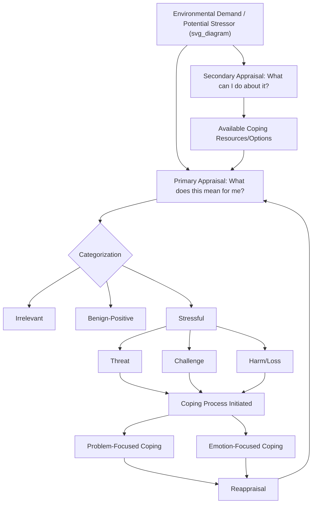

## Lazarus and Folkman's Cognitive Appraisal Model of Stress

### Overview

Richard Lazarus and Susan Folkman's transactional model of stress and coping (formally articulated in their 1984 work *Stress, Appraisal, and Coping*) represents a foundational paradigm shift in stress theory, moving away from purely stimulus-based (stressor-focused) and response-based (physiological reaction-focused) models toward a **transactional** framework in which stress is understood as arising from the dynamic relationship between an individual and their environment, mediated centrally by cognitive appraisal. This model remains one of the most widely cited and applied frameworks in coping and resilience research.

### Theoretical Departure From Earlier Stress Models

**Prior Dominant Models**

- **Stimulus-based models** (e.g., Holmes and Rahe's Social Readjustment Rating Scale) — treated stress as an objective property of external events, ranked by presumed universal severity (e.g., life-event checklists), with individual reactions treated as relatively uniform.
- **Response-based models** (e.g., Hans Selye's General Adaptation Syndrome) — defined stress primarily as a nonspecific physiological response pattern to any demand, regardless of the demand's psychological meaning to the individual.

**The Transactional Innovation**

- Lazarus and Folkman argued that neither approach adequately accounted for the substantial individual variability observed in response to ostensibly similar events — the same objective event (e.g., a job loss) could be experienced as devastating by one person and as a manageable, even opportunity-laden, challenge by another.
- Their model positions stress not as residing purely "in the environment" or purely "in the person," but as emerging from the **transaction** between the two, centrally shaped by how the individual cognitively appraises the situation relative to their own resources and well-being.

**Key Points**

- The transactional model treats the person-environment relationship as **dynamic and bidirectional** — appraisals can change over the course of an encounter as new information emerges or as coping efforts themselves alter the situation, rather than being fixed at the moment of initial stressor onset.
- Stress, in this framework, is formally defined as occurring when environmental demands are appraised as **taxing or exceeding the individual's perceived resources**, and as endangering their well-being.

### The Two-Stage Appraisal Process

**Primary Appraisal**

The initial evaluative process addressing the question: *"What does this situation mean for my well-being?"* Primary appraisal categorizes the encounter into one of several types:

1. **Irrelevant** — the situation has no implications for the individual's well-being; no further stress-related processing occurs.
2. **Benign-positive** — the situation is appraised as having a positive implication for well-being (associated with positive emotions such as joy or relief, rather than stress per se).
3. **Stressful** — subdivided into three further categories:
   - **Harm/loss** — damage has already occurred (e.g., a loss already sustained).
   - **Threat** — anticipated harm or loss that has not yet occurred but is expected.
   - **Challenge** — the situation is appraised as difficult but with potential for growth, mastery, or gain, typically associated with more adaptive emotional and coping profiles than threat appraisals of an objectively similar situation.

**Secondary Appraisal**

A concurrent or subsequent evaluative process addressing the question: *"What can I do about this situation?"* — an assessment of available coping resources and options, including:

- Which coping strategies are available.
- The likelihood that a given strategy will accomplish what is needed.
- The likelihood that the individual can effectively execute a given strategy (conceptually overlapping with Bandura's self-efficacy construct).

**Key Points**

- Despite the numbering, primary and secondary appraisal are not necessarily sequential in a strict temporal sense — they interact and can co-occur, with secondary appraisal of coping resources capable of influencing the primary appraisal of threat versus challenge (e.g., confidence in one's coping resources can shift an initially threat-appraised situation toward a challenge appraisal).
- The **threat-versus-challenge distinction** has become one of the most influential and widely applied elements of the model, extensively used in later psychophysiological research (e.g., the Biopsychosocial Model of Challenge and Threat, Blascovich & Tomaka) linking these appraisal types to distinct cardiovascular reactivity patterns.

### Coping: The Model's Second Central Component

Lazarus and Folkman define coping as **"constantly changing cognitive and behavioral efforts to manage specific external and/or internal demands that are appraised as taxing or exceeding the resources of the person."**

**Two Broad Coping Function Categories**

1. **Problem-focused coping** — efforts directed at managing or altering the source of stress itself (the problem), typically more prominent when the situation is appraised as controllable/amenable to action. Examples: information-seeking, planning, direct action to resolve the stressor, conflict resolution.
2. **Emotion-focused coping** — efforts directed at regulating the emotional distress associated with the situation, typically more prominent when the situation is appraised as relatively uncontrollable. Examples: cognitive reappraisal/reframing, emotional expression/venting, seeking emotional social support, distancing, avoidance, denial, positive reinterpretation.

**Key Points**

- Most real-world coping involves a **combination** of both problem- and emotion-focused strategies deployed flexibly across the course of a stressful encounter, rather than individuals relying exclusively on one category.
- The model explicitly rejects a simple "good coping vs. bad coping" hierarchy between the two categories — the adaptiveness of a given strategy is context-dependent, contingent on the actual controllability of the situation (problem-focused coping tends to be more adaptive for controllable stressors; emotion-focused coping tends to be more adaptive for genuinely uncontrollable stressors, a "goodness of fit" principle later elaborated in subsequent coping research).

### The Recursive, Process-Oriented Nature of the Model

A defining feature distinguishing the transactional model from earlier trait-based coping frameworks is its emphasis on **coping as a dynamic process** rather than a fixed personal style or trait:

- Appraisals and coping efforts are understood to unfold and change continuously across the duration of a stressful encounter.
- **Reappraisal** — a continuous reassessment of the situation based on new information, including information generated by one's own coping efforts (e.g., successfully managing part of a problem may shift subsequent appraisal from threat toward challenge, or reveal that initial coping efforts are ineffective, prompting strategy change).
- This process orientation directly informed the development of **ecological momentary assessment (EMA)** and diary-based coping research methodologies, which attempt to capture coping as it unfolds in real time rather than relying solely on retrospective, trait-style coping questionnaires.

### Measurement Instruments

- **Ways of Coping Questionnaire (WCQ)** (Folkman & Lazarus, 1985/1988) — the primary instrument developed directly from this model, assessing situation-specific coping strategies across subscales (e.g., confrontive coping, distancing, self-controlling, seeking social support, accepting responsibility, escape-avoidance, planful problem-solving, positive reappraisal).
- **COPE Inventory** (Carver, Scheier, & Weintraub, 1989) — a widely used later instrument building on and extending the problem-/emotion-focused framework with additional theoretically derived subscales.
- **Key Points**: A persistent methodological critique of situational coping questionnaires (including the WCQ) concerns retrospective recall bias, since respondents typically report on coping efforts after a stressful episode has concluded, potentially introducing memory distortion or post-hoc rationalization into reported coping strategies.

### Empirical Extensions and Related Frameworks

**Biopsychosocial Model of Challenge and Threat (Blascovich & Tomaka, 1996)**

- Directly builds on Lazarus and Folkman's threat/challenge appraisal distinction, proposing and empirically validating distinct cardiovascular response patterns: challenge appraisals associated with increased cardiac output and decreased/stable vascular resistance, while threat appraisals are associated with increased vascular resistance without corresponding cardiac output increase — providing psychophysiological validation of the cognitive appraisal distinction.

**Coping Flexibility Research**

- Later research building on the transactional model's process orientation emphasizes **coping flexibility** — the capacity to adaptively shift coping strategies based on situational demands — as itself a resilience-relevant individual difference, rather than treating any single coping strategy as universally adaptive.

### Practical / Applied Example

**Scenario**: A workplace stress-management program is designed explicitly using the transactional appraisal-coping framework.

1. **Appraisal assessment and psychoeducation**: Employees are taught to distinguish primary appraisal (what does this situation mean for me) from secondary appraisal (what resources do I have to address it), with explicit training in recognizing threat- versus challenge-framing of the same objective workplace demand (e.g., a challenging new project).
2. **Secondary appraisal resource-building**: Because secondary appraisal of coping resources can shift primary appraisal from threat toward challenge, the program includes skill-building components (time management training, assertive communication skills) explicitly intended to increase employees' perceived and actual coping resource availability.
3. **Matching coping strategy to controllability**: Employees are coached to assess the actual controllability of specific workplace stressors — applying problem-focused strategies (direct negotiation, task restructuring) to genuinely controllable elements, and emotion-focused strategies (cognitive reappraisal, seeking peer support) to less controllable elements (e.g., organizational restructuring decisions beyond individual control).
4. **Ongoing reappraisal check-ins**: The program incorporates brief, repeated check-ins over the course of a stressful project period (rather than only pre/post assessment), consistent with the model's emphasis on stress and coping as an unfolding process rather than a single static event.
5. **Outcome evaluation**: Program effectiveness is evaluated using situational coping measures administered close in time to specific stressful episodes (to reduce retrospective recall bias) alongside standard well-being and burnout outcome measures.

### Critiques and Limitations

- **Measurement challenges**: The heavy reliance on retrospective self-report coping questionnaires introduces recall bias and potential mismatch between reported coping strategies and actual in-the-moment behavior, a persistent methodological concern addressed only partially by later EMA-based approaches.
- **Category overlap and factor structure inconsistency**: Empirical factor-analytic studies of coping questionnaires (including the WCQ) have not always cleanly replicated the clean problem-focused/emotion-focused dichotomy, with some coping strategies loading inconsistently across studies or samples, suggesting the two-category structure may be a useful heuristic simplification rather than a precise empirical taxonomy.
- **Limited attention to social/relational coping in original formulation**: While the original model acknowledges seeking social support as an emotion-focused strategy, later researchers (e.g., relational and communal coping theorists) have argued the original framework underweights coping processes that are inherently interpersonal/dyadic rather than individual, particularly relevant in collectivist cultural contexts.
- **Cultural generalizability**: [Inference] The model's foundational research was developed and validated predominantly in Western, individualist contexts; the relative adaptiveness of problem-focused versus emotion-focused strategies, and the very primary/secondary appraisal distinction itself, may require cultural adaptation and has a less extensive validated evidence base in more collectivist or non-Western populations.

### Relevance to Positive Psychology and Resilience

- The **threat-versus-challenge appraisal distinction** is among the most directly applied concepts from this model within resilience-building interventions, providing a concrete, teachable cognitive-reframing target for building resilient responses to adversity.
- The model's emphasis on **secondary appraisal** (confidence in coping resources) directly connects to self-efficacy and mastery belief research, positioning appraisal-based intervention as a mechanism through which self-efficacy-building translates into altered real-time stress experience.
- The transactional, process-oriented framing supports resilience science's broader move away from viewing resilience as a fixed trait and toward viewing it as a **dynamic, context-responsive process** — directly foreshadowing later dynamic systems approaches to resilience.
- **Cognitive reappraisal**, one of the model's core emotion-focused coping strategies, has become a central target of positive psychology and clinical intervention alike (e.g., cognitive-behavioral therapy, emotion regulation training), with the appraisal model providing much of its original theoretical grounding.

### Related Topics

- Biopsychosocial model of challenge and threat (Blascovich & Tomaka)
- Problem-focused versus emotion-focused coping strategies
- Coping flexibility and goodness-of-fit models
- Self-efficacy and mastery beliefs in resilient functioning
- Cognitive reappraisal and emotion regulation strategies
- Ways of Coping Questionnaire and COPE Inventory
- Ecological momentary assessment in stress and coping research
- Relational and communal coping frameworks