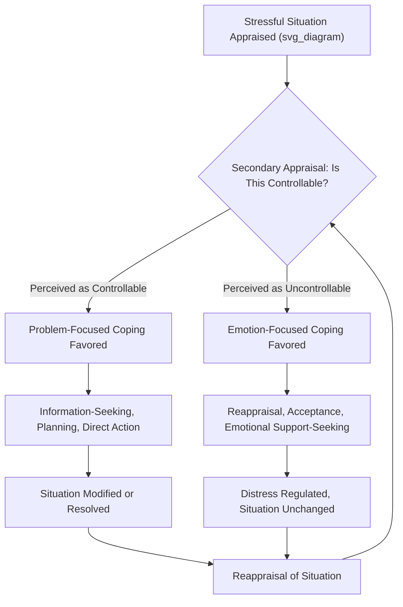

## Problem-Focused Versus Emotion-Focused Coping

### Overview

The problem-focused/emotion-focused distinction, introduced by Richard Lazarus and Susan Folkman as the central coping taxonomy within their transactional model of stress, remains one of the most widely used organizing frameworks for classifying coping strategies in stress and resilience research. The distinction categorizes coping efforts by their primary function — altering the stressful situation itself versus regulating the emotional response to it — and has generated extensive subsequent research examining when each type of coping is most adaptive.

### Core Definitions

**Problem-Focused Coping**

- Coping efforts directed at the source of stress itself, aimed at changing, managing, or eliminating the stressor or the person-environment relationship producing the distress.
- Oriented outward toward the situation, and inward toward the self when the "problem" involves modifying one's own behavior or skills relevant to the stressor.

**Emotion-Focused Coping**

- Coping efforts directed at regulating the emotional distress associated with a stressful situation, without necessarily changing the objective situation itself.
- Encompasses cognitive strategies (reappraisal, acceptance) and behavioral strategies (seeking emotional support, expressing emotion, distraction) aimed at reducing subjective distress.

**Key Points**

- The distinction is functional (defined by the coping effort's *target*, i.e., problem versus emotion), not defined by whether the strategy is behavioral or cognitive — both categories include cognitive and behavioral strategies (e.g., planning is a cognitive problem-focused strategy; venting is a behavioral emotion-focused strategy).
- Real-world coping is typically **mixed and dynamic**: most individuals deploy both types of strategies within a single stressful episode, often shifting emphasis as the situation, available resources, and appraisals evolve over time.

### Representative Strategies Within Each Category

**Problem-Focused Strategies**

- Information/resource-seeking relevant to resolving the stressor
- Planning and generating action alternatives
- Direct action / active confrontation of the problem
- Skill acquisition relevant to managing the stressor
- Negotiation and conflict resolution
- Time management and task restructuring

**Emotion-Focused Strategies**

- Cognitive reappraisal / positive reframing
- Acceptance
- Emotional expression / venting
- Seeking emotional (as opposed to instrumental) social support
- Distancing / cognitive avoidance
- Denial
- Wishful thinking / escape-avoidance fantasy
- Distraction and engagement in unrelated pleasant activities
- Religious or spiritual coping (in many taxonomies, classified as emotion-focused, though some coping researchers treat it as a distinct third category given its frequent combination of meaning-making and behavioral elements)

### The "Goodness of Fit" Hypothesis

A central empirical and theoretical development beyond Lazarus and Folkman's original formulation is the **goodness-of-fit hypothesis** (associated with researchers including Susan Folkman's later work and subsequent coping theorists): the adaptiveness of a given coping strategy is contingent on the actual controllability of the stressor, rather than either strategy type being universally superior.

| Stressor Controllability | Adaptive Coping Emphasis | Rationale |
| --- | --- | --- |
| High (situation genuinely amenable to change through action) | Problem-focused | Direct action can effectively resolve or reduce the stressor |
| Low (situation genuinely not amenable to individual control, e.g., bereavement, terminal illness, systemic constraints) | Emotion-focused | Direct action is unlikely to change the situation; regulating distress becomes the more attainable and adaptive goal |

**Key Points**

- A **mismatch** between coping strategy and actual controllability is generally associated with worse outcomes — e.g., persistent problem-focused effort applied to a genuinely uncontrollable stressor (such as a terminal diagnosis) may prolong distress and forestall adaptive acceptance, while emotion-focused avoidance applied to a genuinely controllable and time-sensitive problem (such as an unresolved conflict or financial issue) may allow the problem to worsen.
- This "fit" framework reframes the two coping categories not as inherently "good" versus "bad" but as tools whose effectiveness depends on accurate situational appraisal, connecting directly back to the secondary appraisal component of Lazarus and Folkman's broader model.

### Measurement Approaches

- **Ways of Coping Questionnaire (WCQ)** (Folkman & Lazarus) — the original instrument, generating multiple subscales that are typically grouped post hoc into broader problem-focused and emotion-focused composites, though factor-analytic work has produced varying subscale structures across studies.
- **COPE Inventory** (Carver, Scheier, & Weintraub, 1989) and its brief version (**Brief COPE**) — a widely used later instrument with more differentiated subscales (e.g., active coping, planning, positive reframing, acceptance, denial, substance use, behavioral disengagement, venting, humor, religion, self-blame) that are often, though not universally, mapped onto the broader problem-/emotion-focused dichotomy.
- **Key Points**: Factor-analytic replication of a clean two-factor (problem-focused/emotion-focused) structure has been inconsistent across studies and populations, leading many contemporary researchers to treat the dichotomy as a useful conceptual organizing heuristic rather than a precisely validated empirical taxonomy, and to favor examining specific coping strategies individually alongside or instead of the broader composite categories.

### Distinguishing Adaptive From Maladaptive Emotion-Focused Coping

A frequently noted refinement in later coping research distinguishes **adaptive** from **maladaptive** emotion-focused strategies, since the broad category includes both:

**Generally Adaptive Emotion-Focused Strategies**

- Cognitive reappraisal / positive reframing
- Acceptance (particularly for genuinely uncontrollable stressors)
- Seeking emotional social support
- Humor
- Meaning-making / benefit-finding

**Generally Maladaptive Emotion-Focused Strategies (sometimes termed "avoidant coping")**

- Denial
- Behavioral disengagement (giving up effort)
- Substance use as a coping mechanism
- Wishful thinking / rumination-adjacent fantasy
- Chronic avoidance of stressor-relevant information or action

[Inference] This adaptive/maladaptive subdivision within emotion-focused coping is well-supported across numerous outcome studies linking avoidant strategies specifically (rather than emotion-focused coping generally) to worse psychological outcomes; however, the precise boundary between "adaptive distancing" and "maladaptive avoidance" for any given strategy can be context- and duration-dependent (e.g., brief distraction may be adaptive as a short-term regulation tool but maladaptive if it becomes a persistent avoidance pattern), a nuance not always captured cleanly by standardized coping questionnaires.

### Cultural and Contextual Considerations

- Much of the foundational empirical validation of the problem-/emotion-focused framework, and the goodness-of-fit hypothesis specifically, derives from research conducted in Western, individualist cultural contexts.
- Cross-cultural coping research suggests that **collectivist cultural contexts** may show different patterns — for example, some research finds emotion-focused and relationally embedded coping strategies (e.g., seeking harmony, deferring to collective/family decision-making) more consistently utilized and adaptive across a broader range of stressor types than in individualist samples, where problem-focused/individual-agency-oriented coping is more heavily emphasized and validated as the "default adaptive" strategy.
- **Religious/spiritual coping** shows particularly notable cross-cultural and individual variation in both prevalence and adaptiveness, and its classification as purely "emotion-focused" has been challenged by researchers who note it often incorporates meaning-making, community/social support-seeking, and at times direct behavioral action components simultaneously.

### Practical / Applied Example

**Scenario**: A cancer support program is designed to help patients cope with treatment-related stress, explicitly incorporating the goodness-of-fit framework.

1. **Controllability assessment**: Facilitators help patients distinguish between genuinely controllable elements of their situation (e.g., adherence to treatment schedules, communication with medical providers, lifestyle factors within their control) and genuinely uncontrollable elements (e.g., disease prognosis, other people's reactions, systemic healthcare delays).
2. **Matched strategy coaching for controllable elements**: For controllable stressors, patients are coached in problem-focused strategies — organizing medical information, preparing questions for appointments, practical logistics planning for treatment schedules.
3. **Matched strategy coaching for uncontrollable elements**: For genuinely uncontrollable elements, patients are coached in adaptive emotion-focused strategies — structured meaning-making exercises, acceptance-based approaches (drawing on acceptance and commitment therapy principles), and facilitated peer emotional-support groups.
4. **Screening for maladaptive avoidance**: The program includes screening for maladaptive avoidant coping patterns (e.g., persistent avoidance of treatment-related medical information, social withdrawal, substance use) to identify patients who may benefit from more intensive intervention targeting these specific patterns rather than broad "emotion-focused coping" generally.
5. **Outcome evaluation**: Program effectiveness is evaluated using both broad coping inventories (e.g., Brief COPE) and situation-specific controllability ratings, allowing researchers to examine whether observed coping-outcome associations are moderated by patients' actual controllability appraisals, consistent with the goodness-of-fit hypothesis.

### Critiques and Limitations

- **Oversimplification of a complex, dynamic process**: The two-category dichotomy, while pedagogically useful, may oversimplify the rich, moment-to-moment, often blended nature of real-world coping responses, which frequently combine elements of both categories simultaneously rather than existing as discrete alternatives.
- **Inconsistent factor structure**: As noted, empirical factor-analytic studies of coping questionnaires do not consistently replicate a clean two-factor structure, suggesting the dichotomy functions more as a conceptual heuristic than a precisely validated psychometric taxonomy.
- **Retrospective self-report limitations**: Most coping research relies on retrospective self-report, subject to recall bias and potential post-hoc rationalization of coping efforts, a limitation shared with the broader transactional coping literature.
- **Risk of oversimplified "problem-focused is better" heuristic in applied practice**: Despite the goodness-of-fit hypothesis's nuanced framing, applied and popular presentations of this dichotomy sometimes default to treating problem-focused coping as generally superior, which the underlying research does not support as a universal claim — the empirically supported position is context-dependent fit, not category superiority.

### Relevance to Positive Psychology and Resilience

- The goodness-of-fit framework provides a practically actionable resilience-building principle: teaching individuals to **accurately assess situational controllability** as a precursor to selecting an appropriate coping strategy is a teachable, transferable skill directly relevant to resilience intervention design.
- The adaptive-emotion-focused strategies identified in this literature (reappraisal, acceptance, meaning-making, humor) overlap substantially with core techniques used across positive psychology interventions, providing empirical grounding for their inclusion in resilience-building curricula.
- The distinction between adaptive and maladaptive emotion-focused coping (specifically flagging avoidance-based strategies as the more consistently problematic subset) offers resilience practitioners a more precise intervention target than a blanket problem-focused/emotion-focused framing, directing attention toward reducing avoidance specifically rather than discouraging emotion-focused coping broadly.
- This framework's emphasis on strategy-situation matching, rather than promoting any single "best" coping style, aligns with resilience science's broader move toward flexible, context-responsive adaptive functioning (coping flexibility) as a marker of resilience, rather than reliance on a single fixed coping trait.

### Related Topics

- Lazarus and Folkman's cognitive appraisal model of stress
- Goodness-of-fit hypothesis in coping research
- Coping flexibility as a resilience marker
- Avoidant coping and its distinction from adaptive emotion regulation
- Acceptance and commitment therapy (ACT) principles in coping
- Meaning-making and benefit-finding in adversity
- Cross-cultural variation in coping strategy adaptiveness
- COPE Inventory and Brief COPE measurement approaches