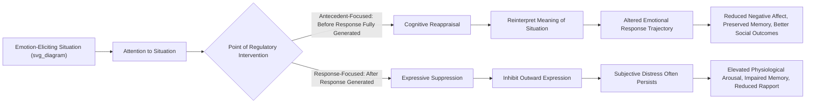

## Cognitive Reappraisal and Reframing Strategies

### Overview

Cognitive reappraisal — the process of reinterpreting the meaning of an emotion-eliciting situation to alter its emotional impact — is one of the most extensively researched and empirically validated emotion regulation strategies in psychological science. Situated centrally within James Gross's process model of emotion regulation, reappraisal is consistently associated with more favorable psychological, physiological, and social outcomes than many alternative regulation strategies, making it a cornerstone technique across clinical, educational, and resilience-building applications.

### Theoretical Placement: Gross's Process Model of Emotion Regulation

James Gross's influential process model organizes emotion regulation strategies according to the point in the emotion-generative process at which they intervene:

| Stage | Strategy Type | Timing |
| --- | --- | --- |
| Situation selection | Choosing to approach or avoid a situation | Before emotional response begins |
| Situation modification | Altering the situation directly | Before emotional response begins |
| Attentional deployment | Directing attention within a situation (e.g., distraction) | Before emotional response begins |
| **Cognitive change (reappraisal)** | **Reinterpreting the meaning of the situation** | **Before the emotional response is fully generated** |
| Response modulation | Directly altering the emotional/behavioral response after it has occurred (e.g., suppression) | After the emotional response has occurred |

**Key Points**

- Reappraisal is classified as an **antecedent-focused** strategy, intervening early in the emotion-generation process by changing the interpretation of a situation before a full emotional response unfolds — distinguishing it fundamentally from **response-focused** strategies like expressive suppression, which attempt to manage an emotion after it has already been generated.
- This early-intervention timing is theorized to underlie much of reappraisal's comparative effectiveness: by altering the appraised meaning of a stimulus, reappraisal changes the entire subsequent emotional trajectory, whereas suppression requires ongoing effortful inhibition of an already-activated response.

### Reappraisal Versus Suppression: The Central Comparative Literature

A substantial body of research, much of it associated with Gross and colleagues, directly compares reappraisal to expressive suppression (inhibiting the outward expression of an ongoing emotion) across multiple outcome domains:

| Outcome Domain | Cognitive Reappraisal | Expressive Suppression |
| --- | --- | --- |
| Subjective negative affect | Generally reduced | Generally not reduced (may leave subjective distress largely intact) |
| Physiological arousal (cardiovascular activation) | Generally not elevated, sometimes reduced | Generally increased sympathetic activation |
| Memory for the emotional event | Generally not impaired | Associated with impaired memory encoding of the event, plausibly due to cognitive resources diverted to inhibition |
| Social functioning/relationship quality | Generally associated with better interpersonal outcomes | Associated with reduced rapport and less positive impressions from social partners in experimental studies |
| Cognitive resource demand | Generally lower once employed as habitual strategy, though may require effort during acquisition | Associated with ongoing cognitive load throughout the suppression period |

[Inference] While this comparative pattern is well-replicated across a substantial experimental literature, most of this research uses laboratory-based, relatively brief emotional stimuli (e.g., film clips); the generalizability of specific effect magnitudes to naturalistic, chronic, or highly intense real-world emotional situations is less extensively studied and should be treated as a reasonable but not fully confirmed extrapolation.

### Types and Techniques of Cognitive Reappraisal

**Reinterpretation of Meaning**

- Reframing the significance or implication of an event (e.g., interpreting a job loss as a potential opportunity for career redirection rather than solely as a failure).

**Distancing / Self-Distancing**

- Adopting a psychologically distanced perspective on an emotional experience, such as viewing it from a third-person or "fly on the wall" vantage point, or imagining how the situation will be perceived from a future temporal distance (a specific technique studied extensively by Ethan Kross and colleagues).
- [Inference] Self-distancing is sometimes classified as a distinct reappraisal subtype and sometimes as a related but conceptually separate regulation strategy in the literature; researchers do not use fully uniform terminology across studies, so specific findings should be checked against the precise operational definition used in a given study.

**Reappraisal of Emotional Intensity/Threat Level**

- Downregulating perceived threat magnitude of a stimulus (e.g., "this is uncomfortable but not dangerous") without necessarily reinterpreting the event's broader meaning.

**Benefit-Finding / Positive Reappraisal**

- Specifically identifying potential positive consequences, growth opportunities, or silver linings within an adverse situation — closely related to, and sometimes used interchangeably with, "positive reframing" in coping research (e.g., within the COPE Inventory's positive reframing subscale).

**Perspective-Taking Reappraisal**

- Reinterpreting another person's behavior by considering alternative, less threatening or hostile explanations for their actions (e.g., reframing a colleague's curt email as reflecting their own stress rather than personal animosity) — closely tied to attribution theory and relevant to interpersonal conflict regulation.

**Challenge Reappraisal (Threat-to-Challenge Reframing)**

- Directly drawing on Lazarus and Folkman's primary appraisal framework, this technique explicitly reframes a demanding situation from a "threat" appraisal toward a "challenge" appraisal by emphasizing available coping resources and potential for growth or mastery — empirically linked to the more adaptive cardiovascular reactivity pattern described in the Biopsychosocial Model of Challenge and Threat.

### Neural Mechanisms

Reappraisal research is among the most extensively studied emotion regulation strategies in affective neuroscience, with a consistent pattern reported across numerous fMRI studies:

- **Increased activation** in prefrontal regions, particularly the **dorsolateral and ventrolateral prefrontal cortex**, during active reappraisal, consistent with these regions' broader role in cognitive control and top-down regulation.
- **Decreased activation** in the **amygdala**, consistent with successful downregulation of the initial threat/emotional response.
- This prefrontal-amygdala pattern is frequently cited as a neural signature of successful cognitive emotion regulation and connects directly to broader neuroplasticity research on prefrontal-amygdala connectivity strengthening with regulation practice.

### Individual Differences and Habitual Reappraisal Use

- **Emotion Regulation Questionnaire (ERQ)** (Gross & John, 2003) — the primary trait-level self-report measure distinguishing habitual reliance on reappraisal versus suppression as general emotion regulation strategies.
- Research using the ERQ consistently associates habitual reappraisal use (as a general disposition) with better well-being outcomes (higher positive affect, life satisfaction, and interpersonal functioning) and habitual suppression use with worse outcomes across these same domains.
- [Inference] These trait-level associations are largely correlational; while experimental manipulation studies support a causal role for reappraisal in improving momentary affective outcomes, the causal contribution of habitual trait-level reappraisal tendency to long-term well-being trajectories is harder to establish definitively given the predominantly correlational nature of much of this individual-differences literature.

### Boundary Conditions and Limits of Reappraisal's Effectiveness

- **Situational controllability moderation**: Some research suggests reappraisal may be particularly effective for relatively uncontrollable stressors (where changing the situation directly is not feasible), while problem-focused strategies may be comparatively more effective for controllable stressors — echoing the broader goodness-of-fit principle in coping research.
- **Emotional intensity considerations**: [Inference] Some research and clinical observation suggests reappraisal may be more difficult to successfully deploy, or less immediately effective, for very high-intensity emotional states compared to milder or moderate ones, though the precise intensity thresholds at which reappraisal effectiveness diminishes are not fully established with precision in the literature.
- **Overuse and "toxic positivity" risk**: Clinical and applied literature cautions that reappraisal, if applied rigidly or prematurely (e.g., insisting on "silver linings" before genuine emotional processing has occurred, or in contexts of severe trauma or loss), can function as a form of emotional invalidation or avoidance rather than genuine adaptive processing — underscoring that reappraisal is a skill requiring appropriate timing and context-sensitivity rather than a uniformly beneficial technique to apply indiscriminately.
- **Cultural considerations**: Most foundational reappraisal research derives from Western, individualist samples; cross-cultural validation of the ERQ and reappraisal's comparative advantage over other regulation strategies (including culturally salient strategies such as certain collectivist emotional suppression norms) shows some variation, suggesting caution against assuming universal cross-cultural equivalence of these findings.

### Measurement and Research Methods

- **Emotion Regulation Questionnaire (ERQ)** — trait-level habitual strategy use.
- **Experimental reappraisal induction paradigms** — commonly using standardized negative emotional stimuli (e.g., IAPS images, film clips) with randomized instruction to reappraise versus simply watch/experience naturally, allowing controlled causal inference about reappraisal's momentary effects.
- **Ecological momentary assessment (EMA)** — increasingly used to capture reappraisal use and its real-time affective consequences in naturalistic daily life settings, addressing limitations of purely laboratory-based research.
- **Physiological co-measurement** — skin conductance, cardiovascular measures, and cortisol are frequently co-assessed alongside self-report in reappraisal research to examine convergence between subjective and physiological regulation outcomes.

### Practical / Applied Example

**Scenario**: A cognitive-behavioral resilience-training program for university students facing academic stress incorporates structured reappraisal skill-building.

1. **Psychoeducation phase**: Students learn to distinguish reappraisal (reinterpreting a situation's meaning before full emotional escalation) from suppression (masking an already-activated emotional response), with explicit discussion of the differential physiological and cognitive costs associated with each.
2. **Guided reappraisal practice with academic stressors**: Using specific, personally relevant examples (e.g., receiving critical feedback on an assignment), students practice generating multiple alternative interpretations of the same event — moving from an initial threat-oriented interpretation ("this proves I'm not good enough") toward a challenge- or growth-oriented reappraisal ("this identifies specific skills I can develop").
3. **Self-distancing technique training**: Students are taught the "fly on the wall" and "future self" self-distancing techniques as concrete tools for generating reappraisals when in-the-moment emotional intensity makes direct reappraisal difficult to initiate.
4. **Timing and appropriateness discussion**: The program explicitly addresses the boundary-condition literature, teaching students that reappraisal is most useful once initial emotional processing has occurred, rather than as an immediate bypass of genuine distress — directly addressing the "toxic positivity" risk noted in clinical critique.
5. **Outcome assessment**: Program evaluation combines the ERQ (assessing shifts in habitual strategy use) with ecological momentary assessment during an actual high-stakes academic period (e.g., final exams), examining whether trained reappraisal use generalizes to real-world application beyond the structured training context.

### Relevance to Positive Psychology and Resilience

- Reappraisal operationalizes one of the most direct, teachable, and empirically validated cognitive mechanisms for building resilient responses to adversity, translating the appraisal-focused theoretical insight of Lazarus and Folkman's model into concrete applied technique.
- Its consistent association with preserved memory, better social functioning, and lower physiological cost (relative to suppression) provides strong empirical grounding for prioritizing reappraisal-based emotion regulation training within resilience curricula over strategies emphasizing emotional suppression or masking.
- Reappraisal's neural signature (increased prefrontal engagement, decreased amygdala activation) connects directly to neuroplasticity research, suggesting that repeated reappraisal practice may build durable neural regulatory capacity over time, consistent with resilience as a trainable rather than fixed characteristic.
- The boundary-condition literature on reappraisal's limits (timing sensitivity, risk of invalidation when misapplied) provides an important corrective within positive psychology practice, reinforcing that resilience-building techniques require skillful, context-sensitive application rather than uncritical, one-size-fits-all promotion.

### Related Topics

- Gross's process model of emotion regulation
- Expressive suppression and its psychological/physiological costs
- Lazarus and Folkman's cognitive appraisal model of stress
- Self-distancing techniques (Kross) and psychological distance
- Biopsychosocial model of challenge and threat
- Neural correlates of positive affect and well-being
- Emotion Regulation Questionnaire (ERQ) and trait regulation styles
- Benefit-finding and positive reframing in coping research