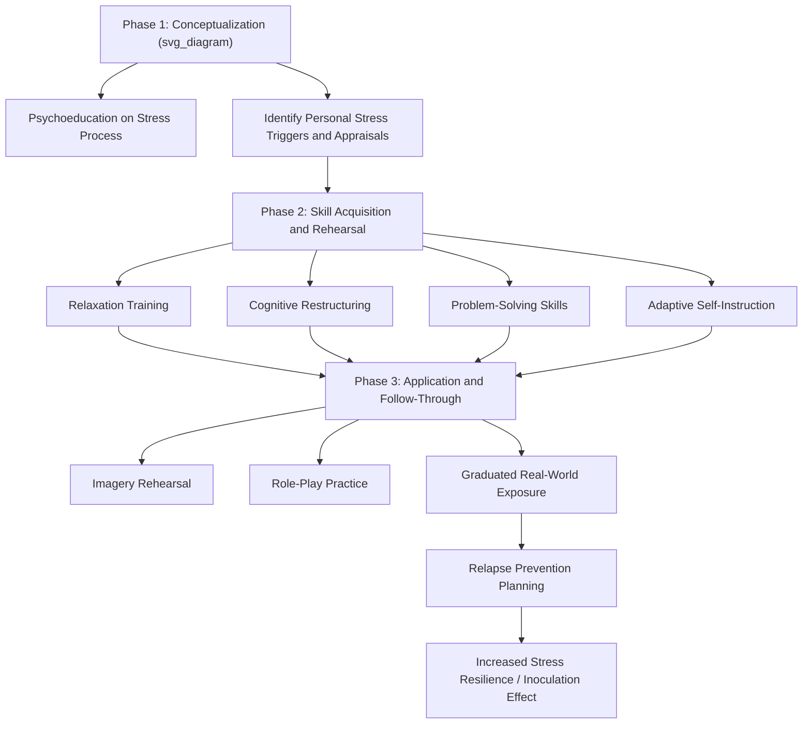

## Stress Inoculation Training

### Overview

Stress Inoculation Training (SIT), developed by Donald Meichenbaum in the 1970s, is a structured, multi-phase cognitive-behavioral intervention designed to build resilience to stress by combining psychoeducation, cognitive-behavioral skill acquisition, and graduated, controlled exposure to stress-inducing stimuli. Drawing an explicit analogy to biological immunization, SIT proposes that exposing individuals to manageable "doses" of stress under supportive, skill-building conditions can build psychological resistance ("inoculation") against the potentially disruptive effects of future, more severe stressors.

### Theoretical Foundations

**The Inoculation Analogy**

- Meichenbaum drew directly on the biological immunization model: just as exposure to a weakened or controlled form of a pathogen stimulates the immune system to develop resistance against future full-strength exposure, SIT proposes that structured exposure to manageable stress, paired with effective coping skill development, builds psychological resistance to future, more intense stress.
- This framing positions SIT as fundamentally **preventive and skill-building** rather than purely remedial — designed to be applied proactively, before a major anticipated stressor, as well as as a treatment approach for existing stress-related difficulties.

**Integration of Cognitive-Behavioral Principles**

- SIT integrates elements from cognitive therapy (identifying and modifying maladaptive self-statements and appraisals), behavioral skills training (relaxation, problem-solving), and Lazarus and Folkman's transactional stress model (appraisal restructuring, coping skill matching to controllability).
- Meichenbaum's broader work on **self-instructional training** and internal dialogue modification is deeply embedded in SIT's cognitive restructuring components — the premise that the content of one's internal self-talk during stressful encounters substantially shapes the resulting stress response.

### The Three-Phase Structure of SIT

**Phase 1: Conceptualization (Education Phase)**

- Establishes a collaborative therapeutic/training relationship and provides psychoeducation about the nature of stress, typically drawing on transactional appraisal-based frameworks.
- Individuals are guided to identify and analyze their personal stress responses, including the specific situations that trigger stress, their characteristic appraisals, physiological reactions, and current coping patterns.
- A key goal is reframing stress as a **process involving identifiable, modifiable components** (appraisals, self-statements, physiological arousal, behavioral responses) rather than an uncontrollable, monolithic experience — directly paralleling the appraisal-based reframing central to Lazarus and Folkman's model.

**Phase 2: Skill Acquisition and Rehearsal**

- Individuals are trained in a range of coping skills spanning both problem-focused and emotion-focused domains, commonly including:
  - **Relaxation techniques** (progressive muscle relaxation, diaphragmatic breathing)
  - **Cognitive restructuring** — identifying and disputing maladaptive or catastrophizing self-statements, replacing them with coping-oriented self-instructions
  - **Problem-solving skills training** — systematic approaches to defining problems, generating solution alternatives, and evaluating options
  - **Self-instructional / self-talk modification** — developing structured, adaptive internal dialogue for use across different phases of a stressful encounter (see structured self-statement categories below)
  - **Social skills and assertiveness training**, where relevant to the specific stressor domain being addressed

**Phase 3: Application and Follow-Through (Graduated Practice/Exposure)**

- Newly acquired coping skills are practiced under conditions of **graduated, controlled stress exposure** — beginning with lower-intensity stressors (often via imagery-based rehearsal or role-play) and progressing to more realistic or intense simulations as competence and confidence increase.
- Techniques commonly used in this phase include:
  - **Imagery rehearsal** — mentally rehearsing successful application of coping skills within vividly imagined stressful scenarios
  - **Role-playing** — behavioral rehearsal of coping responses within simulated interpersonal or performance-based stressful situations
  - **Graduated in-vivo exposure** — where appropriate and feasible, structured real-world practice opportunities of increasing difficulty
  - **Relapse prevention planning** — anticipating potential setbacks or high-risk situations and pre-planning coping responses

### Structured Self-Statement Categories

A distinctive and widely adopted element of SIT involves training individuals in structured coping self-statements organized around the temporal phases of a stressful encounter:

| Phase | Self-Statement Function | Example Content Type |
| --- | --- | --- |
| Preparing for a stressor | Building confidence and planning before the encounter | "I've handled this before; I have a plan" |
| Confronting/managing the stressor | Maintaining focus and coping during the encounter itself | "Stay focused on the task; one step at a time" |
| Coping with feeling overwhelmed | Managing acute escalation of distress during the encounter | "This feeling will pass; focus on my breathing" |
| Reflecting on/reinforcing coping efforts | Self-reinforcement following the encounter, regardless of outcome | "I got through that; I can build on what I learned" |

**Key Points**

- This structured self-statement framework has been influential beyond SIT itself, informing related coping-skills interventions across sport psychology, medical procedure preparation, and military/first-responder resilience training.

### Applications and Populations

**Clinical Applications**

- Anxiety disorders, including generalized anxiety and performance-related anxiety
- Anger management interventions (a particularly well-documented SIT application area, given Meichenbaum's own extensive work adapting SIT specifically for anger regulation)
- Post-traumatic stress-related difficulties, in some adapted protocols
- Chronic pain management, where SIT principles are integrated with pain-coping skill training

**Occupational and High-Stress Performance Contexts**

- Military and first-responder training programs, where SIT-derived principles inform "stress exposure training" protocols designed to build performance resilience under high-stakes, high-arousal conditions.
- Medical and nursing education, where graduated simulation-based training incorporating stress-inoculation principles is used to prepare trainees for high-pressure clinical scenarios.
- Athletic performance psychology, where structured coping self-statement training and graduated pressure-exposure practice are used to build competitive resilience.

**Preventive/Universal Applications**

- Pre-surgical patient preparation, where structured psychoeducation and coping-skill rehearsal have been used to reduce pre- and post-operative distress.
- School-based programs preparing students for high-stakes testing or significant life transitions.

### Evidence Base and Effectiveness Research

- SIT has accumulated a substantial evidence base across its various clinical and applied adaptations, generally showing favorable outcomes for anxiety reduction, anger management, and improved coping skill utilization relative to no-treatment or waitlist control conditions.
- [Inference] As with many multi-component cognitive-behavioral interventions, SIT's specific "active ingredient" — that is, which particular component (relaxation training, cognitive restructuring, self-instructional training, or graduated exposure specifically) accounts for the majority of its beneficial effect — is not fully disentangled in the literature, since most outcome studies evaluate the full multi-component package rather than systematically dismantling and comparing individual components against each other.
- [Unverified] Effect sizes reported across different SIT applications (clinical anxiety treatment versus occupational stress-resilience training versus pre-surgical preparation) vary considerably depending on population, outcome measure, and study design; specific quantitative effect-size claims should be evaluated in the context of the particular application domain and study quality rather than treated as a single, generalizable statistic across all SIT uses.

### Comparison to Related Interventions

| Intervention | Key Distinguishing Feature Relative to SIT |
| --- | --- |
| Standard cognitive-behavioral therapy (CBT) | SIT is more explicitly structured around the three-phase inoculation framework and graduated stress-exposure practice, whereas general CBT protocols vary more widely in structure |
| Exposure therapy (for anxiety/PTSD) | Exposure therapy centers primarily on habituation/extinction to specific feared stimuli; SIT incorporates graduated exposure as one component within a broader multi-skill coping framework |
| Mindfulness-based stress reduction (MBSR) | MBSR centers on present-moment, non-judgmental awareness practices; SIT centers on active cognitive restructuring and skill-based coping rehearsal — the two approaches differ substantially in their theoretical mechanism though both target stress resilience |
| Resilience training programs (e.g., military resilience programs) | Many contemporary resilience training curricula draw directly on SIT's structured self-statement and graduated exposure principles, often integrating them alongside additional positive-psychology-informed content (e.g., strengths identification, social support building) |

### Practical / Applied Example

**Scenario**: A hospital designs a stress inoculation training program for nursing students preparing for their first clinical rotations involving high-acuity patient care.

1. **Conceptualization phase**: Students complete guided reflection exercises identifying their specific anticipated stress triggers in clinical settings (e.g., fear of making a medical error, difficult patient interactions, witnessing patient suffering), along with their characteristic self-talk and physiological responses to these anticipated stressors.
2. **Skill acquisition phase**: Students are trained in diaphragmatic breathing and brief relaxation techniques usable in clinical settings, structured cognitive restructuring exercises targeting catastrophizing self-statements about potential errors, and a systematic clinical problem-solving framework for managing unexpected patient care situations.
3. **Structured self-statement development**: Students develop personalized coping self-statements across the four temporal phases (e.g., preparing: "I've practiced this skill and have support available"; confronting: "Focus on the next step"; managing overwhelm: "Pause, breathe, ask for help if needed"; reflecting: "I handled a difficult situation and learned from it").
4. **Graduated simulation practice**: Students progress through simulation-based clinical scenarios of increasing complexity and emotional intensity — beginning with lower-stakes simulated patient interactions and building toward high-fidelity simulations of emergent or high-acuity situations — practicing their coping skills and self-statements in each successive simulation.
5. **Debrief and reinforcement**: Following each simulation, structured debriefing sessions reinforce successful coping skill application and problem-solve any breakdowns in coping, consistent with SIT's relapse-prevention/follow-through emphasis, before students progress to actual clinical rotation placements.

### Critiques and Limitations

- **Component ambiguity**: As noted, the multi-component nature of SIT makes it difficult to isolate which specific elements drive observed benefits, complicating precise mechanistic understanding and potentially limiting efficient protocol optimization.
- **Resource and time intensity**: Full SIT protocols, particularly those including extensive graduated exposure and simulation-based practice, can be relatively resource- and time-intensive to implement compared to briefer single-component interventions, which may limit feasibility in some applied or clinical settings.
- **Risk of inadequate "dosing" in graduated exposure**: As with any graduated exposure-based approach, poorly calibrated exposure intensity (either too mild to build meaningful resilience or too intense relative to the individual's current coping capacity) can undermine the intervention's intended inoculation effect; skilled facilitation and individualized pacing are important implementation considerations not always adequately addressed in less rigorously delivered programs.
- **Limited direct comparative dismantling research**: Relatively few studies directly compare full SIT protocols against single-component alternatives (e.g., relaxation training alone, cognitive restructuring alone) within the same population and outcome measures, limiting precise conclusions about SIT's specific added value relative to its individual components.

### Relevance to Positive Psychology and Resilience

- SIT represents one of the earliest and most explicitly **resilience-building-by-design** intervention frameworks, directly operationalizing the premise — foundational to much subsequent resilience science — that controlled, manageable challenge exposure paired with skill development builds durable adaptive capacity, rather than viewing stress purely as something to be avoided or eliminated.
- Its integration of cognitive restructuring, structured self-talk, and graduated practice directly anticipates and informs many contemporary resilience training curricula (military, occupational, educational), several of which explicitly cite SIT as a foundational influence.
- SIT's preventive, proactive application model (used before anticipated major stressors, not only as remedial treatment) aligns closely with positive psychology's broader emphasis on building capacity in advance of adversity, rather than exclusively responding to difficulty after it has already caused significant impairment.
- The structured self-statement framework provides a concrete, transferable technique bridging SIT with broader cognitive reappraisal and self-efficacy research, illustrating how multiple resilience-relevant theoretical traditions (appraisal theory, self-efficacy theory, cognitive-behavioral therapy) converge in this single applied intervention model.

### Related Topics

- Meichenbaum's self-instructional training and internal dialogue
- Lazarus and Folkman's cognitive appraisal model of stress
- Cognitive reappraisal and reframing strategies
- Self-efficacy and mastery beliefs in resilient functioning
- Exposure-based treatment and fear extinction
- Military and occupational resilience training programs
- Problem-solving skills training in clinical psychology
- Relapse prevention planning in cognitive-behavioral interventions