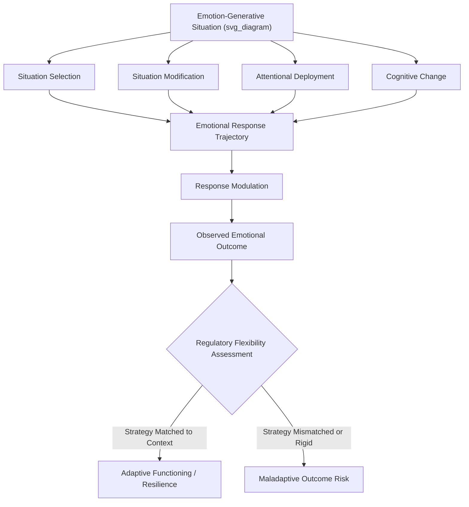

## Emotion Regulation Strategies and Their Links to Resilience

### Overview

Emotion regulation refers to the processes by which individuals influence which emotions they have, when they have them, and how they experience and express them. As a field, emotion regulation research provides much of the mechanistic foundation for understanding how psychological resilience is enacted moment-to-moment — resilient functioning depends substantially on the flexible, adaptive deployment of emotion regulation strategies suited to situational demands, rather than any single fixed regulatory style.

### Theoretical Framework: Gross's Process Model

James Gross's process model remains the dominant organizing framework in emotion regulation research, categorizing strategies by their point of intervention in the emotion-generative sequence:

| Family | Strategy Examples | Timing Relative to Emotional Response |
| --- | --- | --- |
| Situation selection | Approaching or avoiding emotion-relevant situations | Before response generation |
| Situation modification | Actively altering an ongoing situation | Before/during response generation |
| Attentional deployment | Distraction, rumination, concentration | Before/during response generation |
| Cognitive change | Reappraisal, acceptance, distancing | Before response is fully generated |
| Response modulation | Suppression, exercise, substance use, relaxation | After response has occurred |

**Key Points**

- Strategies intervening earlier in the process (situation selection, modification, attentional deployment, cognitive change) are generally termed **antecedent-focused**, while response modulation strategies are termed **response-focused** — a distinction with substantial downstream consequences for effectiveness, as illustrated most extensively in reappraisal-versus-suppression research.
- No single strategy family is universally adaptive; the model's central premise is that regulatory effectiveness depends on strategy-situation fit, individual differences, and flexible deployment rather than fixed reliance on any one approach.

### Major Strategy Categories and Their Resilience Associations

**Cognitive Reappraisal**

- Reinterpreting the meaning of a situation to alter its emotional impact; consistently associated with better psychological, physiological, and social outcomes relative to suppression, and considered one of the most robustly resilience-supportive strategies in the literature.

**Expressive Suppression**

- Inhibiting outward emotional expression while the underlying emotional experience continues; associated with elevated physiological arousal, impaired memory encoding, and reduced interpersonal rapport when used habitually — generally classified among the less adaptive regulation strategies, though situational, culturally-normed suppression (e.g., professional contexts requiring emotional display rules) may carry different implications than chronic trait-level suppression.

**Acceptance**

- A regulation approach involving allowing emotional experience without active attempts to change, avoid, or judge it; central to acceptance and commitment therapy (ACT) and mindfulness-based approaches, associated with reduced experiential avoidance and, particularly for genuinely uncontrollable stressors, favorable long-term outcomes.

**Mindfulness-Based Regulation**

- Non-judgmental, present-moment awareness practices that alter the relationship to emotional experience rather than directly changing its content; associated in substantial intervention research with reduced reactivity, improved attentional control, and downstream emotion regulation benefits.

**Problem-Solving**

- Direct, active efforts to resolve the source of emotional distress; generally most adaptive when applied to genuinely controllable stressors, consistent with the broader coping "goodness of fit" literature.

**Rumination**

- Repetitive, passive focus on the causes and consequences of distress without active problem-solving; robustly associated with worse mental health outcomes, including elevated depression and anxiety risk, and generally classified among the most consistently maladaptive regulation strategies studied.

**Distraction**

- Deliberately shifting attention away from an emotion-eliciting stimulus; shows a more context-dependent evidence profile than rumination — brief, intentional distraction can be adaptive for managing acute distress, while chronic reliance on distraction to avoid necessary emotional processing or problem-solving may become maladaptive.

**Social Sharing / Support-Seeking**

- Engaging others for emotional or instrumental support in processing and managing distress; generally associated with favorable outcomes, though effectiveness is moderated by the quality and responsiveness of the support received, and by the distinction between adaptive support-seeking and excessive reassurance-seeking or co-rumination (a pattern, studied particularly in adolescent friendships, involving excessive mutual focus on problems that can paradoxically increase distress).

**Self-Compassion**

- Extending kindness, non-judgment, and common-humanity framing toward oneself during difficulty (per Kristin Neff's framework); associated with reduced self-critical rumination and improved emotional resilience, distinguished from self-esteem by its lack of dependence on positive self-evaluation or social comparison.

### Emotion Regulation Flexibility as a Meta-Construct

A significant development in the field involves recognizing that the *capacity to flexibly select and switch* among regulation strategies based on contextual demands — termed **emotion regulation flexibility** or **regulatory flexibility** — may be a more robust predictor of resilient functioning than reliance on any single "best" strategy.

**Key Points**

- Research on regulatory flexibility (e.g., work by George Bonanno and colleagues) demonstrates that individuals capable of both enhancing and suppressing emotional expression depending on situational demands (e.g., contextually appropriate expression versus suppression across different social situations) show better long-term adjustment than those rigidly committed to a single regulatory approach across all contexts.
- This flexibility-centered framework reframes the "which strategy is best" question that dominated earlier emotion regulation research, proposing instead that **adaptive capacity to match strategy to context** is itself the more fundamental resilience-relevant individual difference.

### Developmental Considerations

- Emotion regulation capacity develops substantially across childhood and adolescence, moving from heavy reliance on external co-regulation (caregiver-provided soothing and structuring) toward increasingly autonomous, internally generated regulation strategies.
- **Caregiver co-regulation** in early childhood is theorized to scaffold the eventual development of independent emotion regulation capacity — a mechanism connecting attachment quality and early relational experience to later individual differences in regulatory skill, and linking directly to the "safe, stable, nurturing relationships" protective factor discussed throughout resilience research.
- Adolescence involves significant continued development of prefrontal-cortex-dependent regulatory capacities, occurring alongside heightened limbic reactivity — a developmental mismatch proposed by some researchers to partially explain adolescent vulnerability to emotion dysregulation-related difficulties despite improving regulatory skill overall.

### Measurement Approaches

- **Emotion Regulation Questionnaire (ERQ)** (Gross & John, 2003) — trait-level reappraisal and suppression use.
- **Difficulties in Emotion Regulation Scale (DERS)** (Gratz & Roemer, 2004) — a broader multidimensional measure capturing difficulties across several regulation-relevant domains (awareness, clarity, acceptance of emotions, ability to engage in goal-directed behavior when distressed, impulse control, access to effective strategies).
- **Cognitive Emotion Regulation Questionnaire (CERQ)** — assesses a wider range of cognitive strategies including rumination, catastrophizing, positive refocusing, and putting into perspective.
- **Ecological momentary assessment (EMA)** — increasingly used to capture naturalistic, real-time regulation strategy use and its immediate affective consequences, addressing limitations of purely retrospective trait questionnaires.

### Practical / Applied Example

**Scenario**: A workplace resilience program for high-stress emergency dispatch employees is designed around building emotion regulation flexibility rather than promoting a single regulation technique.

1. **Assessment phase**: Employees complete the DERS to identify specific regulatory difficulty profiles (e.g., difficulty with impulse control during acute stress versus difficulty accessing effective strategies once distressed), allowing individualized rather than uniform intervention targeting.
2. **Multi-strategy skill-building**: Rather than training a single technique, the program builds competency across multiple strategy families — brief mindfulness-based grounding techniques for acute in-the-moment regulation during active calls, cognitive reappraisal skills for post-shift processing of distressing calls, and structured social sharing/debriefing protocols with peer support.
3. **Contextual matching training**: Employees are explicitly trained to recognize situational features indicating which strategy is likely most appropriate — for example, brief attentional/breathing-based grounding during an active emergency call (when cognitive bandwidth for reappraisal is limited) versus fuller cognitive reappraisal and social processing during structured post-shift debriefs.
4. **Addressing maladaptive patterns**: The program specifically screens for and addresses rumination patterns and co-rumination risk within peer debriefing groups, given the well-documented risk that unstructured peer processing can shift into unproductive rumination rather than adaptive processing.
5. **Outcome evaluation**: Program effectiveness is assessed using the DERS alongside burnout and psychological well-being measures, examining whether gains in regulatory flexibility (rather than any single strategy's increased use) predict improved occupational resilience outcomes.

### Critiques and Complexities

- **Context-dependency undermines simple strategy hierarchies**: The field's evolution toward flexibility-based frameworks reflects growing recognition that earlier research emphasizing fixed strategy hierarchies (e.g., "reappraisal is good, suppression is bad") oversimplifies a more genuinely context-dependent reality, complicating straightforward clinical or applied recommendations.
- **Measurement and self-report limitations**: Most trait-level regulation measures rely on retrospective self-report of general tendencies, which may not accurately capture actual moment-to-moment strategy deployment, a limitation increasingly addressed but not fully resolved by EMA methodology.
- **Cultural variation in strategy adaptiveness**: As with the broader coping literature, much emotion regulation research derives from Western, individualist samples; the specific adaptiveness rankings of particular strategies (e.g., suppression's generally negative evidence profile) show some variation in cross-cultural research, particularly regarding culturally normative emotional display rules.
- **Distinguishing adaptive acceptance from resignation or avoidance**: Acceptance-based strategies require careful conceptual and empirical distinction from passive resignation or avoidance-based disengagement, since superficially similar behaviors (not acting on distress) can reflect quite different underlying processes with different outcome implications.

### Relevance to Positive Psychology and Resilience

- Emotion regulation research provides the most granular, process-level mechanistic account of how the broader constructs of coping, appraisal, and resilience are actually enacted moment-to-moment, bridging trait-level resilience theory with specific, trainable behavioral and cognitive skills.
- The shift toward **regulatory flexibility** as a meta-construct directly parallels and reinforces resilience science's broader movement away from viewing resilience as a fixed trait toward viewing it as a dynamic, context-responsive capacity — echoing similar developments in coping flexibility research.
- Specific strategies with strong resilience associations (reappraisal, self-compassion, mindfulness-based acceptance, adaptive social support-seeking) constitute the direct technical toolkit underlying many positive psychology and resilience-building intervention programs across clinical, educational, and occupational settings.
- The consistent identification of rumination as a robustly maladaptive strategy, contrasted with more nuanced, context-dependent strategies like distraction and suppression, provides resilience practitioners with clear, well-evidenced intervention priorities (reducing rumination specifically) alongside the more nuanced work of building flexible strategy repertoires.

### Related Topics

- Gross's process model of emotion regulation
- Cognitive reappraisal and reframing strategies
- Expressive suppression and its psychological/physiological costs
- Regulatory flexibility and adaptive strategy switching (Bonanno)
- Self-compassion (Neff) and its distinction from self-esteem
- Rumination and co-rumination in psychological distress
- Mindfulness-based interventions and emotion regulation outcomes
- Developmental origins of emotion regulation and caregiver co-regulation