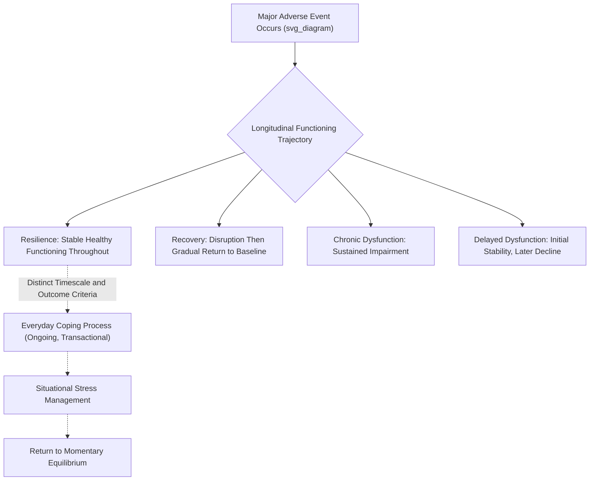

## Distinguishing Everyday Coping From Resilience to Major Adversity

### Overview

While coping and resilience research share substantial theoretical overlap — both concern how individuals respond to demanding circumstances — the two literatures address meaningfully different phenomena in terms of stressor magnitude, timescale, outcome criteria, and theoretical framing. Clarifying this distinction is important for accurate application of research findings, since strategies and constructs validated for everyday hassles do not automatically generalize to responses following major, potentially traumatic adversity, and vice versa.

### Core Conceptual Distinctions

| Dimension | Everyday Coping | Resilience to Major Adversity |
| --- | --- | --- |
| Typical stressor type | Daily hassles, routine demands, minor-to-moderate life stressors (deadlines, interpersonal friction, time pressure) | Major, often discrete traumatic or highly disruptive events (bereavement, disaster, serious illness, violence, major loss) |
| Primary theoretical framework | Lazarus and Folkman's transactional appraisal-coping model | Multi-factorial developmental and clinical resilience frameworks (Masten, Rutter, Bonanno) |
| Typical outcome criterion | Reduction in situational distress; effective management of the specific demand | Maintenance or recovery of overall psychological functioning across multiple life domains following significant disruption |
| Typical timescale studied | Momentary to daily/weekly | Months to years, often with longitudinal trajectory analysis |
| Typical measurement approach | Situational coping questionnaires (WCQ, COPE), ecological momentary assessment | Trajectory-based longitudinal designs, clinical outcome measures, multi-system functioning assessments |

**Key Points**

- "Coping" research, as classically defined by Lazarus and Folkman, was developed with a focus on everyday transactional stress-appraisal processes and moderate stressors, though the framework has since been extended and applied to more severe stressor contexts as well.
- "Resilience" research, particularly as it developed within developmental psychopathology (Garmezy, Masten, Rutter) and later trauma-outcome research (Bonanno), was specifically concerned with understanding why some individuals maintain or regain healthy functioning following exposure to significant risk or trauma, while others develop lasting impairment — a qualitatively different research question than everyday stress management.

### The Trajectory-Based Framework for Distinguishing Outcomes Following Major Adversity

A significant contribution distinguishing major-adversity resilience research from everyday coping research is **George Bonanno's trajectory-based model**, developed primarily through longitudinal research on bereavement and trauma populations. This framework identifies distinct longitudinal patterns of psychological functioning following a potentially traumatic event, rather than treating "coping well" as a single undifferentiated outcome:

1. **Resilience trajectory** — stable, healthy psychological functioning is maintained throughout and after the adverse event, without a pronounced period of significant symptom elevation. Bonanno's research across multiple populations (bereavement, disaster exposure, combat) has consistently identified this as the **modal (most common) trajectory** in many studied populations — a finding that substantially reframes resilience as normative rather than rare or exceptional.
2. **Recovery trajectory** — functioning is significantly disrupted immediately following the event, but gradually returns to baseline levels over subsequent months, typically distinguished from resilience specifically by the presence of this initial disruption period.
3. **Chronic dysfunction trajectory** — functioning remains significantly impaired over an extended period following the event, without meaningful improvement.
4. **Delayed dysfunction/grief trajectory** — functioning appears relatively stable initially, followed by a later emergence or worsening of symptoms — a less common but empirically identified pattern in some studies.

**Key Points**

- This trajectory framework represents a fundamentally different analytic and conceptual approach than situational coping research — rather than examining which specific coping strategy was used in a given moment, it examines the overall longitudinal shape of psychological functioning across an extended post-adversity period.
- Bonanno's finding that resilience is frequently the **modal outcome** following even severe adversity (rather than a rare trait limited to exceptional individuals) has been influential in shifting resilience research away from earlier assumptions that most people would be expected to develop significant, lasting impairment following major trauma.

### Why Everyday Coping Constructs Do Not Automatically Generalize to Major Adversity Contexts

**Differences in Controllability and Appraisal**

- Many major adversities (bereavement, disaster, serious illness, violence) are objectively uncontrollable in a way that many everyday stressors are not, shifting the relevant coping "goodness of fit" calculus substantially toward acceptance-based and meaning-making processes rather than the broader mix of problem- and emotion-focused strategies relevant to more controllable everyday stressors.

**Differences in Duration and Chronicity of Demand**

- Everyday coping research often examines discrete, relatively brief coping episodes; major adversity frequently involves sustained, evolving demands (e.g., ongoing caregiving following a family member's disabling injury, prolonged grief processes, extended recovery from serious illness) requiring coping and regulatory processes to be sustained and adapted over much longer periods than typical everyday-stress research designs capture.

**Differences in Outcome Scope**

- Everyday coping outcome measures typically focus on situational distress reduction or task-specific effectiveness; major-adversity resilience outcome measures typically assess broader, multi-domain functioning (occupational, relational, physical health, overall psychological well-being) over extended follow-up periods, reflecting the more pervasive and potentially life-altering scope of major adversity's effects.

**Differences in the Role of Meaning-Making**

- **Meaning-making** and related constructs (post-traumatic growth, benefit-finding, narrative identity reconstruction) feature much more centrally in major-adversity resilience research than in everyday coping research, reflecting the qualitatively different existential and identity-relevant challenges posed by major loss or trauma compared to routine daily stressors.

[Inference] While there is likely substantial underlying mechanistic overlap between everyday coping processes (appraisal, emotion regulation) and major-adversity resilience processes, since both draw on shared cognitive and emotional regulatory capacities, the degree to which specific findings from one literature can be directly extrapolated to the other has not been fully and systematically mapped, and researchers in each tradition have historically used somewhat distinct measurement approaches, complicating direct comparison.

### Related but Distinct Constructs Specific to Major-Adversity Resilience Research

**Post-Traumatic Growth (PTG)**

- Positive psychological change reported by some individuals following struggle with major adversity, encompassing domains such as changed priorities, deepened relationships, increased personal strength, spiritual development, and appreciation for life (per Tedeschi and Calhoun's foundational framework).
- A construct with essentially no direct parallel in everyday coping research, since it specifically concerns transformative change arising from confrontation with major, identity-challenging adversity rather than routine stress management.

**Complicated/Prolonged Grief**

- A clinically significant, sustained grief response following bereavement that does not follow the more typical adaptive grief trajectory; a construct specific to major-loss research with no direct everyday-coping analog.

**Resilience Factors Specific to Trauma Contexts**

- Certain protective factors are studied with particular intensity in major-adversity contexts specifically — for example, social support's buffering role following disaster or combat exposure, or the specific role of narrative coherence in processing traumatic memory — reflecting theoretical concerns somewhat distinct from the broader everyday-stressor coping literature, though clearly related to it.

### Methodological Implications of the Distinction

- **Measurement timescale mismatch**: Situational coping questionnaires (e.g., the WCQ, designed for a specific recent stressful episode) are not well-suited to capturing resilience following major adversity, which requires longitudinal, trajectory-based designs spanning months to years rather than single-episode assessment.
- **Sampling and generalizability considerations**: Everyday coping research can more readily use general community or student samples experiencing common life stressors; major-adversity resilience research requires access to populations who have actually experienced the specific major adversity of interest (bereaved individuals, disaster survivors, trauma-exposed populations), introducing distinct sampling, ethical, and recruitment considerations.
- **Retrospective versus prospective design challenges**: Studying resilience to major adversity ideally requires pre-adversity baseline data (to properly characterize trajectory patterns, distinguishing "resilience" from "recovery," for example), which is logistically difficult to obtain for unpredictable events, whereas everyday coping research can more readily employ prospective or experimental designs given the more predictable, inducible nature of everyday stressors.

### Practical / Applied Example

**Scenario**: A hospital system is designing separate support programs for (a) staff managing routine occupational stress and (b) staff and patients coping with major traumatic loss (e.g., following a mass casualty event or the sudden death of a colleague).

1. **Everyday occupational stress program**: Designed around Lazarus and Folkman's transactional model and structured coping-skills training (e.g., stress inoculation training principles), focusing on situational appraisal, problem-focused strategies for controllable workplace stressors, and brief emotion-focused regulation techniques for managing routine daily demands — evaluated using situational coping and burnout measures over relatively short assessment intervals (weeks to a few months).
2. **Major-adversity trauma response program**: Designed around trajectory-based resilience principles, explicitly anticipating that most affected individuals will likely show a natural resilience or recovery trajectory without necessarily requiring intensive clinical intervention, while establishing systematic screening protocols to identify the smaller subset following chronic or delayed dysfunction trajectories who require more intensive, sustained clinical support.
3. **Differentiated timescale planning**: The trauma-response program plans support availability across a substantially longer follow-up window (up to a year or more) than the everyday-stress program, reflecting the trajectory-based literature's finding that meaningful post-traumatic functioning patterns, including delayed-onset difficulties, can take considerably longer to fully manifest than typical everyday-stress recovery periods.
4. **Avoiding conflation in program messaging**: Program designers explicitly avoid applying everyday-coping messaging (e.g., generic "positive thinking" or brief coping-skill tips) to the major-adversity context, recognizing that the trauma-response population's needs (meaning-making support, longer-term monitoring, differentiated trajectory-based triage) require a substantially different framework than routine workplace stress management.

### Critiques and Ongoing Debates

- **Boundary ambiguity**: The line between "everyday" and "major" adversity is not sharply defined in the literature, and cumulative everyday stress (chronic, unremitting daily hassles) can in some cases produce outcome patterns and require coping resources more similar to major-adversity resilience research than to typical brief-episode coping research — suggesting the distinction may be better understood as a continuum of stressor severity/chronicity than a strict categorical divide.
- **Risk of over-medicalizing normative major-adversity responses**: The trajectory-based resilience literature's finding that resilience is the modal response following even severe adversity has informed important critiques of intervention approaches (e.g., universal, mandatory post-disaster debriefing protocols) that assume all major-adversity-exposed individuals require intensive intervention, when longitudinal evidence suggests many will show natural resilient or recovery trajectories without such intervention — and in some documented cases, certain well-intentioned interventions (e.g., certain single-session debriefing models) have shown null or even iatrogenic effects for individuals on a natural resilience trajectory.
- **Integration challenges**: [Inference] While both literatures examine adaptive response to demand, more systematic theoretical integration connecting specific everyday coping mechanisms (appraisal, emotion regulation strategies) to the broader trajectory-based major-adversity outcomes remains a relatively underdeveloped area, representing an ongoing opportunity for cross-literature theoretical synthesis.

### Relevance to Positive Psychology and Resilience

- This distinction underscores an important applied principle: resilience-building programs and support interventions should be **calibrated to the actual scale and nature of the adversity being addressed**, rather than assuming uniform applicability of either everyday-coping techniques or intensive trauma-focused resilience frameworks across all contexts.
- Bonanno's trajectory research, identifying resilience as the modal outcome following major adversity, provides an important corrective within positive psychology and resilience science against overly pathologizing normative human responses to loss and trauma — reinforcing the field's broader shift toward recognizing resilience as common and expectable rather than rare and exceptional.
- The distinct centrality of meaning-making and post-traumatic growth constructs within major-adversity research (relative to everyday coping research) highlights a resilience-relevant domain — existential and identity-level adaptation — that is less prominent within standard everyday-stress coping frameworks but is highly relevant to comprehensive positive psychology practice addressing the full range of human adversity.
- Recognizing this distinction helps resilience practitioners avoid both under-response (applying insufficient support frameworks to genuinely major adversity) and over-response (unnecessarily intensive intervention for populations likely to show natural resilient trajectories), supporting more efficient, appropriately calibrated resource allocation in applied resilience-building contexts.

### Related Topics

- Bonanno's trajectory model of resilience following major adversity
- Post-traumatic growth: mechanisms and critiques
- Lazarus and Folkman's cognitive appraisal model of stress
- Complicated/prolonged grief and its distinction from normative bereavement
- Critical incident debriefing and its evidence base controversies
- Meaning-making and narrative identity reconstruction following trauma
- Masten's "ordinary magic" framework and normative resilience
- Longitudinal trajectory-based research design in resilience science