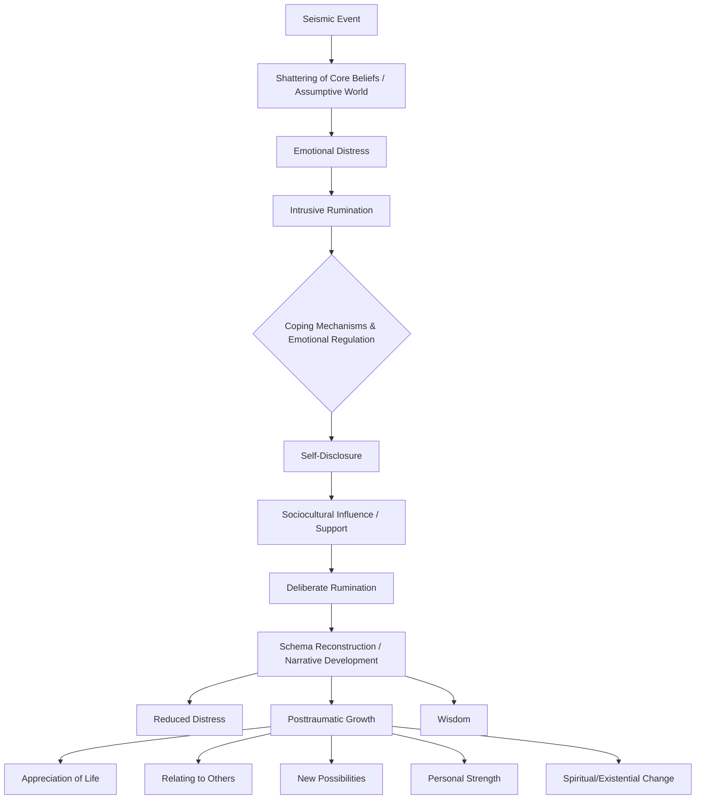

## Tedeschi and Calhoun's Model of Post-Traumatic Growth

### Overview

Post-Traumatic Growth (PTG) is defined as positive psychological change experienced as a result of the struggle with highly challenging life circumstances. The model was developed by psychologists Richard Tedeschi and Lawrence Calhoun in the mid-1990s at the University of North Carolina at Charlotte. A central tenet of the model is that PTG is not a direct result of trauma itself, but rather emerges from an individual's cognitive and emotional struggle to process and make sense of the traumatic event's aftermath. The model distinguishes growth from mere resilience: resilience implies a return to baseline functioning, whereas PTG implies a transformation to a level of psychological functioning that surpasses what was present before the trauma.

### Foundational Premise

**Key Points**

- PTG is a process, not a single outcome — it unfolds over time following the "seismic" event.
- The trauma must be significant enough to challenge the individual's core beliefs, assumptions, and worldview (referred to as "assumptive world" shattering, building on Janoff-Bulman's earlier work).
- Growth and distress can coexist; PTG does not mean the absence of suffering, and most individuals who report growth also report ongoing pain related to the event.
- The model is empirically derived and was validated primarily through the development of the Posttraumatic Growth Inventory (PTGI).

### The Five Domains of Growth

Tedeschi and Calhoun operationalized PTG into five distinct but related domains, measured by the PTGI:

1. **Appreciation of Life** — A shift in life priorities and a greater appreciation for the value of one's own existence, often summarized by the sentiment that ordinary, previously overlooked aspects of life gain new significance.
2. **Relating to Others** — An increased sense of closeness and connection with others, greater compassion for those who suffer, and a willingness to express emotion and accept help.
3. **New Possibilities** — The recognition of new paths for one's life, including new interests, career changes, or a sense that new opportunities emerged that would not have been possible otherwise.
4. **Personal Strength** — A paradoxical sense of increased self-reliance and confidence in one's ability to handle future difficulties, often summarized as "if I survived this, I can survive anything."
5. **Spiritual/Existential Change** — A deepening of spiritual understanding or a more developed existential perspective, which may or may not be religious in nature; this can also involve grappling with fundamental existential questions for the first time.

### The Functional-Descriptive Model (Process Mechanics)

**Key Points**

The model conceptualizes PTG as a process governed by the interaction between the traumatic event and the individual's pre-existing cognitive schemas.

- **Seismic Event**: A highly challenging life event that is significant enough to disrupt an individual's core beliefs (schemas) about the world, themselves, and their future. The "seismic" metaphor implies the event shakes the foundation of the assumptive world.
- **Shattered Assumptive World**: Prior to the event, individuals typically operate under a set of "core beliefs" (e.g., "the world is just," "I am invulnerable"). The trauma challenges these beliefs, leading to significant psychological distress.
- **Rumination**: This is the central engine of the model. Tedeschi and Calhoun differentiate between two types:
  - *Intrusive Rumination*: Automatic, unwanted, and repetitive thoughts about the event, common immediately following the trauma. This is typically distressing and associated with symptoms of PTSD.
  - *Deliberate Rumination*: A more effortful, purposeful, and reflective type of thinking that involves trying to make sense of the event, re-evaluate one's beliefs, and construct a coherent narrative. The model posits that a shift from intrusive to deliberate rumination over time is necessary for growth to occur.
- **Emotional Regulation & Disclosure**: The ability to manage the distressing emotions associated with the event (anxiety, sadness) is necessary to permit deliberate rumination. Self-disclosure to others facilitates this by helping to organize the narrative and receive social support.
- **Sociocultural Context and Support**: The individual does not process the event in a vacuum. A supportive social environment (family, "expert companions," support groups) provides validation, models of coping, and opportunities for disclosure. This can also introduce or reinforce cultural narratives about growth.
- **Narrative Development**: The final stage involves the construction of a "life narrative" — a coherent story that integrates the trauma into one's life story, often as a turning point that led to the growth outcomes.
- **Wisdom**: The model positions wisdom as a potential higher-order outcome of this process — the accumulated life knowledge that results from successfully integrating the trauma.

### Process Flow Diagram

### The Posttraumatic Growth Inventory (PTGI)

**Key Points**

- Developed by Tedeschi and Calhoun (1996) as the primary quantitative measurement tool for the model.
- Consists of 21 items rated on a 6-point scale (0 = "I did not experience this change" to 5 = "I experienced this change to a very great degree").
- Items map onto the five domains described above.
- A shortened 10-item version (PTGI-SF) and an expanded version (PTGI-X, which adds items on existential/spiritual change) have since been developed and validated.

**Example**

A sample PTGI item under the "Personal Strength" domain: *"I know better that I can handle difficulties."* A sample item under "New Possibilities": *"I developed new interests."*

### Distinguishing PTG from Related Constructs

| Construct | Core Definition | Relationship to PTG |
| --- | --- | --- |
| Resilience | Maintenance of stable functioning despite adversity; a "bounce-back" | PTG requires disruption; resilient individuals may show *less* PTG because their schemas were not significantly challenged |
| Hardiness | A personality style (commitment, control, challenge) that buffers stress | Considered a pre-trauma trait that may influence the *coping style* used during the PTG process |
| Benefit Finding | The general cognitive process of identifying positives in a negative situation | Considered a related but broader/simpler construct; PTG is theorized as a more transformative, structural change in schemas rather than a simple cognitive reframe |
| Sense of Coherence | A global orientation of confidence that life is comprehensible and manageable | Overlaps particularly with the "narrative development" component of PTG |

[Inference] The distinction between resilience and PTG as mutually exclusive or inversely related outcomes is a theoretical claim that has generated debate in subsequent literature, as some empirical studies find both can co-occur.

### Critiques and Limitations

**Key Points**

- **Retrospective Bias**: A primary methodological critique is that PTGI scores are based on retrospective self-report, comparing current functioning to a *recalled* pre-trauma state, which is subject to memory distortion.
- **Illusory vs. Constructive Growth**: Some researchers (e.g., Frazier and colleagues) argue that reported PTG may sometimes function as a positive illusion or a coping mechanism to reduce distress, rather than reflecting an actual, veridical change in functioning.
- **Correlation with Distress**: Empirical findings on the relationship between PTG and psychological distress/PTSD symptoms are mixed; some studies show a curvilinear relationship (moderate distress associated with the most growth), which complicates a simple "more suffering, more growth" reading of the model.
- **Cultural Specificity**: [Unverified] The five-factor structure was derived primarily from Western (U.S.) samples, and cross-cultural validation work has found some variation in factor structure in non-Western populations.

### Clinical and Applied Implications

**Key Points**

- **Expert Companionship**: Tedeschi and Calhoun proposed that clinicians should act as an "expert companion" — someone who walks alongside the survivor's process rather than directing it, respecting the survivor's own pace of narrative construction.
- **Posttraumatic Growth Model of clinical practice**: This approach avoids prematurely pushing clients toward "finding the silver lining," which can invalidate ongoing distress. Practitioners are encouraged to validate distress *before* facilitating deliberate rumination.
- Applications extend to work with combat veterans, cancer survivors, refugees, and bereaved individuals.
- [Inference] Clinical application requires care to avoid inadvertently communicating an expectation of growth, which research suggests can increase distress in clients who have not yet, or may never, experience it (sometimes discussed under the concept of "tyranny of positive thinking").

### Related Topics

- Post-Traumatic Stress Disorder (PTSD) and its relationship to PTG
- Janoff-Bulman's Assumptive World Theory
- The Organismic Valuing Process (Joseph and Linley's alternative PTG model)
- Benefit-Finding and Positive Reappraisal as coping strategies
- Sense of Coherence (Antonovsky) and Salutogenesis
- Vicarious/Secondary Post-Traumatic Growth (in caregivers and clinicians)
- Meaning-Making Frameworks (Park's Meaning-Making Model)