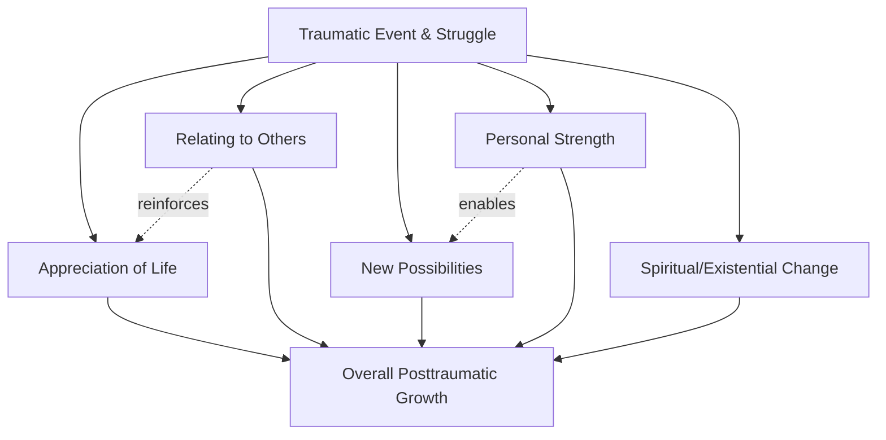

## The Five Domains of Post-Traumatic Growth

### Overview

The five domains of post-traumatic growth (PTG) constitute the empirically derived factor structure underlying Tedeschi and Calhoun's model, operationalized through the Posttraumatic Growth Inventory (PTGI). Rather than treating growth as a monolithic outcome, the model decomposes it into distinct psychological dimensions that can be independently experienced, measured, and tracked. An individual may score highly on one domain while showing minimal change on another, reflecting the idiosyncratic nature of how trauma reshapes different aspects of the self and worldview.

### Domain 1: Appreciation of Life

**Key Points**

- Reflects a recalibration of priorities, in which the individual reports valuing everyday existence more deeply than before the traumatic event.
- Often includes a shift away from previously held goals (e.g., material achievement) toward valuing present-moment experience.
- Closely tied to a heightened awareness of mortality, which — rather than producing only dread — can produce a reordering of what is considered meaningful.
- Measured on the PTGI by items such as: *"I changed my priorities about what is important in life"* and *"I have a greater appreciation for the value of my own life."*

**Example**

A survivor of a serious car accident reports no longer taking routine mornings with their family for granted, describing a heightened sense of gratitude for ordinary, previously unnoticed moments.

### Domain 2: Relating to Others

**Key Points**

- Encompasses changes in interpersonal closeness, empathy, and willingness to be emotionally vulnerable with others.
- Involves two related sub-themes: (1) an increased sense of connection and compassion toward others, particularly those who have also suffered, and (2) a greater willingness to accept help and express emotion, which may represent a shift from prior self-reliant or avoidant interpersonal styles.
- The model suggests that self-disclosure of the traumatic experience to supportive others is both a facilitator of this domain and an outcome of it — disclosure builds closeness, and increased closeness encourages further disclosure.
- Measured on the PTGI by items such as: *"I have a greater sense of closeness with others"* and *"I more clearly see that I can count on people in times of trouble."*

**Example**

A combat veteran who previously avoided discussing emotional topics begins actively mentoring younger service members, reporting a new depth of connection with fellow veterans who understand his experience.

### Domain 3: New Possibilities

**Key Points**

- Refers to the recognition of life paths, interests, or opportunities that the individual either had not considered or actively pursue as a direct consequence of the disruption caused by the trauma.
- Distinct from mere circumstantial change (e.g., losing a job); the domain specifically captures a psychological reorientation toward possibility, often because the traumatic event forced abandonment of a previous life trajectory that had gone unquestioned.
- Frequently manifests as career changes, new advocacy work, returning to education, or the pursuit of previously neglected interests.
- Measured on the PTGI by items such as: *"I developed new interests"* and *"I established a new path for my life."*

**Example**

A cancer survivor who worked in unrelated corporate finance transitions into oncology social work, describing the diagnosis as having "opened a door" she would not otherwise have walked through.

### Domain 4: Personal Strength

**Key Points**

- Captures a paradoxical outcome in which the individual simultaneously acknowledges their vulnerability (having been harmed) while reporting an increased sense of personal capability and self-reliance.
- Often summarized colloquially as the "if I can survive this, I can survive anything" phenomenon.
- [Inference] This domain is theorized to result from the successful integration of the traumatic experience into a revised self-schema, in which surviving the ordeal itself becomes evidence of competence, rather than reflecting a return to a prior, untested sense of invulnerability.
- Measured on the PTGI by items such as: *"I know better that I can handle difficulties"* and *"I discovered that I'm stronger than I thought I was."*

**Example**

A survivor of a natural disaster who rebuilt their home reports feeling more confident handling unrelated life crises (e.g., a health scare, a job loss) that arise afterward.

### Domain 5: Spiritual/Existential Change

**Key Points**

- Involves a deepening or evolution of one's spiritual beliefs, or — independent of religious framework — a more developed engagement with existential questions about meaning, purpose, and the nature of life.
- This domain does not require religiosity; secular individuals can report growth here in the form of a more developed philosophical or existential understanding of life.
- The original PTGI includes fewer items for this domain relative to the others; the later PTGI-Expanded (PTGI-X) version added items specifically to more robustly capture secular existential change, addressing a noted gap in the original instrument.
- Measured on the PTGI by items such as: *"I have a better understanding of spiritual matters"* and *"I have a stronger religious faith."*

**Example**

An individual who survived a serious illness, without adopting any specific religious practice, reports engaging much more deeply with questions of life's meaning and describes a new, more coherent personal philosophy for how they want to live.

### Domain Interrelation Diagram

### Comparative Summary Table

| Domain | Core Shift | Representative PTGI Item Theme |
| --- | --- | --- |
| Appreciation of Life | Reprioritization of values toward the present | Valuing each day |
| Relating to Others | Increased closeness and emotional openness | Reliance on and compassion for others |
| New Possibilities | Emergence of previously unconsidered life paths | New interests or career direction |
| Personal Strength | Increased self-reliance despite acknowledged vulnerability | Confidence in handling future difficulty |
| Spiritual/Existential Change | Deepened engagement with meaning/faith | Understanding of spiritual or existential matters |

### Measurement and Psychometric Notes

**Key Points**

- The five-factor structure was derived via factor analysis during PTGI development (Tedeschi & Calhoun, 1996) and has been broadly, though not universally, replicated across subsequent samples.
- [Unverified] Some cross-cultural and clinical-population studies have found four-factor or alternative-factor solutions, suggesting the five-domain structure may not be fully invariant across all populations.
- A total PTGI score (sum across all domains) is commonly reported alongside domain-specific subscale scores, allowing researchers to examine which domains are most affected by a given type of trauma or intervention.
- Domain scores are not assumed to be equally distributed; certain trauma types tend to elevate certain domains more than others (e.g., health-related trauma often shows pronounced Appreciation of Life and Spiritual/Existential Change scores).

### Critiques and Limitations

**Key Points**

- Because all five domains are measured via retrospective self-report, elevated scores may partly reflect a coping-related cognitive bias rather than objectively verifiable change in functioning.
- Domains can show differential relationships with distress: some research finds Personal Strength and New Possibilities more consistently associated with adaptive outcomes, while Spiritual/Existential Change shows more variable associations depending on population and trauma type. [Inference] This variability suggests the five domains may not be equally "clinically meaningful" as markers of adaptive growth in every context.
- The independence of the five factors has been questioned; some analyses find meaningful cross-loading or high intercorrelation between domains, particularly Relating to Others and Appreciation of Life.

### Related Topics

- The Posttraumatic Growth Inventory (PTGI) and PTGI-Expanded (PTGI-X)
- Deliberate vs. Intrusive Rumination in the PTG process
- Janoff-Bulman's Shattered Assumptions Theory
- Meaning-Making Frameworks (Park's Meaning-Making Model)
- Cross-cultural validation studies of PTG factor structure
- Domain-specific PTG in clinical populations (oncology, combat veterans, bereavement)
- Vicarious/Secondary Post-Traumatic Growth in caregivers