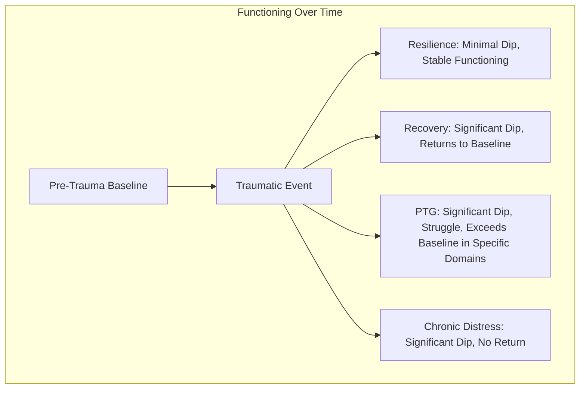

## Distinguishing Post-Traumatic Growth from Resilience and Recovery

### Overview

A central conceptual challenge in the traumatic stress literature is differentiating post-traumatic growth (PTG) from the related but distinct constructs of resilience and recovery. While all three describe positive trajectories following adversity, they refer to fundamentally different processes and endpoints. Conflating them leads to measurement confusion and can misdirect clinical expectations — encouraging clients toward a "growth" framework when a "return to baseline" framework may be more appropriate, or vice versa. Tedeschi and Calhoun explicitly positioned PTG as requiring a degree of psychological disruption that resilience, by definition, does not involve.

### Core Definitional Distinctions

**Key Points**

- **Resilience**: The capacity to maintain relatively stable, healthy levels of psychological and physical functioning during and after exposure to a highly disruptive event, without significant disruption to that functioning. The resilient trajectory is characterized by minimal or transient distress.
- **Recovery**: A trajectory in which the individual initially experiences significant disruption to functioning (symptoms of distress, impairment) but gradually returns to their pre-trauma baseline level of functioning over time. Recovery implies a U-shaped or gradually improving curve back to the original set point.
- **Post-Traumatic Growth**: A trajectory in which the individual experiences significant disruption, but through the struggle with that disruption, arrives at a level of psychological functioning, meaning-making, or self-understanding that exceeds their pre-trauma baseline in specific domains. PTG requires the shattering of prior assumptive schemas as a precondition.

### The Trajectory Model (Bonanno's Framework Applied)

[Inference] The trajectory distinctions below draw substantially on outcome-trajectory research associated with George Bonanno, which is commonly used alongside Tedeschi and Calhoun's model to differentiate these constructs, though Bonanno's trajectories and the PTG model originate from separate research programs.

- **Resistance/Resilience Trajectory**: Minimal disruption to functioning; the individual continues relatively stable functioning throughout.
- **Recovery Trajectory**: Moderate, temporary disruption to functioning followed by a gradual return to baseline over months.
- **Chronic Dysfunction Trajectory**: Significant, sustained disruption with no substantial return to baseline.
- **Delayed Dysfunction Trajectory**: Initial adequate functioning followed by a later decline.
- **Growth Trajectory**: The trajectory of interest for PTG — functioning may dip and recover, but the endpoint reflects a qualitative change in psychological structure (schemas, priorities, self-concept) beyond the pre-trauma level, rather than a mere return to the prior baseline.

### Trajectory Comparison Diagram

### Structured Comparison Table

| Dimension | Resilience | Recovery | Post-Traumatic Growth |
| --- | --- | --- | --- |
| Initial Disruption to Functioning | Minimal or none | Significant | Significant |
| Core Mechanism | Stable coping resources maintain functioning | Natural remission of distress symptoms over time | Cognitive-emotional processing (deliberate rumination) restructures schemas |
| Endpoint Relative to Baseline | At or near baseline throughout | Returns to baseline | Exceeds baseline in specific psychological domains |
| Role of Schema Disruption | Minimal — assumptive world remains largely intact | Assumptive world disrupted, then largely restored | Assumptive world disrupted and reconstructed into a new, often more complex form |
| Presence of Ongoing Distress | Low | Present initially, resolves over time | Can coexist indefinitely alongside growth |
| Measurement Tool (commonly used) | Connor-Davidson Resilience Scale (CD-RISC), Brief Resilience Scale | Symptom measures tracked longitudinally (e.g., PTSD Checklist over time) | Posttraumatic Growth Inventory (PTGI) |

### Why Resilience May Predict *Lower* PTG

**Key Points**

- A counterintuitive but well-documented finding is that measures of resilience and PTG are sometimes negatively or only weakly correlated.
- [Inference] The proposed explanation is that highly resilient individuals, by maintaining stable functioning, do not experience the degree of assumptive world "shattering" that the PTG model identifies as the necessary precondition for growth — there is insufficient disruption to trigger the deliberate rumination process.
- This implies that resilience and PTG are not simply two points on the same continuum of "good outcomes," but represent qualitatively different response patterns to adversity.
- Conversely, individuals reporting moderate-to-severe distress are, on average, more likely to also report higher PTG scores than either minimally-distressed or chronically-dysfunctional individuals — some studies describe this as a roughly curvilinear relationship between distress and growth.

### Why Recovery Is Necessary But Not Sufficient for PTG

**Key Points**

- Recovery (a return to baseline symptom levels) is generally considered a precondition or co-occurring process for PTG to stabilize, but recovery alone does not constitute growth.
- An individual can fully recover from acute distress (e.g., anxiety and intrusive symptoms resolve) without ever engaging in the deliberate rumination or narrative reconstruction that the PTG model identifies as necessary for domain-level growth (e.g., in Appreciation of Life or Personal Strength).
- Recovery is typically assessed via the *absence* of pathology (symptom reduction), whereas PTG is assessed via the *presence* of specific positive changes — these are not simply inverse measures of the same underlying construct.

### Clinical and Research Implications

**Key Points**

- **Assessment Implication**: Using only symptom-reduction measures (e.g., PTSD symptom checklists) in trauma research or treatment outcome studies will not capture PTG; a validated PTG-specific instrument (e.g., PTGI) is required to assess this separate dimension.
- **Treatment Framing**: Clinicians using a PTG-informed approach are cautioned against assuming that fostering resilience-building skills (e.g., stress inoculation) is functionally equivalent to fostering growth; the two may call for different therapeutic emphases (stabilization/coping vs. facilitated meaning-making and narrative work).
- **Avoiding the "Growth Imperative"**: Because PTG requires significant struggle, framing PTG as a universally expected or required outcome risks pathologizing individuals on a resilience or recovery trajectory who show no distress-driven schema disruption — these individuals are not "failing" to grow; growth was not the relevant mechanism for their trajectory.
- [Inference] This distinction also cautions against using PTG as a treatment goal in early-stage crisis intervention, where stabilization and distress reduction (aligned with recovery, not growth) are typically the clinically appropriate priority.

### Common Misconceptions

**Key Points**

- **Misconception**: PTG means the trauma was "worth it" or a net positive event. **Correction**: The model does not evaluate the trauma itself as beneficial; it describes an outcome that can emerge from the survivor's own struggle with an event that remains harmful.
- **Misconception**: High resilience scores imply the individual will also show high PTG scores. **Correction**: Empirical findings often show weak or even inverse relationships, as described above.
- **Misconception**: If someone appears to have "recovered" (symptom-free), they must have also experienced growth. **Correction**: Recovery describes symptom trajectory; growth describes a separate, schema-level transformation that may or may not be present.

### Related Topics

- Bonanno's Trajectories of Resilience Following Loss and Trauma
- Janoff-Bulman's Shattered Assumptions Theory
- The Five Domains of Post-Traumatic Growth
- Deliberate vs. Intrusive Rumination in the PTG Process
- The Posttraumatic Growth Inventory (PTGI) vs. resilience measurement instruments
- Curvilinear models of distress and growth
- Ecological and dynamic systems models of resilience (Masten, Ungar)