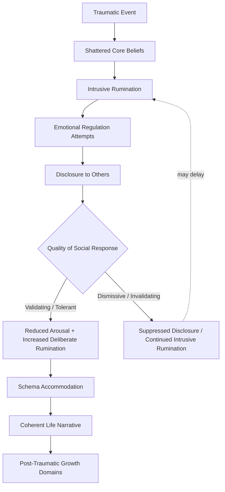

## The Role of Narrative Disclosure and Cognitive Processing of Trauma

### Overview

Within Tedeschi and Calhoun's model of post-traumatic growth (PTG), narrative disclosure and cognitive processing represent the mechanistic core through which a shattered assumptive world is reconstructed into a schema that permits growth. Rather than treating PTG as a passive byproduct of time or symptom resolution, this component of the model treats growth as the outcome of active psychological work: an individual must cognitively engage with the traumatic material, express it in some form, and receive social feedback that helps organize it into a coherent life narrative. This section examines the sub-processes of rumination, disclosure, and narrative construction, and their interdependence.

### From Intrusive to Deliberate Rumination

**Key Points**

- **Intrusive Rumination**: Automatic, unbidden, repetitive thoughts about the traumatic event that occur without conscious effort, typically most prevalent in the immediate aftermath of trauma. This form of rumination is associated with distress and overlaps phenomenologically with intrusion symptoms seen in post-traumatic stress reactions.
- **Deliberate Rumination**: Effortful, intentional reflection on the event and its implications — actively trying to understand why it happened, what it means, and how it changes one's assumptions about the world and self.
- The model proposes a temporal shift: high intrusive rumination early on gradually gives way to a higher proportion of deliberate rumination as the individual's coping resources and emotional regulation stabilize.
- [Inference] This shift is theorized as necessary rather than merely correlated with growth — that is, deliberate rumination is proposed as a required mechanism, not simply an accompanying symptom, for schema reconstruction to occur, though the precise causal sequencing remains difficult to establish with purely correlational, retrospective data common in this literature.

### The Mechanics of Narrative Disclosure

**Key Points**

- **Disclosure** refers to the act of communicating the traumatic experience and its associated thoughts and feelings to another person, whether informally (friends, family) or formally (support groups, therapy).
- Disclosure is theorized to serve several simultaneous functions:
  - *Organizational function*: Putting an inchoate, emotionally overwhelming experience into words forces a degree of structure and sequencing that supports the construction of a coherent narrative.
  - *Regulatory function*: Expressing emotion associated with the trauma (rather than suppressing it) is theorized to reduce physiological and psychological arousal over repeated disclosures, following principles similar to those described in expressive writing research (e.g., James Pennebaker's work on written emotional disclosure).
  - *Social validation function*: The listener's response — empathy, normalization, tolerance of difficult content — provides external validation that can reinforce the survivor's own emerging narrative and sense of self.
- Disclosure is not assumed to be uniformly beneficial; a poor or invalidating response from a listener (dismissal, minimization, discomfort) can inhibit further disclosure and, by extension, inhibit narrative development.

### The Role of the "Expert Companion"

**Key Points**

- Tedeschi and Calhoun introduced the concept of the **expert companion** to describe the ideal role of a clinician, support group facilitator, or trusted confidant in the disclosure process.
- The expert companion role emphasizes accompanying the survivor's own process of meaning-making rather than directing it — the clinician does not prescribe a particular narrative of growth but facilitates the client's own exploration.
- Core practices associated with this role include: tolerating detailed disclosure of the traumatic material without visible distress or avoidance, validating the client's emotional experience before introducing any exploration of possible growth, and using structured reflective questioning (rather than reassurance or premature reframing) to support deliberate rumination.
- [Inference] Premature or clinician-initiated framing of the trauma in growth-oriented terms is generally considered a risk in this model, on the reasoning that it may invalidate the client's ongoing distress or create pressure toward an inauthentic narrative — though the degree of risk this poses in practice is not precisely quantified in the literature.

### Narrative Construction and Schema Reconstruction

**Key Points**

- The end-state of the cognitive processing sequence is the construction of a **life narrative** — a coherent autobiographical account that integrates the traumatic event into the individual's broader life story, typically framing it as a significant turning point.
- This process is closely related to schema change: the individual's revised beliefs about the world, the self, and the future must be woven into this narrative in a way that is subjectively coherent, even if the world itself has not become more comprehensible in objective terms.
- Two general narrative resolutions are commonly described:
  - *Assimilation*: The traumatic event is fit into pre-existing beliefs with minimal alteration to the schema (e.g., "bad things happen, but the world is still fundamentally fair").
  - *Accommodation*: Pre-existing beliefs are substantially revised to incorporate the new information the trauma introduced (e.g., moving from "the world is entirely safe" to a more nuanced, resilient acceptance of unpredictability). The PTG model associates accommodation, rather than assimilation, with the schema-level change necessary for reported growth.

### Process Flow: From Event to Narrative Integration

### Written and Structured Disclosure Techniques

**Key Points**

- **Expressive Writing Paradigm**: Structured writing tasks (commonly modeled on Pennebaker's paradigm) in which individuals write about the traumatic event and their deepest feelings about it for a set duration over consecutive days are frequently used as both a research tool and an applied technique to promote the shift toward deliberate rumination.
- **Guided Autobiographical Narrative**: Some clinical approaches use structured prompts (e.g., "How has this event changed your view of yourself?") to scaffold deliberate rumination in a more directed way than open-ended disclosure.
- **Group-Based Disclosure**: Support groups composed of similarly affected individuals (e.g., bereavement groups, illness-specific groups) provide a disclosure context in which the "expert companion" function may be distributed across peers rather than concentrated in a single clinician.
- [Unverified] The comparative effectiveness of these specific techniques (expressive writing vs. group disclosure vs. individual therapy) in producing measurable PTGI score increases is not conclusively established across the literature, and effect sizes vary considerably by study population and trauma type.

### Boundary Conditions and Risks

**Key Points**

- **Timing sensitivity**: Encouraging deliberate rumination or narrative work too early, before the individual has achieved basic emotional stabilization, risks re-traumatization or overwhelming the individual's coping capacity.
- **Cultural narrative availability**: The sociocultural context provides available "templates" or scripts for growth narratives (e.g., religious frameworks, culturally sanctioned survivor narratives); the absence of an accessible cultural narrative may impede an individual's ability to construct a coherent story, independent of their private cognitive processing.
- **Risk of narrative foreclosure**: [Inference] A narrative constructed too quickly or rigidly, potentially to reduce discomfort with ambiguity, may resemble PTG in self-report without reflecting the deeper schema-level accommodation the model considers characteristic of genuine growth — a distinction sometimes discussed as "illusory" versus "constructive" growth in later critiques of the model.

### Related Topics

- Tedeschi and Calhoun's Model of Post-Traumatic Growth (overall structure)
- Janoff-Bulman's Shattered Assumptions Theory
- Pennebaker's Expressive Writing Paradigm
- The Five Domains of Post-Traumatic Growth
- Assimilation vs. Accommodation in Schema Theory
- Illusory vs. Constructive Growth (critiques of self-reported PTG)
- Meaning-Making Frameworks (Park's Meaning-Making Model)