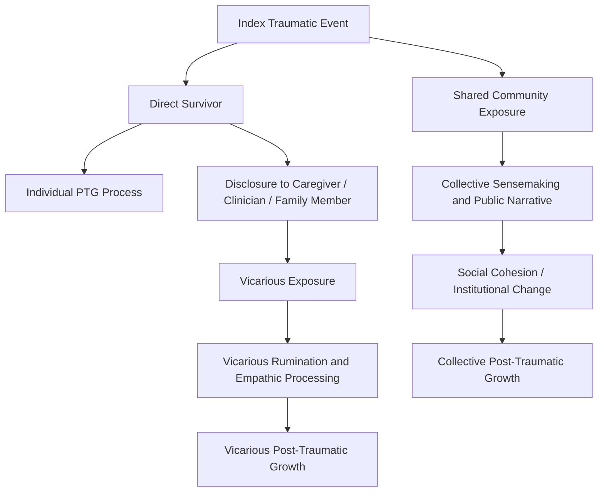

## Vicarious and Collective Post-Traumatic Growth

### Overview

While Tedeschi and Calhoun's original model of post-traumatic growth (PTG) focuses on the individual survivor's own struggle with a traumatic event, subsequent theoretical and empirical work has extended the construct in two distinct directions: **vicarious post-traumatic growth (VPTG)**, which describes growth experienced by individuals who are exposed to another person's trauma indirectly (e.g., through caregiving, clinical work, or close relationship), and **collective post-traumatic growth (CPTG)**, which describes growth experienced at the level of a group, community, or society following a shared traumatic event. Both extensions retain the core mechanisms of the original model (schema disruption, cognitive processing, narrative construction) while relocating the unit of analysis away from the isolated individual trauma survivor.

### Vicarious Post-Traumatic Growth: Definition and Scope

**Key Points**

- VPTG refers to positive psychological change reported by individuals who were not the direct victims of a traumatic event but were exposed to it through their relationship with, or professional engagement with, a direct survivor.
- Commonly studied populations include: psychotherapists and counselors treating trauma survivors, medical and nursing staff caring for critically ill or dying patients, first responders (paramedics, firefighters, disaster relief workers), and family members or partners of trauma survivors (e.g., spouses of combat veterans, parents of children with serious illness).
- VPTG is conceptually related to, but distinct from, **vicarious traumatization** and **secondary traumatic stress** — the negative counterparts describing how repeated indirect exposure to others' trauma can produce trauma-like symptoms in the helper. The model does not treat vicarious growth and vicarious traumatization as mutually exclusive; a caregiver may experience elements of both concurrently.
- [Inference] The theorized mechanism for VPTG parallels the direct-trauma model: exposure to a client's or loved one's traumatic narrative can itself challenge the listener's own assumptive world (e.g., beliefs about safety, fairness, or human resilience), triggering a similar rumination-disclosure-narrative reconstruction sequence in the listener, even though the listener did not experience the index event directly.

### Domains of Vicarious Growth

**Key Points**

Empirical work on VPTG in clinicians and caregivers has generally mapped onto similar domains as the original PTGI, with some field-specific emphases:

- **Increased Appreciation of Life**: Clinicians report a heightened awareness of life's fragility and value after repeated exposure to clients' traumatic material.
- **Enhanced Relational Depth**: Increased empathy and a deepened capacity for intimacy, sometimes described by therapists as a professional benefit of trauma-focused work.
- **Professional and Personal Growth**: A specific sub-domain not prominent in the original PTGI — clinicians frequently report increased perceived competence, a stronger sense of professional purpose, and a broadened repertoire of coping strategies gained through witnessing client resilience.
- **Spiritual/Existential Deepening**: Similar to the original model, exposure to others' suffering and survival is associated with a deepened engagement with existential meaning.
- **Increased Sense of Personal Strength**: Sometimes reported by caregivers as an increased confidence in their own capacity to cope with future adversity, modeled in part on witnessing a client's or family member's coping process.

### Instrumentation for Vicarious Growth

**Key Points**

- The **Vicarious Posttraumatic Growth Inventory (VPTGI)** and related adapted scales have been developed to measure this construct, generally adapting PTGI items to reflect indirect rather than direct exposure (e.g., rephrasing items to refer to change resulting from "my work with trauma survivors" rather than "my own traumatic experience").
- [Unverified] Psychometric validation of VPTG-specific instruments is less extensive than that of the original PTGI, and there is less consensus in the literature on a single standardized factor structure for vicarious growth compared to the direct-trauma model.

### Collective Post-Traumatic Growth: Definition and Scope

**Key Points**

- CPTG extends the growth construct to the level of a **group, organization, community, or nation** following a shared traumatic event (e.g., natural disasters, terrorist attacks, war, pandemics, mass violence).
- CPTG is theorized to manifest through changes in group-level phenomena rather than (or in addition to) individual psychology: shifts in collective identity, community cohesion, shared narratives of resilience, institutional or policy changes, and collective meaning-making rituals (memorials, commemorations, public narratives).
- The construct draws on the idea that a shared traumatic event can shatter a group's collective assumptive world (e.g., a community's shared belief in its own safety or the fairness of its social systems), analogous to schema disruption at the individual level.

### Proposed Mechanisms for Collective Growth

**Key Points**

- **Collective Sensemaking**: Similar to individual deliberate rumination, communities engage in shared discourse (public commemoration, media narratives, political discourse) to construct a coherent collective narrative of the event.
- **Social Cohesion and Solidarity**: Shared adversity is frequently associated with a short-to-medium-term increase in in-group solidarity and mutual aid behavior, sometimes described in the disaster literature as a "post-disaster utopia" or "altruistic community" phenomenon.
- **Institutional and Policy Change**: Structural changes (new safety regulations, memorial institutions, changes in emergency response systems) can be understood as tangible, durable manifestations of collective growth analogous to the "New Possibilities" domain at the individual level.
- **Collective Identity Transformation**: A community or nation may incorporate the traumatic event into its collective identity narrative (e.g., framing itself as more resilient, unified, or vigilant as a result), which parallels individual-level narrative integration.

### Comparative Structure: Individual, Vicarious, and Collective PTG

| Dimension | Individual PTG | Vicarious PTG | Collective PTG |
| --- | --- | --- | --- |
| Unit of Analysis | Single trauma survivor | Individual indirectly exposed (clinician, caregiver, family member) | Group, community, or society |
| Trigger | Direct exposure to traumatic event | Exposure to another's traumatic narrative or suffering | Shared traumatic event affecting a collective |
| Core Mechanism | Deliberate rumination, disclosure, narrative reconstruction | Empathic engagement with client/loved one's narrative, parallel processing | Collective sensemaking, shared narrative construction, social cohesion |
| Primary Measurement Tool | PTGI | Adapted VPTG scales (e.g., VPTGI) | [Unverified] No single widely standardized instrument; often assessed via qualitative, sociological, or mixed-method approaches |
| Risk Counterpart | Chronic PTSD | Vicarious traumatization / secondary traumatic stress / compassion fatigue | Collective trauma, social fragmentation, prolonged collective distress |

### Process Diagram: Pathways to Vicarious and Collective Growth

### Critiques and Open Questions

**Key Points**

- **Construct Boundary Ambiguity**: Critics note that VPTG risks conceptual overreach if applied too loosely — general professional satisfaction or empathy development in helping professions is not necessarily evidence of a trauma-specific growth process analogous to the original PTG model.
- **Measurement Challenges at the Collective Level**: Because CPTG operates at a level beyond individual self-report, it is inherently harder to operationalize and measure with the same psychometric rigor as individual PTG; much of the supporting evidence is qualitative, sociological, or drawn from case studies of specific disasters rather than standardized quantitative instruments.
- **Distinguishing Growth from Recovery at the Collective Level**: As with individual PTG, there is a risk of conflating a community's return to pre-disaster functioning (collective recovery) with genuine transformative change (collective growth) — the same conceptual distinction that applies at the individual level.
- [Inference] Because collective narratives are often shaped by media, political actors, and institutional incentives, apparent "collective growth" narratives may sometimes reflect socially or politically constructed narratives of resilience rather than a demonstrable aggregate shift in the psychological functioning of affected individuals; this makes causal interpretation of CPTG claims particularly difficult.

### Related Topics

- Tedeschi and Calhoun's Model of Post-Traumatic Growth (overall structure)
- Vicarious Traumatization and Secondary Traumatic Stress
- Compassion Fatigue and Compassion Satisfaction in Helping Professions
- The Role of Narrative Disclosure and Cognitive Processing of Trauma
- Community Resilience Frameworks (e.g., Norris et al.'s model of community resilience)
- Collective Trauma and Cultural Memory Studies
- Post-Disaster Social Cohesion ("Altruistic Community" Phenomenon)