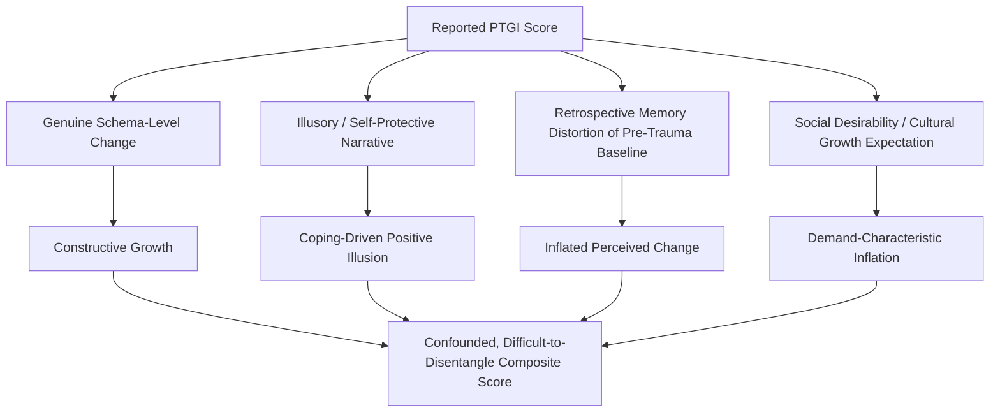

## Critiques and Measurement Challenges in Post-Traumatic Growth Research

### Overview

Despite the widespread adoption of Tedeschi and Calhoun's post-traumatic growth (PTG) model and its accompanying instrument, the Posttraumatic Growth Inventory (PTGI), the construct has faced substantial methodological and theoretical scrutiny. Critics have raised concerns spanning the reliability of retrospective self-report, the possibility that reported growth reflects illusion rather than veridical change, the ambiguous relationship between PTG and actual functioning, and structural limitations in how the construct has been operationalized and validated across populations. This section consolidates the major critiques into their conceptual, methodological, and psychometric categories.

### The Retrospective Self-Report Problem

**Key Points**

- The PTGI and related instruments ask respondents to compare their *current* state to a *recalled* pre-trauma state, rather than comparing to an actual pre-trauma baseline measurement.
- This design is vulnerable to well-documented memory distortions, including hindsight bias and motivated recall, in which individuals may unconsciously downgrade their memory of pre-trauma functioning to make current functioning appear more improved by comparison.
- Longitudinal studies that have obtained genuine pre-trauma baseline data (a methodological rarity, since traumatic events are by nature unpredictable) have sometimes found weaker or even negligible correlations between retrospectively-reported growth and objectively measured pre-to-post change, casting doubt on whether PTGI scores capture actual change or a present-oriented narrative construction.
- [Inference] This suggests that at least part of what the PTGI measures may be a current coping-related belief about growth rather than a strictly veridical record of psychological change, though the degree to which this undermines the construct's overall validity remains debated rather than settled.

### Illusory versus Constructive Growth

**Key Points**

- A prominent critique, associated particularly with researchers such as Patricia Frazier and colleagues, distinguishes between:
  - **Constructive (or "veridical") growth**: Genuine, durable change in functioning, values, or behavior that would be corroborated by independent observers or objective measures.
  - **Illusory growth**: Self-reported growth that functions primarily as a positive illusion or self-protective narrative, serving an emotion-regulation purpose (reducing distress about the trauma) without corresponding to an actual change in underlying functioning or trait-level characteristics.
- Evidence cited for the illusory-growth position includes findings that PTGI scores often correlate only weakly, or inconsistently, with independent or informant-report measures of the same individual's actual behavior or personality change, and that self-reported growth can coexist with, or even increase alongside, ongoing distress in ways that a purely constructive model would not predict.
- [Inference] Proponents of the constructive-growth position counter that domain-specific behavioral changes (e.g., career shifts, documented changes in social behavior) are sometimes independently verifiable, suggesting the growth construct is not uniformly illusory; the likely resolution favored in much of the field is that both processes can operate, with the proportion of illusory versus constructive growth varying by individual and context — though this remains an area of active investigation rather than a settled question.

### The Distress–Growth Relationship: Inconsistent Findings

**Key Points**

- The PTG model implicitly predicts that some degree of struggle or distress is necessary for growth (since growth requires shattering of the assumptive world), yet the empirical relationship between distress (or PTSD symptom severity) and PTGI scores is inconsistent across studies.
- Some studies report a positive linear relationship (more distress, more growth), others report a negative relationship (more distress, less growth), and others report a curvilinear relationship in which moderate distress is associated with the highest growth scores while both low and severe distress are associated with lower growth scores.
- [Unverified] No single functional form of the distress–growth relationship has achieved consensus in the literature; the true relationship may vary by trauma type, timing of assessment relative to the event, and cultural context, none of which is fully accounted for by the base model.
- This inconsistency complicates a straightforward clinical application of the model, since it is not reliably predictable which patients are more likely to show high PTG based on their current level of distress.

### Cross-Sectional Design Limitations

**Key Points**

- The majority of PTG research, including much of the original validation work, relies on cross-sectional designs (a single assessment at one point in time) rather than genuine longitudinal tracking.
- Cross-sectional data cannot establish the temporal sequence the model proposes (shattering → rumination shift → disclosure → narrative reconstruction → growth); it can only show correlations between variables measured simultaneously.
- Where longitudinal designs have been used, findings on the *stability* of PTGI scores over time have been mixed — some studies find PTG scores fluctuate considerably over subsequent assessments of the same individuals, raising questions about whether the construct reflects a stable trait-like change or a more state-dependent, context-sensitive appraisal.

### Structural and Psychometric Concerns with the PTGI

**Key Points**

- **Factor Structure Replication**: While the original five-factor structure has been replicated in a number of studies, other factor-analytic studies have found four-factor, six-factor, or otherwise divergent structures depending on the sample, suggesting the factor structure may not be fully invariant across populations or trauma types.
- **Item Redundancy and Domain Overlap**: Some items show high cross-loading across the theorized domains (particularly between Relating to Others and Appreciation of Life), raising questions about the discriminant validity of the five-domain model.
- **Ceiling and Floor Effects**: [Unverified] Certain populations or trauma types may show compressed score ranges (most respondents endorsing very high or very low growth), which can reduce the instrument's sensitivity to detect meaningful individual differences within that population.
- **Cross-Cultural Validity**: The original PTGI was developed and validated on Western (largely U.S. university and community) samples; subsequent adaptations in other cultural contexts have sometimes required modification of items or have found different factor structures, indicating the instrument's structure may not generalize uniformly across cultures.

### The "Growth" Label Itself: Conceptual Critiques

**Key Points**

- Some critics argue the term "growth" carries an implicit positive-outcome framing that risks encouraging socially desirable responding — respondents may over-endorse growth items because doing so aligns with a culturally valued narrative of triumph over adversity, independent of actual internal change.
- **Tyranny of Positive Thinking**: A related clinical critique holds that widespread cultural and clinical emphasis on PTG as an expected outcome can create implicit pressure on survivors to report growth, potentially at the cost of full acknowledgment of ongoing distress or the invalidation of trauma survivors who do not experience growth.
- [Inference] This concern implies that PTGI scores obtained in contexts where growth is culturally or clinically expected (e.g., after being asked directly by a treating clinician) may be inflated relative to scores obtained in more neutral assessment conditions, though this specific demand-characteristic effect has not been definitively isolated in controlled studies.

### Summary Table of Major Critiques

| Critique Category | Core Concern | Representative Response/Counter-Consideration |
| --- | --- | --- |
| Retrospective Bias | Comparison to recalled, not measured, pre-trauma baseline | Some domain-specific behavioral changes are independently verifiable |
| Illusory vs. Constructive Growth | Self-report may reflect coping narrative, not veridical change | Both processes likely coexist; proportion varies by individual |
| Inconsistent Distress–Growth Link | No consensus functional form (linear, negative, curvilinear) | May reflect genuine moderation by trauma type/timing rather than model failure |
| Cross-Sectional Overreliance | Cannot establish proposed temporal sequence | Growing but still limited longitudinal literature |
| Factor Structure Instability | Divergent factor solutions across samples/cultures | Core five-domain structure still the most widely replicated |
| Social Desirability / Growth Imperative | Cultural pressure may inflate self-reported growth | Neutral assessment framing and clinician training can mitigate |

### Diagram: Sources of Measurement Uncertainty in PTG Research

### Methodological Recommendations Emerging from the Critique Literature

**Key Points**

- Use of **prospective longitudinal designs** with genuine pre-trauma baselines where feasible (e.g., in populations with predictable risk exposure, such as military deployment cohorts or medical populations with staged prognoses).
- Incorporation of **informant reports or behavioral indicators** alongside self-report PTGI scores to help distinguish constructive from illusory growth.
- Use of **neutral, non-leading assessment framing** to reduce social-desirability-driven inflation of growth scores.
- Reporting of **domain-specific** rather than only total PTGI scores, given evidence that domains may have different relationships with distress and functioning.
- Explicit **cultural validation** of the instrument prior to use in non-Western or otherwise divergent populations, rather than assuming direct translational equivalence.

### Related Topics

- Tedeschi and Calhoun's Model of Post-Traumatic Growth (overall structure)
- The Posttraumatic Growth Inventory (PTGI) and PTGI-Expanded (PTGI-X)
- Distinguishing Post-Traumatic Growth from Resilience and Recovery
- Social Desirability Bias in Self-Report Psychological Measurement
- Longitudinal Research Design in Trauma Studies
- Cross-Cultural Psychometric Validation Methods
- The Role of Narrative Disclosure and Cognitive Processing of Trauma