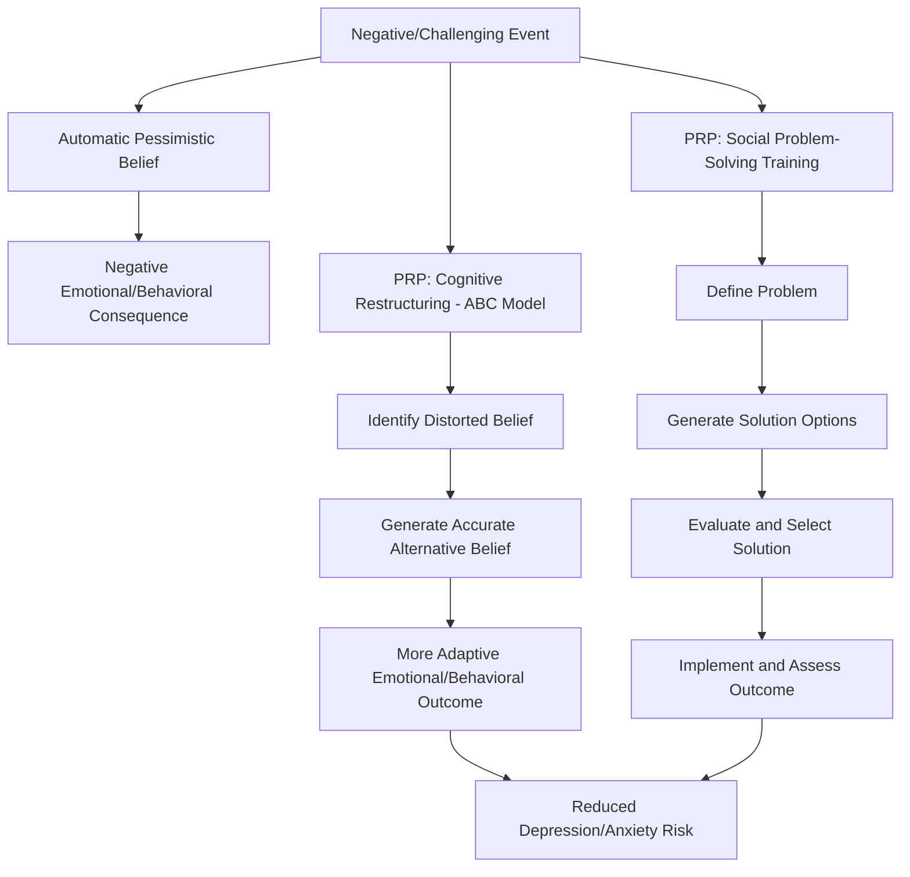

## The Penn Resiliency Program for Youth

### Overview

The Penn Resiliency Program (PRP) is a manualized, school-based group intervention developed at the University of Pennsylvania, primarily associated with Martin Seligman, Karen Reivich, and colleagues, designed to prevent depression and anxiety symptoms and build resilience in children and adolescents. Grounded in cognitive-behavioral theory and positive psychology, PRP teaches young people to identify and dispute pessimistic and inaccurate thought patterns, build social problem-solving skills, and apply these skills to interpersonal and academic challenges. It is among the most extensively studied youth resilience interventions in the prevention science literature, with numerous randomized controlled trials and meta-analyses examining its effects.

### Theoretical Foundations

**Key Points**

- **Cognitive-Behavioral Theory (Beck's Model)**: PRP draws heavily on the premise that pessimistic or distorted interpretations of events (cognitive distortions), rather than the events themselves, drive depressive and anxious symptoms.
- **Learned Helplessness / Explanatory Style (Seligman)**: The program is built substantially on Seligman's earlier work on learned helplessness and attributional/explanatory style — the idea that individuals who explain negative events using permanent, pervasive, and personal attributions ("this will never change," "this affects everything," "it's my fault") are more vulnerable to depression, while a more flexible, accurate explanatory style is protective.
- **Social Problem-Solving Theory**: The program integrates skills training for interpersonal problem-solving, assertiveness, negotiation, and decision-making, treating social competence as a resilience factor distinct from purely cognitive skills.
- **Prevention Science Framework**: PRP is explicitly designed as a *universal* or *selective* prevention program (delivered to whole classrooms or at-risk groups before clinical onset) rather than a treatment for diagnosed depression, aligning with a public-health model of intervening before symptom onset.

### Core Curriculum Components

**Key Points**

The standard PRP curriculum is typically delivered across approximately 12 to 24 sessions (session count varies by program version and setting), usually to groups of middle-school-aged children (approximately ages 10–14), led by trained facilitators (teachers, school counselors, or program-trained staff).

1. **Cognitive Component**:
   - The **ABC Model** (Activating event, Belief, Consequence), adapted from Albert Ellis's Rational Emotive Behavior Therapy, is used to teach students that their beliefs about an event, not the event itself, determine their emotional and behavioral consequences.
   - Students learn to identify automatic, often distorted, thoughts and to generate more accurate, evidence-based alternative interpretations.
   - Techniques for **decatastrophizing** (evaluating the realistic worst-case, best-case, and most-likely outcomes of a feared situation) are taught explicitly.
   - Explanatory style retraining: exercises specifically targeting the permanent/pervasive/personal attributional dimensions described above.
2. **Social Problem-Solving Component**:
   - A structured, stepwise problem-solving model (typically: define the problem, generate multiple possible solutions, evaluate consequences, select and implement a solution) applied to realistic peer, family, and school scenarios.
   - Assertiveness training, including techniques for expressing needs and disagreements without escalating conflict.
   - Negotiation skills for resolving interpersonal disputes.
3. **Coping Skills Component**:
   - Relaxation and self-calming techniques for managing physiological arousal associated with anxiety.
   - Skills for managing procrastination and avoidance behaviors.
   - Strategies for managing anger and impulsive behavior in social situations.

### Delivery Format and Structure

**Key Points**

- **Group Format**: PRP is designed for small-to-medium group delivery (commonly 8–15 students), typically within a school setting during a regular class period or as an after-school program.
- **Manualized Facilitator Guide**: The program provides a structured facilitator manual with session-by-session scripts, role-play scenarios, and skill-building exercises, intended to standardize delivery across different facilitators and settings.
- **Facilitator Training**: Facilitators (who may be teachers, school psychologists, or counselors rather than licensed clinicians) typically undergo a structured training process prior to program delivery, reflecting the program's design for scalable, non-specialist implementation within existing school infrastructure.
- **Session Length and Total Duration**: [Unverified] Exact session count and duration vary somewhat across published trials and program iterations (e.g., original PRP, PRP-A adolescent version, later adaptations), generally ranging from approximately 12 sessions in briefer implementations to over 20 in more extended versions.

### Program Logic Diagram

### Target Population and Delivery Contexts

**Key Points**

- **Primary Target Age**: Late childhood through early adolescence (approximately 10–14 years old), corresponding to a developmental period associated with rising rates of depressive symptom onset.
- **Universal vs. Targeted Delivery**: PRP has been studied both as a *universal* intervention (delivered to entire classrooms regardless of baseline risk) and as a *targeted/selective* intervention (delivered specifically to children identified as at elevated risk via elevated depressive symptoms or other risk factors).
- **Settings**: Primarily implemented in school settings, though adaptations have been studied in community mental health and other youth-serving organizational contexts.
- **Adaptations**: Variants exist for different age ranges and cultural contexts, including adolescent-focused versions and international adaptations (e.g., studies conducted in the UK, China, and other countries), which have sometimes modified content to fit local cultural and linguistic contexts.

### Evidence Base and Outcomes

**Key Points**

- PRP is one of the most heavily studied depression-prevention programs for youth, with a substantial number of randomized controlled trials conducted since the 1990s.
- Meta-analytic reviews have generally found **modest but statistically significant reductions in depressive symptoms** in the short-to-medium term following PRP participation compared to control conditions, though effect sizes are typically small to moderate rather than large.
- [Unverified] Findings on the **durability** of program effects over longer follow-up periods (e.g., beyond 1–2 years) are more mixed across studies, with some trials showing effects that diminish over time and others showing more sustained benefits, complicating firm conclusions about long-term preventive impact.
- Effects appear to vary based on factors including **facilitator fidelity to the manualized protocol**, baseline symptom levels of participants (some evidence suggests larger effects in higher-risk subgroups), and cultural/contextual fit of the adapted curriculum.
- [Inference] The variability in long-term outcomes across studies suggests that program effects may be more reliably characterized as producing a meaningful but time-limited reduction in symptom risk, rather than a permanent inoculation against depression, though this interpretation is not universally agreed upon in the prevention science literature.

### Critiques and Limitations

**Key Points**

- **Effect Size Modesty**: Critics note that while statistically significant, the average effect sizes found in meta-analyses are often small, raising questions about the practical/clinical significance of the intervention at a population level.
- **Publication and Research Group Effects**: [Unverified] Some meta-analytic work has noted that trials conducted by the program's originating research group have tended to report larger effects than independent replications, a pattern sometimes referred to as an "allegiance effect" in psychotherapy and prevention research more broadly; this pattern warrants caution in generalizing the strongest reported effect sizes.
- **Implementation Fidelity Challenges**: Because delivery often relies on teachers or non-specialist staff rather than clinically trained facilitators, real-world implementation fidelity can vary considerably from the standardized conditions used in controlled trials, potentially reducing effectiveness outside research settings.
- **Universal Delivery Cost-Effectiveness**: Some analyses question whether universal delivery (to all students regardless of risk) is the most efficient use of resources compared to more targeted delivery to identified at-risk youth, given the generally modest average effect sizes in universal-delivery trials.

### Relationship to Broader Positive Psychology and Resilience Frameworks

**Key Points**

- PRP is frequently cited as a foundational example of translating cognitive-behavioral and positive psychology principles into a scalable, preventive, school-based format, influencing subsequent programs such as the U.S. Army's Comprehensive Soldier and Family Fitness program (which drew on similar resilience-training principles for an adult, military population).
- The program's emphasis on explanatory style and cognitive restructuring situates it within the broader lineage of Seligman's work on learned helplessness and optimism, linking it conceptually to later positive psychology constructs such as learned optimism.

### Related Topics

- Learned Helplessness and Explanatory Style (Seligman)
- Cognitive-Behavioral Therapy (CBT) Foundations
- Albert Ellis's Rational Emotive Behavior Therapy and the ABC Model
- The Comprehensive Soldier and Family Fitness Program
- Universal vs. Targeted Prevention Program Design
- Meta-Analytic Methods in Prevention Science
- School-Based Mental Health Intervention Models