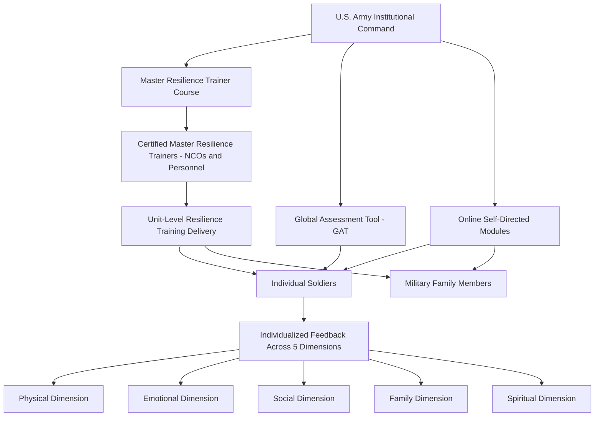

## Comprehensive Soldier and Family Fitness and Military Resilience Training

### Overview

The Comprehensive Soldier and Family Fitness (CSF2) program is a U.S. Army-wide initiative designed to systematically build psychological resilience and overall fitness across the force, extending positive psychology and resilience-training principles from clinical and educational settings into a large-scale military organizational context. Originally launched as the Comprehensive Soldier Fitness (CSF) program in 2009 and later expanded and renamed CSF2 to explicitly include military families, the program was developed in significant collaboration with positive psychology researchers, most notably Martin Seligman, and drew heavily on the theoretical and curricular foundations of the Penn Resiliency Program. It represents one of the largest-scale institutional applications of positive psychology-informed resilience training ever implemented.

### Historical Context and Rationale

**Key Points**

- The program emerged in the context of sustained, high-tempo deployments during the wars in Iraq and Afghanistan, amid documented concerns about elevated rates of post-traumatic stress disorder (PTSD), depression, suicide, and family strain among service members and their families.
- The Army's stated rationale was to shift from a purely reactive posture (treating psychological injury after it occurred) to a proactive, preventive posture, explicitly modeled on the public-health logic of physical fitness training — the premise being that psychological resilience, like physical fitness, could be systematically trained before exposure to stressors rather than only treated afterward.
- The program was explicitly framed as parallel and complementary to physical fitness training already embedded in Army culture, extending the "fitness" framework to psychological, social, family, emotional, and spiritual domains.

### The Five Dimensions of Strength

**Key Points**

CSF2 is organized around a multidimensional model of fitness, generally described as encompassing five interrelated domains:

1. **Physical**: Traditional physical fitness and health behaviors, treated as foundational to overall resilience capacity.
2. **Emotional**: The capacity to approach life's challenges in a positive, optimistic manner, incorporating emotional regulation and constructive coping.
3. **Social**: The ability to build and maintain trusted, meaningful relationships and networks of support, both within military units and in family/community contexts.
4. **Family**: A domain specific to the "family" component of CSF2, addressing resilience within the family unit, including communication, relationship skills, and mutual support between service members and their families during deployment cycles.
5. **Spiritual**: Defined broadly (not necessarily religiously) as a sense of purpose, meaning, and connection to something larger than oneself, intended to be inclusive of both religious and secular/existential frameworks for meaning-making.

### Core Program Components

**Key Points**

- **Global Assessment Tool (GAT)**: A self-report psychological assessment administered to soldiers (and later, family members, via a family-specific version) to measure resilience and fitness across the five dimensions described above, intended to provide individualized feedback and identify areas for targeted training.
- **Master Resilience Trainer (MRT) Program**: A train-the-trainer model in which selected non-commissioned officers and other personnel undergo an intensive training course (delivered in part through a partnership with the University of Pennsylvania's Positive Psychology Center) to become certified Master Resilience Trainers, who then deliver resilience training modules to their units. This model mirrors the school-based, non-specialist-facilitator delivery approach used in the Penn Resiliency Program.
- **Institutional Resilience Training (IRT)**: Structured curriculum modules covering skills such as cognitive reframing (identifying and disputing counterproductive thinking patterns, closely modeled on the ABC framework used in PRP), building strong relationships, effective communication, and goal-setting.
- **Online/Self-Directed Modules**: Web-based training modules corresponding to each of the five fitness dimensions, accessible to soldiers and, in the CSF2 family-inclusive iteration, to family members as well.
- **Family-Specific Programming**: Following the expansion to CSF2, dedicated modules and resources were developed to address family resilience specifically, including resources for spouses and children coping with deployment cycles, reintegration, and the unique stressors of military family life.

### Curricular Content Areas (Drawing on PRP and Related Cognitive-Behavioral Frameworks)

**Key Points**

- **Cognitive Reframing / "Hunt the Good Stuff"**: Exercises designed to counteract negativity bias by deliberately identifying and reflecting on positive events, closely related to gratitude-journaling interventions found in the broader positive psychology literature.
- **Avoiding Thinking Traps**: Direct adaptation of cognitive-distortion identification techniques (e.g., catastrophizing, overgeneralization, mind-reading) from cognitive-behavioral therapy and the Penn Resiliency Program curriculum.
- **Assertive Communication**: Structured communication skills training intended to improve conflict resolution both within military units and family relationships.
- **Interpretive/Explanatory Style Training**: Techniques for identifying and modifying pessimistic explanatory patterns, again reflecting direct influence from Seligman's learned-optimism and explanatory-style research.
- **Character Strengths Application**: Some curricular elements draw on the VIA Classification of character strengths (also associated with Seligman and Christopher Peterson), encouraging soldiers to identify and apply personal strengths in operational and family contexts.

### Organizational Delivery Model

### Evidence Base and Evaluation

**Key Points**

- The program's initial rollout included large-scale internal evaluation efforts, and some published research (including work involving program-affiliated researchers) reported associations between MRT training and improved measures of resilience and reduced negative outcomes such as risky behavior in trained cohorts.
- The program attracted substantial external scientific scrutiny and critique, particularly regarding the strength of the evidence base used to justify Army-wide implementation prior to and during rollout.
- [Unverified] Independent, non-program-affiliated evaluations have generally found more mixed or inconclusive evidence for CSF2's effectiveness at reducing clinically significant outcomes such as PTSD incidence or suicide rates compared to internal program evaluations, though rigorous randomized controlled trial designs are difficult to implement at the scale and organizational context of an entire military service branch.
- A widely cited methodological critique, associated with psychologist Roy Eidelson and colleagues among others, argued that the program was deployed at a very large scale (reportedly targeting over a million soldiers) before adequate independent, peer-reviewed evidence of effectiveness had been established, raising concerns about evidence-based practice standards in large-scale institutional psychology programs. [Inference] This critique reflects a broader tension in applied positive psychology between the appeal of scalable, low-cost preventive programming and the methodological rigor typically expected before wide implementation, rather than a claim that the program was necessarily ineffective.

### Critiques and Controversies

**Key Points**

- **Evidence Timing Critique**: As noted above, critics argued the program's scale of deployment outpaced the maturity of its supporting evidence base at the time of rollout.
- **Assessment Validity Concerns**: Some critics raised concerns about the psychometric properties of the Global Assessment Tool, including questions about whether self-report resilience measures administered in a mandatory military context (where responses could plausibly affect career evaluations or perceived fitness for duty) would yield valid, non-biased responses.
- **"Spiritual Fitness" Controversy**: The inclusion of a "spiritual" fitness dimension drew specific controversy and, in at least one instance, legal challenge from advocacy groups concerned about the appropriateness of a mandatory military program addressing spiritual/religious content, given First Amendment establishment-clause considerations in a government institutional context.
- **Generalizability from Civilian Models**: Critics have questioned the degree to which resilience curricula developed and validated in civilian, largely adolescent (PRP) or general adult populations generalize effectively to the specific stressors of combat exposure and military operational environments, which differ substantially in intensity and nature from the stressors targeted in the original civilian program designs.
- **Mandatory Participation Concerns**: Because training and assessment were often mandatory rather than voluntary within units, some critique has focused on whether mandatory delivery affects genuine engagement and outcome effectiveness compared to voluntary program models.

### Relationship to Broader Resilience and Positive Psychology Frameworks

**Key Points**

- CSF2 represents a direct institutional extension of principles developed in the Penn Resiliency Program, adapted from a school-based adolescent context to an adult, high-stakes occupational context.
- The program is frequently discussed in the positive psychology literature as a case study in the challenges of translating individual- and small-group-validated interventions to large-scale institutional deployment, illustrating both the appeal and the risks of applying positive psychology principles at scale within a hierarchical organizational structure.
- The five-dimension fitness model (physical, emotional, social, family, spiritual) has itself become a reference framework cited in subsequent discussions of multidimensional resilience models beyond the military context.

### Related Topics

- The Penn Resiliency Program for Youth
- Learned Helplessness and Explanatory Style (Seligman)
- The VIA Classification of Character Strengths and Virtues
- Post-Traumatic Stress Disorder (PTSD) in Military Populations
- Evidence-Based Practice Standards in Large-Scale Psychological Interventions
- Organizational and Occupational Resilience Training Models
- Ethical Considerations in Mandatory Institutional Psychological Programming