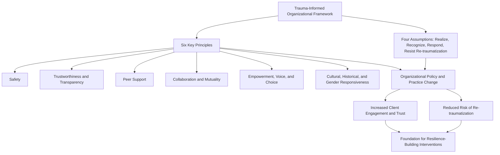

## Trauma-Informed Approaches to Resilience Building

### Overview

Trauma-informed approaches represent a framework for organizational and clinical practice that shifts the guiding question from "what is wrong with this person?" to "what has happened to this person?" Rather than constituting a single manualized intervention (as with the Penn Resiliency Program or CSF2), a trauma-informed approach is best understood as a set of organizing principles that can be layered onto virtually any service delivery context — clinical, educational, correctional, social service, or organizational — to ensure that practices do not inadvertently re-traumatize individuals and actively support resilience-building. This framework is closely associated with the Substance Abuse and Mental Health Services Administration's (SAMHSA) widely adopted conceptual model.

### Foundational Distinction: Trauma-Informed vs. Trauma-Specific

**Key Points**

- **Trauma-Informed Care**: An organizational and systemic orientation that assumes a high baseline prevalence of trauma history among service recipients and adjusts policies, physical environments, staff training, and interpersonal practices accordingly, regardless of whether a formal trauma disclosure or diagnosis has occurred.
- **Trauma-Specific Services**: Targeted clinical interventions designed specifically to treat identified trauma or PTSD (e.g., Trauma-Focused Cognitive Behavioral Therapy, Eye Movement Desensitization and Reprocessing). Trauma-informed care is not itself a treatment for trauma; it is the contextual foundation within which trauma-specific and general services are delivered.
- [Inference] This distinction matters because an organization can meaningfully become "trauma-informed" (e.g., a school, a primary care clinic) without every staff member being a trauma treatment specialist — the framework is designed to be adopted broadly rather than restricted to specialist clinical settings.

### SAMHSA's Four Assumptions ("The Four R's")

**Key Points**

The SAMHSA conceptual framework, widely referenced as a foundational articulation of trauma-informed care, organizes the approach around four key assumptions a trauma-informed program, organization, or system should hold:

1. **Realize** the widespread impact of trauma and understand potential paths for recovery.
2. **Recognize** the signs and symptoms of trauma in clients, families, staff, and others involved with the system.
3. **Respond** by fully integrating knowledge about trauma into policies, procedures, and practices.
4. **Resist Re-traumatization** of clients as well as staff.

### The Six Key Principles of a Trauma-Informed Approach

**Key Points**

Beyond the Four R's, SAMHSA articulates six principles intended to guide implementation across any setting:

1. **Safety**: Ensuring both physical and psychological safety for clients and staff throughout all interactions and environments.
2. **Trustworthiness and Transparency**: Organizational operations and decisions are conducted with transparency, with the goal of building and maintaining trust among clients, family members, and staff.
3. **Peer Support**: Individuals with shared lived experience of trauma are integrated as a key vehicle for building safety, trust, and hope.
4. **Collaboration and Mutuality**: Power differences between staff and clients (or between different levels of staff) are leveled to the extent possible, emphasizing partnership and shared decision-making in the healing process.
5. **Empowerment, Voice, and Choice**: Individual strengths and experiences are recognized and built upon; clients are supported in shared decision-making, choice, and goal-setting, rather than having decisions made entirely on their behalf.
6. **Cultural, Historical, and Gender Issues**: The approach actively addresses historical trauma and offers responsiveness to the cultural, gender, and identity-specific needs of the population served, moving past cultural stereotypes and biases.

### Structural Framework Diagram

### Relationship to Resilience Building

**Key Points**

- A trauma-informed foundation is theorized as a **necessary precondition** for effective resilience-building interventions in populations with significant trauma exposure: attempting to deliver skills-based resilience curricula (e.g., cognitive restructuring, goal-setting) without first establishing safety and trust risks poor engagement, dropout, or inadvertent re-traumatization.
- This framework connects to the concept of **window of tolerance** (associated with Dan Siegel's work), which describes the physiological/emotional zone within which an individual can process information and engage in learning; trauma-informed practices aim to keep individuals within this window (avoiding hyperarousal or dissociative shutdown) so that resilience-skill acquisition is possible.
- Trauma-informed principles are frequently integrated as a *delivery layer* underneath specific resilience curricula — for example, a school implementing the Penn Resiliency Program within a broader trauma-informed school culture would adapt facilitator training, physical environment, and disclosure-handling protocols to trauma-informed standards, rather than treating the resilience curriculum as a standalone add-on.

### Application Domains

**Key Points**

- **Trauma-Informed Schools**: Adjustments to classroom management, discipline policy (shifting from punitive to relationship-based approaches), staff training on recognizing trauma responses (e.g., distinguishing defiance from a trauma-driven fight/flight/freeze response), and physical environment modifications (reducing unpredictable stimuli, providing calm-down spaces).
- **Trauma-Informed Healthcare Settings**: Practices such as universal precautions (assuming trauma history may be present in any patient regardless of disclosure), modified intake procedures to avoid re-traumatizing questioning, and staff training on trauma-sensitive communication during physical examinations or procedures.
- **Trauma-Informed Criminal Justice and Correctional Settings**: Adjustments to intake, housing, and disciplinary procedures in recognition of high trauma prevalence among justice-involved populations, alongside integration of peer support and de-escalation training for staff.
- **Trauma-Informed Workplaces**: Organizational policies addressing psychological safety, manager training on recognizing and responding to employee distress, and flexible accommodation practices, particularly relevant in high-exposure occupations (first responders, healthcare, social work).

### Adverse Childhood Experiences (ACEs) as a Driving Evidence Base

**Key Points**

- The trauma-informed movement draws substantially on findings from the Adverse Childhood Experiences (ACE) Study (originally conducted by Felitti, Anda, and colleagues), which found a dose-response relationship between the number of adverse childhood experiences reported and later-life physical health, mental health, and behavioral outcomes.
- This evidence base is frequently cited as the epidemiological rationale for adopting universal, trauma-informed practices across service systems (rather than only providing trauma-specific care to individuals with disclosed trauma histories), since ACE research suggests trauma exposure is common enough in the general population to warrant a systemic, rather than exceptional, response.
- [Unverified] While the ACE study's dose-response findings are widely replicated in subsequent research, some methodological critiques have raised questions about the retrospective self-report nature of the original ACE measure and the generalizability of specific effect sizes across different populations and measurement approaches.

### Critiques and Implementation Challenges

**Key Points**

- **Implementation Variability**: Because trauma-informed care is a set of principles rather than a manualized protocol, implementation fidelity and depth vary considerably across organizations claiming to be "trauma-informed," making outcome evaluation and comparison across studies difficult.
- **Measurement Challenges**: There is no single standardized instrument analogous to the PTGI for measuring organizational-level "trauma-informedness," which complicates rigorous evaluation of whether adopting the framework produces measurable improvements in resilience or reduced re-traumatization compared to standard practice.
- **Risk of Superficial Adoption**: Critics note a risk that organizations may adopt trauma-informed language and training without corresponding structural or policy change (sometimes discussed as "trauma-informed" branding without substantive practice shift), limiting real-world impact.
- **Staff Burden and Vicarious Trauma**: Implementing trauma-informed practices, particularly in high-exposure settings, places cognitive and emotional demands on staff; without corresponding organizational support for staff wellbeing (itself one of SAMHSA's stated principles), implementation can contribute to staff burnout or vicarious traumatization.
- [Inference] Given the principle-based rather than protocol-based structure of this framework, its effectiveness likely depends heavily on depth and consistency of organizational implementation, which may explain some of the variability in outcomes reported across different trauma-informed initiatives in the literature.

### Related Topics

- The Adverse Childhood Experiences (ACEs) Study
- The Penn Resiliency Program for Youth
- Vicarious and Collective Post-Traumatic Growth
- Window of Tolerance and Polyvagal-Informed Practice
- Trauma-Focused Cognitive Behavioral Therapy (TF-CBT)
- Organizational Change Frameworks in Human Services
- Cultural Humility and Historical Trauma Frameworks