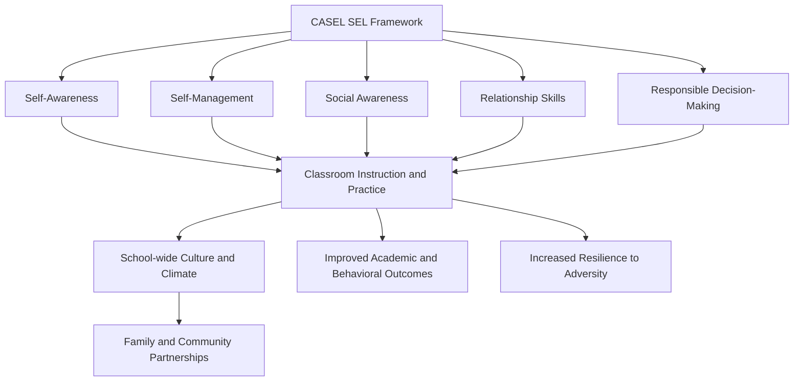

## School-Based Resilience and Social-Emotional Learning Programs

### Overview

School-based resilience and social-emotional learning (SEL) programs represent a broad category of structured curricula delivered within educational settings to build students' capacity to understand and manage emotions, set and achieve positive goals, feel and show empathy, establish positive relationships, and make responsible decisions. While related to targeted resilience programs like the Penn Resiliency Program, SEL constitutes a wider umbrella framework, often integrated into general education rather than delivered only as a discrete prevention program, and is most closely associated institutionally with the Collaborative for Academic, Social, and Emotional Learning (CASEL).

### The CASEL Framework: Five Core Competencies

**Key Points**

CASEL's widely adopted framework organizes SEL around five interrelated core competencies:

1. **Self-Awareness**: The ability to accurately recognize one's own emotions, thoughts, and values and how they influence behavior, including realistic self-assessment of strengths and limitations and a well-grounded sense of confidence and purpose.
2. **Self-Management**: The ability to regulate one's emotions, thoughts, and behaviors effectively in different situations, including managing stress, controlling impulses, motivating oneself, and setting and working toward personal and academic goals.
3. **Social Awareness**: The ability to take the perspective of and empathize with others from diverse backgrounds and cultures, understand social and ethical norms for behavior, and recognize family, school, and community resources and supports.
4. **Relationship Skills**: The ability to establish and maintain healthy and rewarding relationships with diverse individuals and groups, including communicating clearly, listening actively, cooperating, resisting inappropriate social pressure, negotiating conflict constructively, and seeking and offering help when needed.
5. **Responsible Decision-Making**: The ability to make constructive choices about personal behavior and social interactions based on consideration of ethical standards, safety concerns, social norms, and the realistic evaluation of consequences of various actions.

### The CASEL Framework Diagram

### The "Casel Wheel": Levels of Implementation

**Key Points**

CASEL's implementation model describes SEL as operating across nested contextual levels, sometimes depicted as concentric rings around the five core competencies:

- **Classrooms**: Direct instruction, explicit SEL curricula, supportive teaching practices, and integration of SEL into academic content delivery.
- **Schools**: School-wide policies, discipline approaches, and culture-building practices (e.g., advisory periods, restorative practices) that reinforce SEL competencies beyond individual classrooms.
- **Families and Caregivers**: Partnership strategies to extend and reinforce SEL skill practice into the home environment.
- **Communities**: Broader community partnerships (youth organizations, mental health services, local government) that support and reinforce SEL development across a young person's full ecological context.

### Distinguishing SEL from Targeted Resilience Curricula

**Key Points**

- SEL programs are typically **universal** in design and delivery, integrated into general classroom instruction for entire student populations regardless of risk status, whereas some resilience programs (like the selective delivery model of PRP) are explicitly designed for at-risk subgroups.
- SEL curricula tend to have a **broader competency scope** (encompassing academic, social, and emotional domains simultaneously) compared to more narrowly targeted cognitive-behavioral resilience programs focused specifically on depression/anxiety symptom prevention.
- Many widely used SEL programs (e.g., Second Step, PATHS — Promoting Alternative Thinking Strategies, RULER) share underlying cognitive-behavioral and social-learning theoretical roots with targeted resilience programs, and in practice, the categories overlap substantially — a school might describe a Penn-Resiliency-Program-style curriculum as one component of its broader SEL implementation strategy.

### Representative Program Examples

**Key Points**

- **PATHS (Promoting Alternative Thinking Strategies)**: A curriculum for elementary-aged children emphasizing emotional literacy, self-control, and social problem-solving through structured lessons, widely studied in randomized trials.
- **Second Step**: A K-8 curriculum addressing skills in empathy, emotion management, and problem-solving, delivered through age-graded lesson sequences.
- **RULER Approach**: Developed at the Yale Center for Emotional Intelligence, RULER (an acronym for Recognizing, Understanding, Labeling, Expressing, and Regulating emotions) emphasizes emotional intelligence skill-building integrated across the school community, including staff and families, rather than only direct student instruction.
- **Responsive Classroom**: An approach integrating SEL principles into daily classroom management and teaching practices rather than delivering a separate stand-alone lesson sequence.
- [Unverified] The relative comparative effectiveness of these specific named programs against one another has not been established through extensive head-to-head trial designs; most evidence derives from independent evaluations of each program against no-intervention or business-as-usual control conditions rather than direct program-to-program comparison.

### Delivery Models

**Key Points**

- **Stand-Alone Lesson Sequences**: Dedicated class periods (often 20–45 minutes weekly) devoted specifically to SEL instruction using a scripted or semi-scripted curriculum.
- **Integrated/Infused Instruction**: SEL skill-building embedded directly within academic content instruction (e.g., using literature discussion to explore perspective-taking, or embedding self-regulation prompts within math instruction) rather than delivered as a separate subject.
- **School-Wide Climate Initiatives**: Broader structural and cultural interventions (e.g., restorative justice practices, advisory/homeroom systems, positive behavioral interventions and supports frameworks) that reinforce SEL competencies through the overall school environment rather than discrete lessons.
- **Teacher Professional Development Models**: Some approaches (e.g., RULER) prioritize training teachers and staff in SEL competencies and practices first, on the theory that teacher modeling and classroom climate are more impactful delivery vehicles than direct student curricula alone.

### Evidence Base and Outcomes

**Key Points**

- Large-scale meta-analyses (notably a widely cited synthesis led by Joseph Durlak and colleagues, encompassing several hundred studies) have generally found that well-implemented SEL programs are associated with improvements across multiple outcome domains: social-emotional skills, attitudes toward self and others, positive social behavior, reduced conduct problems, reduced emotional distress, and improved academic performance.
- [Unverified] While these meta-analytic findings are broadly consistent across multiple independent reviews, effect sizes vary considerably depending on program type, implementation quality, and outcome measure, and some individual program evaluations have found null or mixed results, particularly in real-world (as opposed to research-supported) implementation conditions.
- Evidence suggests that **implementation quality** — including facilitator training, fidelity to program design, and dosage (number of sessions delivered as intended) — is a significant moderator of outcomes, with poorly implemented programs showing substantially reduced or negligible effects compared to well-implemented versions in efficacy trials.

### Critiques and Implementation Challenges

**Key Points**

- **Efficacy-to-Effectiveness Gap**: As with many school-based interventions, effect sizes found in tightly controlled efficacy trials (often conducted with researcher involvement and support) tend to be larger than those found in "real-world" effectiveness trials conducted under normal school operating conditions, raising questions about scalability.
- **Cultural and Contextual Fit**: Critics have raised concerns about whether SEL frameworks developed predominantly within North American educational and cultural contexts translate directly to other cultural settings without meaningful adaptation of content and delivery norms.
- **Political and Ideological Controversy**: [Unverified] In some contexts, SEL programming has become subject to public and political controversy, with critics raising concerns (contested by SEL proponents and much of the empirical literature) about curriculum content extending beyond core social-emotional skill-building into more contested value-laden territory; the empirical evidence base for the core competency framework itself is generally treated separately from these specific political debates in the academic literature.
- **Assessment Difficulty**: Reliable, valid, and practical measurement of SEL competencies at scale (as opposed to research-context measurement) remains a persistent methodological challenge, with most schools lacking access to the more rigorous assessment tools used in formal evaluation studies.
- **Sustainability**: Programs are frequently found to weaken or be discontinued after initial grant funding or research partnerships end, raising concerns about the durability of school-wide SEL implementation absent sustained institutional investment.

### Relationship to Broader Resilience and Positive Psychology Frameworks

**Key Points**

- SEL competencies overlap substantially with constructs central to positive psychology and resilience research, including emotional regulation, self-efficacy, and social support — the same underlying skill domains addressed by targeted programs like the Penn Resiliency Program, but delivered through a broader, less clinically framed curricular lens.
- The trauma-informed schools movement (see related topic) and SEL frameworks are frequently integrated in practice, with trauma-informed principles providing the safety and relational foundation upon which SEL skill instruction is layered.

### Related Topics

- The Penn Resiliency Program for Youth
- Trauma-Informed Approaches to Resilience Building
- The CASEL Framework and Implementation Model
- RULER Approach to Emotional Intelligence (Yale Center for Emotional Intelligence)
- Positive Behavioral Interventions and Supports (PBIS)
- Restorative Justice Practices in Schools
- Meta-Analytic Methods in Educational Intervention Research