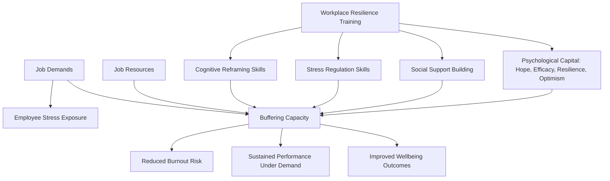

## Workplace Resilience Training Programs

### Overview

Workplace resilience training programs comprise a category of organizational interventions designed to build employees' capacity to adapt to stress, adversity, and change within occupational settings, with the goal of reducing burnout, improving wellbeing, and sustaining performance under sustained workplace demands. Unlike the largely manualized, single-protocol structure of programs such as the Penn Resiliency Program, workplace resilience training spans a heterogeneous set of approaches — ranging from brief workshop-based interventions to comprehensive organizational culture initiatives — typically drawing on cognitive-behavioral, mindfulness-based, and positive-organizational-psychology frameworks.

### Theoretical Foundations

**Key Points**

- **Job Demands-Resources (JD-R) Model**: A widely cited occupational health framework proposing that employee wellbeing and burnout risk result from the balance between job demands (workload, emotional labor, role conflict) and job resources (autonomy, social support, feedback); resilience training is often framed as building personal resources that buffer the impact of high job demands.
- **Positive Organizational Scholarship / Positive Organizational Behavior**: A research tradition (associated with scholars such as Fred Luthans) applying positive psychology constructs to organizational contexts, emphasizing measurable, developable psychological capacities relevant to workplace performance.
- **Psychological Capital (PsyCap)**: A specific construct developed within positive organizational behavior research, comprising four components — hope, efficacy, resilience, and optimism (often referred to by the acronym HERO) — theorized as a higher-order, state-like resource that can be developed through targeted intervention (commonly termed PsyCap Intervention, or PCI).
- **Conservation of Resources (COR) Theory**: A stress theory proposing that individuals strive to obtain, retain, and protect valued resources (including psychological resources like resilience), and that stress arises from actual or threatened resource loss; resilience training is framed within this model as building a reservoir of psychological resources.

### Common Curricular Components

**Key Points**

Workplace resilience programs vary considerably in content and delivery format, but frequently draw on a recurring set of skill domains:

1. **Cognitive Reframing and Realistic Optimism**: Techniques for identifying and challenging unhelpful thought patterns related to workplace stressors, closely paralleling cognitive-behavioral techniques used in the Penn Resiliency Program and CSF2, adapted to occupational scenarios (e.g., handling critical feedback, managing workload pressure).
2. **Stress Management and Physiological Regulation**: Training in relaxation techniques, breathing exercises, and other physiological self-regulation strategies intended to reduce acute stress arousal.
3. **Mindfulness-Based Components**: Many contemporary workplace resilience programs integrate mindfulness practices (attention training, present-moment awareness) adapted from clinical mindfulness-based stress reduction (MBSR) protocols, though typically abbreviated relative to full clinical MBSR courses.
4. **Goal-Setting and Self-Efficacy Building**: Structured goal-setting exercises intended to build a sense of controllability and self-efficacy, drawing on psychological capital and self-efficacy theory.
5. **Social Support and Team Cohesion Building**: Activities designed to strengthen peer support networks and team-level psychological safety, recognizing social support as a key buffering resource against occupational stress.
6. **Recovery and Boundary-Setting Skills**: Guidance on work-recovery practices (e.g., psychological detachment from work during non-work hours) intended to prevent the resource depletion associated with chronic stress exposure.

### Delivery Formats

**Key Points**

- **Brief Workshop Format**: Single or multi-session workshops (ranging from a few hours to a few days), often delivered by external consultants or internal learning-and-development staff, covering a condensed version of the skill domains above.
- **Extended Multi-Week Programs**: Structured programs delivered over several weeks with spaced sessions, more closely resembling the manualized, skill-building structure of clinical or educational resilience curricula.
- **Digital/App-Based Delivery**: Self-directed online modules or mobile applications delivering resilience content asynchronously, often used to scale training across large or geographically distributed workforces at lower marginal cost than in-person delivery.
- **Coaching and One-on-One Models**: Individualized coaching relationships focused on applying resilience principles to an employee's specific role and challenges, often used for leadership development programs specifically.
- **Organizational Culture Interventions**: Broader initiatives extending beyond individual-level training to address structural and cultural factors (management practices, workload design, psychological safety norms) theorized to influence resilience at a systemic rather than purely individual level.

### Structural Diagram: Workplace Resilience Program Logic

### Target Populations and Contexts

**Key Points**

- **General Corporate Workforces**: Broadly delivered programs aimed at reducing burnout and improving general wellbeing metrics across an organization.
- **High-Stress Occupational Groups**: Specifically adapted programs for occupations with elevated stress exposure, including healthcare workers, first responders, and military personnel (see the Comprehensive Soldier and Family Fitness program as a military-specific example of this category).
- **Leadership and Management Programs**: Resilience training packaged specifically for managerial populations, often combined with broader leadership development content, on the theory that resilient leadership behavior cascades to team-level outcomes.
- **Remote and Hybrid Workforces**: [Unverified] An increasing number of programs have been adapted or newly designed specifically to address resilience challenges associated with remote work isolation and boundary-blurring, though the evidence base for these specific adaptations is comparatively newer and less extensively validated than for traditional in-person occupational resilience programs.

### Evidence Base and Outcomes

**Key Points**

- Meta-analytic reviews of workplace resilience interventions have generally found **small-to-moderate positive effects** on resilience measures, along with secondary improvements in related outcomes such as perceived stress, anxiety, depression symptoms, and subjective wellbeing.
- Evidence for **psychological capital interventions (PCI)** specifically has shown associations with improvements in job performance and job satisfaction metrics in a number of studies, though [Unverified] the durability of these effects beyond the immediate post-intervention period is less consistently established across the literature.
- As with school-based programs, **implementation fidelity, program duration, and facilitator competence** appear to moderate outcome magnitude, with brief, single-session workshops generally showing smaller and less durable effects than multi-session programs with spaced practice and follow-up.
- [Inference] The wide heterogeneity in program design, delivery format, and outcome measurement across the workplace resilience literature makes direct comparison across studies difficult, and meta-analytic effect size estimates should be interpreted as an average across a fairly diverse set of interventions rather than a precise estimate applicable to any single specific program design.

### Critiques and Limitations

**Key Points**

- **Individual-Level Framing Critique**: A significant and recurring critique holds that many workplace resilience programs implicitly place the burden of adaptation on the individual employee (building personal coping skills) while leaving structural organizational stressors (excessive workload, poor management practices, understaffing) unaddressed — sometimes summarized in the critical literature as programs treating resilience as an individual employee's responsibility rather than an organizational design problem.
- **Return-on-Investment Measurement Challenges**: Organizations often lack rigorous outcome tracking (e.g., pre-post validated measures, control comparison groups) when evaluating internally delivered resilience programs, making genuine effectiveness difficult to distinguish from participant satisfaction or engagement metrics alone.
- **Publication and Selection Bias**: [Unverified] As with many applied organizational intervention literatures, there is a risk that published evaluations disproportionately reflect successful program implementations, while less effective or null-result internal corporate programs may go unpublished, potentially inflating the apparent average effectiveness reported in academic reviews.
- **Risk of Superficial "Wellness Washing"**: Critics note a risk that resilience training is sometimes adopted as a low-cost, visible wellness initiative without corresponding investment in addressing underlying structural stressors, potentially limiting genuine impact on employee wellbeing at scale.
- **Voluntary vs. Mandatory Participation Effects**: As observed in the CSF2 military context, mandatory participation in workplace training may affect genuine engagement and self-report validity compared to voluntary program models, complicating outcome interpretation in organizationally mandated programs.

### Relationship to Broader Resilience and Positive Psychology Frameworks

**Key Points**

- Workplace resilience programs frequently borrow curricular content directly from the cognitive-behavioral tradition established in the Penn Resiliency Program, adapted for adult occupational rather than adolescent educational contexts.
- The Comprehensive Soldier and Family Fitness program represents a specific, large-scale, institutionally mandated example of workplace (military) resilience training, and shares many of the same structural critiques (evidence-base timing concerns, mandatory-participation effects) discussed in the broader workplace resilience literature.
- Psychological capital (PsyCap) has emerged as one of the more empirically developed constructs specific to the organizational context, distinguishing workplace resilience research from the largely clinical or educational focus of programs like PRP.

### Related Topics

- The Penn Resiliency Program for Youth
- Comprehensive Soldier and Family Fitness and Military Resilience Training
- The Job Demands-Resources (JD-R) Model
- Psychological Capital (PsyCap) and the HERO Model
- Burnout and Occupational Stress Frameworks
- Mindfulness-Based Stress Reduction (MBSR) in Organizational Settings
- Positive Organizational Scholarship