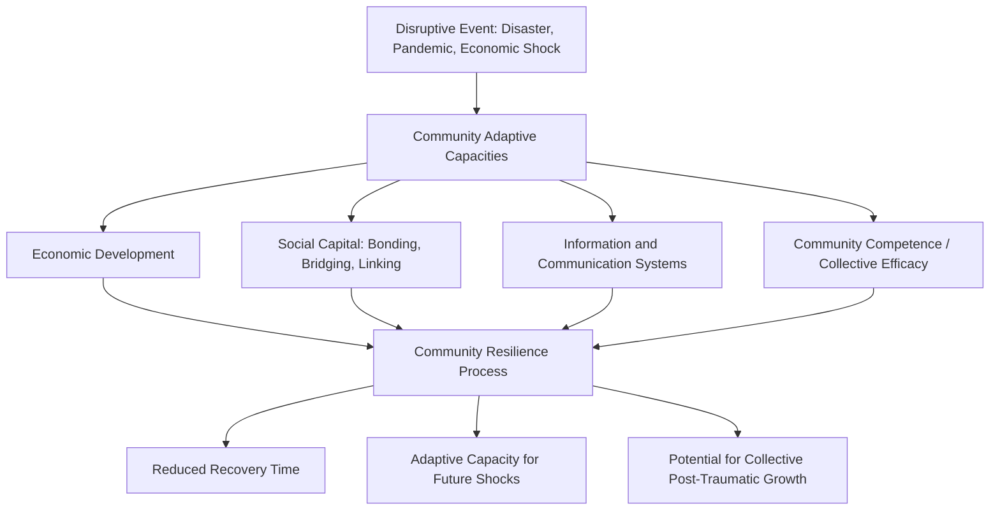
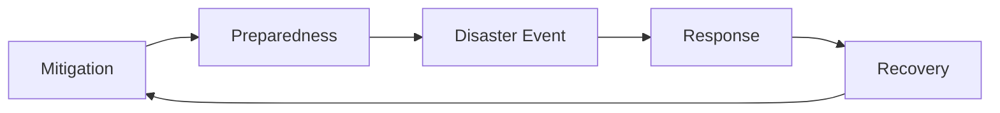

## Community-Based and Disaster Resilience Initiatives

### Overview

Community-based and disaster resilience initiatives shift the unit of intervention from the individual to the collective — neighborhoods, municipalities, regions, or entire societies — with the goal of building capacity to anticipate, withstand, adapt to, and recover from disruptive events such as natural disasters, pandemics, economic shocks, and mass violence. Unlike individually delivered curricula such as the Penn Resiliency Program, these initiatives operate through social infrastructure, institutional coordination, and ecological/systems-level design, drawing on frameworks from public health, disaster sociology, urban planning, and community psychology in addition to positive psychology.

### Defining Community Resilience

**Key Points**

- Community resilience is commonly defined as a process linking a set of adaptive capacities to a positive trajectory of functioning and adaptation after a disturbance, rather than a fixed trait a community either possesses or lacks.
- A widely cited conceptual synthesis by Norris, Stevens, Pfefferbaum, Wyche, and Pfefferbaum (2008) frames community resilience as emerging from four primary sets of networked adaptive capacities: **economic development**, **social capital**, **information and communication**, and **community competence**.
- [Inference] This networked-capacities framing treats resilience as an emergent property of interacting systems rather than a simple sum of individual residents' personal resilience, distinguishing the community-level construct conceptually from aggregated individual resilience measures.

### The Four Primary Adaptive Capacities (Norris et al. Framework)

**Key Points**

1. **Economic Development**: The level and diversity of economic resources available to a community, along with equitable distribution of those resources; communities with greater and more evenly distributed economic resources are theorized to have greater capacity to absorb and recover from shocks.
2. **Social Capital**: The networks of relationships, trust, and reciprocity within a community, commonly divided into *bonding social capital* (close ties within a homogeneous group), *bridging social capital* (ties across different groups within the community), and *linking social capital* (ties connecting community members to institutions and authorities with power or resources).
3. **Information and Communication**: The presence of trusted, reliable communication systems and narratives that allow accurate information to flow before, during, and after a disruptive event, reducing rumor-driven panic and supporting coordinated response.
4. **Community Competence**: Collective decision-making capacity, including community members' ability to identify problems, establish consensus on priorities, and act collectively — sometimes discussed as a form of collective efficacy.

### Structural Framework Diagram

### Common Program Types and Interventions

**Key Points**

- **Community Emergency Response Team (CERT) Programs**: Structured training programs (widely implemented in the U.S. and adapted internationally) that train civilian volunteers in basic disaster response skills (light search and rescue, basic first aid, fire suppression, team organization), building both practical response capacity and social cohesion among trained members.
- **Social Capital-Building Initiatives**: Programs explicitly designed to strengthen neighborhood-level bonding and bridging social capital prior to disaster events, based on research finding that pre-existing social ties are strong predictors of post-disaster recovery speed and mutual aid effectiveness.
- **Risk Communication and Early Warning Systems**: Infrastructure and communication protocol development intended to ensure timely, accurate, and trusted information reaches community members before and during a disaster.
- **Psychological First Aid (PFA) Training**: Community-level training in evidence-informed psychological support techniques (distinct from formal clinical treatment) intended to be delivered by trained laypersons, first responders, or community volunteers in the immediate aftermath of a disaster.
- **Participatory Community Resilience Planning**: Structured community-engagement processes (town halls, participatory mapping, community asset assessments) intended to build community competence and collective ownership over resilience planning, rather than resilience plans being externally imposed by government or expert authorities alone.
- **Faith-Based and Civic Organization Mobilization**: Formal integration of churches, mosques, temples, and civic organizations into disaster response planning, leveraging existing bonding social capital and trusted communication channels within these institutions.

### Disaster Resilience Cycle

**Key Points**

Disaster-focused resilience frameworks commonly organize activity around a cyclical process:

- **Mitigation**: Pre-disaster actions taken to reduce the severity or likelihood of harm (e.g., building codes, infrastructure hardening, land-use planning).
- **Preparedness**: Pre-disaster planning and capacity-building (e.g., CERT training, communication system development, resource stockpiling).
- **Response**: Immediate actions taken during and shortly after a disaster to protect life and property and begin stabilization.
- **Recovery**: Longer-term actions to restore community functioning, infrastructure, and economic activity, and — per the collective post-traumatic growth literature — potentially to achieve functioning or social cohesion exceeding pre-disaster levels in specific domains.

### Institutional and Governmental Frameworks

**Key Points**

- **FEMA's Whole Community Approach**: A framework adopted by the U.S. Federal Emergency Management Agency emphasizing the integration of individuals, families, businesses, faith-based organizations, and community organizations into all phases of emergency management, rather than treating disaster response as solely a government function.
- **UN Sendai Framework for Disaster Risk Reduction**: An international framework (adopted 2015) guiding member states' disaster risk reduction efforts, emphasizing understanding disaster risk, strengthening governance, investing in resilience, and enhancing preparedness for effective response and "build back better" recovery.
- [Unverified] The comparative effectiveness of top-down, government-led resilience planning versus bottom-up, grassroots community organizing approaches remains an area of ongoing debate in the disaster sociology and public administration literature, with evidence suggesting different approaches may be more or less effective depending on the specific hazard type, governance context, and existing community social capital.

### Measurement Challenges at the Community Level

**Key Points**

- Unlike individual-level constructs measured by instruments such as the PTGI or CD-RISC, there is no single widely standardized psychometric instrument for community resilience; assessment tools tend to be composite indices combining multiple data sources (census/demographic data, infrastructure assessments, social capital surveys, and qualitative community input).
- Notable composite indices include the **Baseline Resilience Indicators for Communities (BRIC)** and various hazard-specific vulnerability/resilience indices developed by academic and governmental disaster research groups, which combine social, economic, infrastructural, and institutional indicators into a composite resilience score.
- [Inference] Because these composite indices combine heterogeneous data types with varying weighting methodologies, comparability across different indices or across studies using different index versions is limited, making it difficult to establish a single authoritative benchmark for community resilience comparable to the standardized measurement achieved at the individual level with instruments like the PTGI.

### Critiques and Limitations

**Key Points**

- **Equity and Distributional Concerns**: A significant body of critique argues that community resilience frameworks can obscure pre-existing structural inequities — communities with lower economic resources, marginalized racial or ethnic groups, or historically disinvested infrastructure often show substantially slower recovery trajectories, and framing resilience purely as a community-level "capacity" risks understating the role of external structural disadvantage and underinvestment.
- **Risk of Shifting Responsibility**: Similar to the individual-level critique of workplace resilience programs, some critics argue that emphasizing community "resilience" can function to shift responsibility for recovery onto communities themselves (particularly under-resourced ones) rather than onto government and institutional actors responsible for infrastructure investment and equitable resource distribution.
- **Social Capital's Double-Edged Nature**: While bonding social capital is generally protective, research has noted it can, in some contexts, also reinforce exclusionary in-group dynamics that limit resource-sharing with out-groups during recovery, complicating a purely positive framing of social capital as an unqualified resilience asset.
- **Definitional Ambiguity**: The breadth of the "community resilience" concept, spanning economic, infrastructural, social, and psychological dimensions, has led some researchers to argue the construct risks becoming too broad to be empirically falsifiable or precisely operationalized in a consistent way across studies.

### Relationship to Broader Positive Psychology and Resilience Frameworks

**Key Points**

- Community resilience frameworks connect conceptually to **collective post-traumatic growth**, in that both examine group-level rather than purely individual-level adaptation to shared adversity, and both face similar measurement challenges given the difficulty of applying individual-level psychometric tools to collective-level phenomena.
- The emphasis on social capital and collective efficacy in the community resilience literature parallels the "Social" and "Family" dimensions emphasized in individually-oriented programs like Comprehensive Soldier and Family Fitness, suggesting a shared theoretical emphasis on relational resources as central to resilience across levels of analysis.

### Related Topics

- Vicarious and Collective Post-Traumatic Growth
- Norris et al.'s Model of Community Resilience (Four Adaptive Capacities)
- Social Capital Theory (Bonding, Bridging, and Linking Capital)
- Psychological First Aid (PFA)
- FEMA's Whole Community Approach and the UN Sendai Framework
- Trauma-Informed Approaches to Resilience Building
- Structural Inequity and Disaster Recovery Disparities