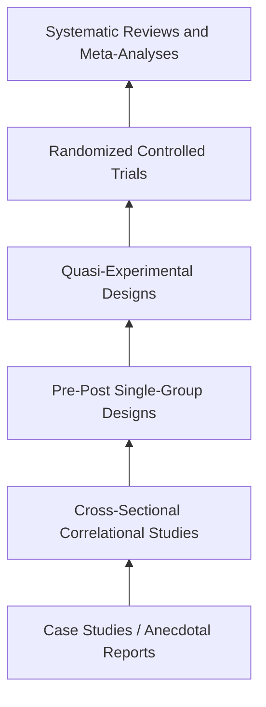
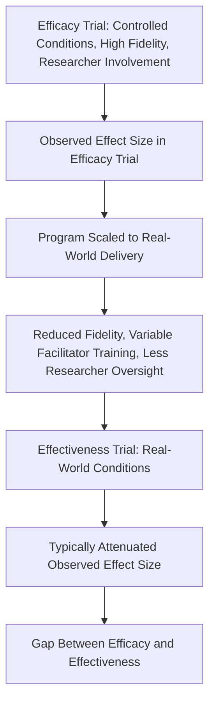

## Evaluating the Effectiveness of Resilience Interventions

### Overview

Evaluating whether a resilience intervention "works" is methodologically more complex than it may initially appear, spanning questions of research design, measurement validity, effect size interpretation, moderator analysis, and the translation of controlled research findings into real-world practice. Across the programs previously examined — the Penn Resiliency Program, Comprehensive Soldier and Family Fitness, trauma-informed approaches, school-based SEL, workplace programs, and community-based disaster resilience initiatives — a recurring set of evaluation challenges and methodological standards applies. This section consolidates the cross-cutting principles, designs, and pitfalls relevant to rigorously assessing resilience intervention effectiveness.

### Levels of Evidence in Intervention Research

**Key Points**

Evaluation research is commonly organized into a hierarchy reflecting the internal validity (causal certainty) each design can support:

1. **Case Studies and Anecdotal Reports**: Descriptive accounts of individual or program outcomes, useful for hypothesis generation but providing minimal causal evidence due to absence of comparison groups and high susceptibility to selection and confirmation bias.
2. **Cross-Sectional Correlational Studies**: Single time-point studies examining associations between resilience measures and other variables; cannot establish temporal precedence or rule out confounding.
3. **Pre-Post (Single-Group) Designs**: Measurement before and after an intervention within the same group, lacking a comparison group to rule out maturation, regression to the mean, or concurrent external events as alternative explanations for observed change.
4. **Quasi-Experimental Designs**: Comparison of an intervention group to a non-randomized comparison group (e.g., a different school, unit, or community not receiving the intervention), improving on pre-post designs but still vulnerable to selection bias since group assignment was not randomized.
5. **Randomized Controlled Trials (RCTs)**: Random assignment of participants (or clusters, such as classrooms or units) to intervention versus control conditions, considered the strongest standard design for establishing causal effect, though not always feasible or ethical in large-scale organizational or community contexts.
6. **Systematic Reviews and Meta-Analyses**: Synthesis of findings across multiple independent studies (ideally RCTs), providing the strongest aggregate evidence base when the underlying primary studies are of high quality and the synthesis methodology is rigorous.

### Evidence Hierarchy Diagram

### Key Methodological Threats to Validity

**Key Points**

- **Selection Bias**: Occurs when participants who choose to enroll in (or are selected for) a resilience program differ systematically from those who do not, in ways that independently predict better outcomes (e.g., higher baseline motivation), inflating apparent program effects if not controlled through randomization.
- **Regression to the Mean**: Individuals or groups selected for intervention based on unusually high distress or low resilience scores may show improvement over time regardless of intervention, simply because extreme initial scores tend to move toward the average on re-measurement.
- **Maturation and Developmental Confounds**: Particularly relevant in youth resilience programs, since normal developmental change over the study period can produce apparent improvement independent of program effects; control groups are necessary to isolate the intervention's specific contribution.
- **Demand Characteristics and Social Desirability**: Participants may report improved resilience or reduced distress because they infer this is the expected or desired response, particularly in non-blinded self-report designs — a concern raised specifically regarding PTGI and CSF2 Global Assessment Tool scores in earlier sections.
- **Allegiance Effects**: A well-documented pattern in psychotherapy and prevention research in which trials conducted by a program's originating research team tend to report larger effects than independent replications, as previously noted in the critique of the Penn Resiliency Program's evidence base.
- **Attrition and Differential Dropout**: If participants who are struggling most are more likely to drop out of a program before follow-up assessment, remaining program completers may show inflated apparent effectiveness ("survivor bias" in program evaluation).

### Measurement Considerations Specific to Resilience Constructs

**Key Points**

- **Construct Proliferation**: The resilience/positive-psychology intervention literature uses a wide range of measurement instruments (PTGI, CD-RISC, Brief Resilience Scale, PsyCap Questionnaire, GAT, program-specific measures), which are not fully interchangeable; comparing "effectiveness" across programs using different outcome measures is methodologically fraught, since apparent differences in effect size may partly reflect instrument differences rather than true differences in program impact.
- **Self-Report Reliance**: The large majority of resilience outcome measures rely on self-report, which is vulnerable to the retrospective bias, social desirability, and illusory-versus-constructive-change concerns discussed in the PTG measurement critique section; triangulation with behavioral, physiological, or informant-report measures strengthens evaluation rigor but is used inconsistently across the field.
- **Timing of Assessment**: Resilience and growth constructs may fluctuate meaningfully over time; single-timepoint post-intervention assessment cannot distinguish a durable change from a transient state effect, making longitudinal follow-up assessment methodologically important but often absent due to resource constraints.
- **Level of Analysis Mismatch**: As discussed in the community and collective resilience sections, individual-level instruments are not directly applicable to group- or community-level resilience claims, requiring distinct composite or ecological measurement approaches whose validity and comparability remain less well established than individual-level psychometrics.

### Moderators and Effect Size Heterogeneity

**Key Points**

Across the programs reviewed in this chapter, several recurring moderators have been identified as influencing the magnitude and durability of intervention effects:

- **Implementation Fidelity**: The degree to which a program is delivered as designed (correct dosage, sequence, facilitator adherence to protocol) is consistently associated with larger effects; low-fidelity, "real-world" implementations tend to show attenuated effects relative to tightly controlled efficacy trials.
- **Facilitator Training and Competence**: Programs relying on non-specialist facilitators (teachers, peer leaders, non-commissioned officers) show variable effectiveness depending on the quality and depth of facilitator training, a factor relevant across PRP, CSF2, and SEL programs alike.
- **Baseline Risk Level of Participants**: Some evidence across multiple program types suggests larger effects in higher-risk or higher-distress subgroups compared to low-risk universal populations, though this pattern is not perfectly consistent across the literature.
- **Program Duration and Dosage**: Multi-session, spaced-practice programs generally show more durable effects than brief, single-session interventions, a pattern observed in both workplace resilience training and school-based programs.
- **Cultural and Contextual Fit**: Programs developed and validated in one cultural or organizational context (e.g., Western, individualist, civilian) may require adaptation, and sometimes show altered factor structures or effect sizes, when transported to different cultural, developmental, or occupational contexts (e.g., military populations, non-Western cultures).

### Effect Size Interpretation and Practical Significance

**Key Points**

- Statistically significant findings do not necessarily imply practically meaningful effects; many resilience intervention meta-analyses report small-to-moderate standardized effect sizes (e.g., Cohen's $d$ commonly in the range of approximately $0.2$ to $0.4$ for many prevention programs), which some critics argue may have limited real-world impact at an individual level despite population-level significance.
- **Number Needed to Treat (NNT)** and similar practical-significance metrics are used less consistently in the resilience intervention literature compared to clinical treatment research, making it harder to communicate the real-world magnitude of program benefits to policymakers and practitioners in intuitive terms.
- [Inference] Because small average effect sizes can still translate into meaningful population-level benefit when a program is delivered at very large scale (e.g., a school district or an entire military branch), evaluating "effectiveness" requires considering the combination of effect size, cost, scalability, and population reach together — a small individual-level effect delivered cheaply at scale may still represent a favorable use of resources relative to a larger individual-level effect achievable only through intensive, expensive delivery.

### The Efficacy-to-Effectiveness Translation Gap

### Cost-Effectiveness and Return-on-Investment Analysis

**Key Points**

- A more complete evaluation framework incorporates **cost per participant**, **cost per unit of outcome improvement**, and comparison against alternative uses of the same resources, rather than examining effectiveness in isolation from cost.
- [Unverified] Rigorous cost-effectiveness analyses are relatively uncommon in the resilience intervention literature compared to fields such as clinical medicine or public health more broadly, limiting the ability of decision-makers to compare resilience programs against other possible investments (e.g., direct clinical treatment services) on a common cost-effectiveness metric.
- Digital and app-based delivery models are frequently justified on cost-effectiveness grounds (lower marginal delivery cost at scale) even when per-participant effect sizes are smaller than intensive in-person alternatives, illustrating the trade-off between depth of individual impact and breadth of population reach.

### Best-Practice Standards for Rigorous Evaluation

**Key Points**

- Use of **randomized controlled designs** (individual or cluster-randomized, depending on feasibility) wherever ethically and logistically possible.
- **Pre-registration of hypotheses and analysis plans** to reduce the risk of selective outcome reporting and post-hoc reinterpretation of null results as partial successes.
- **Independent (non-program-affiliated) replication** as a check against allegiance effects, given the documented pattern of originating research teams reporting larger effects than independent evaluators.
- **Longitudinal follow-up** extending well beyond immediate post-intervention assessment to establish durability of effects, a gap identified across nearly every program type reviewed in this chapter.
- **Multi-method measurement**, combining self-report with behavioral, physiological, or informant-report indicators where feasible, to address the self-report and social-desirability limitations common to resilience constructs.
- **Fidelity monitoring** during program delivery (not just at initial pilot stage) to allow effect sizes to be interpreted in light of actual implementation quality rather than assumed protocol adherence.
- **Explicit moderator analysis** examining whether effects differ by baseline risk, cultural context, dosage, and facilitator characteristics, rather than reporting only an average effect size across a heterogeneous population.

### Related Topics

- The Penn Resiliency Program for Youth
- Comprehensive Soldier and Family Fitness and Military Resilience Training
- Critiques and Measurement Challenges in Post-Traumatic Growth Research
- Meta-Analytic Methods in Prevention Science
- Randomized Controlled Trial Design in Behavioral Intervention Research
- Cost-Effectiveness Analysis in Public Health Interventions
- Implementation Science and Fidelity Monitoring Frameworks