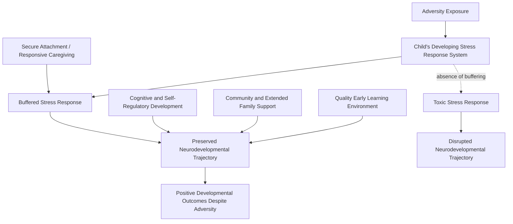

## Resilience in Early Childhood Development

### Overview

Resilience in early childhood refers to the developmental processes through which young children (typically defined as birth through approximately age 8) achieve positive developmental outcomes despite exposure to significant risk factors, adversity, or threat. Unlike resilience frameworks aimed at adolescents or adults, early childhood resilience research places particular emphasis on the neurodevelopmental sensitivity of this period, the centrality of caregiving relationships, and the foundational role this developmental stage plays in shaping later-life resilience capacity. The field draws heavily on developmental psychopathology, attachment theory, and neurobiological stress research, most notably associated with the work of Ann Masten and colleagues.

### Foundational Conceptual Model: Resilience as an Ordinary Process

**Key Points**

- A foundational contribution of this literature, particularly associated with Ann Masten's concept of **"ordinary magic,"** is the reframing of childhood resilience away from an extraordinary or rare trait possessed by exceptional children, toward an understanding of resilience as arising from ordinary, normative adaptive systems (attachment relationships, cognitive development, self-regulation capacity, community and cultural resources) functioning under conditions of adversity.
- This reframing has significant implications: rather than searching for what makes "resilient children" unique or exceptional, the framework directs attention toward protecting and strengthening the basic, universally available developmental systems that support healthy development in all children, applying resources broadly rather than only to identified exceptional cases.

### Key Protective Factors in Early Childhood

**Key Points**

Early childhood resilience research consistently identifies several categories of protective factors operating across individual, relational, and contextual levels:

1. **Secure Attachment Relationships**: A consistent, responsive caregiving relationship (commonly with a parent but potentially with any consistent caregiving figure) is considered one of the most robust protective factors in early childhood, providing a foundation for emotional regulation, exploration, and stress buffering.
2. **Effective Caregiving and Parenting Quality**: Beyond attachment security specifically, broader parenting practices — including consistent structure, warmth, appropriate developmental expectations, and effective co-regulation of the child's emotional states — are strongly associated with resilient outcomes.
3. **Cognitive and Self-Regulatory Capacities**: Early-developing executive function skills (including attentional control, working memory, and inhibitory control) and emerging self-regulation abilities support children's capacity to manage stress and adapt to challenging circumstances.
4. **Community and Extended Family Support**: The availability of extended family, community institutions (quality early childhood education, faith communities, neighborhood cohesion), and culturally embedded support networks supplement and reinforce primary caregiving relationships.
5. **Positive Early Learning Environments**: Access to stimulating, responsive early educational environments (quality childcare and preschool) is associated with improved cognitive and socioemotional outcomes even among children facing significant socioeconomic adversity.

### The Neurobiology of Early Stress and Resilience

**Key Points**

- **Toxic Stress Framework**: A distinction commonly drawn in this literature (associated with the work of the Harvard Center on the Developing Child, among others) differentiates three categories of childhood stress response: *positive stress* (brief, mild physiological activation with supportive relationships present, considered a normal and even beneficial part of development), *tolerable stress* (more serious but time-limited stress buffered by supportive relationships), and *toxic stress* (strong, frequent, or prolonged activation of the body's stress response systems in the absence of adequate adult support, associated with disruption of developing brain architecture).
- **Buffering Hypothesis**: A central proposition in this framework is that the presence of a supportive, responsive caregiving relationship can shift what would otherwise be a toxic stress response into a tolerable one, effectively "buffering" the child's physiological stress system even when significant adversity is present.
- **HPA Axis and Cortisol Regulation**: Early caregiving quality is associated with the developing regulation of the hypothalamic-pituitary-adrenal (HPA) axis, the body's primary neuroendocrine stress-response system; [Unverified] while dysregulated cortisol patterns have been associated with early adversity and disrupted caregiving in numerous studies, the precise long-term developmental and health consequences of specific early cortisol regulation patterns remain an area of ongoing research with some inconsistency in findings across studies.
- **Neuroplasticity Considerations**: Early childhood is characterized by especially high neuroplasticity, which underlies both the increased vulnerability to disruption from significant early adversity and the increased potential responsiveness to timely, high-quality intervention during this developmental window.

### Developmental Systems Model

### Risk Factors Commonly Studied in This Literature

**Key Points**

- **Poverty and Economic Hardship**: Chronic material deprivation is one of the most extensively studied early childhood risk factors, associated with cumulative exposure to multiple co-occurring stressors (housing instability, food insecurity, parental stress) rather than operating as an isolated risk mechanism.
- **Parental Mental Health and Substance Use**: Parental depression, substance use disorders, and other parental mental health challenges are associated with disrupted caregiving quality and, correspondingly, increased risk to the child's developmental trajectory, though the presence of alternative supportive caregiving relationships can moderate this risk substantially.
- **Exposure to Family or Community Violence**: Direct or witnessed exposure to violence in the home or community environment is associated with disrupted stress regulation and increased risk for later behavioral and emotional difficulties.
- **Insecure or Disrupted Attachment**: Disruptions to consistent caregiving (frequent caregiver changes, neglect, inconsistent responsiveness) are associated with insecure or disorganized attachment patterns, which the literature treats as a risk factor for later socioemotional difficulty, though not as deterministic of poor outcome.
- **Cumulative Risk**: A consistent finding across this literature is that the *number* of co-occurring risk factors a child experiences is often more strongly predictive of developmental outcome than any single risk factor in isolation, supporting a cumulative or dose-response model of early risk exposure.

### Early Childhood-Specific Intervention Approaches

**Key Points**

- **Attachment-Based Interventions**: Programs designed to strengthen caregiver-child attachment and caregiver sensitivity/responsiveness, often delivered through structured coaching or video-feedback methods (e.g., approaches broadly in the tradition of interventions like Circle of Security or Child-Parent Psychotherapy).
- **Home Visiting Programs**: Structured programs (e.g., Nurse-Family Partnership and similar models) delivering support, education, and coaching directly to families in the home environment, often beginning during pregnancy or shortly after birth and continuing through early childhood, with a substantial evidence base supporting improved outcomes in high-risk populations.
- **High-Quality Early Childhood Education**: Structured preschool and childcare programs (with substantial evidence from long-term studies of programs such as the Perry Preschool Project and Head Start) associated with improved later cognitive, academic, and socioemotional outcomes, particularly for children facing socioeconomic adversity.
- **Parenting Skills Training**: Structured programs teaching caregivers specific strategies for behavior management, emotional coaching, and positive reinforcement (e.g., approaches within the broader family of programs such as Parent-Child Interaction Therapy and Triple P — Positive Parenting Program), intended to strengthen the caregiving-quality protective factor directly.
- **Two-Generation Approaches**: Increasingly emphasized program models that simultaneously address parental needs (mental health, economic stability, education) alongside direct child-focused programming, based on the recognition that caregiver wellbeing and capacity are themselves central protective mechanisms for the child.

### Measurement Approaches

**Key Points**

- Early childhood resilience research relies on a combination of measurement approaches distinct from the self-report instruments used with older populations, given young children's limited capacity for self-report:
  - **Observational Assessment**: Direct behavioral observation of caregiver-child interaction quality (e.g., structured observational coding systems assessing caregiver sensitivity and child engagement).
  - **Physiological Measurement**: Cortisol sampling and other physiological stress-response indicators, used to assess the buffering hypothesis directly at a biological level.
  - **Caregiver and Teacher Report**: Standardized caregiver- or teacher-completed measures of child socioemotional and behavioral functioning (e.g., broadly used instruments such as the Ages and Stages Questionnaire or the Child Behavior Checklist for young children).
  - **Developmental Screening Tools**: Standardized developmental milestone assessments used to track cognitive, language, motor, and socioemotional development against normative benchmarks.

### Critiques and Limitations

**Key Points**

- **Overreliance on Caregiver-Mediated Measurement**: Because young children cannot reliably self-report, most resilience and risk assessment in this age range depends on caregiver or observer report, which introduces potential reporter bias, particularly when the caregiver themselves is a source of risk (e.g., a caregiver experiencing depression may both contribute to child risk and simultaneously under- or over-report child symptoms).
- **Ethical and Practical Constraints on Experimental Research**: The ethical impossibility of experimentally exposing children to adversity for research purposes means that much of this evidence base relies on naturally occurring adversity (observational, quasi-experimental designs), with the accompanying causal-inference limitations discussed in intervention evaluation research more broadly.
- **Deterministic Interpretation Risk**: [Inference] Given the emphasis on early childhood as a sensitive developmental period, there is a risk of overinterpreting early risk exposure as deterministic of later outcome; the resilience literature itself emphasizes that developmental trajectories remain modifiable well beyond early childhood, and early adversity should not be treated as an irreversible sentence, though the relative ease of intervention may be greater during this developmentally plastic window.
- **Cultural Variation in Caregiving Norms**: Much of the foundational attachment and caregiving-quality research was conducted in Western, primarily North American and European contexts; the generalizability of specific caregiving-quality benchmarks to diverse cultural caregiving practices and family structures remains an active area of cross-cultural developmental research.

### Related Topics

- Attachment Theory (Bowlby and Ainsworth)
- The Toxic Stress Framework (Harvard Center on the Developing Child)
- Ann Masten's "Ordinary Magic" Model of Resilience
- Home Visiting Programs (Nurse-Family Partnership Model)
- The Adverse Childhood Experiences (ACEs) Study
- Executive Function and Self-Regulation Development
- Two-Generation Family Support Program Models