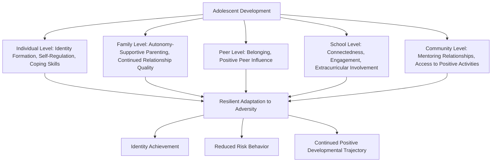

## Resilience in Adolescence and Identity Formation

### Overview

Resilience in adolescence describes the developmental processes through which young people (typically defined as spanning roughly ages 10–19, though boundaries vary across frameworks) achieve positive adaptation despite exposure to risk and adversity, during a developmental period distinguished by simultaneous neurobiological maturation, identity exploration, expanding autonomy, and heightened sensitivity to social and peer influence. Unlike early childhood resilience, which centers heavily on caregiver-mediated protective mechanisms, adolescent resilience research places greater emphasis on the young person's own developing agency, identity formation processes, and the widening ecological context of peers, school, and broader sociocultural systems.

### Erikson's Identity Formation Framework as Foundational Context

**Key Points**

- Erik Erikson's psychosocial developmental model frames adolescence as centered on the core developmental task of **identity versus role confusion**, in which the young person must integrate various self-conceptions (values, beliefs, occupational interests, social roles) into a coherent and stable sense of identity.
- Subsequent empirical elaboration of this framework, particularly the **identity status model** developed by James Marcia, operationalizes identity formation along two dimensions — **exploration** (active questioning and consideration of alternatives) and **commitment** (making a firm decision) — yielding four identity statuses: *identity diffusion* (low exploration, low commitment), *foreclosure* (low exploration, premature commitment, often based on others' expectations), *moratorium* (active exploration without yet reaching commitment), and *identity achievement* (exploration followed by self-determined commitment).
- [Inference] Within resilience research, identity achievement status is generally associated with more adaptive psychological outcomes compared to diffusion or foreclosure, though the relationship between identity status and resilience specifically (as opposed to general wellbeing) has received less direct, targeted empirical study than the identity status model's relationship to other developmental outcomes.

### Neurodevelopmental Context

**Key Points**

- Adolescence is characterized by asynchronous maturation between subcortical limbic/reward-processing brain systems (which mature earlier) and prefrontal cortical regions responsible for executive function, impulse control, and long-term planning (which continue maturing into the mid-20s) — a pattern frequently cited in developmental neuroscience as contributing to adolescents' heightened reward-sensitivity and risk-taking propensity, particularly in emotionally arousing or peer-present contexts.
- [Unverified] While this dual-systems or maturational-imbalance framing is widely referenced in developmental neuroscience literature, some more recent work has proposed more nuanced models that qualify a simple linear "imbalance" narrative, suggesting that adolescent brain development interacts with contextual and individual difference factors in ways not fully captured by the earlier dual-systems formulation.
- This neurodevelopmental context is relevant to resilience research because it implies that protective factors during adolescence may need to operate partly through environmental scaffolding (structuring contexts to reduce risk exposure) rather than relying solely on the adolescent's own not-yet-fully-matured self-regulatory capacity.

### Key Protective Factors in Adolescent Resilience

**Key Points**

1. **Continued Caregiver Relationship Quality**: While autonomy-seeking increases during adolescence, a consistent finding across the resilience literature is that supportive parent-adolescent relationships remain a robust protective factor, even as the *form* of that support shifts from direct caregiving toward more autonomy-supportive guidance.
2. **Peer Relationships and Belonging**: Given adolescence's heightened social sensitivity, positive peer relationships and a sense of social belonging function as increasingly central protective factors relative to earlier developmental stages, while negative peer influence (e.g., deviant peer affiliation) functions as a correspondingly significant risk factor.
3. **School Connectedness and Engagement**: A sense of belonging and engagement within the school environment is consistently associated with more adaptive adolescent outcomes, including academic persistence and reduced risk behavior.
4. **Extracurricular and Mentoring Relationships**: Participation in structured extracurricular activities and access to supportive non-parental adult mentors (coaches, teachers, community program staff) are associated with protective effects, particularly for adolescents facing family-level adversity.
5. **Identity Development and Purpose**: A developing sense of personal identity, values clarity, and future purpose or goal orientation is associated with resilient adaptation, connecting this developmental stage's central psychosocial task directly to resilience outcomes.
6. **Self-Regulation and Coping Skill Development**: Continued development of emotion regulation and coping skills, building on earlier-childhood foundations, remains protective, particularly given the heightened emotional reactivity associated with this developmental period.

### Ecological Systems Diagram

### Risk Factors Specific to This Developmental Period

**Key Points**

- **Negative Peer Influence and Deviant Peer Affiliation**: Association with peer groups engaged in risk behavior is a well-documented risk factor specific to the heightened peer-orientation of adolescence.
- **Identity Confusion or Foreclosure**: Failure to engage in adequate identity exploration (diffusion) or premature foreclosure on an identity based on external pressure rather than self-determined exploration are both associated with poorer psychosocial adjustment in the identity development literature.
- **Academic Disengagement and School Dropout Risk**: Declining school connectedness during adolescence is associated with cascading risk across academic, social, and behavioral domains.
- **Onset of Mental Health Symptoms**: Adolescence represents a developmental period of markedly elevated onset risk for numerous mental health conditions, a pattern that underlies the rationale for programs such as the Penn Resiliency Program targeting this specific age range preventively.
- **Increased Autonomy Combined with Incomplete Self-Regulatory Maturation**: The combination of expanding independence (more unsupervised time, decision-making autonomy) with still-maturing prefrontal self-regulatory capacity is theorized to create a period of elevated vulnerability to risk behavior, particularly in high-arousal or peer-present contexts.
- **Social Media and Digital Environment Exposure**: [Unverified] A substantial and rapidly evolving body of research has examined the relationship between adolescent social media use and psychological wellbeing/resilience; findings across this literature remain mixed and are the subject of continued active debate regarding both the direction and magnitude of effects, with some studies finding small negative associations, others finding null or mixed effects depending on use patterns, and ongoing methodological debate about measurement approaches in this area.

### Adolescent-Specific Intervention and Program Approaches

**Key Points**

- **School-Based Resilience and SEL Programs**: As discussed in the prior chapter, programs such as the Penn Resiliency Program are specifically designed and validated for this developmental window, targeting cognitive and social problem-solving skills relevant to adolescent-specific stressors.
- **Mentoring Programs**: Structured formal mentoring programs (e.g., Big Brothers Big Sisters-style models) pairing adolescents with supportive non-parental adults have an evidence base supporting improved outcomes, particularly for youth facing family-level adversity or limited access to positive adult role models.
- **Positive Youth Development (PYD) Frameworks**: A broader strengths-based approach (distinct from, but overlapping with, resilience-specific frameworks) emphasizing the promotion of positive assets and competencies (sometimes organized around frameworks such as the "Five Cs" — competence, confidence, connection, character, and caring/compassion) rather than solely the prevention or reduction of risk behavior.
- **Identity-Focused Interventions**: Structured programming designed to support adolescent identity exploration processes directly (e.g., culturally-focused identity development programs, particularly relevant for adolescents from marginalized or minority cultural backgrounds navigating questions of ethnic or cultural identity alongside general identity development).
- **Family-Based Interventions**: Programs targeting the parent-adolescent relationship specifically, supporting parents in shifting caregiving style to be appropriately autonomy-supportive while maintaining connection and monitoring, recognizing the continued (if transformed) importance of the parent-adolescent relationship as a protective factor.

### Measurement Approaches Specific to Adolescence

**Key Points**

- Self-report becomes considerably more reliable and widely used during adolescence compared to early childhood, given adolescents' increased capacity for introspection and self-reflection, allowing broader use of instruments similar to those used with adults (e.g., adapted resilience scales, the PRP's own outcome measures).
- **Identity Status Interview and Questionnaire Measures**: Structured interview protocols and questionnaire instruments (developed in the tradition of Marcia's identity status model) are used to assess exploration and commitment across various identity domains (occupational, ideological, relational).
- **Peer Nomination and Sociometric Methods**: Given the centrality of peer relationships during this period, some research employs peer-nomination methodologies to assess social status, peer influence networks, and social belonging in ways not captured by self-report alone.
- **School Records and Behavioral Indicators**: Objective behavioral data (attendance, disciplinary records, academic performance) are frequently used alongside self-report to provide a multi-method assessment of adolescent functioning and resilience-relevant outcomes.

### Critiques and Limitations

**Key Points**

- **Heterogeneity Within "Adolescence"**: The wide chronological span typically included under "adolescence" (early adolescence around ages 10–13 versus later adolescence around 17–19) encompasses substantially different developmental capacities, risk profiles, and contextual circumstances, and some critics argue that resilience research does not always adequately differentiate findings across this internal developmental heterogeneity.
- **Overreliance on Individualist, Western Identity Models**: Erikson's and Marcia's identity frameworks were developed primarily within Western, individualist theoretical traditions; cross-cultural research has raised questions about the direct applicability of an individually-focused exploration/commitment model to more collectivist cultural contexts where identity may be more relationally or communally constituted.
- **Rapidly Evolving Digital Context**: Given the pace of change in adolescents' digital and social media environments, resilience research risks lagging behind the contemporary lived context of the population it studies, complicating the currency and generalizability of findings from studies conducted even a relatively few years prior.
- **Risk of Individual-Level Framing Obscuring Structural Factors**: As with workplace and community resilience critiques, some scholars caution that emphasizing individual adolescent resilience risks understating the role of structural factors (school funding, neighborhood safety, economic opportunity) that meaningfully shape the adversity adolescents face and the resources available to cope with it.

### Related Topics

- Erikson's Stages of Psychosocial Development
- Marcia's Identity Status Model
- The Penn Resiliency Program for Youth
- Positive Youth Development (PYD) and the Five Cs Framework
- Dual-Systems Models of Adolescent Brain Development
- School-Based Resilience and Social-Emotional Learning Programs
- Mentoring Program Models and Youth Outcomes