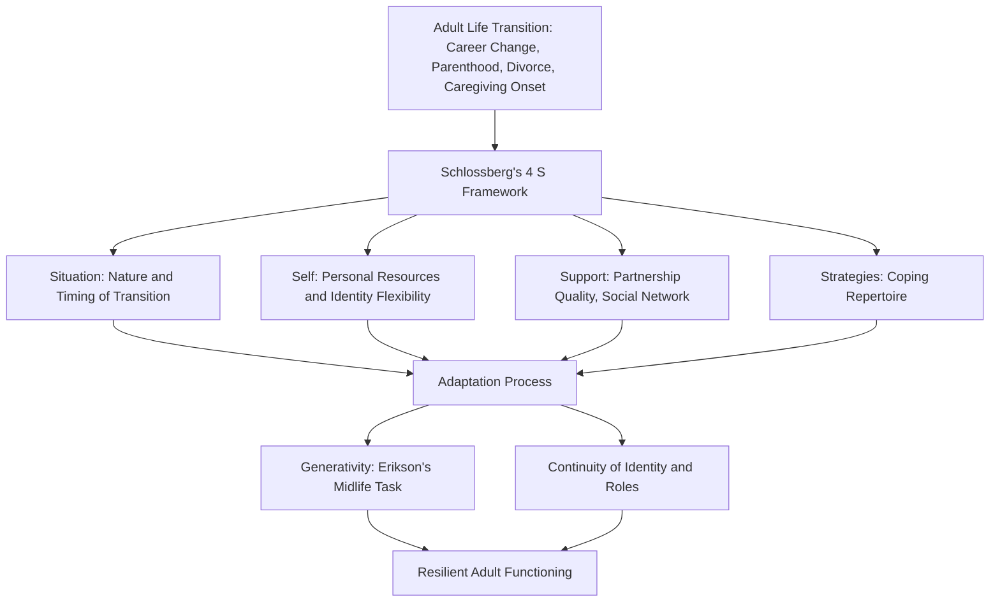

## Resilience During Adult Life Transitions and Midlife Challenges

### Overview

Resilience during adulthood and midlife concerns the psychological adaptation processes that support positive functioning across the normative and non-normative transitions characteristic of this extended developmental period — spanning early adulthood establishment tasks through midlife reassessment and challenge, typically covering roughly ages 20 through the early 60s depending on the framework used. Unlike childhood and adolescent resilience research, which centers heavily on developmental scaffolding provided by caregivers and institutions, adult resilience research emphasizes self-directed coping, identity continuity and revision, and navigation of socially structured role transitions (career, partnership, parenthood, caregiving) occurring within a more autonomous and self-determined life structure.

### Theoretical Foundations

**Key Points**

- **Erikson's Middle Adulthood Stage**: Erik Erikson's psychosocial model frames midlife around the core task of **generativity versus stagnation**, describing a developmental tension between establishing and guiding the next generation (through parenting, mentorship, or broader societal contribution) and a sense of stagnation or self-absorption; this framework provides a foundational lens for understanding midlife psychological challenges as developmentally patterned rather than purely idiosyncratic.
- **Life Course Theory**: A sociological framework (associated with Glen Elder and colleagues) emphasizing that individual development is embedded within historical time and social context, and that life transitions (marriage, parenthood, career change, widowhood) occur within socially structured, age-graded expectations (a "social clock") that shape both the timing and meaning of adult transitions.
- **Transition Theory (Schlossberg's 4 S's)**: A framework specifically addressing adult life transitions, proposing that adaptation to any transition depends on four interacting factors: **Situation** (the nature and context of the transition itself), **Self** (personal and demographic characteristics, including psychological resources), **Support** (available social and institutional support), and **Strategies** (coping strategies and behaviors used to manage the transition).
- **Continuity Theory**: A gerontological/developmental theory proposing that adults strive to maintain continuity in internal psychological structures (identity, values) and external life patterns (roles, relationships) as they age, using continuity as an adaptive strategy for managing the changes and challenges that accompany adult development.

### Common Normative Adult Transitions

**Key Points**

1. **Career Establishment and Change**: Entry into the workforce, career advancement, and — with increasing frequency in contemporary economies — career change or disruption (including involuntary job loss), each carrying distinct psychological and identity-related adaptation demands.
2. **Partnership and Marriage Formation**: The establishment of committed intimate partnerships, requiring identity integration and role renegotiation between partners.
3. **Parenthood**: The transition to parenting responsibilities, associated with substantial identity reorganization, role strain, and (for many but not universally) a reported sense of purpose and generativity consistent with Erikson's framework.
4. **Divorce and Relationship Dissolution**: A significant non-normative but statistically common adult transition, associated with substantial psychological, social, and often economic adaptation demands.
5. **Caregiving for Aging Parents**: An increasingly prominent midlife transition (sometimes discussed under the "sandwich generation" concept, describing adults simultaneously caring for both children and aging parents), associated with substantial time, emotional, and financial demands.
6. **The "Midlife Reassessment" or "Midlife Crisis" Concept**: A popularly discussed but empirically contested construct describing a period of significant self-reevaluation, sometimes associated with distress, occurring roughly in the 40s to early 50s. [Unverified] While the popular "midlife crisis" narrative is widely recognized culturally, rigorous longitudinal research has found more mixed evidence for a universal or even common acute crisis pattern at this life stage, with some large-scale studies finding midlife associated with modestly lower average wellbeing (sometimes described as a "U-shaped" happiness curve across the lifespan) rather than a dramatic crisis for most individuals.

### The U-Shaped Wellbeing Curve

**Key Points**

- A substantial body of research across multiple countries has found evidence for a **U-shaped relationship between age and subjective wellbeing**, with wellbeing measures tending to be relatively higher in young adulthood, dipping to a low point roughly in midlife (commonly cited in the general range of the late 40s, though specific estimates vary across studies and datasets), and then rising again into older adulthood.
- [Unverified] The causal mechanisms underlying this pattern remain debated in the literature; proposed explanations include the convergence of peak career/family responsibility demands during this period, a psychological process of adjusting aspirations to align more realistically with achieved outcomes as individuals age past midlife, and possible cohort or methodological artifacts in some of the underlying data, meaning the U-shape should be treated as a well-replicated but not fully mechanistically explained empirical pattern.
- This pattern is relevant to resilience research because it suggests midlife may represent a period of normatively elevated psychological demand across multiple life domains simultaneously (career, parenting, caregiving, physical health changes), providing an empirical basis for why this period warrants specific resilience-focused attention distinct from early or later adulthood.

### Protective Factors Specific to Adult and Midlife Resilience

**Key Points**

1. **Established Coping Repertoire**: Adults bring an accumulated history of coping strategies developed across earlier developmental stages, providing a more extensive personal resource base compared to earlier life stages, though the effectiveness of this repertoire depends on whether previously effective strategies remain adaptive for new midlife-specific challenges.
2. **Marital and Partnership Quality**: The quality (not merely presence) of intimate partnership relationships is a consistently identified protective factor for adult psychological wellbeing and resilience during transition periods.
3. **Occupational Identity and Meaning**: A sense of purpose and meaning derived from work or other generative activity is associated with resilient adaptation, particularly relevant to the generativity-versus-stagnation developmental tension described by Erikson.
4. **Social Network Maintenance**: Sustained friendships and social connections, which research suggests require more active maintenance in adulthood than in earlier life stages (when social contexts like school provide more automatic social contact), function as an ongoing protective resource.
5. **Financial and Economic Stability**: Given the convergence of financial demands during midlife (mortgage, children's education, retirement planning, potential caregiving costs), economic security functions as a significant protective buffer against the compounding stress of concurrent life demands.
6. **Flexible Identity and Meaning-Making Capacity**: The psychological capacity to revise identity and meaning structures in response to changing life circumstances (rather than rigidly maintaining prior self-concepts) is associated with more adaptive negotiation of major adult transitions such as divorce, career change, or caregiving role onset.

### Integrated Process Model

### Non-Normative and Compounding Adversities in Adulthood

**Key Points**

- **Job Loss and Career Disruption**: Involuntary unemployment during adulthood is associated with significant psychological distress beyond the direct financial impact, connected to identity disruption given the centrality of occupational role to adult identity in many cultural contexts.
- **Serious Illness Diagnosis**: The onset of chronic or serious illness during adulthood or midlife connects directly to the post-traumatic growth literature discussed in the earlier chapter, as a serious diagnosis frequently functions as the kind of "seismic event" capable of shattering assumptive beliefs and triggering the PTG process.
- **Divorce and Relationship Dissolution**: Associated with cascading secondary stressors (housing changes, financial strain, co-parenting renegotiation, social network disruption) beyond the primary relationship loss itself.
- **Bereavement**: The loss of parents (increasingly concentrated in midlife as parents age) and, less commonly but with severe impact, loss of a partner or child, represent significant adult bereavement challenges requiring distinct grief-adaptation processes.
- **Cumulative and Compounding Stress**: A distinguishing feature of midlife specifically is the frequent *simultaneous* occurrence of multiple significant demands (caregiving for aging parents while still raising children, career pressure at a senior career stage, personal health changes), which some researchers argue creates a qualitatively distinct resilience challenge from the more sequential adversities more typical of earlier adulthood.

### Intervention and Support Approaches

**Key Points**

- **Employee Assistance Programs (EAPs)**: Workplace-based counseling and referral services addressing personal and work-related challenges, frequently utilized during adult career transitions and personal crises.
- **Career Transition and Outplacement Counseling**: Structured support services specifically addressing the identity and practical challenges of involuntary career transition.
- **Couples and Family Therapy**: Therapeutic approaches addressing relationship strain during major transitions (parenthood, caregiving onset, midlife reassessment) at the relational rather than purely individual level.
- **Caregiver Support Programs**: Structured support groups, respite care services, and psychoeducation specifically targeting the "sandwich generation" caregiving challenge, recognizing caregiver burden as a distinct resilience challenge requiring targeted resources.
- **Workplace Resilience Training**: As discussed in the previous chapter, workplace-delivered resilience programs frequently target adult employees navigating exactly these career and life-stage transition challenges, situating this intervention category as directly relevant to adult and midlife resilience specifically.

### Critiques and Limitations

**Key Points**

- **Empirical Fragility of the "Midlife Crisis" Concept**: As noted, the popular midlife crisis narrative has weaker empirical support as a universal, acute phenomenon than its cultural prominence would suggest; resilience research in this area benefits from distinguishing the well-replicated U-shaped wellbeing pattern (a modest, gradual dip) from the more dramatic, crisis-oriented popular narrative, which lacks the same level of empirical confirmation.
- **Cohort and Historical Context Confounds**: Because life course theory explicitly emphasizes the embeddedness of adult development within historical time, findings from adult resilience studies conducted in one historical/economic period (e.g., particular economic conditions, career structures, family norms) may not generalize cleanly to different generational cohorts experiencing different structural conditions.
- **Underrepresentation Relative to Childhood and Later-Life Research**: [Unverified] Some scholars have noted that adult midlife resilience, as a distinct developmental focus, has received comparatively less dedicated theoretical and empirical development than either childhood resilience or, at the other end of the lifespan, resilience and successful aging in later life, potentially reflecting a broader tendency in developmental psychology to concentrate research attention on the more rapidly-changing developmental periods at either end of the lifespan.
- **Individual Variability in Transition Timing**: The "social clock" concept from life course theory assumes normative timing expectations for transitions (e.g., expected ages for parenthood or career milestones); increasing variability in the timing of these transitions in contemporary society may reduce the direct applicability of earlier normative-timing-based theoretical models.

### Related Topics

- Erikson's Stages of Psychosocial Development
- Life Course Theory (Glen Elder)
- Schlossberg's Transition Theory (The 4 S's)
- Workplace Resilience Training Programs
- Tedeschi and Calhoun's Model of Post-Traumatic Growth
- The U-Shaped Curve of Subjective Wellbeing Across the Lifespan
- Caregiver Burden and the "Sandwich Generation"