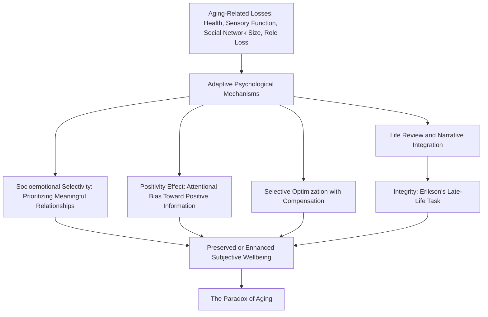

## Resilience and Healthy, Successful Aging

### Overview

Resilience in later life concerns the psychological, social, and biological processes through which older adults maintain wellbeing and adaptive functioning despite the accumulating losses characteristic of this developmental stage — including declining physical health, sensory changes, bereavement, retirement-related role loss, and eventual confrontation with mortality. A notable and consistent empirical finding in this literature, sometimes described as the **paradox of aging** or the **wellbeing paradox**, is that despite these objective losses, older adults frequently report subjective wellbeing levels equal to or higher than those of younger and midlife adults, a pattern that has motivated substantial theoretical development around the specific psychological mechanisms supporting resilience in later life.

### The Paradox of Aging

**Key Points**

- Multiple longitudinal and cross-sectional studies have found that measures of emotional wellbeing (including positive affect frequency, emotional regulation, and life satisfaction) often remain stable or even improve into older adulthood, despite the concurrent decline in physical health, sensory function, and social network size typically observed in this population.
- This finding runs counter to an intuitive assumption that increasing physical and social losses should straightforwardly produce declining wellbeing, and has motivated theoretical models specifically addressing the psychological mechanisms that might explain this apparent paradox.
- [Inference] This paradox connects to, but is conceptually distinct from, the U-shaped lifespan wellbeing curve discussed in the midlife resilience context — the U-shape describes wellbeing rising again after a midlife dip, while the aging paradox specifically addresses why this rise (or at minimum, stability) persists even as objective losses accumulate in later life, which is a separate explanatory question.

### Socioemotional Selectivity Theory (Carstensen)

**Key Points**

- Developed primarily by Laura Carstensen, **socioemotional selectivity theory (SST)** proposes that as individuals perceive their remaining lifetime as more limited (a perception that increases with age, though it can also be triggered by other salient reminders of life's finitude at any age), their motivational priorities shift from knowledge-acquisition and expansive future-oriented goals toward present-oriented, emotionally meaningful goals.
- A key behavioral prediction and finding associated with this theory is that older adults tend to actively and selectively narrow their social networks toward a smaller number of emotionally close, meaningful relationships, deliberately reducing peripheral social contacts — a pattern the theory frames as an adaptive resilience strategy rather than a passive consequence of social loss.
- **The Positivity Effect**: A related and well-replicated finding associated with this theoretical tradition is that older adults show an attentional and memory bias toward positive over negative emotional information relative to younger adults, theorized as reflecting a motivated emotion-regulation strategy consistent with the present-oriented, emotionally-meaningful goal structure proposed by SST.

### Selective Optimization with Compensation (SOC) Model

**Key Points**

- Developed by Paul and Margret Baltes, the **Selective Optimization with Compensation (SOC)** model describes a general strategy for successful aging (and adaptive functioning across the lifespan more broadly) built on three interacting processes:
  - **Selection**: Narrowing the number and scope of goals pursued, in response to age-related changes in resources and capacities, focusing effort on a smaller set of personally meaningful domains.
  - **Optimization**: Investing available resources (time, effort, practice) more intensively into the selected domains to maintain or improve functioning within them.
  - **Compensation**: Employing alternative strategies, tools, or external supports to offset losses in capacity within domains that remain important, allowing continued functioning despite decline in a particular underlying capacity.
- **Illustrative Example**: A frequently cited real-world illustration of the SOC model involves an aging concert pianist who narrows their repertoire to fewer pieces (selection), practices those pieces more intensively (optimization), and deliberately plays them at a somewhat slower tempo to compensate for reduced processing speed while preserving the perceived musical quality of the performance (compensation).

### Erikson's Late-Life Stage and Life Review

**Key Points**

- Erikson's psychosocial model frames late life around the developmental task of **integrity versus despair**, describing the challenge of achieving a sense of coherence, acceptance, and meaning regarding one's life as a whole, as opposed to a state of despair or regret over unfulfilled possibilities.
- **Life Review** (a concept particularly associated with Robert Butler) describes a naturally occurring process of reflecting on and reorganizing one's life narrative in later life, theorized as serving an adaptive function in achieving the integrative resolution described by Erikson's model, connecting conceptually to the narrative construction processes described in the post-traumatic growth literature but applied to the whole-life review context specifically.

### Comparative Framework Diagram

### Biological and Physical Resilience Considerations

**Key Points**

- **Cognitive Reserve**: A construct describing the brain's capacity to maintain functional performance despite age-related or pathological neural changes, theorized to be built up through cumulative educational attainment, occupational complexity, and sustained cognitive engagement across the lifespan; cognitive reserve is frequently discussed as a resilience factor specifically relevant to age-related cognitive decline and dementia risk.
- **Physical Frailty and Functional Reserve**: Physical resilience in aging is often discussed in relation to a concept of physiological reserve capacity — the ability of physiological systems to withstand and recover from acute stressors (illness, injury, surgery) — with frailty representing a state of reduced reserve capacity that increases vulnerability to poor recovery from such stressors.
- **Successful Aging Model (Rowe and Kahn)**: An influential framework proposing that "successful aging" (as distinct from merely "usual" or average aging) is characterized by the combination of low probability of disease and disability, high cognitive and physical functional capacity, and active engagement with life; [Unverified] this framework has drawn some critique for potentially setting an implicitly narrow or exclusionary standard for what counts as "successful" aging that may not adequately account for resilient adaptation among individuals living well despite chronic illness or disability.

### Social and Structural Factors

**Key Points**

- **Social Support and Intergenerational Relationships**: Continued social connection, including relationships with adult children, grandchildren, and peer networks, remains a significant protective factor, consistent with but qualitatively narrowed (per socioemotional selectivity theory) relative to earlier life stages.
- **Retirement Transition**: The transition out of the workforce represents a significant role-identity transition specific to this life stage, with resilient adaptation associated with the development of alternative sources of purpose, structure, and social engagement to replace the occupational role.
- **Ageism and Structural Barriers**: Societal ageism, including age discrimination and reduced structural investment in resources supporting older adults (healthcare access, age-friendly community design, elder care infrastructure), represents an external structural challenge to resilient aging that operates independently of any individual's personal psychological resources.
- **Living Arrangement and Community Design**: Access to age-friendly community design, transportation, and housing options that support continued independence and social engagement is increasingly recognized as a structural-level resilience factor, paralleling the community resilience frameworks discussed in the intervention chapter.

### Intervention and Program Approaches

**Key Points**

- **Life Review and Reminiscence Therapy**: Structured therapeutic approaches that formally guide older adults through a structured life review process, intended to support the integrative narrative work associated with Erikson's integrity-versus-despair task.
- **Cognitive Engagement and "Brain Training" Programs**: Programs designed to build or maintain cognitive reserve through sustained mental engagement, though [Unverified] the degree to which specific commercial "brain training" products produce generalizable, real-world cognitive benefit (as opposed to narrow improvement on the trained task itself) remains a contested question in the cognitive aging literature.
- **Physical Activity and Exercise Programs**: Structured exercise programming specifically adapted for older adult populations, with a substantial evidence base connecting physical activity to both physical functional reserve and psychological wellbeing outcomes in this population.
- **Social Engagement and Intergenerational Programs**: Programs designed to maintain or build social connection specifically for older adults, including structured intergenerational programming connecting older adults with younger generations, and senior center or community-based social engagement programming.
- **Grief and Bereavement Support**: Given the increased frequency of loss (spouse, peers, siblings) characteristic of later life, structured bereavement support programming is a particularly relevant intervention category for this population.

### Critiques and Limitations

**Key Points**

- **Selection and Survivorship Effects in Research Samples**: Cross-sectional studies of older adults are subject to potential survivorship bias — individuals who survive to older age and remain able to participate in research may be systematically healthier or more resilient than the broader birth cohort, potentially inflating apparent wellbeing and resilience findings for the "older adult" population as studied.
- **Heterogeneity Within Later Life**: As with adolescence, the wide chronological span often grouped under "older adulthood" (sometimes spanning 60s through 100+) encompasses substantially different health statuses, social circumstances, and generational/cohort experiences, and broad generalizations risk obscuring this internal heterogeneity.
- **Cultural Variation in Aging Experience**: Much of the foundational theoretical work in this area (socioemotional selectivity theory, the SOC model, the Rowe and Kahn successful aging framework) was developed and validated primarily in Western, and particularly U.S., research contexts; cross-cultural research has found some variation in the specific mechanisms and cultural meaning structures associated with resilient aging in different societies, particularly regarding the role and structure of intergenerational family relationships.
- **Tension Between Individual and Structural Explanations**: As in other resilience domains discussed in this chapter, there is ongoing critique regarding the degree to which "successful aging" frameworks appropriately account for structural and socioeconomic determinants of health and wellbeing in later life, versus placing primary explanatory emphasis on individual psychological adaptation strategies.

### Related Topics

- Socioemotional Selectivity Theory (Carstensen)
- Selective Optimization with Compensation (Baltes and Baltes)
- Erikson's Stages of Psychosocial Development
- The Rowe and Kahn Model of Successful Aging
- Cognitive Reserve and Dementia Risk
- Resilience During Adult Life Transitions and Midlife Challenges
- Community-Based and Disaster Resilience Initiatives (Age-Friendly Community Design)