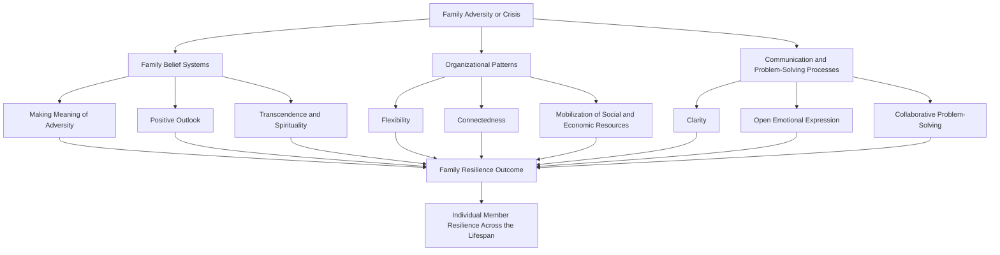

## Family Resilience Frameworks

### Overview

Family resilience frameworks shift the unit of analysis from the individual to the family system as a whole, examining how families collectively withstand, adapt to, and grow from adversity, disruption, and crisis. Rather than treating family members' individual resilience as simply additive, this literature — most closely associated with the work of Froma Walsh — conceptualizes the family as an interactional system with its own emergent processes, belief systems, and organizational patterns that shape how effectively the family unit navigates shared or member-specific challenges. This framework has direct relevance across the lifespan stages discussed in this chapter, since family systems provide the relational context within which individual resilience — in early childhood, adolescence, adulthood, and later life — is embedded.

### Theoretical Foundations: Family Systems Theory

**Key Points**

- Family resilience frameworks draw substantially on **family systems theory**, which conceptualizes the family as an interconnected system in which change in any one member or subsystem (e.g., the parental relationship, a sibling relationship) reverberates through the system as a whole, rather than treating family members as independent units.
- This systemic framing implies that resilience-relevant interventions targeting a single family member (e.g., a child) are theorized to be more effective when they also account for and potentially intervene at the level of the broader family system (parenting practices, marital relationship quality, family communication patterns).
- The framework also draws on a developmental, life-cycle perspective on families, recognizing that family systems themselves move through predictable developmental stages (formation, childrearing, launching children, later-life stages) that interact with the adversity the family faces at any given point.

### Walsh's Family Resilience Framework: Three Domains

**Key Points**

Froma Walsh's influential framework, developed and refined over several decades, organizes family resilience processes into three interacting domains:

1. **Family Belief Systems**: The shared meanings, values, and narratives a family holds, which shape how the family interprets and responds to adversity. This domain includes:
   - *Making Meaning of Adversity*: The family's shared framework for understanding a crisis (e.g., viewing a challenge as a shared, manageable family problem versus as an individual member's failing).
   - *Positive Outlook*: A family's capacity to maintain hope, courage, and a sense of possibility even amid significant adversity, while still acknowledging real constraints and limitations.
   - *Transcendence and Spirituality*: Shared meaning-making frameworks that extend beyond the immediate crisis, whether religious, spiritual, or more broadly existential, providing a larger context of purpose and connection.
2. **Organizational Patterns**: The structural and relational organization of the family system, including:
   - *Flexibility*: The family's capacity to adapt its structure, roles, and rules in response to changing circumstances, balanced against the need for enough stability and continuity to provide a secure structure.
   - *Connectedness*: The degree of mutual support, cohesion, and collaboration among family members, balanced against respect for individual autonomy and differentiation.
   - *Social and Economic Resources*: The family's ability to mobilize extended kin, community, and institutional resources, and to manage the practical and financial demands accompanying a crisis.
3. **Communication and Problem-Solving Processes**: The family's interactional processes for managing information and challenges, including:
   - *Clarity*: Consistent, clear, and honest communication about the crisis and its implications, avoiding ambiguity or family secrets that can generate confusion or anxiety, particularly in children.
   - *Open Emotional Expression*: A family climate that permits the expression of a full range of emotional responses to the crisis, including difficult emotions, in a mutually respectful manner.
   - *Collaborative Problem-Solving*: The family's shared capacity for structured problem identification, brainstorming, and decision-making, including the ability to reframe irresolvable stressors and manage inevitable ongoing challenges.

### Framework Structure Diagram

### Relationship to McCubbin and Patterson's Resiliency Model

**Key Points**

- A separate but related theoretical lineage, developed by Hamilton McCubbin and Joan Patterson (building on the earlier ABCX family stress model), describes family adaptation through the **Family Adjustment and Adaptation Response (FAAR) model** and related resiliency models.
- The original **ABCX Model** (developed by Reuben Hill) proposes that a family's crisis response (X) results from the interaction of the stressor event itself (A), the family's existing resources (B), and the family's perception or definition of the event's meaning (C) — a formulation emphasizing that the same objective stressor can produce very different family outcomes depending on available resources and interpretive framing.
- McCubbin and Patterson's extension incorporates a distinction between **adjustment** (a family's initial, often minor-adaptation response to a stressor) and **adaptation** (a more substantial reorganization of family patterns required when initial adjustment strategies prove insufficient for a more severe or pile-up of stressors), introducing the concept of **stressor pile-up** — the cumulative effect of multiple co-occurring demands overwhelming a family's existing coping capacity.
- [Inference] This pile-up concept parallels the cumulative-risk finding discussed in the early childhood resilience literature, suggesting a consistent theme across resilience frameworks at different units of analysis (individual and family) that the *number* of co-occurring demands, not simply their individual severity, is a key determinant of adaptive versus maladaptive outcome.

### Family Resilience Across Specific Adversity Types

**Key Points**

- **Chronic Illness or Disability**: Family resilience research has examined how families organize around the ongoing demands of a member's chronic illness or disability, with Walsh's framework applied to understanding how family belief systems (meaning-making about the illness) and organizational flexibility (redistributing caregiving roles) shape long-term family adaptation.
- **Divorce and Family Restructuring**: Family systems research on divorce examines resilience not as the absence of family disruption but as the family's (including both post-divorce households') capacity to reorganize communication, co-parenting collaboration, and children's sense of security despite structural family change.
- **Military Deployment and Reintegration**: Connecting directly to the Comprehensive Soldier and Family Fitness program discussed in the interventions chapter, family resilience frameworks have been specifically applied to understanding military family adaptation across the deployment cycle (pre-deployment, deployment, reintegration), each phase presenting distinct family reorganization demands.
- **Immigration and Acculturation Stress**: Family resilience research has examined how immigrant families navigate the combined stress of acculturation, potential intergenerational value differences between immigrant parents and children raised in a new cultural context, and often concurrent economic adjustment demands.
- **Bereavement**: Family systems approaches to bereavement examine how families collectively process loss, including the risk of family communication breakdown (e.g., avoidance of discussing the loss) versus adaptive shared grieving processes.

### Measurement Approaches

**Key Points**

- **Family-Level Self-Report Instruments**: Several instruments have been developed to assess family-level constructs consistent with these frameworks, including measures of family cohesion, adaptability, and communication (e.g., instruments in the tradition of the Family Adaptability and Cohesion Evaluation Scales, FACES, associated with the circumplex model of marital and family systems).
- **Observational Family Interaction Coding**: Structured observational methods coding actual family interaction patterns (e.g., during a structured problem-solving task) provide an alternative to self-report, capturing communication and problem-solving processes more directly.
- **Multi-Informant Approaches**: Given that family systems theory anticipates that different family members may have differing perspectives on the same family processes, rigorous family resilience research often collects data from multiple family members (e.g., both parents and, when age-appropriate, children) rather than relying on a single family "reporter."

### Critiques and Limitations

**Key Points**

- **Measurement Complexity**: Assessing a family-level (rather than individual-level) construct introduces substantial methodological complexity, including questions about how to aggregate or reconcile differing perspectives across family members, and the field lacks a single, universally adopted gold-standard instrument comparable to the individual-level PTGI.
- **Risk of Idealizing Family Cohesion**: Some critics note that an emphasis on family connectedness and cohesion as protective could, if applied without nuance, risk overlooking situations in which reduced family connectedness (e.g., in the context of family conflict, abuse, or highly enmeshed dynamics) may actually be an adaptive or protective outcome for certain family members, cautioning against treating "more cohesion" as universally beneficial without attention to family context and power dynamics.
- **Cultural Variation in Family Structure and Values**: Much of Walsh's foundational framework was developed within a Western clinical and research context; the specific balance points described (e.g., between flexibility and stability, or individual autonomy and connectedness) may carry different cultural weighting and meaning across family structures and cultural traditions with different normative expectations regarding family hierarchy, individual autonomy, and extended-family involvement.
- **Directionality and Causal Ambiguity**: As with much of the broader resilience literature, most family resilience research relies on correlational or qualitative designs, making it difficult to establish whether identified family processes (e.g., open communication) are a cause of resilient family outcomes, a consequence of a family's underlying resilient capacity, or both in a bidirectional relationship.

### Related Topics

- Walsh's Family Resilience Framework (Belief Systems, Organization, Communication)
- The ABCX Model and McCubbin and Patterson's Resiliency Model
- Family Systems Theory
- Comprehensive Soldier and Family Fitness and Military Resilience Training
- The Circumplex Model of Marital and Family Systems (FACES)
- Resilience in Early Childhood Development
- Vicarious and Collective Post-Traumatic Growth