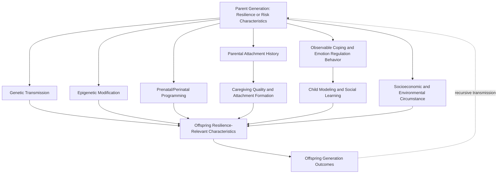

## Intergenerational Transmission of Resilience and Risk

### Overview

Intergenerational transmission research examines how resilience-relevant capacities and risk factors are passed from one generation to the next — through biological, psychological, relational, and sociocultural pathways. This body of work sits at the intersection of developmental psychology, behavioral genetics, epigenetics, and family systems research, and addresses a question with direct implications for every lifespan stage previously discussed: why do children of resilient parents tend to show elevated resilience themselves, and conversely, why does adversity (trauma, mental illness, poverty) so often recur across successive generations within the same family lineage, and through which specific mechanisms does this transmission occur.

### Defining the Scope of Intergenerational Transmission

**Key Points**

- Intergenerational transmission is generally defined broadly enough to include both **risk transmission** (the passing of vulnerability factors, such as elevated likelihood of mental illness, substance use, or maladaptive coping patterns) and **resilience transmission** (the passing of protective factors, adaptive coping strategies, and psychological resources) — the two are typically studied within the same broad research paradigms rather than as entirely separate literatures.
- The concept encompasses transmission across as few as two generations (parent to child) and, in some research designs, across three or more generations (grandparent to parent to child), the latter being methodologically more demanding but theoretically important for distinguishing durable transmission patterns from more transient, single-generation effects.
- [Inference] Because transmission operates through multiple simultaneous pathways (genetic, epigenetic, prenatal, direct caregiving behavior, modeling, and broader socioeconomic circumstance), isolating the unique contribution of any single mechanism is a persistent methodological challenge across this literature, and most contemporary theoretical models treat these pathways as interacting rather than mutually exclusive explanations.

### Proposed Mechanisms of Transmission

**Key Points**

1. **Genetic Transmission**: Behavioral genetics research (including twin and adoption study designs) has established that certain traits associated with resilience-relevant capacities (e.g., temperament, stress reactivity, aspects of personality) show heritable components, suggesting a direct genetic contribution to intergenerational continuity in resilience-relevant characteristics.
2. **Epigenetic Mechanisms**: A growing body of research examines whether environmental exposures (including significant stress or trauma) can produce epigenetic modifications (changes in gene expression not involving alteration of the underlying DNA sequence itself, such as DNA methylation) that may be transmitted to offspring, potentially affecting offspring stress-reactivity or other resilience-relevant biological systems. [Unverified] While epigenetic transmission of trauma effects has received considerable research and popular attention, the field remains an active and in some respects contested area of study, particularly regarding the degree to which findings from animal models (where controlled experimental designs are more feasible) generalize to human intergenerational transmission, and regarding the durability and specificity of any such epigenetic marks across human generations.
3. **Prenatal and Perinatal Programming**: Maternal stress, mental health, and physiological state during pregnancy are associated with offspring neurodevelopmental and stress-regulatory outcomes, a pathway distinct from direct genetic or epigenetic inheritance and operating through the intrauterine environment itself (sometimes discussed under the concept of fetal programming or developmental origins of health and disease).
4. **Direct Caregiving Behavior and Attachment Transmission**: Perhaps the most extensively studied mechanism, this pathway concerns how a parent's own attachment history and caregiving capacity (shaped by their own developmental experiences) directly influences the caregiving they provide to their own children, in turn shaping the child's attachment security and associated resilience-relevant capacities — a pathway central to attachment theory's concept of the **intergenerational transmission of attachment patterns**.
5. **Modeling and Social Learning**: Children learn coping strategies, emotion regulation approaches, and general problem-solving orientations partly through direct observation and modeling of parental behavior, providing a purely behavioral/observational transmission pathway distinct from either genetic or direct caregiving-quality mechanisms.
6. **Shared Environmental and Socioeconomic Circumstance**: Families transmit not only psychological and biological characteristics but also material circumstances (socioeconomic status, neighborhood context, access to education and healthcare), which independently shape offspring resilience-relevant outcomes and can either compound or partially offset transmission occurring through the more individually-focused mechanisms above.

### Multi-Pathway Transmission Diagram

### Attachment-Based Transmission Research

**Key Points**

- Research within the attachment theory tradition has consistently found associations between a parent's own reported attachment representations (commonly assessed via structured interview methods such as the Adult Attachment Interview) and their child's observed attachment security, supporting the concept of intergenerational attachment transmission.
- **The "Transmission Gap"**: Notably, meta-analytic research in this tradition has identified what is sometimes called the transmission gap — the observed statistical association between parental and child attachment classification is generally significant but only moderate in strength, meaning parental attachment history predicts, but does not fully determine, child attachment outcome; a substantial portion of variance remains unexplained by parental attachment representation alone, implying other mechanisms (direct caregiving sensitivity, child temperament, other relationships) contribute independently.
- **Reflective Functioning / Mentalization**: A parent's capacity for reflective functioning (the ability to understand and represent their own and their child's mental states, thoughts, and feelings) has been proposed as a key mediating mechanism partially explaining the link between parental attachment history and child attachment outcome, suggesting the transmission pathway operates partly through this specific parental cognitive-emotional capacity rather than attachment history alone.

### Discontinuity and the "Resilience-Breaking" Phenomenon

**Key Points**

- A parallel and clinically significant body of research examines cases of **discontinuity** — individuals who, despite childhood exposure to significant parental risk (maltreatment, parental mental illness, insecure attachment), do not replicate this pattern with their own children, sometimes discussed in the clinical literature as "breaking the cycle."
- Factors associated with this discontinuity include: the presence of at least one alternative supportive relationship during the individual's own childhood (a grandparent, teacher, or other consistent caregiving figure) providing a corrective relational experience; engagement in therapeutic processes (individual therapy, particularly approaches addressing attachment-related processing) as an adult; a supportive and stable adult partnership providing an alternative relational model; and higher levels of reflective functioning capacity, allowing the individual to process and make meaning of their own childhood experience rather than reenacting it unreflectively.
- [Inference] This discontinuity research connects conceptually to the deliberate rumination and narrative-construction processes central to the post-traumatic growth model discussed earlier in this course, suggesting that the capacity to consciously process and reframe one's own developmental history may function as a protective mechanism specifically against intergenerational risk transmission, distinct from simply the passage of time or absence of continued adversity exposure.

### Resilience Transmission Specifically

**Key Points**

- While much of the classic literature in this area has historically emphasized risk transmission (given the clinical and public health urgency of understanding cycles of maltreatment, mental illness, or poverty), a growing complementary body of work examines the transmission of protective and adaptive characteristics specifically — for example, research on how parental optimism, effective emotion regulation modeling, and secure attachment provision transmit protective capacity to offspring, independent of the presence or absence of specific identified risk factors.
- Some research has examined **grandparental influence** as an additional transmission pathway for resilience specifically, including grandparents functioning as an alternative attachment figure or source of family narrative and meaning-making (connecting to Walsh's family resilience framework discussed previously, particularly the "making meaning of adversity" domain, which may draw on multi-generational family narratives).

### Measurement Approaches

**Key Points**

- **Prospective Longitudinal Multi-Generational Designs**: The most methodologically rigorous approach to studying intergenerational transmission involves following families across multiple generations prospectively (rather than relying on retrospective report), though such designs are resource-intensive and comparatively rare given the multi-decade time horizon required.
- **Adult Attachment Interview (AAI) and Related Structured Interview Methods**: Widely used to assess parental attachment representations for correlation with observed child attachment classification (commonly assessed via methods such as the Strange Situation Procedure for younger children).
- **Behavioral Genetics Designs (Twin and Adoption Studies)**: Used to help disentangle genetic from environmental transmission pathways, by comparing outcome similarity across relationship types with differing degrees of genetic relatedness and shared versus non-shared environment.
- **Epigenetic Biomarker Assessment**: Emerging methods assessing specific epigenetic markers (e.g., DNA methylation patterns at specific genomic sites) in offspring in relation to documented parental trauma exposure history, though [Unverified] standardization of these biomarker assessment methods and replication of specific findings across independent research groups remains an active area of methodological development.

### Critiques and Limitations

**Key Points**

- **Overinterpretation of Epigenetic Findings**: Given considerable public and media interest in the concept of "inherited trauma," some researchers have cautioned against overinterpreting preliminary epigenetic findings (particularly those derived from animal models) as directly and straightforwardly applicable to human intergenerational trauma transmission, noting that the human evidence base, while growing, remains considerably less developed and more methodologically contested than the more publicly popularized narrative might suggest.
- **Disentangling Mechanism Contributions**: Because genetic, epigenetic, prenatal, attachment-based, and socioeconomic transmission pathways typically co-occur within the same family and are correlated with one another, isolating the independent causal contribution of any single mechanism using naturally occurring (non-experimental) family data remains a substantial and, in many cases, not fully resolved methodological challenge.
- **Risk of Deterministic Interpretation**: As with the discussion of early childhood adversity more broadly, there is a recurring risk of interpreting intergenerational transmission findings in an overly deterministic way; the discontinuity research specifically demonstrates that transmission patterns are probabilistic tendencies rather than fixed inevitabilities, and the field's own findings regarding "cycle-breaking" caution against fatalistic interpretation of transmission risk.
- **Structural and Socioeconomic Confounds**: Because socioeconomic circumstances are themselves highly likely to persist across generations within the same family (independent of any specific psychological or biological transmission mechanism), disentangling genuinely psychological or biological transmission from the simple continuity of shared structural disadvantage remains a significant interpretive challenge across much of this literature.

### Related Topics

- Attachment Theory and the Adult Attachment Interview
- Reflective Functioning and Mentalization-Based Approaches
- The Adverse Childhood Experiences (ACEs) Study
- Family Resilience Frameworks (Walsh)
- Resilience in Early Childhood Development
- Behavioral Genetics: Twin and Adoption Study Designs
- Epigenetics and the Developmental Origins of Health and Disease