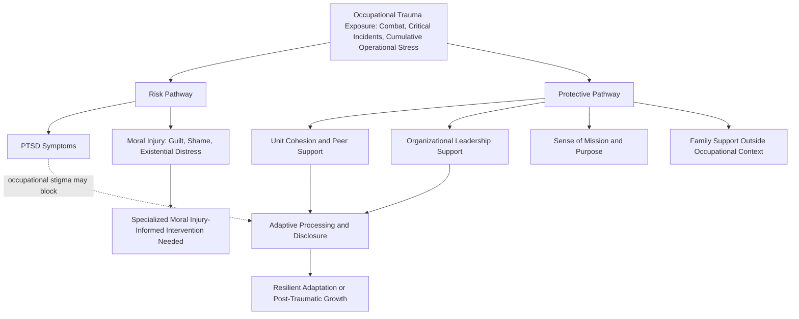

## Military, Veteran, and First-Responder Resilience

### Overview

Military, veteran, and first-responder populations face a distinctive occupational risk profile characterized by repeated, often unpredictable exposure to potentially traumatic events, high operational stress, and unique organizational cultures that shape both risk and protective processes. Resilience research within this population draws on and extends many of the frameworks discussed earlier in this course — including the Comprehensive Soldier and Family Fitness program, post-traumatic growth theory, and family resilience frameworks — while also addressing population-specific factors such as combat exposure, occupational culture, moral injury, and the distinct transition challenges associated with military-to-civilian reintegration.

### Population-Specific Risk Exposure Profile

**Key Points**

- **Repeated and Cumulative Trauma Exposure**: Unlike single-incident civilian trauma populations often studied in general PTG research, military and first-responder populations frequently experience repeated exposure to potentially traumatic events across a career, raising distinct questions about cumulative risk and the applicability of single-event trauma models to this population.
- **Occupationally Embedded Risk**: Exposure to trauma is not incidental but is an anticipated and, in many respects, occupationally required feature of these roles, which distinguishes the psychological context of this exposure from civilian trauma populations who did not anticipate or accept trauma exposure as part of a chosen occupational role.
- **Operational Tempo and Chronic Stress**: Beyond acute traumatic incidents, sustained high operational tempo (extended deployments, prolonged shift work, chronic understaffing in emergency services) contributes an additional chronic stress burden distinct from acute traumatic exposure itself.
- **Population Heterogeneity**: This broad category spans meaningfully distinct subpopulations — active-duty military, military veterans (a population facing distinct reintegration-specific challenges), and civilian first responders (police, fire, emergency medical services, dispatchers) — each with somewhat different organizational structures, exposure patterns, and post-service or post-incident trajectories.

### Moral Injury: A Population-Specific Construct

**Key Points**

- **Moral injury** is a construct developed substantially within military and, more recently, first-responder mental health research, referring to the lasting psychological, social, and spiritual harm that can result from perpetrating, failing to prevent, or witnessing acts that violate one's own deeply held moral beliefs and expectations.
- Moral injury is theoretically and empirically distinguished from PTSD, though the two frequently co-occur: PTSD is generally centered on fear-based threat response to danger, while moral injury is centered on guilt, shame, and moral/existential distress arising from a violation of one's own values, potentially including situations involving no direct threat to the individual's own safety.
- [Unverified] While moral injury has gained substantial clinical and research attention over the past roughly two decades, formal diagnostic criteria and standardized assessment instruments remain less fully established and validated compared to PTSD, and the field continues to refine both the construct's boundaries and appropriate treatment approaches.
- This construct connects directly to the post-traumatic growth model's emphasis on shattered assumptive beliefs, since moral injury by definition involves the violation of core moral schemas — the same category of foundational belief disruption theorized as a precondition for the PTG process, though moral injury's emphasis on self-directed guilt and shame introduces additional complexity beyond the general assumptive-world disruption described in the original Tedeschi and Calhoun model.

### Protective Factors Specific to This Population

**Key Points**

1. **Unit Cohesion and Peer Support**: Strong, trusted relationships with fellow service members or colleagues who share direct understanding of operational experiences are among the most consistently identified protective factors in this literature, connecting to the "linking" and "bonding" social capital concepts discussed in the community resilience framework.
2. **Organizational and Leadership Support**: Perceived support from unit or department leadership, including leadership behavior that models help-seeking and normalizes psychological struggle, is associated with reduced stigma around seeking mental health support and improved outcomes.
3. **Sense of Mission and Purpose**: A clear sense of purpose connected to the occupational role itself functions as a protective factor, connecting to the generativity and meaning-related protective factors discussed in the broader resilience literature.
4. **Pre-Deployment/Pre-Incident Resilience Training**: Programs such as Comprehensive Soldier and Family Fitness, discussed in the interventions chapter, represent institutional attempts to build resilience-relevant skills proactively prior to operational exposure.
5. **Family and Social Support Outside the Occupational Context**: Given the occupationally embedded nature of trauma exposure in this population, maintaining supportive relationships outside the immediate professional context is theorized to provide an important source of perspective and support distinct from occupational peer relationships.
6. **Effective Post-Incident Debriefing and Support Structures**: Organizational practices for processing difficult incidents shortly after they occur (though the specific effectiveness of formal single-session psychological debriefing models has been debated in the literature, discussed further below) are theorized to support more adaptive processing relative to organizational cultures that discourage acknowledgment or discussion of difficult incidents.

### Occupational Culture as a Double-Edged Factor

**Key Points**

- Military and first-responder occupational cultures are frequently characterized by norms emphasizing stoicism, self-reliance, and reluctance to acknowledge psychological difficulty, which can function protectively in the sense of supporting operational functioning under acute stress, but can simultaneously constitute a risk factor by discouraging help-seeking and open disclosure of psychological struggle.
- [Inference] This cultural tension directly parallels the disclosure and narrative-processing mechanisms central to the post-traumatic growth model discussed earlier in this course — a culture that discourages disclosure may impede the shift from intrusive to deliberate rumination theorized as necessary for growth, suggesting occupational culture change (destigmatizing disclosure) may be a necessary complement to individual-level resilience training in this population, rather than individual training alone being sufficient.
- Growing institutional efforts (including within military and first-responder organizations) to actively destigmatize mental health help-seeking reflect an explicit organizational response to this recognized cultural tension.

### Population-Specific Diagram

### Veteran-Specific Reintegration Challenges

**Key Points**

- **Military-to-Civilian Transition**: Separation from military service represents a distinct and significant life transition (connecting to the adult transition frameworks discussed earlier, particularly Schlossberg's 4 S model), involving loss of the structured occupational role, unit cohesion, and clear mission purpose that characterized military service, alongside the practical demands of civilian employment transition, potential relocation, and family reintegration.
- **Identity Transition**: Veterans frequently report significant identity-related adjustment challenges in transitioning from a military identity (often deeply integrated with unit and mission) to a civilian identity, connecting to the identity-formation and identity-continuity frameworks discussed in the adolescent and adult resilience sections of this course.
- **Family Reintegration**: Reintegration following deployment involves renegotiation of family roles that may have shifted during the service member's absence, connecting directly to the family resilience frameworks (particularly Walsh's flexibility and reorganization domains) discussed previously.
- **Access to and Utilization of Veteran-Specific Services**: Structural factors including veteran-specific healthcare systems (in the U.S. context, the Department of Veterans Affairs), veteran service organizations, and peer-support networks specifically for veterans represent structural resources relevant to this population's post-service resilience.

### Intervention and Program Approaches

**Key Points**

- **Comprehensive Soldier and Family Fitness (CSF2)**: As discussed extensively in the interventions chapter, this represents the primary large-scale, institutionally mandated resilience training program specific to active-duty military populations.
- **Critical Incident Stress Management (CISM) and Debriefing**: A category of post-incident intervention widely used in first-responder organizations, though [Unverified] the evidence base for specific single-session debriefing protocols (particularly the widely used Critical Incident Stress Debriefing, or CISD, model) has been substantially debated, with some rigorous evaluations raising concerns about limited or even potentially counterproductive effects of certain single-session debriefing formats, leading to ongoing refinement of recommended post-incident support practices in this field.
- **Peer Support Programs**: Structured programs training service members, veterans, or first responders themselves (rather than only external clinicians) to provide peer-based emotional support and connection to formal mental health resources, leveraging the strong protective value of within-occupation peer relationships identified in this population.
- **Moral Injury-Specific Interventions**: Specialized therapeutic approaches (including approaches such as Adaptive Disclosure and other emerging moral-injury-focused treatment models) developed specifically to address the guilt, shame, and existential/spiritual dimensions of moral injury, distinct from standard PTSD-focused treatment protocols.
- **Family-Inclusive Programming**: Given the centrality of family reintegration challenges, programs explicitly including military and first-responder families (rather than targeting the individual service member alone) — again connecting to the CSF2 program's family-inclusive expansion — represent a growing intervention category in this space.
- **Peer-Support and Veteran Service Organization Networks**: Community-based and veteran-specific organizational networks (extending beyond formal clinical intervention) provide an additional structural resource layer relevant to long-term post-service resilience.

### Critiques and Limitations

**Key Points**

- **Evidence Base Timing and Scale Concerns**: As discussed regarding CSF2 specifically, critics have raised concerns about the pace of large-scale program deployment relative to the maturity of the underlying evidence base in this population, a concern that extends to some other military and first-responder resilience initiatives as well.
- **Debriefing Controversy**: As noted, the evidence base for certain widely used post-incident debriefing models has been genuinely contested, illustrating that intuitive or widely adopted practices in this field are not guaranteed to reflect rigorously established best practice, and underscoring the importance of the evaluation standards discussed in the interventions-evaluation chapter.
- **Underdeveloped Moral Injury Assessment and Treatment Standardization**: As noted, the moral injury construct, while clinically and theoretically significant, remains comparatively less standardized in both assessment and treatment compared to the more established PTSD literature, representing an active area of continued development.
- **Occupational Culture as a Persistent Structural Barrier**: Even well-designed individual-level interventions may show limited real-world impact if the surrounding occupational culture continues to discourage genuine help-seeking and disclosure, suggesting that individual-level resilience training alone, absent broader cultural and organizational change, may have a ceiling on its potential effectiveness in this population.
- **Heterogeneity Across Subpopulations**: Findings from active-duty military research do not necessarily generalize directly to veteran or civilian first-responder populations, given differences in organizational structure, exposure type, and post-incident support infrastructure across these distinct occupational contexts.

### Related Topics

- Comprehensive Soldier and Family Fitness and Military Resilience Training
- Tedeschi and Calhoun's Model of Post-Traumatic Growth
- Moral Injury: Assessment and Treatment Approaches
- Family Resilience Frameworks
- Schlossberg's Transition Theory (The 4 S's)
- Critical Incident Stress Management and Debriefing Controversies
- Vicarious and Collective Post-Traumatic Growth