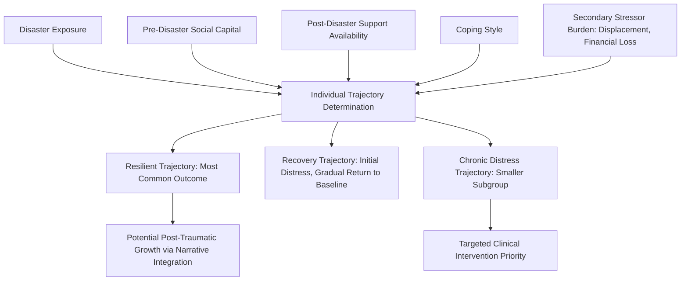

## Resilience Among Trauma and Disaster Survivors

### Overview

Resilience among trauma and disaster survivors examines how individuals directly exposed to acute, often sudden-onset traumatic events — natural disasters, mass violence, serious accidents, terrorism, and similar events — maintain or regain adaptive functioning. This population differs from the military and first-responder population discussed previously in that exposure is typically unanticipated and non-occupational, and differs from the general trauma literature underlying the original post-traumatic growth model primarily in scale and context: disaster-specific research often examines large numbers of simultaneously affected individuals within a shared geographic and temporal context, allowing for study of both individual and collective-level resilience processes concurrently.

### Distinguishing Features of Disaster and Acute Trauma Exposure

**Key Points**

- **Suddenness and Unpredictability**: Unlike occupationally anticipated trauma exposure (as in military or first-responder contexts) or chronic, ongoing adversity (as in some family or community-level stress research), disaster exposure is typically sudden and largely unanticipated by those affected, which is theorized to have distinct implications for the "shattering" of assumptive beliefs central to the post-traumatic growth model — sudden disasters may produce a more acute and complete disruption of prior safety assumptions than more gradual or anticipated adversity.
- **Simultaneous Collective Exposure**: Disasters typically affect many individuals within a shared community simultaneously, distinguishing this context from individually experienced trauma (e.g., an individual assault or accident) and enabling direct application of the collective post-traumatic growth and community resilience frameworks discussed earlier alongside individual-level analysis.
- **Heterogeneity of Disaster Type**: This population category spans meaningfully different disaster types — natural disasters (hurricanes, earthquakes, floods, wildfires), technological/human-made disasters (industrial accidents, transportation disasters), and mass violence events (terrorism, mass shootings) — each carrying somewhat distinct psychological implications (e.g., mass violence involves intentional human harm, which is associated with distinct attributional and trust-related psychological sequelae compared to naturally occurring disasters).
- **Secondary Stressor Cascade**: Beyond the acute traumatic exposure itself, disaster survivors frequently face a cascade of secondary stressors — displacement, financial loss, prolonged recovery and rebuilding demands, bureaucratic navigation of aid systems, and community disruption — which some researchers argue can contribute as much or more to longer-term psychological outcome as the acute event itself.

### Trajectory Patterns Following Disaster Exposure

**Key Points**

- Consistent with the general trajectory research discussed in the distinction between resilience, recovery, and PTG, disaster-specific longitudinal research has generally found that the **majority of disaster-exposed individuals show a resilient trajectory** (relatively stable functioning without significant or sustained psychopathology), with a substantially smaller proportion showing chronic distress trajectories, and an intermediate proportion showing a recovery trajectory (initial distress followed by gradual return to baseline).
- [Inference] This finding — that resilience, rather than chronic dysfunction, represents the modal or most common outcome following disaster exposure — carries important public health planning implications, suggesting that disaster mental health resource allocation may be most efficiently targeted toward identifying and supporting the smaller subgroup showing chronic distress trajectories rather than assuming universal need for intensive intervention across the entire exposed population, though the specific proportions found vary considerably across studies and disaster types.
- Factors associated with which trajectory an individual experiences include: proximity and severity of exposure (dose-response relationship between exposure severity and distress risk), pre-existing mental health history, availability of post-disaster social support, and the presence of significant secondary stressors (e.g., loss of home, displacement) beyond the acute event itself.

### Protective Factors Specific to This Population

**Key Points**

1. **Pre-Disaster Social Capital**: As discussed in the community resilience framework, pre-existing social ties and community cohesion prior to a disaster are strong predictors of both individual and community-level post-disaster recovery, since these networks provide immediate practical and emotional support in the disaster's aftermath.
2. **Perceived and Actual Availability of Post-Disaster Support**: Access to emotional support, practical assistance (housing, financial aid), and information in the immediate aftermath is associated with more adaptive individual trajectories.
3. **Effective Coping Style**: Active, problem-focused coping strategies (as opposed to avoidant coping) are generally associated with more adaptive outcomes, consistent with broader coping research beyond the disaster context specifically.
4. **Sense of Community and Collective Identity**: Individuals who maintain or develop a strong sense of connection to their affected community, including participation in collective recovery efforts, often report both individual resilience and, in some cases, elements of post-traumatic growth connected to this renewed or strengthened community identity.
5. **Timely and Appropriate Mental Health Response**: Access to evidence-informed psychological support (including but not limited to psychological first aid, discussed below) in the acute aftermath, calibrated appropriately to the individual's actual level of need rather than universally applied intensive intervention, is associated with more adaptive trajectories.
6. **Meaning-Making and Narrative Construction**: Consistent with the post-traumatic growth model's emphasis on narrative processing, disaster survivors who are able to construct a coherent narrative integrating the disaster experience — including, for some, a narrative of collective resilience or renewal — show associations with more adaptive long-term outcomes.

### Trajectory and Protective Factor Diagram

### Population-Specific Vulnerability Considerations

**Key Points**

- **Children and Disaster Exposure**: Child disaster survivors require developmentally calibrated support approaches, connecting to the early childhood and adolescent resilience frameworks discussed earlier — younger children rely heavily on caregiver emotional stability and the caregiver's own coping capacity as a buffering mechanism, while adolescents' peer relationships and emerging identity processes shape their disaster-related adaptation.
- **Older Adults**: Older disaster survivors may face compounded vulnerability related to physical health status, mobility limitations affecting evacuation and immediate response capacity, and potentially reduced social network size, though — consistent with the aging resilience literature discussed earlier — some research has also found older adults show comparable or in some cases more adaptive emotional resilience trajectories than younger adults, potentially reflecting the emotion-regulation advantages associated with socioemotional selectivity theory.
- **Socioeconomically Disadvantaged Populations**: Consistent with the equity critiques raised in the community resilience discussion, socioeconomically disadvantaged disaster survivors frequently face compounded secondary stressor burden (fewer financial resources for recovery, potentially less resilient housing infrastructure, reduced access to insurance or aid navigation resources), and empirical research consistently finds slower recovery trajectories in these populations independent of the initial disaster exposure severity itself.
- **Populations with Pre-Existing Mental Health Conditions**: Individuals with pre-existing mental health conditions prior to disaster exposure are generally found to be at elevated risk for more severe or prolonged post-disaster distress, underscoring the relevance of pre-disaster individual vulnerability alongside disaster-specific exposure severity in trajectory prediction.

### Intervention and Program Approaches

**Key Points**

- **Psychological First Aid (PFA)**: An evidence-informed, non-clinical support approach designed for delivery by trained laypersons and first responders in the immediate aftermath of disaster, emphasizing safety, comfort, connection to social supports and practical needs, and calm, non-intrusive presence, explicitly designed as an alternative to more intensive single-session debriefing models whose evidence base has been contested (as discussed in the military/first-responder resilience section).
- **Stepped-Care and Triage-Based Models**: Given the finding that most disaster survivors show resilient trajectories, contemporary disaster mental health response models increasingly favor a stepped-care approach — providing lower-intensity universal support (such as PFA and practical resource connection) broadly, while reserving more intensive clinical intervention for the smaller subgroup identified as showing persistent distress through ongoing monitoring or screening.
- **Community-Based Recovery Programming**: Programs explicitly designed to rebuild community-level social capital and collective efficacy post-disaster, connecting directly to the community resilience frameworks and adaptive capacities (economic development, social capital, information/communication, community competence) discussed in the interventions chapter.
- **School-Based Post-Disaster Support**: Given the significant number of children typically affected by community-wide disasters, school-based psychological support programming represents a common delivery vehicle, leveraging existing educational infrastructure to reach affected children and families.
- **Long-Term Case Management and Recovery Navigation**: Given the secondary stressor cascade characteristic of disaster recovery, structured case management support helping survivors navigate housing, financial aid, and insurance systems represents an important practical (rather than purely psychological) intervention category shown to reduce cumulative secondary stressor burden.

### Critiques and Limitations

**Key Points**

- **Overapplication of Intensive Clinical Models**: Historically, disaster mental health response sometimes defaulted to universal, intensive clinical intervention models based on an assumption of widespread trauma-related pathology; contemporary research supporting the predominance of resilient trajectories has driven a shift toward the stepped-care models described above, though [Unverified] the optimal screening methodology for efficiently and accurately identifying the smaller at-risk subgroup requiring intensive intervention remains an active area of methodological development.
- **Equity Gaps in Disaster Recovery Research and Response**: Consistent with critiques raised regarding community resilience more broadly, disaster resilience and recovery research has faced criticism for insufficient attention to how structural inequity shapes differential recovery trajectories, with calls for greater integration of equity-focused analysis into both research design and disaster response resource allocation.
- **Generalizability Across Disaster Types**: Given the heterogeneity of disaster types encompassed within this research category, findings from one disaster type (e.g., a natural disaster with a defined recovery and rebuilding trajectory) may not generalize directly to another (e.g., an act of intentional mass violence, which carries distinct psychological sequelae related to human intentionality and community trust disruption).
- **Measurement Timing Challenges**: Disaster research faces distinct practical challenges in establishing pre-disaster baseline data (since disasters are by definition largely unpredictable), similar to the retrospective-baseline measurement challenges discussed in the post-traumatic growth critique section, complicating precise assessment of true pre-to-post change.

### Related Topics

- Community-Based and Disaster Resilience Initiatives
- Psychological First Aid (PFA)
- Vicarious and Collective Post-Traumatic Growth
- Distinguishing Post-Traumatic Growth from Resilience and Recovery
- Critical Incident Stress Management and Debriefing Controversies
- Resilience in Early Childhood Development
- Socioemotional Selectivity Theory (Carstensen)