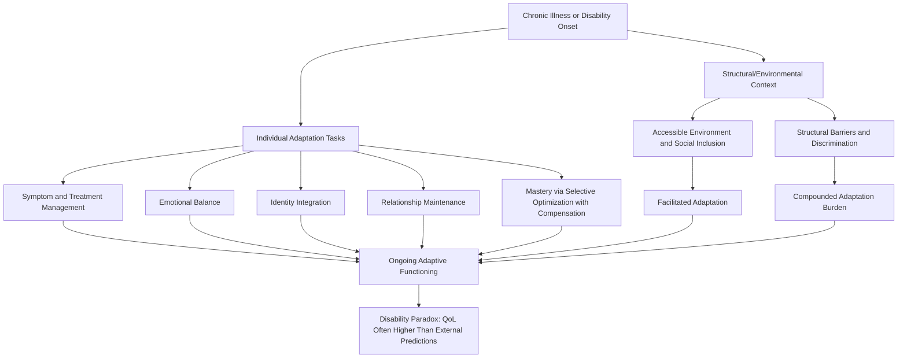

## Resilience in Chronic Illness and Disability

### Overview

Resilience in the context of chronic illness and disability concerns how individuals maintain psychological wellbeing, functional adaptation, and quality of life while living with an ongoing health condition or disability, rather than resilience following a discrete, time-limited traumatic event. This distinction is conceptually significant: unlike the acute trauma or disaster contexts examined previously, chronic illness and disability typically involve **ongoing, ambient adversity** — ongoing symptom management, uncertain or progressive disease trajectories, and repeated adaptation demands — rather than a single "seismic event" followed by a recovery or growth process. This population also connects directly to the disability rights and disability studies literature, which offers an important critical counterpoint to purely deficit-based framings of chronic illness and disability.

### Distinguishing Ongoing Adversity from Discrete Traumatic Events

**Key Points**

- The post-traumatic growth model discussed earlier in this course was developed primarily around discrete traumatic events with a definable onset; chronic illness and disability adaptation research has needed to extend or adapt this framework to account for **ongoing, non-discrete adversity** that may lack a single clear onset point (e.g., a slowly progressive condition), may involve a clear diagnostic onset but ongoing chronic management (e.g., a new diagnosis of a lifelong condition), or may be present from birth (congenital disability), each presenting distinct psychological adaptation demands.
- [Inference] Because chronic illness often does not offer a clear post-event "recovery" endpoint (given ongoing symptom management or disease progression), resilience in this context is frequently reframed around the concept of ongoing adaptive functioning *despite* continuing adversity, rather than functioning *after* adversity has resolved — a conceptually important distinction from the trauma-recovery-growth trajectory models discussed in earlier sections of this course.
- Diagnosis itself can function as a discrete "seismic event" in the sense described by the post-traumatic growth model (shattering assumptive beliefs about health, mortality, and life trajectory), even when the ongoing disease course that follows requires a distinct, continuous adaptation process beyond the initial diagnostic shock.

### The Disability Rights and Social Model Perspective

**Key Points**

- A significant conceptual contribution from disability studies and the disability rights movement is the distinction between the **medical model of disability** (which frames disability primarily as an individual deficit or pathology to be treated, cured, or accommodated for) and the **social model of disability** (which frames disability as arising substantially from the interaction between an individual's impairment and a socially constructed environment that fails to accommodate that impairment — e.g., a wheelchair user is disabled less by their mobility impairment itself than by a building lacking ramps or elevators).
- This distinction has direct implications for resilience research: a purely medical-model, deficit-focused framing risks pathologizing disability itself (treating any psychological adjustment as necessarily a response to an inherently negative condition), whereas a social-model-informed resilience framework distinguishes adaptation to structural and social barriers (a legitimate resilience challenge) from an implicit assumption that disability itself is a tragedy requiring resilience to simply tolerate.
- [Inference] Reflecting this critique, more recent chronic illness and disability resilience research has increasingly emphasized structural and environmental facilitators (accessible environments, social inclusion, anti-discrimination protections) as resilience-relevant factors operating alongside, and in some framings more significant than, purely individual psychological coping resources — paralleling the equity-focused critiques raised regarding community and workplace resilience frameworks discussed earlier in this course.

### The Disability Paradox

**Key Points**

- A well-documented and theoretically significant finding in this literature, sometimes termed the **disability paradox**, is that many individuals living with significant chronic illness or disability report quality of life and subjective wellbeing substantially higher than external observers (including, notably, healthcare providers) typically predict or assume.
- [Unverified] Multiple proposed explanations for this paradox exist in the literature, including hedonic adaptation (a general psychological tendency to adjust subjective wellbeing baselines toward a relatively stable set point following most life changes, positive or negative), response shift (a recalibration of the internal standards, values, or conceptualization used to evaluate one's own quality of life following the onset of a health condition), and the selective, comparative reference-group effects individuals may use when evaluating their own functioning; the relative contribution of each of these proposed mechanisms remains an active area of research rather than a fully settled question.
- This paradox carries a significant methodological implication: healthcare providers, family members, and researchers without personal disability or chronic illness experience may systematically underestimate the achievable and actual quality of life of individuals living with a given condition, a concern with direct clinical and policy relevance (e.g., in end-of-life decision-making contexts).

### Common Adaptation Tasks in Chronic Illness

**Key Points**

Drawing on chronic illness adaptation research (including foundational contributions from researchers such as Rudolf Moos in health psychology), individuals living with chronic illness commonly face several recurring adaptive tasks:

1. **Managing Symptoms and Treatment Regimens**: Ongoing practical management of symptoms, medication adherence, and navigation of healthcare systems represents a continuous demand distinct from the more time-limited "processing" tasks associated with discrete trauma.
2. **Maintaining Emotional Balance**: Managing the emotional experience of living with illness (which may include grief-like responses to lost function or life trajectory, alongside ongoing anxiety about disease progression or recurrence) over an extended, sometimes indefinite, time horizon.
3. **Preserving a Satisfactory Self-Image and Identity**: Integrating the illness or disability into one's self-concept without the condition becoming a totalizing identity, connecting to the identity-continuity themes discussed in the adult lifespan resilience sections.
4. **Sustaining Relationships with Family and Friends**: Navigating changes in relational roles and potential caregiving dynamics that chronic illness or disability may introduce into existing relationships, connecting to the family resilience frameworks discussed previously (particularly Walsh's flexibility and organizational-pattern domains).
5. **Maintaining a Sense of Competence and Mastery**: Preserving a sense of self-efficacy and control despite functional changes, often requiring active adaptation of goals and activities (connecting conceptually to the Selective Optimization with Compensation model discussed in the aging resilience section) rather than either denial of limitation or complete resignation.
6. **Preparing for an Uncertain Future**: Particularly relevant for progressive or uncertain-prognosis conditions, managing psychological adaptation to prognostic uncertainty represents a distinct ongoing task not present in the same form for conditions with a more predictable course.

### Integrated Adaptation Framework Diagram

### Post-Traumatic Growth in the Context of Chronic Illness

**Key Points**

- Research applying the PTG model to chronic illness populations (e.g., cancer survivors, individuals with chronic conditions such as multiple sclerosis or inflammatory bowel disease) has generally found evidence for growth across the same five domains described in the original model, though [Unverified] the relative weighting of domains may differ somewhat in chronic illness populations compared to single-event trauma populations — for example, some chronic illness research finds particularly pronounced "Appreciation of Life" and "Spiritual/Existential Change" domain scores, plausibly connected to the ongoing confrontation with mortality or uncertain prognosis distinct from a resolved, past-tense traumatic event.
- The distinction between recovery, resilience, and growth (discussed earlier in this course) is arguably even more conceptually complex in chronic illness contexts, since there may be no possible "return to baseline" if the condition is permanent or progressive — some researchers have proposed that resilience in chronic illness may be better conceptualized as an ongoing process of ***renegotiated equilibrium*** rather than either static resilience or return-to-baseline recovery.

### Intervention and Support Approaches

**Key Points**

- **Chronic Disease Self-Management Programs**: Structured, often peer-led programs (such as models in the tradition of the Stanford Chronic Disease Self-Management Program) teaching practical symptom management, communication with healthcare providers, and problem-solving skills specific to living with chronic illness.
- **Peer Support and Mentorship**: Programs connecting individuals with a given condition to peers with lived experience of the same or similar condition, leveraging shared understanding in a manner conceptually similar to peer support models in military and first-responder resilience.
- **Acceptance and Commitment Therapy (ACT) and Related Approaches**: Therapeutic approaches emphasizing psychological flexibility, acceptance of difficult internal experiences (rather than futile struggle against unchangeable aspects of the condition), and values-based action, frequently applied in chronic illness and chronic pain populations specifically.
- **Structural and Accessibility Advocacy**: Consistent with the social model perspective, interventions at the structural level — accessibility accommodations, anti-discrimination policy, inclusive design — represent a resilience-relevant intervention category operating independently of, and complementary to, individual psychological support.
- **Family and Caregiver Support**: Given the relational adaptation task described above, support extending to family members and caregivers (connecting to the "sandwich generation" and caregiver burden concepts discussed in the adult lifespan resilience section) represents an important complementary intervention category.

### Critiques and Limitations

**Key Points**

- **Risk of Individual-Level "Inspiration" Framing**: Disability studies scholars have specifically critiqued popular and, at times, research narratives that frame individual disabled people's resilience or adaptation as individually "inspirational," arguing this framing can implicitly reinforce low expectations for disabled people generally while simultaneously failing to address the structural barriers that create much of the adaptation burden in the first place (a critique sometimes discussed under the term "inspiration porn" within disability advocacy discourse).
- **Heterogeneity of Condition Type and Trajectory**: This population category spans an extremely wide range of conditions (stable versus progressive, visible versus invisible, congenital versus acquired, life-limiting versus non-life-limiting), and resilience findings from one condition type may not generalize to others with meaningfully different symptom patterns, social visibility, or prognostic trajectories.
- **Measurement of the Disability Paradox**: Some methodological critique of disability paradox research has questioned whether self-reported quality-of-life measures adequately capture the full lived experience, or whether response-shift phenomena might partly reflect a form of adaptive but potentially incomplete psychological accommodation rather than a straightforwardly positive finding; this remains a genuinely debated interpretive question rather than a settled one.
- **Tension Between Medical and Social Model Framings in Research Design**: Much clinical and health psychology resilience research continues to be conducted primarily within a medical-model framework (focused on individual coping and adjustment), and disability studies critiques of this framing have not been uniformly integrated across the broader chronic illness resilience research literature, representing an ongoing area of interdisciplinary tension and potential integration.

### Related Topics

- Tedeschi and Calhoun's Model of Post-Traumatic Growth
- The Social Model versus Medical Model of Disability
- Selective Optimization with Compensation (Baltes and Baltes)
- Acceptance and Commitment Therapy (ACT)
- Family Resilience Frameworks (Walsh)
- Resilience During Adult Life Transitions and Midlife Challenges
- Caregiver Burden and the "Sandwich Generation"