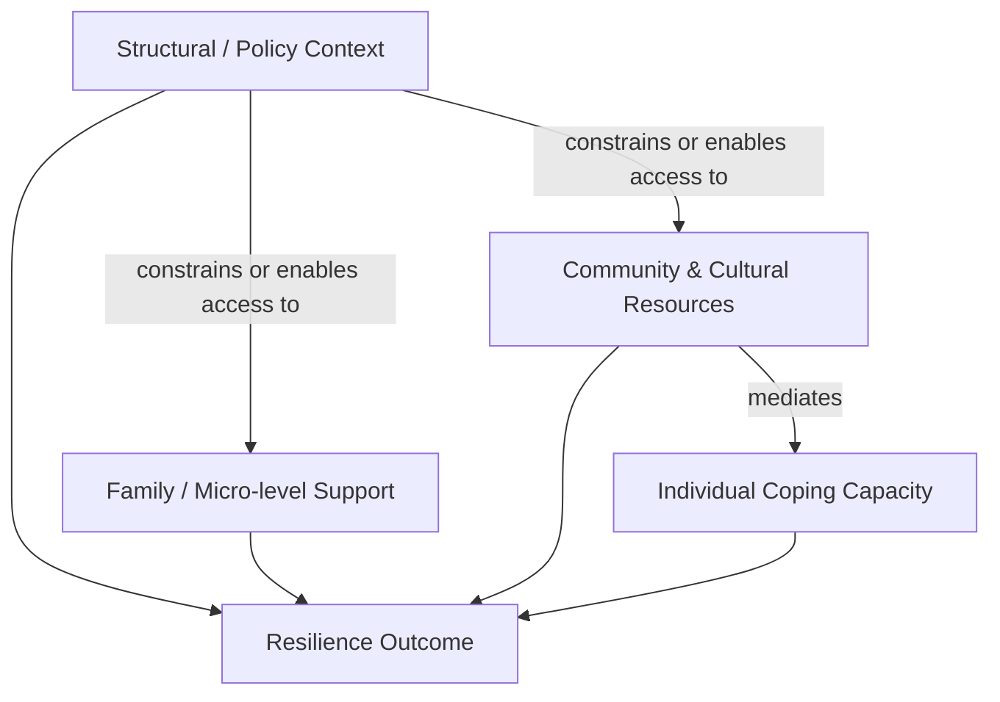

## Resilience in Marginalized, Minority, and Refugee Communities

### Overview

Resilience in marginalized, minority, and refugee populations refers to processes of positive adaptation in the context of significant adversity that is often chronic, structural, and layered atop acute trauma. Unlike general resilience models built primarily on individual-level risk (e.g., single-incident trauma, poverty alone), this domain requires frameworks that account for cumulative and intersecting stressors: displacement, discrimination, acculturative stress, historical/intergenerational trauma, and systemic exclusion from institutions (healthcare, legal systems, labor markets). Positive psychology research in this area has moved away from purely individualistic, trait-based resilience models toward ecological, culturally embedded, and collective models of adaptation.

### Distinguishing Structural from Acute Adversity

**Key Points**

- Marginalized and refugee populations frequently experience **polyvictimization** — multiple, overlapping forms of adversity (e.g., pre-migration violence, transit trauma, post-migration discrimination) rather than a single stressor event
- **Structural adversity** (racism, xenophobia, poverty, legal precarity) is ongoing and ambient, distinct from **acute adversity** (a single traumatic event), and requires resilience processes that operate continuously rather than in a discrete recovery window
- Standard PTSD-recovery-oriented resilience models are often insufficient because the stressor does not end; adaptation must occur *under* continued threat, sometimes termed "resilience in the eye of the storm"

### Ecological and Social-Ecological Models

Bronfenbrenner's ecological systems framework has been widely adapted for refugee and minority resilience research, positioning adaptation as a function of nested systems:

- **Microsystem**: family cohesion, peer relationships, immediate community ties
- **Mesosystem**: interactions between school/work and family/community
- **Exosystem**: resettlement agency policy, employer discrimination, neighborhood conditions
- **Macrosystem**: national immigration policy, dominant cultural narratives about the group, structural racism
- **Chronosystem**: how adversity and support change over time (e.g., legal status transitions, generational shifts)

Michael Ungar's **social-ecological model of resilience** is particularly influential here, arguing that resilience is less about individual traits and more about the *capacity of the environment* to provide culturally meaningful resources, and the *capacity of the individual* to navigate toward and negotiate for those resources. This reframes resilience from "what's strong inside the person" to "what is available in the system, and can the person access it."

### Core Protective Mechanisms

**Key Points**

- **Ethnic and cultural identity strength**: A well-developed, positively-valenced ethnic identity is one of the most consistently replicated protective factors against discrimination-related distress. It is not merely "pride" but a cognitive-affective resource that buffers appraisal of discriminatory events
- **Bicultural competence / biculturalism**: The ability to navigate both heritage culture and host culture (sometimes called "cultural frame-switching") is associated with better mental health outcomes than either full assimilation or full separation, aligning with Berry's acculturation framework (integration > assimilation/separation/marginalization for wellbeing)
- **Collective/communal coping**: Extended family networks, diaspora communities, religious congregations, and mutual aid structures often function as the primary coping unit rather than the individual — a departure from individualist resilience models
- **Meaning-making and narrative reconstruction**: Constructing a coherent life narrative that integrates the migration or discrimination experience (rather than avoiding it) is linked to better long-term adjustment; this connects to post-traumatic growth (PTG) frameworks
- **Religious and spiritual coping**: Frequently reported as a dominant coping resource in refugee populations specifically, providing both meaning-making and community-based social support simultaneously

### Refugee-Specific Stage Model of Adversity

Refugee resilience is often analyzed across three temporally distinct phases, each with distinct stressor profiles:

| Phase | Primary Stressors | Resilience-Relevant Processes |
| --- | --- | --- |
| Pre-migration | War, persecution, violence, loss | Pre-existing coping repertoire, prior trauma history |
| Transit/flight | Displacement, camp conditions, family separation, danger | Survival-focused coping, social bonds formed in transit |
| Post-migration/resettlement | Acculturative stress, discrimination, language barriers, unemployment, legal uncertainty | Community integration, identity renegotiation, host-society reception |

**[Inference]** Post-migration stressors are frequently found in the literature to predict long-term mental health outcomes as strongly as, or more strongly than, pre-migration trauma exposure — a finding often summarized as "the resettlement environment matters as much as the trauma itself." This is a substantive empirical claim with variation across studies and populations, so it should be treated as a general pattern rather than a fixed rule.

### Minority Stress Theory as a Resilience-Relevant Framework

Originally developed by Ilan Meyer for sexual minority populations, **minority stress theory** has been extended broadly to racial, ethnic, and immigrant minorities. It distinguishes:

- **Distal stressors**: objective discriminatory events (e.g., being denied housing, verbal harassment)
- **Proximal stressors**: internalized processes stemming from distal stress (e.g., internalized stigma, vigilance/expectation of rejection, concealment)

Resilience factors are theorized to operate at both levels: community connectedness can buffer distal stress exposure (e.g., through advocacy, avoidance of hostile environments), while identity affirmation and group pride can buffer the internalization of proximal stress.

### Intergenerational and Historical Trauma

**Key Points**

- **Historical trauma** (a term originating in Indigenous studies, notably the work of Maria Yellow Horse Brave Heart) describes cumulative emotional and psychological wounding across generations resulting from massive group trauma (e.g., genocide, slavery, colonization)
- Distinct from individual PTSD, historical trauma operates at a collective/cultural level and can be transmitted through parenting practices, cultural narratives, and — per emerging **[Speculation]** epigenetic research — potentially biological pathways, though the strength and mechanism of epigenetic transmission in humans remains actively debated and not fully established
- Resilience responses include **historical trauma-informed interventions**, which explicitly incorporate cultural mourning practices, reclamation of cultural/spiritual practices, and community-level healing rituals rather than purely individual psychotherapy

### Refugee and Minority-Specific Assessment Considerations

**[Unverified]** Standard Western resilience scales (e.g., Connor-Davidson Resilience Scale) have been criticized for cultural bias when applied cross-culturally without adaptation, since they often emphasize individual autonomy and self-reliance items that may not map onto collectivist conceptions of resilience. Culturally adapted or indigenous instruments (e.g., community-developed measures capturing collective efficacy, familial obligation, or spiritual coping) are increasingly used, though psychometric validation varies by instrument and population, so any specific claim about a named scale's validity should be checked against current documentation rather than assumed.

### Intervention Models

**Example**

A commonly cited applied framework is the **multi-tiered, community-based intervention model** used in refugee mental health programs:

1. **Tier 1 — Community-wide psychoeducation**: normalizing stress responses, disseminated through trusted community leaders rather than clinical settings
2. **Tier 2 — Peer support and mutual aid groups**: structured peer-led groups (e.g., women's circles, elder councils) that leverage existing collective coping norms
3. **Tier 3 — Culturally adapted clinical intervention**: for individuals with clinically significant symptoms, using approaches like Narrative Exposure Therapy (NET), which was specifically developed for multiply-traumatized refugee populations and organizes testimony into a coherent autobiographical narrative

**[Inference]** Task-shifting models — training lay community members or paraprofessionals to deliver structured psychosocial support under clinical supervision — are frequently used in low-resource refugee settings due to shortages of trained mental health professionals; effectiveness data exists for several such programs but generalization across all refugee contexts should not be assumed without checking the specific program's evidence base.

### Structural-Level Resilience Factors

Beyond individual and community factors, several structural/policy conditions are consistently associated with better outcomes:

- Secure legal status (vs. prolonged asylum uncertainty)
- Access to language instruction and credential recognition (enabling return to pre-migration occupational status)
- Non-discriminatory housing and labor markets
- School environments with anti-bullying infrastructure and multicultural curricula for children of immigrants/refugees

This reflects a broader critique within the field: resilience should not be framed solely as an individual burden ("be resilient") when much of the variance in outcomes is explained by structural conditions outside the individual's control — a critique sometimes phrased as avoiding the "resilience as compliance" trap, where systems place the burden of adaptation entirely on marginalized individuals rather than addressing structural harm.

### Illustrative Diagram: Layered Adversity and Buffering Model (svg_diagram)

<svg xmlns="http://www.w3.org/2000/svg" viewBox="0 0 720 420">
<rect x="0" y="0" width="720" height="420" fill="none" />
<text x="360" y="28" text-anchor="middle" font-size="16" font-weight="bold" fill="#222">Layered Adversity and Buffering Model (svg_diagram)</text>
<circle cx="360" cy="230" r="170" fill="#fdecea" stroke="#c0392b" stroke-width="2" />
<text x="360" y="90" text-anchor="middle" font-size="13" fill="#c0392b">Structural Adversity (racism, policy exclusion)</text>
<circle cx="360" cy="230" r="125" fill="#fef5e7" stroke="#d68910" stroke-width="2" />
<text x="360" y="130" text-anchor="middle" font-size="12" fill="#d68910">Acculturative &amp; Community-level Stress</text>
<circle cx="360" cy="230" r="80" fill="#eafaf1" stroke="#1e8449" stroke-width="2" />
<text x="360" y="180" text-anchor="middle" font-size="12" fill="#1e8449">Family / Community Buffers</text>
<circle cx="360" cy="230" r="38" fill="#eaf2fb" stroke="#2471a3" stroke-width="2" />
<text x="360" y="234" text-anchor="middle" font-size="11" fill="#2471a3">Individual</text>

<text x="360" y="400" text-anchor="middle" font-size="11" fill="#555">Resilience emerges at the interaction of all layers, not the innermost layer alone</text>

</svg>

### Common Pitfalls in Research and Practice

- Treating resilience as a fixed individual trait rather than a dynamic, context-dependent process
- Applying resilience frameworks developed in majority/Western populations without cultural adaptation
- Overlooking within-group heterogeneity (e.g., collapsing all "refugees" or all members of a minority group into a single homogeneous risk category, ignoring differences by country of origin, class background, religion, or migration pathway)
- Framing resilience in ways that inadvertently justify withholding structural support ("they are resilient, so less intervention is needed")

### Related Topics

- Acculturation theory and Berry's fourfold model (assimilation, integration, separation, marginalization)
- Post-traumatic growth (PTG) in trauma-exposed populations
- Minority stress theory (Meyer) in LGBTQ+ populations
- Historical and intergenerational trauma in Indigenous communities
- Narrative Exposure Therapy (NET) and other refugee-specific clinical interventions
- Collective efficacy and community-level resilience measurement
- Discrimination-related stress appraisal models
- Resilience in forced migration vs. voluntary migration populations
- Structural competency in mental health service delivery