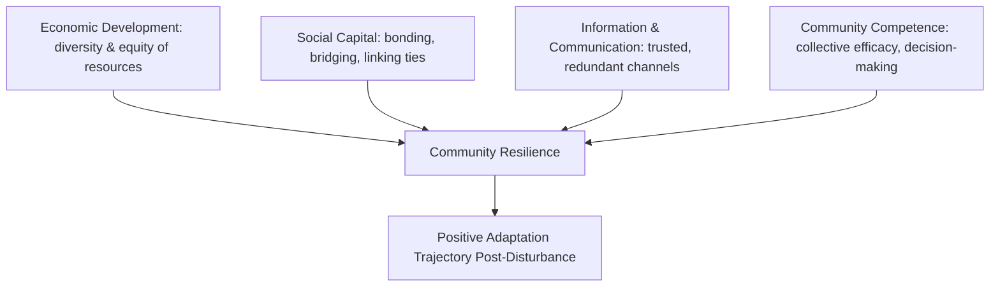

## Organizational and Community-Level Resilience

### Overview

Organizational and community-level resilience extends resilience theory beyond the individual to collective units — workplaces, institutions, neighborhoods, and communities — that must absorb disruption, adapt, and continue functioning (or improve function) under stress. Unlike individual resilience, which centers on psychological and physiological adaptation, collective resilience is a property of *systems*: it depends on structural redundancy, distributed leadership, communication networks, resource stocks, and shared social capital. The field draws on organizational behavior, community psychology, disaster/emergency management research, and systems theory, converging with positive psychology primarily through the concept of positive adaptation under adversity applied at a systems level.

### Defining Collective Resilience

**Key Points**

- Community resilience is commonly defined as a process linking a set of adaptive capacities to a positive trajectory of functioning after a disturbance (Norris et al.'s widely cited definition), emphasizing that resilience is a *process*, not a static resource
- Organizational resilience is typically defined as the capacity of an organization to anticipate, prepare for, respond to, and adapt to incremental change and sudden disruptions in order to survive and prosper (a formulation echoed in resilience-oriented management standards such as ISO 22316)
- Both concepts share a critical distinction from mere robustness: resilient systems don't just resist disruption, they *adapt through* it, sometimes emerging with improved function ("bouncing forward" rather than merely "bouncing back")

### Norris et al. Community Resilience Model

One of the most cited frameworks (Norris, Stevens, Pfefferbaum, Wyche, & Pfefferbaum, 2008) identifies four primary sets of networked adaptive capacities:

1. **Economic development**: diversity and equity of resources, not merely volume of resources
2. **Social capital**: bonding capital (within-group ties), bridging capital (cross-group ties), and linking capital (ties to power/authority structures)
3. **Information and communication**: trusted sources of information, communication infrastructure, and narrative/meaning-making capacity during crisis
4. **Community competence**: collective decision-making ability, flexibility, and collective efficacy (a community's shared belief in its own capacity to respond effectively)

### Organizational Resilience: Structural Components

**Key Points**

- **Redundancy**: backup systems, cross-trained personnel, and distributed resources that prevent single points of failure
- **Requisite variety**: an organization's internal complexity/response repertoire must match the complexity of the environment it faces (from Ashby's law of requisite variety, widely applied in resilience engineering)
- **Slack resources**: deliberately maintained excess capacity (financial reserves, spare capacity, buffer time) that can be redirected during disruption — often in tension with lean/efficiency-maximizing management philosophies
- **Distributed and adaptive leadership**: resilient organizations tend to decentralize decision authority during crises so that responses do not bottleneck through a single hierarchy
- **Psychological safety**: at the team level (per Amy Edmondson's research), psychological safety enables rapid surfacing of problems and errors, which is a precondition for organizational learning and adaptive response

### Resilience Engineering Perspective

Resilience engineering (a distinct but related field, associated with researchers like Erik Hollnagel and David Woods) reframes organizational resilience around four core abilities:

| Ability | Description |
| --- | --- |
| Responding | Knowing what to do; having ready responses to regular and irregular disruptions |
| Monitoring | Knowing what to look for; tracking indicators of changing conditions |
| Learning | Knowing what has happened; extracting correct lessons from past events |
| Anticipating | Knowing what to expect; anticipating developments, threats, and opportunities |

**[Inference]** This framework is frequently used in high-reliability organization (HRO) contexts (aviation, healthcare, nuclear operations) where failure consequences are severe; its direct applicability to lower-stakes organizational settings (e.g., typical corporate teams) is more of an extrapolation than an empirically settled transfer, so claims of universal applicability should be treated cautiously.

### High-Reliability Organizations (HROs)

**Example**

HRO theory (Weick & Sutcliffe) identifies five characteristics organizations exhibit to sustain resilience despite operating in high-hazard environments:

1. **Preoccupation with failure**: treating small anomalies as symptoms of potential systemic problems rather than isolated nuisances
2. **Reluctance to simplify interpretations**: resisting the urge to explain away complexity with simple narratives
3. **Sensitivity to operations**: maintaining situational awareness of frontline conditions, not just aggregate metrics
4. **Commitment to resilience**: developing capacity to detect, contain, and recover from errors that do occur
5. **Deference to expertise**: decision authority migrates to whoever has the relevant expertise, regardless of hierarchical rank, during high-tempo situations

### Community-Level Social Capital and Collective Efficacy

- **Collective efficacy** (extending Bandura's self-efficacy construct to the group level) refers to a community's shared belief in its joint capability to organize and execute courses of action required to manage a threat or produce a desired outcome; strongly associated with faster post-disaster recovery and lower rates of certain social problems (originally studied in the context of neighborhood violence by Sampson and colleagues)
- **Bonding vs. bridging vs. linking capital** matters differentially: bonding capital (tight in-group ties) provides immediate mutual aid but can also entrench "in-group only" resource silos; bridging capital (weak ties across different groups) is associated with faster diffusion of resources and information across a broader network; linking capital (vertical ties to institutions/authorities) determines a community's access to external aid and policy influence
- **[Unverified]** Communities with high bonding but low bridging/linking capital sometimes show *slower* institutional recovery despite strong immediate mutual aid, a pattern reported in some post-disaster case studies but not established as a universal law across all disaster contexts

### Organizational Resilience Assessment and Standards

Several formal frameworks exist for assessing organizational resilience:

- **ISO 22316** (Security and resilience — Organizational resilience — Principles and attributes): a management-systems standard outlining principles for building organizational resilience, covering shared vision, understanding of context, effective governance, and supportive culture, among other attributes
- **BS 65000**: British Standard for organizational resilience, structurally similar in intent
- **[Unverified]** Specific certification requirements, audit procedures, and current revision status of these standards change over time; if precise compliance requirements are needed for a real implementation, current published standard text should be consulted directly rather than relied upon from general knowledge

### The Efficiency–Resilience Tradeoff

**Key Points**

- A recurring tension in organizational design is that resilience-enhancing features (redundancy, slack, diversified supply chains, cross-training) typically *reduce* short-term efficiency and increase operating costs
- Just-in-time and lean methodologies optimize for efficiency by minimizing redundancy and inventory buffers, which — as highlighted by widespread supply-chain disruption analyses — can dramatically reduce resilience to unexpected shocks
- Resilient system design generally requires deliberately accepting some efficiency loss as an investment in shock-absorption capacity; this tradeoff is a central design decision rather than something resolvable in the abstract, since the "right" balance depends on the specific risk profile, cost of disruption, and frequency of shocks facing the given organization or community

### Community Resilience in Disaster Contexts

**Example**

A commonly cited operational model in disaster management is the **PEOPLES framework**, used to assess and build community disaster resilience across seven dimensions:

- **P**opulation and demographics
- **E**nvironmental/ecosystem
- **O**rganized governmental services
- **P**hysical infrastructure
- **L**ifestyle and community competence
- **E**conomic development
- **S**ocial-cultural capital

Post-disaster recovery research consistently finds that communities with pre-existing strong social networks recover faster than communities with comparable material resources but weaker social infrastructure — reinforcing that resilience capacity must be built *before* disruption occurs, since social capital and institutional trust cannot be rapidly generated during a crisis itself.

### Measurement Approaches

- **Community-level indices**: composite indices (e.g., the Baseline Resilience Indicators for Communities, BRIC) aggregate proxy variables (economic diversity, social capital proxies, infrastructure quality) into a single resilience score for cross-community comparison
- **Organizational surveys**: employee-level surveys assessing psychological safety, perceived leadership support, and adaptive capacity, often aggregated to team or organization level
- **[Inference]** Composite resilience indices are useful for relative comparison across communities or time but should not be over-interpreted as precise predictive instruments, since the weighting of component indicators involves methodological choices that vary across index-construction approaches

### Common Pitfalls

- Conflating resilience with mere recovery to baseline ("bouncing back") rather than adaptive improvement ("bouncing forward")
- Assuming resilience interventions that work at the individual level (e.g., individual stress-management training) will scale linearly to organizational or community outcomes without addressing structural/systemic factors
- Over-relying on composite indices without validating them against the specific community or organizational context being assessed
- Treating resilience-building as a one-time initiative rather than an ongoing structural investment (redundancy, social capital, and adaptive capacity degrade without maintenance)

### Related Topics

- High-reliability organization (HRO) theory in aviation and healthcare settings
- Resilience engineering and Safety-II approaches to organizational safety
- Social capital theory (Putnam, Coleman) and its bonding/bridging/linking typology
- Collective efficacy theory (Sampson) in neighborhood and community contexts
- Supply chain resilience and the efficiency-resilience tradeoff in operations management
- Disaster recovery frameworks (PEOPLES, Community Capitals Framework)
- Psychological safety and team-level adaptive performance (Edmondson)
- ISO 22316 and organizational resilience management standards