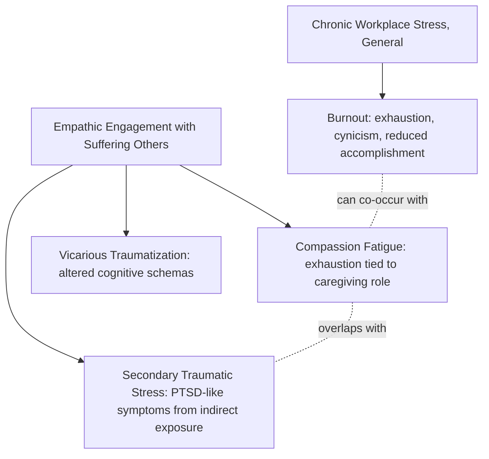

## Compassion Fatigue, Vicarious Trauma, and Resilience in Caregivers

### Overview

Caregivers — clinicians, therapists, nurses, social workers, first responders, and informal/family caregivers — face a distinct resilience challenge: their occupational or relational role requires sustained empathic engagement with others' suffering, which carries its own psychological costs. This domain addresses three related but conceptually distinct constructs (compassion fatigue, vicarious trauma, and burnout), their differentiation from positive constructs (compassion satisfaction, post-traumatic growth in caregivers), and the resilience mechanisms and organizational practices that buffer against caregiver deterioration over time.

### Differentiating the Core Constructs

**Key Points**

- **Burnout**: a syndrome of emotional exhaustion, depersonalization/cynicism, and reduced personal accomplishment resulting from chronic workplace stressors that have not been successfully managed (per Maslach's tripartite model); burnout is *not specific to caregiving* and can arise in any occupational context with chronic stress and inadequate resources
- **Compassion fatigue**: a term introduced by Charles Figley, referring to the emotional and physical exhaustion that results specifically from the cumulative demands of caring for suffering others; often described as having a more rapid onset than burnout and being more directly tied to the empathic/caregiving relationship itself rather than general workplace stress
- **Vicarious traumatization (VT)**: a construct developed by McCann and Pearlman, describing lasting, cumulative changes in a caregiver's own cognitive schemas (about safety, trust, control, intimacy, esteem) that result from empathic engagement with clients' traumatic material — distinguished from compassion fatigue by its emphasis on *structural changes to the caregiver's worldview*, not just exhaustion
- **Secondary traumatic stress (STS)**: overlapping with compassion fatigue, describes trauma symptoms (intrusion, avoidance, hyperarousal) that mirror PTSD but arise from indirect exposure to another's traumatic material rather than direct exposure

**[Unverified]** These four constructs are used with varying degrees of precision across the literature, and some researchers treat compassion fatigue and secondary traumatic stress as functionally interchangeable while others maintain a sharper distinction; readers encountering these terms in a specific study should check that study's operational definitions rather than assuming a single universally agreed taxonomy.

### Compassion Satisfaction: The Counterbalancing Construct

**Key Points**

- **Compassion satisfaction** — the pleasure and sense of meaning derived from being able to do caregiving work well and help others — is treated in the Professional Quality of Life (ProQOL) model (Stamm) as an independent dimension, not simply the absence of compassion fatigue
- Caregivers can simultaneously experience high compassion satisfaction and moderate compassion fatigue; the two are measured as separate subscales rather than opposite poles of one continuum
- Compassion satisfaction is one of the more consistently identified protective factors against caregiver burnout progression, functioning similarly to how intrinsic meaning/purpose buffers stress in general resilience models

### Risk Factors for Caregiver Deterioration

- **Caseload characteristics**: high proportion of trauma-specific cases, high case severity, and insufficient case variety (e.g., a caseload composed entirely of severe trauma survivors versus a mixed caseload)
- **Personal trauma history**: caregivers with unresolved personal trauma histories show elevated vulnerability to vicarious traumatization, since client material can activate the caregiver's own unprocessed material (a countertransference-adjacent mechanism)
- **Organizational factors**: inadequate supervision, excessive administrative burden, lack of control over caseload, and absence of peer support structures are consistently identified as amplifying risk beyond what caseload content alone would predict
- **Empathic engagement style**: [Inference] caregivers who report difficulty maintaining boundaries between their own emotional state and the client's affective state (sometimes discussed under the concept of "empathic overarousal" or insufficiently differentiated empathy) appear more vulnerable in several studies, though the causal direction (whether this trait precedes or results from cumulative exposure) is not fully resolved in the literature

### Protective and Resilience-Building Factors

**Key Points**

- **Reflective supervision and case consultation**: structured opportunities to process difficult case material with a supervisor or peer group, distinct from purely administrative supervision
- **Self-differentiation / boundary maintenance**: the capacity to remain empathically engaged with a client's suffering while maintaining a clear cognitive-emotional boundary between "their story" and "my internal state" — sometimes framed through the concept of **self-compassion** (Kristin Neff's model: self-kindness, common humanity, mindfulness) as a buffer against self-critical responses to perceived caregiving inadequacy
- **Mindfulness-based practices**: present-moment awareness practices are associated with reduced secondary traumatic stress symptoms in multiple caregiver populations, plausibly by interrupting rumination on client material outside of work hours
- **Peer support networks**: caregivers who have regular contact with peers facing similar work (not just general social support) report better outcomes, likely because peer caregivers can validate experiences that lay social contacts may not fully understand
- **Meaning-making and professional identity**: caregivers who frame their work within a larger narrative of purpose (a specific application of meaning-in-life constructs from positive psychology) show more resilience to cumulative exposure than those without this framing
- **Work-life boundary practices**: deliberate rituals for psychologically "closing" the workday (e.g., structured debriefing, transition rituals) are commonly recommended, though **[Unverified]** the comparative effectiveness of specific ritual types has limited rigorous head-to-head trial evidence and should not be treated as definitively superior to alternative approaches without checking current literature

### The ARC (Attend, React, Recover) and Organizational Response Models

**Example**

Organizational interventions for caregiver resilience commonly operate at three levels:

1. **Individual level**: training in self-care practices, self-compassion, mindfulness, and psychoeducation about compassion fatigue/VT symptom recognition
2. **Team level**: structured peer consultation groups, debriefing protocols after critical incidents, reflective supervision
3. **Organizational/systemic level**: caseload management policies (capping trauma-heavy caseloads), adequate staffing ratios, and organizational culture that normalizes seeking support rather than stigmatizing it

**[Inference]** Interventions at the individual level alone (e.g., a single mindfulness workshop) tend to show weaker and less durable effects than multi-level interventions that also address caseload and organizational culture; this pattern is broadly consistent with the general finding in occupational health psychology that individual-focused interventions underperform relative to combined individual-plus-organizational approaches, though the exact effect-size differential varies by study and population and should not be quoted as a fixed number without checking the specific source.

### Post-Traumatic Growth in Caregivers

- Caregivers can also experience **vicarious post-traumatic growth (VPTG)**: positive psychological change resulting from witnessing and helping others through trauma, including increased appreciation for life, strengthened relationships, and a deepened sense of meaning
- VPTG is not simply the inverse of vicarious trauma; caregivers frequently report *both* some degree of vicarious traumatization symptoms *and* vicarious growth simultaneously, consistent with the broader post-traumatic growth literature's finding that distress and growth are not mutually exclusive

### Assessment Instruments

| Instrument | Constructs Measured |
| --- | --- |
| ProQOL (Professional Quality of Life Scale) | Compassion satisfaction, burnout, secondary traumatic stress |
| Compassion Fatigue Self-Test (Figley) | Compassion fatigue symptom severity |
| TSI Belief Scale (McCann & Pearlman) | Cognitive schema disruption related to vicarious traumatization |
| Maslach Burnout Inventory (MBI) | Emotional exhaustion, depersonalization, personal accomplishment |

**[Unverified]** Specific psychometric properties (reliability coefficients, factor structure validation across populations) for these instruments vary by translated/adapted version and population studied; current validation studies for the specific population and language in question should be consulted rather than assuming universal psychometric equivalence across all uses of a given instrument.

### Informal/Family Caregivers: A Distinct Subpopulation

- Family caregivers of chronically ill, disabled, or aging relatives face many of the same compassion fatigue dynamics but without the professional structures (supervision, defined work hours, professional boundaries) available to paid caregivers
- **Caregiver burden** in this population is often compounded by lack of role choice (inability to leave the caregiving role, unlike a professional who can change jobs), financial strain, and social isolation
- Resilience factors identified in family caregiver populations include respite care access, caregiver support groups, and — similar to professional caregivers — meaning-making frameworks that integrate the caregiving role into the caregiver's broader identity and values

### Common Pitfalls

- Treating compassion fatigue, vicarious trauma, and burnout as fully interchangeable terms without attention to the specific construct being measured or discussed
- Framing caregiver resilience as solely an individual responsibility (e.g., "just practice more self-care") while ignoring organizational and caseload-level structural contributors
- Assuming that high compassion satisfaction rules out concurrent compassion fatigue, when the ProQOL model treats these as independent dimensions
- Overlooking informal/family caregivers, who face comparable psychological dynamics but typically lack access to the professional support structures available to paid caregivers

### Related Topics

- Maslach Burnout Inventory and the tripartite burnout model
- Self-compassion theory (Kristin Neff) and its application to helping professions
- Post-traumatic growth theory and vicarious post-traumatic growth
- Reflective supervision models in clinical and social work training
- Occupational health psychology and multi-level workplace intervention design
- Caregiver burden in informal/family caregiving contexts
- Mindfulness-based stress reduction (MBSR) in helping-profession populations
- Professional Quality of Life (ProQOL) measurement framework